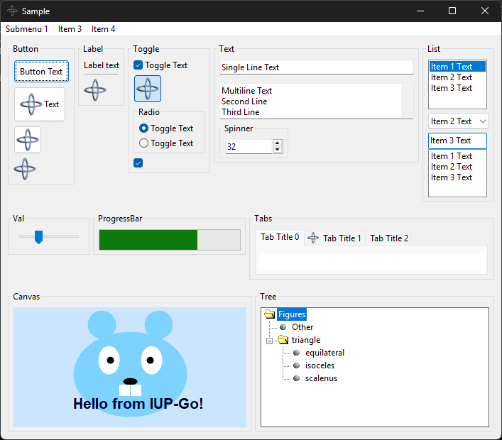

## iup-go
[](https://github.com/gen2brain/iup-go/actions)
[](https://pkg.go.dev/github.com/gen2brain/iup-go/iup)

Go bindings for [IUP](https://www.tecgraf.puc-rio.br/iup/), a multi-platform toolkit for building graphical user interfaces.
The toolkit provides system native UI controls for Windows (win32), Linux (GTK+) and macOS (Cocoa).

IUP C source code is included and compiled together with bindings.
Note that the first build can take a few minutes.

### Requirements

#### Windows

On Windows, you need a C compiler, like [Mingw-w64](https://mingw-w64.org) or [TDM-GCC](http://tdm-gcc.tdragon.net/).
You can also build a binary in [MSYS2](https://msys2.github.io/) shell.

* To remove a console window, i.e., compile GUI app, build with `-ldflags "-H=windowsgui"`.
* You can add icon resource to `.exe` file with the [rsrc](https://github.com/akavel/rsrc) tool.
* Windows manifest is included in the build by default. See below how to disable manifest if you want to include your own.

[](examples/sample/sample_win32.png)

#### Linux

On Linux, you need a C compiler and GTK+ development packages.

* Debian/Ubuntu: `apt-get install libgtk-3-dev`
* RedHat/Fedora: `dnf install gtk3-devel`

Note that you can also build and link against the GTK2 version (or Motif), see build tags below.

[](examples/sample/sample_gtk3.png)

#### macOS

On macOS, you need Xcode or Command Line Tools for Xcode (if you have `brew` you already have this).

* To create an `.app` bundle or `.dmg` image check this gist https://gist.github.com/mholt/11008646c95d787c30806d3f24b2c844.
* You can also build for GTK+ in macOS, with `gtk` build tag. Install deps with `brew install gtk+3 pkgconf`.

[](examples/sample/sample_cocoa.png)

#### Other

The library should work on other Unix-like systems, FreeBSD, NetBSD, OpenBSD, DragonFly, Solaris, Illumos, and AIX.

You can also compile for a time-tested [Motif](https://en.wikipedia.org/wiki/Motif_(software)) library if GTK+ is not available.

* Debian/Ubuntu: `apt-get install libmotif-dev libxmu-dev libxpm-dev`
* RedHat/Fedora: `dnf install motif-devel libXpm-devel`

[](examples/sample/sample_motif.png)

### Build tags

* `gl` - build with support for `GLCanvas` control
* `web` - build with support for `WebBrowser` control
* `gtk` - use GTK+ in macOS or Windows
* `gtk2` - link with a GTK2 version, default is GTK3
* `motif` - build for X11/Motif 2.x environment
* `xembed` - build for XEmbed tray protocol instead of SNI
* `nomanifest` - do not include manifest in Windows build
* `nopkgconfig` - do not use pkg-config for compile and link flags

### Compiler flags

You can provide explicit compiler and linker flags instead of using the defaults provided by pkg-config.
For example, if `gtk3` and other dependencies are in a non-standard location:

```
CGO_CFLAGS="-I<include path> ..." CGO_LDFLAGS="-L<dir> -llib ..." go build -tags nopkconfig
```

You can also point `PKG_CONFIG_LIBDIR` to some local directory with custom modified `.pc` files.

### Documentation

[IUP](https://www.tecgraf.puc-rio.br/iup/) documentation is a must, every Go function in doc reference there.
Also check [Go Reference](https://pkg.go.dev/github.com/gen2brain/iup-go/iup) and [Examples](https://github.com/gen2brain/iup-go/tree/main/examples).

### Thread-Safety

User interface (and OpenGL) is usually not thread-safe and IUP is not thread-safe. Some platforms enforce running UI on the main thread.
Note that a goroutine can arbitrarily and randomly be scheduled or rescheduled on different running threads.

The secondary threads (goroutine) should not directly update the UI, instead, use `PostMessage` that is expected to be thread-safe.
See [example](https://github.com/gen2brain/iup-go/tree/main/examples/postmessage/postmessage.go) that sends data to an element,
that will be received by a callback when the main loop regains control. You can also use the `IdleFunc` and `Timer`.

### Cross-compile (Linux)

To cross-compile for Windows, install [MinGW](https://www.mingw-w64.org/) toolchain.

```
$ CGO_ENABLED=1 CC=x86_64-w64-mingw32-gcc GOOS=windows GOARCH=amd64 go build -ldflags "-s -w"
$ file alarm.exe
alarm.exe: PE32+ executable (console) x86-64, for MS Windows

$ CGO_ENABLED=1 CC=i686-w64-mingw32-gcc GOOS=windows GOARCH=386 go build -ldflags "-s -w"
$ file alarm.exe
alarm.exe: PE32 executable (console) Intel 80386, for MS Windows
```

To cross-compile for macOS, install [OSXCross](https://github.com/tpoechtrager/osxcross) toolchain.
Ready-made SDK tarballs are available [here](https://github.com/joseluisq/macosx-sdks).

```
$ CGO_ENABLED=1 CC=x86_64-apple-darwin25-clang GOOS=darwin GOARCH=amd64 go build -ldflags "-s -w"
$ file alarm
alarm: Mach-O 64-bit x86_64 executable, flags:<NOUNDEFS|DYLDLINK|TWOLEVEL|WEAK_DEFINES|BINDS_TO_WEAK>

$ CGO_ENABLED=1 CC=aarch64-apple-darwin25-clang GOOS=darwin GOARCH=arm64 go build -ldflags "-s -w"
$ file alarm
alarm: Mach-O 64-bit arm64 executable, flags:<NOUNDEFS|DYLDLINK|TWOLEVEL|WEAK_DEFINES|BINDS_TO_WEAK|PIE>
```

### Screenshots

See more [screenshots](https://github.com/gen2brain/iup-go/tree/main/examples/sample/README.md).

### Credits

* [Tecgraf/PUC-Rio](https://www.tecgraf.puc-rio.br)
* [matwachich](https://github.com/matwachich/iup)

### License

iup-go is MIT licensed, same as IUP. View [LICENSE](https://github.com/gen2brain/iup-go/blob/main/LICENSE).
