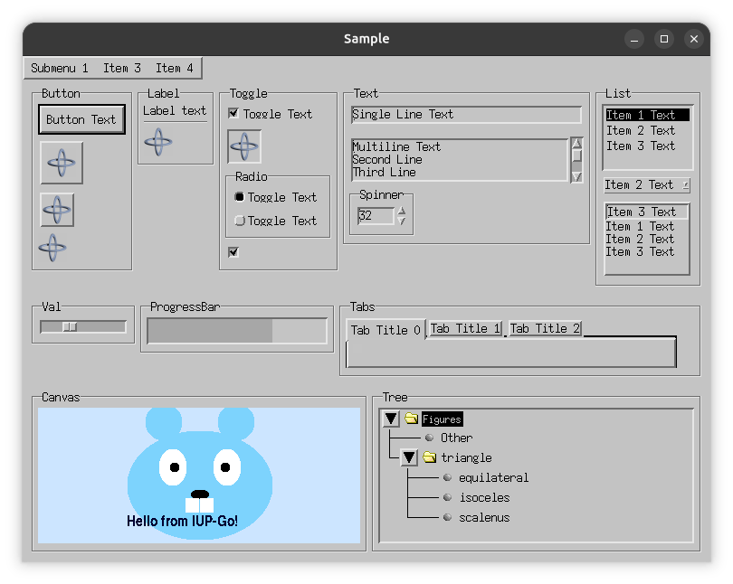

## iup-go
[](https://github.com/gen2brain/iup-go/actions)
[](https://pkg.go.dev/github.com/gen2brain/iup-go/iup)

Go bindings for [IUP](https://www.tecgraf.puc-rio.br/iup/), a multi-platform toolkit for building graphical user interfaces.
The toolkit provides system native UI controls for Windows, Linux (GTK+), and macOS.

IUP C source code is included and compiled together with bindings.
Note that the first build can take a few minutes.

### Requirements

Go 1.17 is minimum required version (cgo.Handle, new style build tags).

#### Windows

On Windows, you need a C compiler, like [Mingw-w64](https://mingw-w64.org) or [TDM-GCC](http://tdm-gcc.tdragon.net/).
You can also build a binary in [MSYS2](https://msys2.github.io/) shell.

Note that Windows manifest is included in the build by default. IUP controls appearance will follow the system appearance only if the manifest is used.
If not using the manifest, it will always look like Windows XP Classic. See below how to disable manifest if you want to include your own.

* To remove console window, i.e., compile GUI app, build with `-ldflags "-H=windowsgui"`.
* You can add icon resource to `.exe` file with the [rsrc](https://github.com/akavel/rsrc) tool.


#### Linux

On Linux, you need a C compiler and GTK+ development packages.

* Debian/Ubuntu: `apt-get install libgtk-3-dev`
* RedHat/Fedora: `dnf install gtk3-devel`

When you are not using `gl` tag, the library is built with `GDK_NULL` to completely remove the [X11](https://en.wikipedia.org/wiki/X_Window_System) usage,
so it should just work in [Wayland](https://en.wikipedia.org/wiki/Wayland_(display_server_protocol)).

You may provide explicit compiler and linker flags instead of using the defaults provided by pkg-config, if `gtk3` and other dependencies are in a non-standard location:

```
CGO_CFLAGS="-I<include path> ..." CGO_LDFLAGS="-L<dir> -llib ..." go build -tags nopkconfig
```  

Note that you can also build and link against the GTK2 version, see build tags below.


#### macOS

On macOS, you need Xcode or Command Line Tools for Xcode.

Note that support for `Cocoa` is a **work in progress**. Not everything is implemented. If you can help with Cocoa or GLCanvas, please join the IUP mailing list.
Also note that you must use and distribute binary in the `.app` directory, together with `.nib` compiled resources, see [example.app](https://github.com/gen2brain/iup-go/tree/master/dist/darwin/example.app).

You can also build for GTK+ in macOS, with `gtk` build tag. It will use [Quartz](https://en.wikipedia.org/wiki/Quartz_(graphics_layer)) native rendering. 
See [screenshot](examples/sample/sample_darwin_gtk.png), `.app` is not required with GTK+.

Install GTK+ development packages with brew.

* `brew install gtk+3`


#### Other

Although not tested, the library should work on other Unix-like systems, FreeBSD, NetBSD, OpenBSD, DragonFly, Solaris, Illumos, and AIX.

You can also compile for time-tested [Motif](https://en.wikipedia.org/wiki/Motif_(software)) library if GTK+ is not available,
though not all controls and attributes are possible, check the documentation for details.

* Debian/Ubuntu: `apt-get install libmotif-dev libxmu-dev libxpm-dev`
* RedHat/Fedora: `dnf install motif-devel libXpm-devel`



### Build tags

* `gl` - build with support for GLCanvas (Windows and Linux)
* `gtk` - use GTK+ in macOS or Windows
* `gtk2` - link with GTK2 version, default is GTK3 (Linux)
* `motif` - build for X11/Motif 2.x environment
* `nomanifest` - do not include manifest in Windows build
* `nopkgconfig` - do not use pkg-config for compile and link flags. User specifies CGO_CFLAGS and CGO_LDFLAGS env vars

### Documentation

[IUP](https://www.tecgraf.puc-rio.br/iup/) documentation is nice, every Go function in doc reference there.
Also check [Go Reference](https://pkg.go.dev/github.com/gen2brain/iup-go/iup) and [Examples](https://github.com/gen2brain/iup-go/tree/master/examples).

### Thread-Safety

User interface (and OpenGL) is usually not thread-safe and IUP is not thread-safe. Some platforms enforce running UI on the main thread.
Note that a goroutine can arbitrarily and randomly be scheduled or rescheduled on different running threads.

The secondary threads (goroutine) should not directly update the UI, instead, use `PostMessage` that is expected to be thread-safe.
See [example](https://github.com/gen2brain/iup-go/tree/master/examples/postmessage) that sends data to an element,
that will be received by a callback when the main loop regains control. You can also use the `IdleFunc` and `Timer`.

### Cross-compile (Linux)

To cross-compile for Windows install [MinGW](https://www.mingw-w64.org/) toolchain.

```
$ CGO_ENABLED=1 CC=x86_64-w64-mingw32-gcc GOOS=windows GOARCH=amd64 go build -ldflags "-s -w"
$ file alarm.exe
alarm.exe: PE32+ executable (console) x86-64, for MS Windows

$ CGO_ENABLED=1 CC=i686-w64-mingw32-gcc GOOS=windows GOARCH=386 go build -ldflags "-s -w"
$ file alarm.exe
alarm.exe: PE32 executable (console) Intel 80386, for MS Windows
```

To cross-compile for macOS install [OSXCross](https://github.com/tpoechtrager/osxcross) toolchain.

```
$ CGO_ENABLED=1 CC=x86_64-apple-darwin21.1-clang GOOS=darwin GOARCH=amd64 go build -ldflags "-linkmode external -s -w '-extldflags=-mmacosx-version-min=10.14'"
$ file alarm
alarm: Mach-O 64-bit x86_64 executable, flags:<NOUNDEFS|DYLDLINK|TWOLEVEL|WEAK_DEFINES|BINDS_TO_WEAK>

$ CGO_ENABLED=1 CC=aarch64-apple-darwin21.1-clang GOOS=darwin GOARCH=arm64 go build -ldflags "-linkmode external -s -w '-extldflags=-mmacosx-version-min=10.14'"
$ file alarm
alarm: Mach-O 64-bit arm64 executable, flags:<NOUNDEFS|DYLDLINK|TWOLEVEL|WEAK_DEFINES|BINDS_TO_WEAK|PIE>
```

### Credits

* [Tecgraf/PUC-Rio](https://www.tecgraf.puc-rio.br)
* [matwachich](https://github.com/matwachich/iup)

### License

iup-go is MIT licensed, same as IUP. View [LICENSE](https://github.com/gen2brain/iup-go/blob/master/LICENSE).
