## CURSOR (non-inheritable) 

Defines the element's cursor.

### Value

Name of a cursor.

It will check first for the following predefined names:

|                |         | Name                                    |
|:-----------------------------------------:|:------------------------------------:|-----------------------------------------|
|                                           |                                      | "NONE" or "NULL"                        |
|  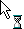   |                 ---                  | "APPSTARTING" (Win32, WinUI Only)       |
|     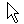      |      | "ARROW"                                 |
|      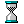      |       | "BUSY"                                  |
|     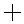      |   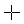   | "CROSS"                                 |
|            |   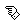    | "HAND"                                  |
|            |   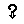    | "HELP"                                  |
|      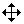      |       | "MOVE"                                  |
|              |                 ---                  | "NO" (not in GTK, Qt, Motif, FLTK, EFL) |
|                    ---                    |                 ---                  | "PEN" (not in Cocoa)                    |
|   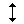    | 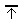  | "RESIZE_N"                              |
|       |   | "RESIZE_S"                              |
|       | 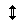 | "RESIZE_NS"                             |
|   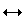    | 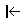  | "RESIZE_W"                              |
|       | 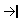  | "RESIZE_E"                              |
|       |  | "RESIZE_WE"                             |
|     | 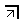 | "RESIZE_NE"                             |
|     | 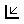 | "RESIZE_SW"                             |
|     | 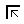 | "RESIZE_NW"                             |
|     | 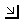 | "RESIZE_SE"                             |
|  |  | "SPLITTER_HORIZ"                        |
|   |  | "SPLITTER_VERT"                         |
|      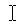      |   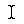    | "TEXT"                                  |
|    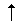     |  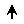  | "UPARROW"                               |

Default: "ARROW"

If it is not a pre-defined name, drivers that map cursors via system-theme names (GTK, GTK4, Qt, Motif, EFL) try the platform's cursor theme. Win32 tries the application resources. Motif also accepts an X-Windows cursor number from `cursorfont.h` (or an Xcursor file on Motif 2.4.0+).

If no system cursors were found, then the value will be used to try to find an IUP image with the same name.
Use **IupSetHandle** to define a name for an **IupImage**.
But the image will need an extra attribute and some specific characteristics, see notes below.

### Notes

For an image to represent a cursor, it should have the attribute "**HOTSPOT"** to define the cursor hotspot (place where the mouse click is actually effective).
The default value is "0:0".

Usually only color indices 0, 1 and 2 can be used in a cursor, where 0 will be transparent (must be "BGCOLOR").
The RGB colors corresponding to indices 1 and 2 are defined just as in regular images.
In Windows, GTK, macOS and Qt, the cursor can have more than 2 colors and support RGBA images.
Cursor sizes are usually less than or equal to 32x32.

The cursor will only change when the interface system regains control or when IupFlush is called.

Not supported on Android and iOS (touch UIs have no cursor).

The Windows SDK recommends that cursors and icons should be implemented as resources rather than created at run time.

When the cursor image is no longer necessary, it must be destroyed through function [IupDestroy](../func/iup_destroy.md).
Attention: the cursor cannot be in use when it is destroyed.

### Affects

[IupDialog](../dlg/iup_dialog.md), [IupCanvas](../elem/iup_canvas.md)

### See Also

[IupImage](../elem/iup_image.md)
