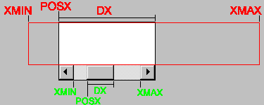

## SCROLLBAR (creation-only) 

Associates a horizontal and/or vertical scrollbar to the element.

### Value

"VERTICAL", "HORIZONTAL", "YES" (both) or "NO" (none).

Default: "NO"

### Configuration Attributes (non-inheritable)

[DX](../attrib/iup_dx.md): Size of the thumb in the horizontal scrollbar. Also the horizontal page size.
Default: "0.1".

[DY](../attrib/iup_dy.md): Size of the thumb in the vertical scrollbar. Also the vertical page size.
Default: "0.1".

[POSX](../attrib/iup_posx.md): Position of the thumb in the horizontal scrollbar. Default: "0.0".

[POSY](../attrib/iup_posy.md): Position of the thumb in the vertical scrollbar. Default: "0.0".

[XMIN](../attrib/iup_xmin.md): Minimum value of the horizontal scrollbar. Default: "0.0".

[XMAX](../attrib/iup_xmax.md): Maximum value of the horizontal scrollbar. Default: "1.0".

[YMIN](../attrib/iup_ymin.md): Minimum value of the vertical scrollbar. Default: "0.0".

[YMAX](../attrib/iup_ymax.md): Maximum value of the vertical scrollbar. Default: "1.0".

**LINEX**: The amount the thumb moves when a horizontal step is performed.
Default: 1/10th of DX.

**LINEY**: The amount the thumb moves when a vertical step is performed.
Default: 1/10th of DY.

**XAUTOHIDE**: When enabled, if DX >= XMAX-XMIN then the horizontal scrollbar is hidden.
Default: "YES".

**YAUTOHIDE**: When enabled, if DY >= YMAX-YMIN then the vertical scrollbar is hidden.
Default: "YES".

**XHIDDEN** [read-only]: returns if the scrollbar is hidden or not when XAUTOHIDE=Yes.

**YHIDDEN** [read-only]: returns if the scrollbar is hidden or not when YAUTOHIDE=Yes.

**SB_RESIZE** [read-only]: returns if a scrollbar visibility was changed forcing a canvas resize after setting DX or DY.

**SCROLLVISIBLE** (read-only) [Windows Only]: Returns which scrollbars are visible at the moment.
Can be: YES (both), VERTICAL, HORIZONTAL, NO.

### Notes

The scrollbar allows you to create a virtual space associated to the element.
In the image below, such space is marked in **red**, as well as the attributes that affect the composition of this space.
In **green** you can see how these attributes are reflected on the scrollbar.

Hence, you can clearly deduce that POSX is limited to XMIN and XMAX-DX, or  **XMIN<=POSX<=XMAX-DX**.

Usually applications configure XMIN and XMAX to a region in World coordinates, and set DX to the canvas visible area in World coordinates.
Since the canvas can have scrollbars and borders, its visible area in pixel coordinates can be easily obtained using the **DRAWSIZE** attribute.

**IMPORTANT:** the LINEX, XMAX and XMIN attributes are only updated in the scrollbar when the DX attribute is updated.

**IMPORTANT:** when working with a virtual space with integer coordinates, set XMAX to the integer size of the virtual space, NOT to "width-1", or the last pixel of the virtual space will never be visible.
If you decide to let XMAX with the default value of 1.0 and to control only DX, then use the formula DX=visible_width/width.

**IMPORTANT:** When the virtual space has the same size as the canvas, i.e., when **DX >= XMAX-XMIN**, the scrollbar is automatically hidden if **XAUTOHIDE**=Yes.
The width of the vertical scrollbar (the same as the height of the horizontal scrollbar) can be obtained using the SCROLLBARSIZE global attribute.

The same is valid for YMIN, YMAX, DY and POSY. But remember that the Y axis is oriented from top to bottom in IUP.
So if you want to consider YMIN and YMAX as bottom-up oriented, then the actual YPOS must be obtained using **YMAX-DY-POSY**.

**IMPORTANT:** Changes in the scrollbar parameters do NOT generate ACTION nor SCROLL_CB callback events.
If you need to update the canvas contents call your own action callback or call **IupUpdate**.
But a change in the DX attribute may generate a RESIZE_CB callback event if XAUTOHIDE=Yes.

If you have to change the properties of the scrollbar (XMIN, XMAX and DX) but you want to keep the thumb still (if possible) in the same relative position, then you have to also recalculate its position (POSX) using the old position as reference to the new one.
For example, you can convert it to a 0-1 interval and then scale to the new limits:

    old_posx_relative = (old_posx - old_xmin)/(old_xmax - old_xmin)
    posx = (xmax - xmin)*old_posx_relative + xmin

**IupList, IupTree**, and **IupText/IupMultiline** scrollbars are automatically managed and do NOT have the POS*, *MIN, *MAX and D* attributes.

When updating the virtual space size, or when the canvas is resized, if **XAUTOHIDE**=Yes then calculating the actual DX size can be very tricky.
Here is a helpful algorithm:

    void scrollbar_update(Ihandle* ih, int view_width, int view_height)  /* view_width and view_height is the virtual space size */
    {
      int elem_width, elem_height;
      int canvas_width, canvas_height;
      int sb_size = IupGetInt(NULL, "SCROLLBARSIZE");
      int border = IupGetInt(ih, "BORDER");

      IupGetIntInt(ih, "RASTERSIZE", &elem_width, &elem_height);

      /* remove BORDER (always size=1) */
      /* this is available drawing size not considering the scrollbars*/
      elem_width -= 2 * border;  
      elem_height -= 2 * border;
      canvas_width = elem_width;
      canvas_height = elem_height;

      /* if view is greater than canvas in one direction,
         then it has scrollbars,
         but this affects the opposite direction */

      if (view_width > elem_width)  /* check for horizontal scrollbar */
        canvas_height -= sb_size;   /* affect vertical size */
      if (view_height > elem_height)
        canvas_width -= sb_size;

      if (view_width <= elem_width && view_width > canvas_width)  /* check again for horizontal scrollbar */
        canvas_height -= sb_size;
      if (view_height <= elem_height && view_height > canvas_height)  /* notice that these two ifs are mutually exclusive */
        canvas_width -= sb_size;

      if (canvas_width < 0) canvas_width = 0;
      if (canvas_height < 0) canvas_height = 0;

      IupSetFloat(ih, "DX", (float)canvas_width / (float)view_width);  /* normalize to 0-1 assuming XMIN-XMAX=0-1 */
      IupSetFloat(ih, "DY", (float)canvas_height / (float)view_height);

      /* Another approach is to set DX,DY to canvas_width,canvas_height  
         and XMAX,YMAX to view_width,view_height */
    }

Inside the canvas ACTION callback, the (x,y) offset for drawing is calculated as:

     int x, y, canvas_width, canvas_height;
    float posy = IupGetFloat(ih, "POSY");
    float posx = IupGetFloat(ih, "POSX");

    IupGetIntInt(ih, "DRAWSIZE", &canvas_width, &canvas_height);

    if (canvas_width < view_width)
      x = (int)floor(-posx*view_width);
    else
      x = (canvas_width - view_width) / 2;  /* no scrollbar, for example, center the view */

    if (canvas_height < view_height)
    {
      /* posy is top-bottom, CD and OpenGL are bottom-top.
         invert posy reference (YMAX-DY - POSY) */
      float dy = IupGetFloat(ih, "DY");
      posy = 1.0f - dy - posy;
      y = (int)floor(-posy*view_height);
    }
    else
      y = (canvas_height - view_height) / 2;  /* no scrollbar, for example, center the view */

Call **scrollbar_update** from the RESIZE_CB callback and when you change the zoom factor that affects **view_width** or **view_height**.

### Affects

[IupList](../elem/iup_list.md), [IupMultiline](../elem/iup_multiline.md), [IupCanvas](../elem/iup_canvas.md)

### See Also

[POSX](iup_posx.md), [XMIN](iup_xmin.md), [XMAX](iup_xmax.md), [DX](iup_dx.md), [POSY](iup_posy.md), [YMIN](iup_ymin.md), [YMAX](iup_ymax.md), [DY](iup_dy.md)
