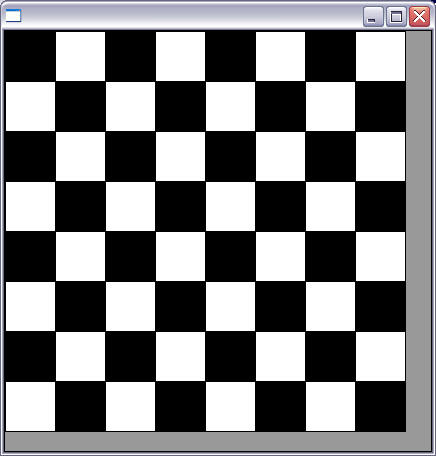
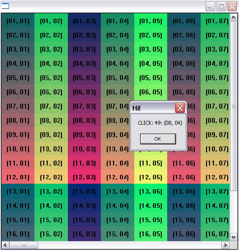

## IupCells

Creates a grid widget (set of cells) that enables some application-specific drawing, such as chess tables, tiles editors, degrade scales, drawable spreadsheets, and so forth.

This element is mostly based on application callbacks functions that determine the number of cells (rows and columns), their appearance and interaction.
This mechanism offers full flexibility to applications, but requires programmer attention to avoid infinite loops inside these functions.
Using callbacks, cells can be also grouped to form major or hierarchical elements, such as headers, footers, etc.
This callback approach was intentionally chosen to allow all cells to be dynamically and directly changed based on application's data structures.
Since the size of each cell is given by the application, the size of the control also must be given using SIZE or RASTERSIZE attributes.

It inherits from [IupCanvas](../elem/iup_canvas.md).
Uses the [IupDraw](../func/iup_draw.md) API for internal drawing.

Originally implemented by André Clinio.

### Creation

    Ihandle* IupCells(void);

**Returns:** the identifier of the created element, or NULL if an error occurs.

### Attributes

**BOXED:** Determines if the bounding cells' regions should be drawn with black lines.
It can be "YES" or "NO". Default: "YES".
If the span attributes are used, set this attribute to "NO" to avoid grid drawing over spanned cells.

**BUFFERIZE:** Disables the automatic redrawing of the control, so many attributes can be changed without many redraws.
When set to "NO" the control is redrawn. When REPAINT attribute is set, BUFFERIZE is automatically set to "NO".
Default: "NO".

**CLIPPED:** Determines if, before cells drawing, each bounding region should be clipped.
This attribute should be changed in few specific cases. It can be "YES" or "NO". Default: "YES".

**FIRST_COL** (read-only) (non-inheritable): Returns the number of the first visible column.

**FIRST_LINE** (read-only) (non-inheritable): Returns the number of the first visible line.

**FULL_VISIBLE** (write-only) (non-inheritable)**:** Tries to show completely a specific cell (considering any vertical or horizontal header or scrollbar position).
This attribute is set by a formatted string "%d:%d" (C syntax), where each "%d" represent the line and column integer indexes respectively.

**LIMITS***L:C* (read-only) (non-inheritable): Returns the limits of a given cell.
Input format is "lin:col" or "%d:%d" in C.
Output format is "xmin:xmax:ymin:ymax" or "%d:%d:%d:%d" in C.

**NON_SCROLLABLE_LINES:** Determines the number of non-scrollable lines (vertical headers) that should always be visible despite the vertical scrollbar position.
It can be any non-negative integer value. Default: "0"

**NON_SCROLLABLE_COLS:** Determines the number of non-scrollable columns (horizontal headers) that should always be visible despite the horizontal scrollbar position.
It can be any non-negative integer value. Default: "0"

**ORIGIN:** Sets the first visible line and column positions.
This attribute is set by a formatted string "%d:%d" (C syntax), where each "%d" represent the line and column integer indexes respectively.

**REPAINT**(write-only) (non-inheritable)**:** When set with any value, provokes the control to be redrawn.

[SIZE](../attrib/iup_size.md) (non-inheritable): there is no initial size.
You must define SIZE or RASTERSIZE.

[SCROLLBAR](../attrib/iup_scrollbar.md) (creation-only): Default: "YES".

> 
>
> ------------------------------------------------------------------------

[ACTIVE](../attrib/iup_active.md), [BGCOLOR](../attrib/iup_bgcolor.md), [FONT](../attrib/iup_font.md), [SCREENPOSITION](../attrib/iup_screenposition.md), [POSITION](../attrib/iup_position.md), [MINSIZE](../attrib/iup_minsize.md), [MAXSIZE](../attrib/iup_maxsize.md), [WID](../attrib/iup_wid.md), [TIP](../attrib/iup_tip.md), [SIZE](../attrib/iup_size.md), [RASTERSIZE](../attrib/iup_rastersize.md), [ZORDER](../attrib/iup_zorder.md), [VISIBLE](../attrib/iup_visible.md): also accepted. 

### Callbacks

**DRAW_CB**`:` called when a specific cell needs to be redrawn.

    int function(Ihandle* ih, int line, int column, int xmin, int xmax, int ymin, int ymax);

**ih**: identifier of the element that activated the event.\
**line**, **column**: the grid position inside the control that is being redrawn, in grid coordinates.\
**xmin, xmax, ymin, ymax**: the raster bounding box of the redrawn cells, where the application can use [IupDraw](../func/iup_draw.md) functions to draw.
If the attribute CLIPPED is set (the default), all drawing primitives are clipped to the bounding region.

**HEIGHT_CB**`:` called when the controls need to know a (eventually new) line height.

    int function(Ihandle* ih, int line); 

**ih**: identifier of the element that activated the event.\
**line:** the line index

**Returns**: an integer that specifies the desired height (in pixels). Default is 30 pixels.

**HSPAN_CB**`:` called when the control needs to know if a cell should be horizontally spanned.

    int function(Ihandle* ih, int line, int column); 

**ih**: identifier of the element that activated the event.\
**line, column:** the line and column indexes (in grid coordinates)

**Returns**: an integer that specifies the desired span. Default is 1 (no span).

**MOUSECLICK_CB**`:` called when the mouse is clicked over a cell.

    int function(Ihandle* ih, int button, int pressed, int line, int column, int x, int y, char* status); 

Same as the [BUTTON_CB](../call/iup_button_cb.md) IupCanvas callback with two additional parameters:

**line**, **column**: the grid position in the control where the event has occurred, in grid coordinates.

**MOUSEMOTION_CB**`:` called when the mouse moves over the control.

    int function(Ihandle *ih, int line, int column, int x, int y, char *r);

Same as the [MOTION_CB](../call/iup_motion_cb.md) IupCanvas callback with two additional parameters:

**line**, **column**: the grid position in the control where the event has occurred, in grid coordinates.

**NCOLS_CB**`:` called when then controls needs to know its number of columns.

    int function(Ihandle* ih); 

**ih**: identifier of the element that activated the event.

**Returns**: an integer that specifies the number of columns. Default is 10 columns.

**NLINES_CB**`:` called when then controls needs to know its number of lines.

    int function(Ihandle* ih); 

**ih**: identifier of the element that activated the event.

**Returns**: an integer that specifies the number of lines. Default is 10 lines.

**SCROLLING_CB**`:` called when the scrollbars are activated.

    int function(Ihandle* ih, int line, int column); 

**ih**: identifier of the element that activated the event.\
**line, column:** the first visible line and column indexes (in grid coordinates)

**Returns**: If IUP_IGNORE the cell is not redrawn. By default, the cell is always redrawn.

**VSPAN_CB**`:` called when the control needs to know if a cell should be vertically spanned.

    int function(Ihandle* ih, int line, int column); 

**ih**: identifier of the element that activated the event.\
**line, column:** the line and column indexes (in grid coordinates)

**Returns**: an integer that specifies the desired span. Default is 1 (no span).

**WIDTH_CB**`:` called when the controls need to know the column width

    int function(Ihandle* ih, int column); 

**ih**: identifier of the element that activated the event.\
**column:** the column index

**Returns**: an integer that specifies the desired width (in pixels). Default is 60 pixels.

> 
>
> ------------------------------------------------------------------------

[MAP_CB](../call/iup_map_cb.md), [UNMAP_CB](../call/iup_unmap_cb.md), [DESTROY_CB](../call/iup_destroy_cb.md), [GETFOCUS_CB](../call/iup_getfocus_cb.md), [KILLFOCUS_CB](../call/iup_killfocus_cb.md), [ENTERWINDOW_CB](../call/iup_enterwindow_cb.md), [LEAVEWINDOW_CB](../call/iup_leavewindow_cb.md), [K_ANY](../call/iup_k_any.md), [HELP_CB](../call/iup_help_cb.md): All common callbacks are supported.

### Utility Functions

These functions can be used to help set and get attributes from the control:

    void  IupSetAttributeId2(Ihandle* ih, const char* name, int lin, int col, const char* value);
    char* IupGetAttributeId2(Ihandle* ih, const char* name, int lin, int col);
    int   IupGetIntId2(Ihandle* ih, const char* name, int lin, int col);
    float IupGetFloatId2(Ihandle* ih, const char* name, int lin, int col);
    void  IupSetfAttributeId2(Ihandle* ih, const char* name, int lin, int col, const char* format, ...);
    void  IupSetIntId2(Ihandle* ih, const char* name, int lin, int col, int value);
    void  IupSetFloatId2(Ihandle* ih, const char* name, int lin, int col, float value);

 

    IupSetAttribute(ih, "30:10", value)        => IupSetAttributeId2(ih, "", 30, 10, value)
    IupSetAttribute(ih, "BGCOLOR30:10", value) => IupSetAttributeId2(ih, "BGCOLOR", 30, 10, value)
    IupSetAttribute(ih, "ALIGNMENT10", value)  => IupSetAttributeId(ih, "ALIGNMENT", 10, value)

When one of the indices is the asterisk, use IUP_INVALID_ID as the parameter. For ex:

    IupSetAttribute(ih, "BGCOLOR30:*", value) => IupSetAttributeId2(ih, "BGCOLOR", 30, IUP_INVALID_ID, value)

These functions are faster than the traditional functions because they do not need to parse the attribute name string and the application does not need to concatenate the attribute name with the id.

### Examples

[Browse for Example Files](../../examples/)

**Checkerboard Pattern**

**Numbering Cells**

### See Also

[IupCanvas](../elem/iup_canvas.md)
