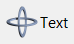
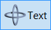
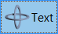
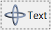

## IupFlatButton

Creates an interface element that is a button, but it does not have native decorations.
When selected, this element activates a function in the application.
Its visual presentation can contain a text and/or an image.

It behaves just like an [IupButton](../elem/iup_button.md), but since it is not a native control, it has more flexibility for additional options.
It can also behave like an [IupToggle](../elem/iup_toggle.md) (without the checkmark).

It inherits from [IupCanvas](../elem/iup_canvas.md).

### Creation

    Ihandle* IupFlatButton(const char *title);

**title**: Text to be shown to the user. It can be NULL. It will set the TITLE attribute.

**Returns:** the identifier of the created element, or NULL if an error occurs.

### Attributes

Inherits all attributes and callbacks of the [IupCanvas](../elem/iup_canvas.md), but redefines a few attributes.

**ALIGNMENT** (non-inheritable): horizontal and vertical alignment of the set image+text.
Possible values: "ALEFT", "ACENTER" and "ARIGHT", combined to "ATOP", "ACENTER" and "ABOTTOM".
Default: "ACENTER:ACENTER". Partial values are also accepted, like "ARIGHT" or ":ATOP", the other value will be obtained from the default value.
Alignment does not include the padding area.

**BACKIMAGE** (non-inheritable): image name to be used as a background.
Use [IupSetHandle](../func/iup_sethandle.md) or [IupSetAttributeHandle](../func/iup_setattributehandle.md) to associate an image to a name.
See also [IupImage](../elem/iup_image.md).

**BACKIMAGEHIGHLIGHT** (non-inheritable): background image name of the element in highlight state.
If it is not defined then the BACKIMAGE is used.

**BACKIMAGEINACTIVE** (non-inheritable): background image name of the element when inactive.
If it is not defined then the BACKIMAGE is used and its colors will be replaced by a modified version creating the disabled effect.

**BACKIMAGEPRESS** (non-inheritable): background image name of the element in pressed state.
If it is not defined then the BACKIMAGE is used.

**BACKIMAGEZOOM** (non-inheritable): if set, the back image will be zoomed to occupy the full background.
Aspect ratio is NOT preserved. Can be Yes or No. Default: No.

[BGCOLOR](../attrib/iup_bgcolor.md): Background color.
If text and image are not defined, the button is configured to simply show a color, in this case set the button size because the natural size will be very small.
If not defined it will use the background color of the native parent.

**HLCOLOR**: background color used to indicate a highlight state. Pre-defined to "200 225 245".
Can be set to NULL. If NULL, BGCOLOR will be used instead.

**PSCOLOR**: background color used to indicate a press state. Pre-defined to "150 200 235".
Can be set to NULL. If NULL, BGCOLOR will be used instead.

**GRADIENT** (non-inheritable): gradient background colors in the format "color1:color2".
When defined, the background is drawn as a linear gradient instead of a solid color.
Can be set to NULL to disable.

**GRADIENTHL** (non-inheritable): gradient colors used for highlight state.
If not defined, GRADIENT will be used.

**GRADIENTPS** (non-inheritable): gradient colors used for pressed state.
If not defined, GRADIENT will be used.

**GRADIENTANGLE** (non-inheritable): angle in degrees for the gradient direction.
Default: "90" (top to bottom).

**BORDER** (creation-only): the default value is "NO". This is the **IupCanvas** border.

**BORDERCOLOR**: color used for borders. Default: "50 150 255".
This is for the **IupFlatButton** drawn border.

**BORDERPSCOLOR**: color used for borders when pressed or selected.
Default use BORDERCOLOR.

**BORDERHLCOLOR**: color used for borders when highlighted. Default uses BORDERCOLOR.

**BORDERWIDTH**: line width used for borders. Default: "1".
Any borders can be hidden by simply setting this value to 0.
This is for the **IupFlatButton** drawn border.

**CORNERRADIUS** (non-inheritable): radius of the rounded corners for the button background and border.
Default: "0" (no rounding).

**SHOWBORDER**: by default borders are drawn only when the button is highlighted, if SHOWBORDER=Yes borders are always show.
When SHOWBORDER=Yes and BGCOLOR is not defined, the actual BGCOLOR will be a darker version of the background color of the native parent.

**CANFOCUS** (creation-only) (non-inheritable): enables the focus traversal of the control.
Default: YES.

**FOCUSFEEDBACK** (non-inheritable): draw the focus feedback. Can be Yes or No.
Default: Yes.

**PROPAGATEFOCUS** (non-inheritable): enables the focus callback forwarding to the next native parent with FOCUS_CB defined.
Default: NO.

[EXPAND](../attrib/iup_expand.md) (non-inheritable): The default value is "NO". 

[FGCOLOR](../attrib/iup_fgcolor.md): Text color. Default: the global attribute DLGFGCOLOR.

**TEXTHLCOLOR**: text color used to indicate a highlight state.
If not defined FGCOLOR will be used instead.

**TEXTPSCOLOR**: text color used to indicate a press state.
If not defined FGCOLOR will be used instead.

**FITTOBACKIMAGE** (non-inheritable): enable the natural size to be computed from the BACKIMAGE.
If BACKIMAGE is not defined will be ignored. Can be Yes or No. Default: No.

**FRONTIMAGE** (non-inheritable): image name to be used as foreground.
The foreground image is drawn in the same position as the background, but it is drawn at last.
Use [IupSetHandle](../func/iup_sethandle.md) or [IupSetAttributeHandle](../func/iup_setattributehandle.md) to associate an image to a name.
See also [IupImage](../elem/iup_image.md).

**FRONTIMAGEHIGHLIGHT** (non-inheritable): foreground image name of the element in highlight state.
If it is not defined then the FRONTIMAGE is used.

**FRONTIMAGEINACTIVE** (non-inheritable): foreground image name of the element when inactive.
If it is not defined then the FRONTIMAGE is used and its colors will be replaced by a modified version creating the disabled effect.

**FRONTIMAGEPRESS** (non-inheritable): foreground image name of the element in pressed state.
If it is not defined then the FRONTIMAGE is used.

**HASFOCUS** (read-only): returns the button state if has focus. Can be Yes or No.

**HIGHLIGHTED** (read-only): returns the button state if highlighted. Can be Yes or No.

**IMAGE** (non-inheritable): Image name.
Use [IupSetHandle](../func/iup_sethandle.md) or [IupSetAttributeHandle](../func/iup_setattributehandle.md) to associate an image to a name.
See also [IupImage](../elem/iup_image.md).

**IMAGEHIGHLIGHT** (non-inheritable): Image name of the element in highlight state.
If it is not defined then the IMAGE is used.

**IMAGEINACTIVE** (non-inheritable): Image name of the element when inactive.
If it is not defined then the IMAGE is used and its colors will be replaced by a modified version creating the disabled effect.

**IMAGEPRESS** (non-inheritable): Image name of the element in pressed state.
If it is not defined then the IMAGE is used.

**IMAGEPOSITION** (non-inheritable): Position of the image relative to the text when both are displayed.
Can be: LEFT, RIGHT, TOP, BOTTOM. Default: LEFT.

**PADDING**: internal margin. Works just like the MARGIN attribute of the **IupHbox** and **IupVbox** containers, but uses a different name to avoid inheritance problems.
Alignment does not include the padding area. Default value: "0x0".
Value can be DEFAULTBUTTONPADDING, so the global attribute of this name will be used instead.

**CPADDING**: same as PADDING but using the units of the **SIZE** attribute.
It will actually set the PADDING attribute.

**PRESSED** (read-only): returns the button state if pressed. Can be Yes or No.

**RADIO** (read-only): returns if the toggle is inside a radio. Can be "YES" or "NO".
Valid only after the element is mapped and TOGGLE=Yes, before returns NULL.

**IGNORERADIO** (non-inheritable): when set, the toggle will not behave as a radio when inside an **IupRadio** hierarchy.

**SPACING** (non-inheritable): spacing between the image and the text. Default: "2".

**CSPACING**: same as SPACING but using the units of the vertical part of the **SIZE** attribute.
It will actually set the SPACING attribute.

[TITLE](../attrib/iup_title.md) (non-inheritable): Label's text.
The '\n' character is accepted for line change.

**TOGGLE**: enabled the toggle behavior. Default: NO.

**TEXTALIGNMENT** (non-inheritable): Horizontal text alignment for multiple lines.
Can be: ALEFT, ARIGHT or ACENTER. Default: ALEFT.

**TEXTWRAP** (non-inheritable): For single line texts if the text is larger than its box the line will be automatically broken in multiple lines.
Notice that this is done internally by the system, the element natural size will still use only a single line.
For the remaining lines to be visible, the element should use EXPAND=VERTICAL or set a SIZE/RASTERSIZE with enough height for the wrapped lines.

**TEXTELLIPSIS** (non-inheritable): If the text is larger than its box, an ellipsis ("...") will be placed near the last visible part of the text and replace the invisible part.
It will be ignored when TEXTWRAP=Yes.

**TEXTCLIP** (non-inheritable): If Yes, the text will be clipped to the button area. Default: No.

**TEXTORIENTATION** (non-inheritable): text angle in degrees and counterclockwise.
The text size will adapt to include the rotated space.

**VALUE** (non-inheritable): Toggle's state. Values can be "ON", "OFF" or "TOGGLE".
Default: "OFF". The TOGGLE option will invert the current state. Valid only when TOGGLE=Yes.
Can only be set to ON for a toggle inside a radio, it will automatically set to OFF the previous toggle that was ON.

**SELECTED** (non-inheritable): Same as VALUE but ignore the TOGGLE attribute.
Directly sets the selected state but does not depend on a TOGGLE behavior.

> 
>
> ------------------------------------------------------------------------

[ACTIVE](../attrib/iup_active.md), [FONT](../attrib/iup_font.md), [EXPAND](../attrib/iup_expand.md), [SCREENPOSITION](../attrib/iup_screenposition.md), [POSITION](../attrib/iup_position.md), [MINSIZE](../attrib/iup_minsize.md), [MAXSIZE](../attrib/iup_maxsize.md), [WID](../attrib/iup_wid.md), [TIP](../attrib/iup_tip.md), [SIZE](../attrib/iup_size.md), [RASTERSIZE](../attrib/iup_rastersize.md), [ZORDER](../attrib/iup_zorder.md), [VISIBLE](../attrib/iup_visible.md), [THEME](../attrib/iup_theme.md): also accepted.

### Callbacks

Inherits all callbacks of the [IupCanvas](../elem/iup_canvas.md), but redefines a few of them.
Including ACTION, BUTTON_CB, MOTION_CB, FOCUS_CB, LEAVEWINDOW_CB, and ENTERWINDOW_CB.
To allow the application to use those callbacks, the same callbacks are exported with the "FLAT_" prefix using the same parameters, except the FLAT_ACTION callback that now mimics the **IupButton** ACTION.
They are all called before the internal callbacks, and if they return IUP_IGNORE the internal callbacks are not processed.

**FLAT_ACTION**: Action generated when the button 1 (usually left) is selected.
This callback is called only after the mouse is released and when it is released inside the button area.

    int function(Ihandle* ih);

**ih**: identifier of the element that activated the event.

**Returns**: IUP_CLOSE will be processed.

**VALUECHANGED_CB**: Called after the value was interactively changed by the user.
Called only when TOGGLE=Yes. Called after the ACTION callback but under the same context.

    int function(Ihandle *ih);

**ih**: identifier of the element that activated the event.

------------------------------------------------------------------------

[MAP_CB](../call/iup_map_cb.md), [UNMAP_CB](../call/iup_unmap_cb.md), [DESTROY_CB](../call/iup_destroy_cb.md), [GETFOCUS_CB](../call/iup_getfocus_cb.md), [KILLFOCUS_CB](../call/iup_killfocus_cb.md), [ENTERWINDOW_CB](../call/iup_enterwindow_cb.md), [LEAVEWINDOW_CB](../call/iup_leavewindow_cb.md), [K_ANY](../call/iup_k_any.md), [HELP_CB](../call/iup_help_cb.md): All common callbacks are supported.

### Notes

The **IupFlatButton** can contain text and image simultaneously.

The natural size will be a combination of the size of the image and the title, if any, plus PADDING and SPACING (if both image and title are present).

Borders are drawn only when the button is highlighted reproducing the behavior of the **IupButton** when FLAT=Yes.

Buttons are activated using Enter or Space keys.

When TOGGLE=Yes, to build a set of mutual exclusive toggles, insert them in a **IupRadio** container.
Only the **IupFlatButton** controls inside the radio will be part of the exclusive group.

When TOGGLE=Yes, the button that is a child of an **IupRadio** automatically receives a name when its is mapped into the native system.

To replace a **IupButton** by a **IupFlatButton**, you must change the function call (**IupFlatButton** does not include the action callback in the constructor) and change the ACTION callback name to FLAT_ACTION.

To replace a **IupToggle** by a **IupFlatButton**, you must do the same, and set TOGGLE=Yes.
But notice that there will be no check box nor radio button.

Finally, notice that the name of the secondary image attributes are different (for instance, IMINACTIVE is IMAGEINACTIVE, IMPRESS is IMAGEPRESS, and so on).
To define a button that only shows a color, do the same as in **IupButton** and don't define TITLE nor IMAGE, but instead of BGCOLOR use FGCOLOR to set the color of the button.

When the **IupFlatButton** displays only a text it will look like a label, use SHOWBORDER=Yes to force the display of the borders all the time.

### Examples

[Browse for Example Files](../../examples/)

The sample buttons have PADDING=5x5.

**Normal**

**Highlight**

**Press**

**Focus**

### See Also

[IupImage](../elem/iup_image.md), [IupButton](../elem/iup_button.md), [IupToggle](../elem/iup_toggle.md), [IupLabel](../elem/iup_label.md)
