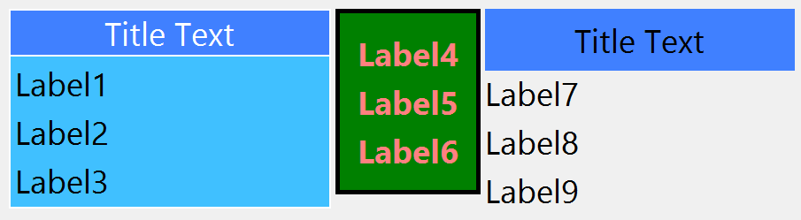

## IupFlatFrame

Creates a native container, which draws a frame with a title around its child. The decorations are manually drawn.
The control inherits from [IupBackgroundBox](../elem/iup_backgroundbox.md).

### Creation

    Ihandle* IupFlatFrame(Ihandle *child);

**child**: Identifier of an interface element which will receive the frame around. It can be NULL.

**Returns:** the identifier of the created element, or NULL if an error occurs.

### Attributes

Inherits all attributes and callbacks of the [IupBackgroundBox](../elem/iup_backgroundbox.md), but redefines a few attributes.

**DECORATION** [read-only] (non-inheritable): return Yes.

**DECOROFFSET** and **DECORSIZE** [read-only] (non-inheritable): are calculated according to FRAME, FRAMEWIDTH, FRAMESPACE and the title area.

**BGCOLOR**: background color of the child area.
If not defined it will use the background color of the native parent.

**FRAME** (non-inheritable): enables the frame line. Default: Yes.
If value is CROSSTITLE the frame at top crosses the title, like traditional frames in native systems.
When CROSSTITLE is used TITLELINE and TITLEALIGNMENT are ignored, the title line is never drawn and alignment is always left.

**FRAMECOLOR** (non-inheritable): frame line color. Default: "160 160 160" (changed in 3.28).

**FRAMEWIDTH** (non-inheritable): frame line width. Default: 1.

**FRAMESPACE** (non-inheritable): spacing between frame line and child area. Used only when FRAME=Yes.
Default: 2.

[TITLE](../attrib/iup_title.md) (non-inheritable): Text the user will see at the top of the frame.

**TITLECOLOR** (non-inheritable): title text color. Default: the global attribute DLGFGCOLOR.

**TITLEBGCOLOR** (non-inheritable): background color of the title area.
If not defined BGCOLOR will be used.

**TITLELINE** (non-inheritable): enables the title line.
Horizontal line that separates the title area from the child area. Default: Yes.

**TITLELINECOLOR** (non-inheritable): title line color. Default: the global attribute DLGFGCOLOR.

**TITLELINEWIDTH** (non-inheritable): title line width. Default: 1.

**TITLEIMAGE** (non-inheritable): image name to be used in title.
Use [IupSetHandle](../func/iup_sethandle.md) or [IupSetAttributeHandle](../func/iup_setattributehandle.md) to associate an image to a name.
See also [IupImage](../elem/iup_image.md).

**TITLEIMAGEINACTIVE** (non-inheritable): image used in title when inactive.
If it is not defined then the TITLEIMAGE is used and its colors will be replaced by a modified version creating the disabled effect.

**TITLEIMAGEPOSITION** (non-inheritable): position of the image relative to the text when both are displayed.
Can be: LEFT, RIGHT, TOP, BOTTOM. Default: LEFT.

**TITLEIMAGESPACING** (non-inheritable): spacing between the image and the text. Default: "2".

**TITLEALIGNMENT** (non-inheritable): horizontal alignment. Possible values: "ALEFT", "ACENTER" and "ARIGHT".
Default: "ACENTER". Alignment does not includes the padding area.

**TITLETEXTALIGNMENT** (non-inheritable): horizontal text alignment for multiple lines.
Can be: ALEFT, ARIGHT or ACENTER. Default: ALEFT.

**TITLETEXTWRAP** (non-inheritable): For single line texts if the text is larger than its box, the line will be automatically broken in multiple lines.
Notice that this is done internally by the system, the element natural size will still use only a single line.
For the remaining lines to be visible, the element should use EXPAND=VERTICAL or set a SIZE/RASTERSIZE with enough height for the wrapped lines.

**TITLETEXTELLIPSIS** (non-inheritable): If the text is larger than its box, an ellipsis ("...") will be placed near the last visible part of the text and replace the invisible part.
It will be ignored when TEXTWRAP=Yes.

  **TITLETEXTORIENTATION** (non-inheritable): text angle in degrees and counterclockwise.
The text size will adapt to include the rotated space.

**TITLEPADDING** (non-inheritable): title internal margin. Alignment does not include the padding area.
Default value: "0x0".

### Notes

To replace a **IupFrame** by a **IupFlatFrame**, you must set TITLELINE=No, TITLEALIGNMENT=ALEFT and FRAMECOLOR="160 160 160" (or a lighter version of the DLGFGCOLOR).
But the line cannot be positioned in the middle of the text like in IupFrame. 

### Examples

[Browse for Example Files](../../examples/)

      frame1 = IupFlatFrame
              (
                IupVbox
                (
                  IupLabel("Label1"),
                  IupSetAttributes(IupLabel("Label2"), "SIZE=70x"),
                  IupLabel("Label3"),
                  NULL
                )
              );

      frame2 = IupFlatFrame
              (
                IupVbox
                (
                  IupSetAttributes(IupLabel("Label4"), "EXPAND=HORIZONTAL"),
                  IupLabel("Label5"),
                  IupLabel("Label6"),
                  NULL
                )
              );

      frame3 = IupFlatFrame
              (
                IupVbox
                (
                  IupLabel("Label7"),
                  IupSetAttributes(IupLabel("Label8"), "SIZE=70x"),
                  IupLabel("Label9"),
                  NULL
                )
              );

      IupSetAttribute(frame1, "TITLE", "Title Text");
      IupSetAttribute(frame1, "BGCOLOR", "64 192 255");
      IupSetAttribute(frame1, "FRAMECOLOR", "255 255 255");
      IupSetAttribute(frame1, "TITLELINECOLOR", "255 255 255");
      IupSetAttribute(frame1, "TITLEBGCOLOR", "64 128 255");
      IupSetAttribute(frame1, "TITLECOLOR", "255 255 255");
      IupSetAttribute(frame1, "TITLELINEWIDTH", "2");
      IupSetAttribute(frame1, "FRAMEWIDTH", "2");
      IupSetAttribute(frame1, "FRAMESPACE", "5");

      IupSetAttribute(frame2, "BGCOLOR", "0 128 0");
      IupSetAttribute(frame2, "FRAMEWIDTH", "5");
      IupSetAttribute(frame2, "FRAMESPACE", "20");
      IupSetAttribute(frame2, "FGCOLOR", "255 128 128");  /* recursive set for labels */
      IupSetAttribute(frame2, "FONTSTYLE", "Bold");
      IupSetAttribute(frame2, "FONTSIZE", "14");

      IupSetAttribute(frame3, "FRAME", "No");
      IupSetAttribute(frame3, "TITLE", "Title Text");
      IupSetAttribute(frame3, "TITLELINE", "No");
      IupSetAttribute(frame3, "TITLEBGCOLOR", "64 128 255");

\

### See Also

[IupFrame](../elem/iup_frame.md), [IupBackgroundBox](../elem/iup_backgroundbox.md)
