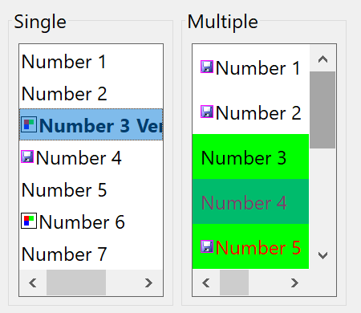

## IupFlatList

Creates an interface element that displays a list of items, but it does not have native decorations.

It behaves like [IupList](../elem/iup_list.md) when DROPDOWN=NO and EDITBOX=NO.

It inherits from [IupCanvas](../elem/iup_canvas.md).

### Creation

    Ihandle* IupFlatList(void);

**Returns:** the identifier of the created element, or NULL if an error occurs.

### Attributes

Inherits all attributes and callbacks of the [IupCanvas](../elem/iup_canvas.md), but redefines a few attributes.

**"1"**: Title of the first item in the list.
**"2"**: Title of the second item in the list.
**"3"**: Title of the third item in the list.
**...**
**"id"**: Title of the idth item in the list.

(non-inheritable) The values can be any text. Items before "1" are ignored.
Differently from IupList, the behavior before map and after map are the same.

- if "1" is set to NULL, all items are removed.
- if "id" is set to NULL, all items after id are removed.
- if "id" is between the first and the last item, the current idth item title is replaced.
- if "count+n" is set, then empty items are inserted from count up to the given id. (different from IupList)

**APPENDITEM** (write-only): inserts an item after the last item. Ignored if set before map.

**ALIGNMENT** (non-inheritable): horizontal and vertical alignment of the set image+text for each item.
Possible values: "ALEFT", "ACENTER" and "ARIGHT",  combined to "ATOP", "ACENTER" and "ABOTTOM".
Default: "ALEFT:ACENTER". Partial values are also accepted, like "ARIGHT" or ":ATOP", the other value will be obtained from the default value.
Alignment does not include the padding area.

**BACKIMAGE** (non-inheritable): image name to be used as a background.
Use [IupSetHandle](../func/iup_sethandle.md) or [IupSetAttributeHandle](../func/iup_setattributehandle.md) to associate an image to a name.
See also [IupImage](../elem/iup_image.md).

**BACKIMAGEZOOM** (non-inheritable): if set, the back image will be zoomed to occupy the full background.
Aspect ratio is NOT preserved. Can be Yes or No. Default: No.

[BGCOLOR](../attrib/iup_bgcolor.md): Background color of the text.
Default: the global attribute TXTBGCOLOR.

**BORDER** (creation-only): the default value is "NO". This is the **IupCanvas** border.
It is displayed around the scrollbars.

**BORDERCOLOR**: color used for the internal border. Default: "50 150 255".
This is for the internal border.

**BORDERWIDTH**: line width used for the internal border. Default: "0".
The internal borders are hidden by simply setting this value to 0.
It is drawn inside the canvas, so inside the scrollbars.

**COUNT** (read-only) (non-inheritable): returns the number of items.

**DRAGDROPLIST** (non-inheritable): prepare the [Drag & Drop](../attrib/iup_dragdrop.md) callbacks to support drag and drop of items between lists (IupList or IupFlatList), in the same IUP application.
[Drag & Drop](../attrib/iup_dragdrop.md) attributes still need to be set in order to activate the drag & drop support, so the application can control if this list is a source and/or target.
Default: NO.

**DROPFILESTARGET** (non-inheritable): Enable or disable the drop of files.
Default: NO, but if DROPFILES_CB is defined when the element is mapped then it will be automatically enabled.

[FGCOLOR](../attrib/iup_fgcolor.md): Text color. Default: the global attribute TXTFGCOLOR.

**FOCUSFEEDBACK** (non-inheritable): draw the focus feedback. Can be Yes or No. Default: Yes.

**PROPAGATEFOCUS** (non-inheritable): enables the focus callback forwarding to the next native parent with FOCUS_CB defined.
Default: NO.

**FITTOBACKIMAGE** (non-inheritable): enable the natural size to be computed from the BACKIMAGE.
If BACKIMAGE is not defined will be ignored. Can be Yes or No. Default: No.

**HASFOCUS** (read-only): returns the button state if has focus. Can be Yes or No.

**IMAGEid** (non-inheritable): image name to be used in the specified item, where id is the specified item starting at 1.
The item must already exist. Use [IupSetHandle](../func/iup_sethandle.md) or [IupSetAttributeHandle](../func/iup_setattributehandle.md) to associate an image to a name.
See also [IupImage](../elem/iup_image.md). Images don't need to have the same size.

**IMAGEPOSITION** (non-inheritable): Position of the image relative to the text when both are displayed.
Can be: LEFT, RIGHT, TOP, BOTTOM. Default: LEFT.

**PADDING**: internal margin of each item.
Works just like the MARGIN attribute of the **IupHbox** and **IupVbox** containers, but uses a different name to avoid inheritance problems.
Alignment does not include the padding area. Default value: "2x2".

**CPADDING**: same as PADDING but using the units of the **SIZE** attribute.
It will actually set the PADDING attribute.

**ITEMFGCOLOR*****id***: foreground color of the item at the given id. id starts at 1.
If not defined FGCOLOR is used.

**ITEMBGCOLOR*****id***: background color of the item at the given id. id starts at 1.
If not defined BGCOLOR is used.

**ITEMTIP*****id***: tip of the item at the given id.
If defined will be shown instead of the TIP attribute.

**ITEMFONT*****id***: text font of the tab. If not defined FONT is used.

**ITEMFONTSTYLE*****id***: text font style. When changed will actually set ITEMFONTid.

**ITEMFONTSIZE*****id***: text font size. When changed will actually set ITEMFONTid.

**ICONSPACING** (non-inheritable): spacing between the image and the text. Default: "2".

**HLCOLOR**: color of a filled box drawn over the selected item. Default: "TXTHLCOLOR".

**HLCOLORALPHA**: the transparency used to draw the selection. Default: 128.
If set to 0 the selection box is not drawn.

**PSCOLOR**: background color of a selected item.
If not defined BACKCOLORid will be used.

**TEXTPSCOLOR**: foreground color of a selected item.
If not defined FORECOLORid will be used.

**INSERTITEMid** (write-only): inserts an item before the given id position. id starts at 1.
If id=COUNT+1 then it will append after the last item. Ignored if out of bounds.
Different from IupList, can be set before map.

**MULTIPLE** (creation-only): Allows selecting several items simultaneously (multiple list).
Default: "NO".

**REMOVEITEM** (write-only): removes the given value. value starts at 1.
If value is NULL or "ALL" removes all the items. Different from IupList, can be set before map.

[SCROLLBAR](../attrib/iup_scrollbar.md) (read-only): is always "NO". So the IupCanvas native scrollbars are hidden.
See the FLATSCROLLBAR attribute below. YAUTOHIDE and XAUTOHIDE will always be Yes.

[FLATSCROLLBAR](../attrib/iup_flatscrollbar.md): Can be Yes, Vertical or Horizontal.
Can be set only before map. Default: Yes.

**SHOWDRAGDROP** (creation-only) (non-inheritable): enables the internal drag and drop of items in the same list, and enables the **DRAGDROP_CB** callback.
Default: "NO". Works only if MULTIPLE=NO.
[Drag & Drop](../attrib/iup_dragdrop.md) attributes are NOT used.

[SIZE](../attrib/iup_size.md): Size of the list.
The **Natural Size** is defined by the number of elements in the list and the width of the largest item, the default has room for 5 characters in 1 item.
The **Natural Size** ignores the list contents if VISIBLECOLUMNS or VISIBLELINES attributes are defined.

**SPACING**: internal space between each item. Different from IupList, it does not affect the internal margin.
Not drawn with any item background color. Default: 0

**CSPACING**: same as SPACING but using the units of the vertical part of the **SIZE** attribute.
It will actually set the SPACING attribute.

**TOPITEM** (write-only): position the given item at the top of the list or near to make it visible.

**TEXTALIGNMENT** (non-inheritable): Horizontal text alignment for multiple lines.
Can be: ALEFT, ARIGHT or ACENTER. Default: ALEFT.

**TEXTWRAP** (non-inheritable): For single line texts if the text is larger than its box, the line will be automatically broken in multiple lines.
Notice that this is done internally by the system, the element natural size will still use only a single line.
For the remaining lines to be visible, the element should use EXPAND=VERTICAL or set a SIZE/RASTERSIZE with enough height for the wrapped lines.

**TEXTELLIPSIS** (non-inheritable): If the text is larger than its box, an ellipsis ("...") will be placed near the last visible part of the text and replace the invisible part.
It will be ignored when TEXTWRAP=Yes.

**VALUE** (non-inheritable): Depends on the selection mode:

- MULTIPLE=YES: Sequence of '+' and '-' symbols indicating the state of each item. When setting this value, the user must provide the same amount of '+' and '-' symbols as the amount of items in the list. It can use ' ' (space) or another character so the current selection on that item will remain the same.
- MULTIPLE=NO: Integer number representing the selected item in the list (begins at 1). It returns NULL if there is no selected item.
- For both cases, when setting NULL, all items are deselected.

**VALUESTRING** (non-inheritable): changes or retrieves the value attribute using a string of an item.
Works only when MULTIPLE=NO. When set it will search for the first item with the same string.

**VISIBLECOLUMNS**: Defines the number of visible columns for the **Natural Size**, this means that will act also as minimum number of visible columns.
It uses a wider character size then the one used for the SIZE attribute, so strings will fit better without the need of extra columns.
Set this attribute to speed **Natural Size** computation for very large lists.

**VISIBLELINES**: Defines the number of visible lines for the **Natural Size**, this means that will act also as minimum number of visible lines.

### Callbacks

Inherits all callbacks of the [IupCanvas](../elem/iup_canvas.md), but redefines a few of them.
Including ACTION, BUTTON_CB, LEAVEWINDOW_CB, FOCUS_CB, and MOTION_CB.
To allow the application to use those callbacks, the same callbacks are exported with the "FLAT_" prefix using the same parameters, except the FLAT_ACTION callback that now mimics the **IupList** ACTION.
They are all called before the internal callbacks, and if they return IUP_IGNORE the internal callbacks are not processed.

**FLAT_ACTION**: Action generated when the state of an item in the list is interactively changed.

    int function (Ihandle *ih, char *text, int item, int state);

**ih**: identifier of the element that activated the event.\
**text**: Text of the changed item.\
**item**: Number of the changed item starting at 1.\
**state**: Equal to 1 if the option was selected or to 0 if the option was deselected.

**DBLCLICK_CB**: Action generated when the user double-click an item.

    int function (Ihandle *ih, int item, char *text);

**ih**: identifier of the element that activated the event.\
**item**: Number of the selected item starting at 1.\
**text**: Text of the selected item.

**DRAGDROP_CB**: Action generated when an internal drag and drop is executed.
Only active if **SHOWDRAGDROP=YES.**

    int function(Ihandle *ih, int drag_id, int drop_id, int isshift, int iscontrol); 

**ih**: identifier of the element that activated the event.\
**drag_id**: Identifier of the clicked item where the drag start.\
**drop_id**: Identifier of the clicked item where the drop was executed. -1 indicates a drop in a blank area.\
**isshift**: flag indicating the shift key state.\
**iscontrol**: flag indicating the control key state.

Returns: if returns IUP_CONTINUE, or if the callback is not defined and **SHOWDRAGDROP=YES**, then the item is moved to the new position.
If Ctrl is pressed, then the item is copied instead of moved.

**MULTISELECT_CB**: Action generated when the state of an item in the multiple selection list is interactively changed.
But it is called only when the interaction is over.

    int function (Ihandle *ih, char *value);

**ih**: identifier of the element that activated the event.\
**value**: Similar to the VALUE attribute for a multiple selection list.
Items selected are marked with '+', items deselected are marked with '-', and non changed items are marked with an 'x'.

This callback is called only when MULTIPLE=YES.
If this callback is defined, the **ACTION** callback will not be called.

The non changed items marked with 'x' are simulated internally by IUP in all systems.
If you add or remove items to/from the list, and you count on the 'x' values, then after adding/removing items set the VALUE attribute to ensure proper 'x' values.

**VALUECHANGED_CB**: Called after the selection was interactively changed.

    int function(Ihandle *ih);

**ih**: identifier of the element that activated the event.

### Notes

When the list has focus, use the arrow keys to move focus from one item to another.
If the list has multiple selection, pressing shift and the arrow will select a range of items.
Pressing a letter will select and scroll the list to the next element which title starts with that letter.
Pressing PgDn or PgUp the list is scrolled but the selection is not changed.

When adding or removing items, the selection can be changed depending on the operation, but the selection callbacks will not be called.

**Clicking and dragging a item**: if SHOWDRAGDROP=Yes starts a drag.
When mouse is released, the DRAGDROP_CB callback is called.
If the callback does not exist or if it returns IUP_CONTINUE then the item is moved to the new position.
If Ctrl is pressed then the node is copied instead of moved.
Drag is performed with the left mouse button.

All list items occupy the same vertical size, which is the largest height computed from the combination of text and image for each item individually.

### Utility Functions

These functions can be used to set and get attributes from the element:

    void  IupSetAttributeId(Ihandle *ih, const char* name, int id, const char* value);
    char* IupGetAttributeId(Ihandle *ih, const char* name, int id);
    int   IupGetIntId(Ihandle *ih, const char* name, int id);
    float IupGetFloatId(Ihandle *ih, const char* name, int id);
    void  IupSetfAttributeId(Ihandle *ih, const char* name, int id, const char* format, ...);
    void  IupSetIntId(Ihandle* ih, const char* name, int id, int value);
    void  IupSetFloatId(Ihandle* ih, const char* name, int id, float value);

They work just like the respective traditional set and get functions.
But the attribute string is complemented with the id value. For ex:

    IupSetAttributeId(ih, "", 3, value) == IupSetAttribute(ih, "3", value)
    IupSetAttributeId(ih, "INSERTITEM", 8, value) == IupSetAttribute(ih, "INSERTITEM8", value)

But these functions are faster than the traditional functions because they do not need to parse the attribute name string and the application does not need to concatenate the attribute name with the id.

### Examples

[Browse for Example Files](../../examples/)

### See Also

[IupList](../elem/iup_list.md), [IupCanvas](../elem/iup_canvas.md)
