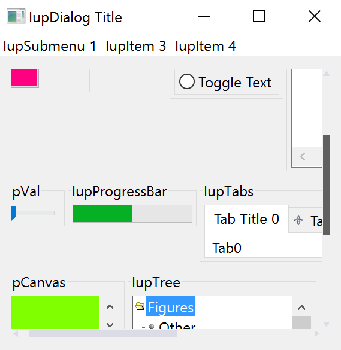

## IupFlatScrollBox

Creates a native container that allows its child to be scrolled. It inherits from [IupCanvas](../elem/iup_canvas.md).
The difference from [IupScrollBox](../elem/iup_scrollbox.md) is that its scrollbars are drawn.

### Creation

    Ihandle* IupFlatScrollBox(Ihandle* child);

**child**: Identifier of an interface element which will receive the box. It can be NULL.

**Returns:** the identifier of the created element, or NULL if an error occurs.

### Attributes

Inherits all attributes and callbacks of the [IupCanvas](../elem/iup_canvas.md), but redefines a few attributes.

[BGCOLOR](../attrib/iup_bgcolor.md): will always use the background color of the native parent.

**BORDER** (creation-only): it is always "NO".

**CANFOCUS**: is set to NO.

**CANVASBOX** (non-inheritable): enable the behavior of a canvas box instead of a regular container.
This will affect the EXPAND attribute, the Natural size computation, and child layout distribution.
Can be Yes or No. Default: No.

**CHILDOFFSET**: Allow specifying a position offset for the child. Available for native containers only.
It will not affect the natural size, and allows to position controls outside the client area.
Format "*dx*x*dy*", where *dx* and *dy* are integer values corresponding to the horizontal and vertical offsets, respectively, in pixels.
Default: 0x0.

[EXPAND](../attrib/iup_expand.md) (non-inheritable): The default value is "YES".

**LAYOUTDRAG** (non-inheritable): When the scrollbar is moved, automatically update the children layout.
Default: YES. If set to NO then the layout will be updated only when the mouse drag is released.

[SCROLLBAR](../attrib/iup_scrollbar.md) (read-only): is always "NO". So the IupCanvas native scrollbars are hidden.
See the FLATSCROLLBAR attribute below. YAUTOHIDE and XAUTOHIDE will be always Yes.

**SCROLLTO** (write-only): position the scroll at the given x,y coordinates relative to the box top-left corner.
Format "*x,y*". Value can also be TOP or BOTTOM for a vertical scroll to the top or to the bottom of the scroll range.

**SCROLLTOCHILD** (write-only): position the scroll at the top-left corner of the given child located by its name.
Use [IupSetHandle](../func/iup_sethandle.md) or [IupSetAttributeHandle](../func/iup_setattributehandle.md) to associate an Ihandle* to a name.
The child must be contained in the Scrollbox hierarchy.

**SCROLLTOCHILD_HANDLE** (write-only): same as SCROLLTOCHILD but directly using the child handle.

[FLATSCROLLBAR](../attrib/iup_flatscrollbar.md): Can be Yes, Vertical or Horizontal.
Can be set only before map. Default: Yes.

**WHEELDROPFOCUS:** set to Yes.

### Scrollbars Appearance Attributes

See [FLATSCROLLBAR](../attrib/iup_flatscrollbar.md).

> 
>
> ------------------------------------------------------------------------

[CLIENTSIZE](../attrib/iup_clientsize.md), [CLIENTOFFSET](../attrib/iup_clientoffset.md): also accepted.

### Callbacks

**LAYOUTUPDATE_CB**: Action generated when the layout is updated after a scroll operation.

### Notes

The box allows the application to create a virtual space for the dialog that is actually larger than the visible area.
The current size of the box defines the visible area.
The natural size of the child (and its children) defines the virtual space size.

So the **IupFlatScrollBox** does not depend on its child's size or expansion, and its natural size is always 0x0, except for the first time when it expands to the child's natural size.

The user can move the box contents by dragging the background.
Also, the mouse wheel scrolls the contents vertically.

The box can be created with no elements and be dynamic filled using [IupAppend](../func/iup_append.md) or [IupInsert](../func/iup_insert.md).

Notice that it is possible to use the **IupFlatScrollBox** to overcome the internal scrollbars of another control like **IupMatrix** by making all cells visible, but this will force all cells to be drawn all the time even when not visible at the scroll box, which is much slower than the internal **IupMatrix** optimization.

### Examples

[Browse for Example Files](../../examples/)

### See Also

[IupScrollBox](../elem/iup_scrollbox.md)

