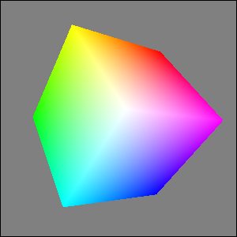

## IupGLCanvas

Creates an OpenGL canvas (drawing area for OpenGL).
It inherits from [IupCanvas](../elem/iup_canvas.md).

**Windows:** The implementation uses WGL (Win32 OpenGL) for all backends (Win32, WinUI, GTK3, GTK4, Qt, FLTK).

**Linux/Unix:** GTK3, GTK4, Qt, EFL, and FLTK use EGL with native window integration. Both X11 and Wayland display servers are supported. Motif and GTK2 use GLX (X11 OpenGL extension).

**macOS:** The implementation uses NSOpenGLContext (Cocoa OpenGL) for all backends (Cocoa, GTK3, Qt, FLTK).

### Initialization and Usage

The **IupGLCanvasOpen** function must be called after a **IupOpen**, so that the control can be used.
The "iupgl.h" file must also be included in the source code.
The program must be linked to the controls library (iupgl), and with the OpenGL library.

To link with the OpenGL libraries in Windows, add: opengl32.lib.
In Linux/Unix with EGL (GTK3, GTK4, Qt, EFL, FLTK), add: -lEGL -lGL.
In Linux/Unix with GLX (Motif, GTK2), add: -lGL.
In macOS add: -framework OpenGL.

### Creation

    Ihandle* IupGLCanvas(const char* action);

**action**: Name of the action generated when the canvas needs to be redrawn. It can be NULL.

**Returns:** the identifier of the created element, or NULL if an error occurs.

### Attributes

The **IupGLCanvas** element handles all attributes defined for a conventional canvas, see [IupCanvas](../elem/iup_canvas.md).

Apart from these attributes, **IupGLCanvas** handle specific attributes used to define the kind of buffer to be instanced.
Such attributes are all **creation-only** attributes and must be set before the element is mapped on the native system.
After the mapping, specifying these special attributes has no effect.

>
>
> ------------------------------------------------------------------------

**ACCUM_RED_SIZE**, **ACCUM_GREEN_SIZE**, **ACCUM_BLUE_SIZE** and **ACCUM_ALPHA_SIZE**: Indicate the number of bits for representing the color components in the accumulation buffer.
Value 0 means the accumulation buffer is not necessary. Default is 0.

**ALPHA_SIZE**: Indicates the number of bits for representing each colors alpha component (valid only for RGBA and for hardware that store the alpha component).
Default is "0".

**ARBCONTEXT** (non-inheritable): enable the usage of ARB extension contexts.
If during map the ARB extensions could not be loaded the attribute will be set to NO and the standard context creation will be used.
Default: NO. On EGL and macOS, setting CONTEXTVERSION, CONTEXTPROFILE, or CONTEXTFLAGS also enables extended context creation.

**BUFFER**: Indicates if the buffer will be single "SINGLE" or double "DOUBLE". Default is "SINGLE".

**BUFFER_SIZE**: Indicates the number of bits for representing the color indices (valid only for INDEX).
The system default is 8 (256-color palette).

**COLOR**: Indicates the color model to be adopted: "INDEX" or "RGBA". Default is "RGBA".
Indexed color mode is not supported on macOS and EGL; RGBA will be used instead.

**COLORMAP** (read-only): Returns the platform colormap handle, if COLOR=INDEX.

**CONTEXT** (read-only): Returns the platform OpenGL context handle.

**CONTEXTFLAGS** (non-inheritable): Context flags. Can be DEBUG, FORWARDCOMPATIBLE or DEBUGFORWARDCOMPATIBLE.
On Windows/GLX, used only when ARBCONTEXT=Yes. On EGL and macOS, can be used independently.

**CONTEXTPROFILE** (non-inheritable): Context profile mask. Can be CORE, COMPATIBILITY or CORECOMPATIBILITY.
On Windows/GLX, used only when ARBCONTEXT=Yes. On EGL and macOS, can be used independently.

**CONTEXTVERSION** (non-inheritable): Context version number in the format "major.minor".
On Windows/GLX, used only when ARBCONTEXT=Yes. On EGL and macOS, can be used independently.

**DEPTH_SIZE**: Indicates the number of bits for representing the *z* coordinate in the z-buffer.
Value 0 means the z-buffer is not necessary.

**ERROR** (read-only): If an error is found during **IupMap** and **IupGLMakeCurrent**, returns a string containing a description of the error in English.
See notes below.

**LASTERROR** (read-only) [Windows Only]: If an error is found, returns a string with the system error description.

**RED_SIZE**, **GREEN_SIZE** and **BLUE_SIZE**: Indicate the number of bits for representing each color component (valid only for RGBA).
The system default is usually 8 for each component (True Color support).

**REFRESHCONTEXT** (write-only) [Windows Only]: action attribute to refresh the internal device context when it is not owned by the window class.
The **IupCanvas** of the Win32 driver will always create a window with an owned DC, but GTK in Windows will not.

**STENCIL_SIZE**: Indicates the number of bits in the stencil buffer.
Value 0 means the stencil buffer is not necessary. Default is 0.

**STEREO**: Creates a stereo GL canvas (special glasses are required to visualize it correctly).
Possible values: "YES" or "NO". Default: "NO".
When this flag is set to Yes but the OpenGL driver does not support it, the map will be successful and STEREO will be set to NO and ERROR will not be set.

**SHAREDCONTEXT**: name of another **IupGLCanvas** that will share its display lists and textures.
That canvas must be mapped before this canvas.

**VISUAL** (read-only): Returns the platform visual handle.

**VSYNC** [macOS Only] (creation-only): Enable or disable vertical synchronization.
Can be "YES" or "NO". Default: "YES".

### Callbacks

The **IupGLCanvas** element understands all callbacks defined for a conventional canvas, see [IupCanvas](../elem/iup_canvas.md).

Additionally:

[RESIZE_CB](../call/iup_resize_cb.md): By default the resize callback sets:

    glViewport(0,0,width,height);

**SWAPBUFFERS_CB**`:` action generated when **IupGLSwapBuffers** is called.

    int function(Ihandle* ih);

**ih**: identifier of the element that activated the event.

### Auxiliary Functions

These are auxiliary functions based on the platform OpenGL extensions.
Check the respective documentations for more information.
ERROR attribute will be set to "Failed to set new current context." if the call failed.
It will reset the ERROR to NULL if successful.

    void IupGLMakeCurrent(Ihandle* ih);

Activates the given canvas as the current OpenGL context.
All subsequent OpenGL commands are directed to such canvas.
The first call will set the global attributes GL_VERSION, GL_VENDOR and GL_RENDERER.

    int IupGLIsCurrent(Ihandle* ih);

Returns a non-zero value if the given canvas is the current OpenGL context.

    void IupGLSwapBuffers(Ihandle* ih);

Makes the BACK buffer visible. This function is necessary when a double buffer is used.

    void IupGLPalette(Ihandle* ih, int index, float r, float g, float b);

Defines a color in the color palette. This function is necessary when INDEX color is used.
Not available on EGL and macOS (indexed color mode not supported).

    void IupGLUseFont(Ihandle* ih, int first, int count, int list_base);

Creates a bitmap display list from the current FONT attribute.
See the documentation of the wglUseFontBitmaps (Windows) and glXUseXFont (GLX) functions.
Not available on EGL. On macOS, this function uses Core Text to rasterize glyphs into bitmaps.

    void IupGLWait(int gl)

If gl is non-zero it will call glFinish or glXWaitGL, else will call GdiFlush or glXWaitX.
On EGL, calls eglWaitClient or eglWaitNative respectively.
On macOS, calls glFinish or flushGraphics respectively.

### Notes

In Windows, if the dialog COMPOSITED attribute is enabled, the hardware acceleration may be disabled.

Possible ERROR strings during **IupMap**:

    "X server has no OpenGL GLX extension." - OpenGL not supported (GLX only)
    "No appropriate visual." - Failed to choose a Visual (GLX only)
    "No appropriate pixel format." - Failed to choose a Pixel Format (Windows only)
    "Could not create a rendering context." - Failed to create the OpenGL context (Windows and GLX)
    "EGL display not initialized." - EGL display unavailable (EGL only)
    "No appropriate EGL config found." - Failed to choose an EGL configuration (EGL only)
    "Could not create EGL surface." - Failed to create EGL surface (EGL only)
    "Could not create EGL context." - Failed to create EGL context (EGL only)
    "No appropriate pixel format found." - Failed to choose a pixel format (macOS only)
    "Could not create OpenGL context." - Failed to create context (macOS only)
    "Failed to create OpenGL Core profile context." - Core profile unavailable (macOS only)
    "Failed to create OpenGL Legacy profile context." - Legacy profile unavailable (macOS only)

### Examples

[Browse for Example Files](../../examples/)

### See Also

[IupCanvas](../elem/iup_canvas.md)
