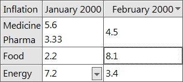
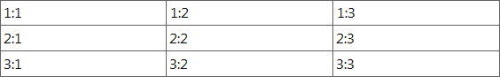

## IupMatrix

Creates a matrix of alphanumeric fields. Therefore, all values of the matrix fields are strings.
The matrix is not a grid container like [IupGridBox](../elem/iup_gridbox.md).
It inherits from [IupCanvas](../elem/iup_canvas.md).

This is an additional control. It is included in the IupControls library.

It has two modes of operation: normal and callback mode.
In normal mode, string values are stored in attributes for each cell.
In callback mode, these attributes are ignored and the cells are filled with strings returned by the "VALUE_CB" callback.
So the existence of this callback defines the mode the matrix will operate.

### Creation

    Ihandle* IupMatrix(char *action_cb);

**action_cb**: Name of the action generated when the user types something.

Returns the identifier of the created matrix, or NULL if an error occurs.

### Attributes

#### See [Attributes](iup_matrix_attrib.md)

### Callbacks

#### Interaction

[ACTION_CB](iup_matrix_cb.md) - Action generated when a keyboard event occurs.[\
CLICK_CB](iup_matrix_cb.md) - Action generated when any mouse button is pressed over a cell.\
 [COLRESIZE_CB](iup_matrix_cb.md): Action generated when a column is interactively resized. [\
](iup_matrix_cb.md)[RELEASE_CB](iup_matrix_cb.md) - Action generated when any mouse button is released over a cell.\
 [RESIZEMATRIX_CB](iup_matrix_cb.md): Action generated after the element size has been updated but before the cells have been actually refreshed. \
 [TOGGLEVALUE_CB](iup_matrix_cb.md): Action generated when a toggle button is pressed.\
 [VALUECHANGED_CB](iup_matrix_cb.md): Called after the value was interactively changed by the user or after a group of values where programmatically changed in a single operation.[\
](iup_matrix_cb.md)[MOUSEMOVE_CB](iup_matrix_cb.md) - Action generated to notify the application that the mouse has moved over the matrix.\
[ENTERITEM_CB](iup_matrix_cb.md) - Action generated when a matrix cell is selected, becoming the current cell.[\
LEAVEITEM_CB](iup_matrix_cb.md) - Action generated when a cell is no longer the current cell.\
[SCROLLTOP_CB](iup_matrix_cb.md) - Action generated when the matrix is scrolled with the scrollbars or with the keyboard.

#### Drawing

[BGCOLOR_CB](iup_matrix_cb.md) - Action generated to retrieve the background color of a cell when it needs to be redrawn.\
[FGCOLOR_CB](iup_matrix_cb.md) - Action generated to retrieve the foreground color of a cell when it needs to be redrawn.\
[FONT_CB](iup_matrix_cb.md) - Action generated to retrieve the font of a cell when it needs to be redrawn.\
 [TYPE_CB](iup_matrix_cb.md): Action generated to retrieve the type of cell value. \
[DRAW_CB](iup_matrix_cb.md) - Action generated before the cell is drawn. Allow a custom cell draw.\
[DROPCHECK_CB](iup_matrix_cb.md) - Action generated to determine if dropdown feedback should be shown.\
[TRANSLATEVALUE_CB](iup_matrix_cb.md): Action generated to translate the value of a cell during display and size computation.

#### Editing

[DROP_CB](iup_matrix_cb.md) - Action generated to determine if a text field or a dropdown will be shown.\
[MENUDROP_CB](iup_matrix_cb.md) - Action generated to determine if a popup menu will be shown. \
[DROPSELECT_CB](iup_matrix_cb.md) - Action generated when an element in the dropdown list is selected.[\
EDITION_CB](iup_matrix_cb.md) - Action generated when the current cell enters or leaves the edition mode.

#### Callback Mode

[VALUE_CB](iup_matrix_cb.md) - Action generated to verify the value of a cell.\
[VALUE_EDIT_CB](iup_matrix_cb.md) - Action generated to notify the application that the value of a cell was edited.\
[MARK_CB](iup_matrix_cb.md) - Action generated to verify the selection state of a cell. [\
MARKEDIT_CB](iup_matrix_cb.md) - Action generated to notify the application that the selection state of a cell was changed.

### Utility Functions

These functions can be used to help set and get attributes from the matrix:

    void  IupSetAttributeId2(Ihandle* ih, const char* name, int lin, int col, const char* value);
    char* IupGetAttributeId2(Ihandle* ih, const char* name, int lin, int col);
    int   IupGetIntId2(Ihandle* ih, const char* name, int lin, int col);
    float IupGetFloatId2(Ihandle* ih, const char* name, int lin, int col);
    void  IupSetfAttributeId2(Ihandle* ih, const char* name, int lin, int col, const char* format, ...);
    void  IupSetIntId2(Ihandle* ih, const char* name, int lin, int col, int value);
    void  IupSetFloatId2(Ihandle* ih, const char* name, int lin, int col, float value);

They work just like the respective traditional set and get functions.
But the attribute string is complemented with the L and C values.
When only one value is needed then use the Iup*AttributeId functions. For ex:

    IupSetAttribute(ih, "30:10", value)        => IupSetAttributeId2(ih, "", 30, 10, value)
    IupSetAttribute(ih, "BGCOLOR30:10", value) => IupSetAttributeId2(ih, "BGCOLOR", 30, 10, value)
    IupSetAttribute(ih, "ALIGNMENT10", value)  => IupSetAttributeId(ih, "ALIGNMENT", 10, value)

When one of the indices is the asterisk, use IUP_INVALID_ID as the parameter. For ex:

    IupSetAttribute(ih, "BGCOLOR30:*", value) => IupSetAttributeId2(ih, "BGCOLOR", 30, IUP_INVALID_ID, value)

These functions are faster than the traditional functions because they do not need to parse the attribute name string and the application does not need to concatenate the attribute name with the id.

------------------------------------------------------------------------

#### Storage

Before mapped to the native system, all attributes are stored in the hash table, independently of the size of the matrix or its operation mode.
The action attributes like ADDLIN and DELCOL will NOT work.

When the matrix is mapped, and it is NOT in callback mode, then the cell values and mark state are moved from the hash table to an internal storage at the matrix.
Other cell attributes remains on the hash table. Cell values with indices greater than (NUMLIN, NUMCOL) are ignored.
When in callback mode, cell values stored in the hash table are ignored.

#### Callback Mode

Very large matrices can use the callback mode to store the cell values at the application and not at the internal matrix storage.
The idea is the following:

1 - Register the VALUE_CB callback\
2 - No longer set the value of the cells. Store the cell value at the application.
They will be retrieved one by one by the callback.\
3 - If the matrix can be edited, set the VALUE_EDIT_CB callback.\
4 - When the matrix display must be updated, use the REDRAW attribute to force a matrix redraw.

A negative aspect is that, when VALUE_CB is defined, after it is mapped the matrix never verifies attributes of type L:C again.

If VALUE_CB is defined and VALUE_EDIT_CB is not defined when the matrix is mapped then READONLY will be set to YES.

#### Number of Cells

If you do not plan to use ADDLIN nor ADDCOL, and plan to set sparse cell values, then you must set NUMLIN and NUMCOL before mapping.

#### Titles

A matrix might have titles for lines and columns.
Titles are always non scrollable, non editable and presented with a different default background color.
A matrix will have a line of titles if an attribute of the "*L*:0" type is defined, where L is a line number, or if the HEIGHT0 attribute is defined.
It will have a column of titles if an attribute of the "0:*C*" type is defined, where C is a column number, or if the WIDTH0 attribute is defined.

When allowed, the width of a column can be changed by holding and dragging its title right border, see RESIZEMATRIX.

Any cell can have more than one text line, just use the \n control character.
Multiple text lines will be considered when calculating the title cell size based on its contents.
The contents of ordinary cells (not a title) do not affect the cell size.

#### Natural Size

The Natural size is calculated using only the title cells size plus the size of NUMCOL_VISIBLE and NUMLIN_VISIBLE cells, but it is also affected if SCROLBAR is enabled.
The natural height is the sum of the line heights from line 0 to NUMLIN_VISIBLE (inclusive).
The natural width is the sum of the column width from column 0 to NUMCOL_VISIBLE (inclusive).
Notice that since NUMCOL_VISIBLE and NUMLIN_VISIBLE do not include the titles then NUMCOL_VISIBLE+1 columns and NUMLIN_VISIBLE+1 lines are included in the sum.

The height of a line L depends on several attributes, first it checks the HEIGHT*L* attribute, then checks RASTERHEIGHT*L*, then when USETITLESIZE=YES or not in callback mode the height of the title text for the line or if L=0 it searches for the highest column title, if still could not define a height then if L!=0 it will use HEIGHTDEF, if L=0 then height will be 0.

A similar approach is valid for the column width.
The width of a column C first checks the WIDTH*C* attribute, then checks RASTERWIDTH*C*, then when USETITLESIZE=YES or not in callback mode the width of the title text for the column or if C=0 it searches for the widest line title, if still could not define a width then if C!=0 it will use WIDTHDEF, if C=0 then height will be 0.

#### Virtual Size

When the scrollbars are enabled if the matrix area is greater than the visible area, then scrollbars will be displayed so the cells can be scrolled to be visible area.
When dragging the scrollbar, the position of cells is free, when clicking on its buttons it will move in cell steps, aligning to the left border of the cell.

By default, EXPAND=Yes, so matrix will be automatically resized when the dialog is resized.
So more columns and lines will be displayed. But the matrix Natural size will be used as minimum size.
To remove the minimum size limitation, set NUMCOL_VISIBLE and NUMLIN_VISIBLE to 0 after showing it for the first time.

The RESIZEMATRIX_CB callback can be used to dynamically change columns or lines sizes when the matrix is resized by setting FITTOSIZE accordingly.

#### Edition Mode

When READONLY=NO and there is no EDITION_CB callback or the callback return is IUP_DEFAULT, the matrix cell values can be edited. 

 Editing starts automatically when the user press a character key when the focus is at a cell, then the old cell value is replaced by the new one being typed.
If **F2, Enter** or **Space** is pressed, the current cell enters the edition mode with the current text of the cell.
And double-clicking a cell enters the edition mode (in Motif the user must click again to the edit control get the focus).

The new value will be accepted if the user press **Enter** during edition mode.
Pressing **Esc** will cancel the editing and the old value remains.
The cell will also leave the edition mode if the user clicked in another cell or in another control, then the new value will be automatically accepted.
But the value confirmation still depends on the EDITION_CB callback return code.

#### Keyboard Navigation

Keyboard navigation through the matrix cells outside the edition mode is done by using the following keys:

- **Arrows**: Moves the focus to the next cell, according to the arrows direction.
- **Page Up** and **Page Down**: Moves a visible page up or down.
- **Home**: Moves the focus to the fist column in the line.
- **Home Home**: Moves the focus to the top-left corner of the visible page.
- **Home Home Home**: Moves the focus to the top-left corner of the first page of the matrix.
- **End**: Moves the focus to the last column in the line.
- **End End**: Moves the focus to the bottom-right corner of the visible page.
- **End End End**: Moves the focus to the bottom-right corner of the last page in the matrix.

When using the keyboard to change the focus cell if the limit of the visible area is reached, then the cells are automatically scrolled.
Also if a cell partially visible is edited, then first it is scrolled to the visible area.
Also while pressing together the **Shift** key and marks are enabled with MARKMULTIPLE=Yes then a continuous area will be selected.

Inside the **edition mode**, the following keys are used for a text field:

- **Left, Right, Up and Down arrows**: if the caret is at the extremes of the text being edited, then leave the edition mode and moves the focus accordingly. The value is confirmed.
- **Ctrl + arrows**: leave the edition mode and move the focus accordingly independent of caret position. The value is confirmed.
- **Enter**: leave the edition mode. The value is confirmed. Moves the focus to the cell below.
- **Esc**: leave the edition mode. The new value is ignored and the old value remains.

When pressing **Enter** to confirm the value, the focus goes to the cell below the current cell. If at the last line then the focus goes to the cell on the left.
This can be controlled using the EDITNEXT attribute.

#### Marks (Selected Cells)

When a mark mode is set the cells can be marked using mouse.

A marked cell will have its background attenuated to indicate that it is marked.
A title cell appears marked only when MARKMODE=LIN, COL or LINCOL.

Cells can be selected individually or can be restricted to lines or columns.
Also, multiple cells can be marked simultaneously in continuous or in segmented areas.
Lines and columns are marked only when the user clicks in their respective titles, if MARKMODE=CELL then all the cells of the line or column will be marked.
Continuous areas are marked holding and dragging the mouse or holding the **Shift** key when clicking at the end of the area.
Segmented areas are marked or unmarked holding the **Ctrl** key, the mark state is inverted.
Clicking on the cell 0:0 will select all the cells depending on MARKMODE, except for LINCOL.

When there are cells marked, pressing the **Del** key removes the selected cells contents.

#### IupMatrixEx

For more features, like Import/Export, Clipboard, Undo/Redo, Search, Sort, Column Visibility, Numeric Columns, Numeric, Context Menu and others, see the [IupMatrixEx](iup_matrixex.md) extension library.

### Examples

[Browse for Example Files](../../examples/)

### See Also

[IupCanvas](../elem/iup_canvas.md), [IupMatrixEx](iup_matrixex.md), [IupTable](../elem/iup_table.md)
