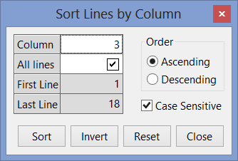
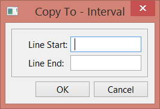
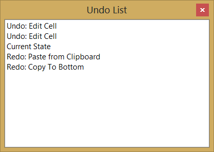
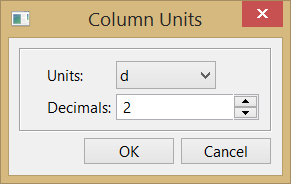
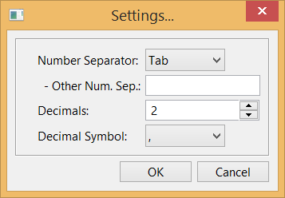
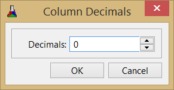

## IupMatrixEx

An extension library for **IupMatrix**.
This library adds new features to the **IupMatrix** in order to extend the current features.
Adds support for Import/Export, Clipboard, Undo/Redo, Find, Sort, Column Visibility, Numeric Columns, Numeric Units, Context Menu and others.

It can be used in callback mode or in standard more.

This is an additional control that depends on the IupControls library.

Based on the DMatrix library created by Bruno Kassar and Luiz Cristóvão Gomez Coelho.

### Creation

    Ihandle* IupMatrixEx(void);

This function returns the identifier of the created editing component, or NULL if an error occurs.

### Attributes

The **IupMatrixEx** element handles all attributes defined for a [IupMatrix](iup_matrix_attrib.md) control.

> 
>
> ------------------------------------------------------------------------

**BUSY**: returns Yes if the library is changing the matrix contents internally as a result of an operation such as paste or duplicate.
Can be canceled setting to No. See the BUSY_CB callback for more information.

**BUSYPROGRESS**: flag to display a progress dialog while data is being changed.
Can be Yes or No. Default: No.

**LASTERROR** (read-only): set when an error occurred during an operation.
It is reset to NULL at the start of every operation that sets its value.

#### Import/Export and Clipboard

**COPY** (write-only): copies (export) the selected cells to the clipboard in TEXT format.
If value is ALL then all cells are copied regardless if there is a selection.
If value is MARKED then the [MARKED](iup_matrix_attrib.md) attribute is used to define the selection.
Value can also be a range of cells in the format "L1:C1-L2:C2".
Title cells are not copied, even when a line or column is fully selected.
If the column or line is invisible (its size=0) it is not copied.
The **TEXTSEPARATOR** attribute can be used to define a column separator (default is tab '\t') and line separator will be line feeds ('\n').

When MARKMODE=CELLS and sparse cells are selected, there are two options for copy according to the **COPYKEEPSTRUCT** attribute, if "Yes" the copied data will fit a rectangular region that contains all the selected cells and the non selected cells inside the region will be copied as empty spaces (' '), if "No" only the selected cells will be copied but they must contain a matrix consistent structure, in other words the selected column pattern must be consistent along lines.\
LASTERROR can be set to "NOMARKED" (no selected cells) or "MARKEDCONSISTENCY" (when COPYKEEPSTRUCT=NO and inconsistent selection).\
Copied lines will follow the sort order.

**COPYDATA**: Use the same parameters of the COPY attributes but will copy (export) to an internal buffer.
To retrieve the buffer get the attribute value after setting it.
To clear the internal buffer set it to NULL.

**COPYFILE** (write-only): copies (export) all visible cells to a given file. Value is the file name to be saved.
LASTERROR can also be set to "INVALIDFILENAME" (failed to open).
Data will be in plain text format, but the file format will be defined by the **FILEFORMAT** attribute, can be "TXT" (default), "HTML" or "LaTeX".
The **COPYCAPTION** attribute can be used to define a caption that will be added to the file before the data, depending on the file format.

When using TXT format, the **TEXTSEPARATOR** attribute can be used to define a column separator (default is tab '\t') and line separator will be line feeds ('\n').\
When using LaTeX format, the **LATEXLABEL** attribute can be used to define a label for the table.\
When using HTML format, the attributes "HTML<TABLE>", "HTML<TR>", "HTML<TH>", "HTML<TD>", "HTML<CAPTION>" can use used to define a complement to be inserted in the respective tag definition, so a " style=.." or a " class=.." complements can be added.
The **HTMLADDFORMAT** can be used to add the attribute ALIGNMENT, BGCOLOR, FGCOLOR and FONT to the "style" complement of the "TD" tag.\
For all formats use:\
**SKIPLINES**: number of lines to skip at start when exporting the matrix to a file, not counting the title line if any.\
**SKIPCOLUMNS**: number of columns to skip at start when exporting the matrix to a file, not counting the title columns if any.\
Copied lines will follow the sort order.

**PASTE** (write-only): paste (import) data from the clipboard. Data is obtained from the clipboard in TEXT format.
Value is the insert position, it can be "FOCUS" to use the [FOCUS_CELL](iup_matrix_attrib.md) attribute, can be "MARKED" to use the start of the selected groups of cells (top-left selected cell), or can be a cell address "L:C".

Data must be in plain text format. Lines can be separated in DOS, UNIX or MAC format.
Columns can be separated with a tab ('\t'), or with a semicolon (';'), or with a space (' ') or with a custom value defined by the **TEXTSEPARATOR** attribute.
Data must contain an exact matrix organization.
Use the attribute **TEXTSKIPLINES** to skip a number of lines at the beginning of the data.
If data at the insert position have more lines or columns than the current matrix, then the PASTESIZE_CB callback is called if the callback does not exist, the matrix size is not changed, and the exceeding data will be discarded.
If defined, the [EDITION_CB](iup_matrix_cb.md) callback will be called before the cell value is set.
**LASTERROR** can be set to "NOTEXT" (data is empty or NULL), "INVALIDMATRIX" (not matrix data).
**BUSY** will be set to Yes during the operation. Only visible cells will receive data.\
Pasted lines will follow the sort order.

**PASTEDATA** (write-only): paste (import) data from a memory buffer. Value is the data.
Insert position is obtained from the [FOCUS_CELL](iup_matrix_attrib.md) attribute.
See PASTE for more details.

**PASTEFILE** (write-only): paste (import) data from a file. Value is the file name to be loaded.
Insert position is always "0:0". See PASTE for more details.
LASTERROR can also be set to "INVALIDFILENAME" (failed to open).
The PASTEFILEAT attribute controls the insert position, can be "FOCUS" or a cell address "L:C".

#### Find

**FIND**: searches for the given text in the matrix cells.
The search will start at the FOCUS_CELL cell, if found the FOCUS_CELL will be changed to the cell where the text was found and the cell will also be marked.
If not visible the cell will the scrolled to the visible area. Returns the last text searched.

**FINDCOL**: restricts the search for a given column number.

**FINDDIRECTION**: direction of the find. Default RIGHTBOTTOM.

if RIGHTBOTTOM will search from left to **right**, then top to **bottom**; (search for columns then change line)\
if LEFTTOP will search from right to **left**, then bottom to **top**;\
if BOTTOMRIGHT will search from top to **bottom**, then left to **right**; (search for lines then change column)\
if TOPLEFT will search from bottom to **top**, then right to **left**;

**FINDMATCHCASE**: defines if the text comparison is case-sensitive when using FIND.
Can be Yes or No. Default: Yes.

**FINDMATCHWHOLECELL**: defines if the whole cell is used for comparison, or it will search for the first occurrence of the text inside the cell.
Can be Yes or No. Default: Yes.

**FINDMATCHSELECTION**: defines if the whole matrix is searched or just the selected cells.
Can be Yes or No. Default: No.

#### Undo/Redo

**UNDOREDO**: Enable or disable the Undo/Redo support. Can be Yes or No. Default: No.
Undo/Redo support is available only for cell values, interactively or programmatically changed.
Attributes are not saved/restored.

**UNDOCOUNT** (read-only): Returns the total number of stored undo levels.

**UNDONAME*id*** (read-only): Returns a name for the given undo level. It represents the operation that was performed.
Uses descriptive strings based on the names "PASTECLIP", "PASTEDATA", "PASTEFILE", "COPYCOLTO:ALL", "COPYCOLTO:TOP", "COPYCOLTO:BOTTOM", "COPYCOLTO:MARKED", "COPYCOLTO:INTERVAL", "CLEARVALUE", "SETCELL" and "EDITCELL", that are language dependent.

**UNDO**: Sets the number of undo levels to be performed. If value is NULL will undo 1 level.
When retrieved returns Yes or No indicating if it has Undo to be performed.
BUSY will be set to Yes during the operation.

**REDO**: Sets the number of redo levels to be performed. If value is NULL will redo 1 level.
When retrieved returns Yes or No indicating if it has Redo to be performed.
BUSY will be set to Yes during the operation.

**UNDOCLEAR** (write-only): clears all Undo/Redo information.

#### Sort

**SORTCOLUMN*id*** (write-only): sort the specified lines of the matrix based on the values of the given column (id).
Can be ALL (1-NUMLIN), an interval in the format "L1-L2", INVERT (invert the order in the current interval of the current column, id is ignored) or RESET (remove any ordering).
The SORTSIGN*id* attribute will be updated to reflect the ordering.

When the SORTCOLUMNCOMPARE_CB callback is NOT defined, and the column is NOT numeric, then the text is **lexicographically** sorted.
This means that numbers and text in the same value are sorted separately (for ex: A1 A2 A11 A30 B1).
Also, natural alphabetic order is used: 123...aAáÁ...bBcC...
The internal comparison will work only for Latin-1 characters, even if UTF8MODE is Yes.
Uses the [IupStringCompare](../func/iup_stringcompare.md) function.\
Sorting is reset if lines are added or removed.\
**IMPORTANT**: The sort will not affect the original data, only how it is displayed from the original data and how it is updated to the original data.
ALSO the line and cell attributes of the sorted lines will NOT be affected, this means that sizes, colors and fonts will NOT follow the sort order, also means that cell address in FOCUS_CELL, MARKED, ORIGIN, SHOW, HEIGHTn (which implies VISIBLELINn), and others, are all relative to the display position data and they do NOT follow the sort order.
*VALUE_CB, EDITION_CB and VALUE_EDIT_CB will be called with the correct line index following the sort order, all other callbacks won't.

**SORTCOLUMNORDER**: defines if the number or text comparison is in ASCENDING or DESCENDING order.
Default: ASCENDING. Used during SORTCOLUMN*id* and when the SORTCOLUMNCOMPARE_CB callback is NOT defined.
Used to update the SORTSIGN*id* attribute when the SORTCOLUMNCOMPARE_CB callback is defined.

**SORTCOLUMNCASESENSITIVE**: defines if the text comparison is case-sensitive. Can be Yes or No.
Default: Yes. Used only during SORTCOLUMN*id* and when the SORTCOLUMNCOMPARE_CB callback is not defined.

**SORTCOLUMNINTERVAL** (read-only): Returns the last sorted interval, in the format "L1,L2".

**SORTLINEINDEX***id* (read-only): Returns the sorted line index given a line in regular order.
To be used inside other callbacks.

**LASTSORTCOLUMN** (read-only): Returns the last sorted column.

#### Line and Column Visibility

**FREEZE:** freezes the scroll of columns and lines up to the given cell.
Can be: "Yes" - uses the value of the FOCUS_CELL attribute, "*L*:*C*" where L and C are the line and column, or "No" clear the freeze state.
Internally will set the NUMLIN_NOSCROLL and NUMCOL_NOSCROLL, and change the FRAMEHORIZCOLOR of the line and the FRAMEVERTCOLOR of the column to the color defined by FREEZECOLOR.

**FREEZECOLOR**: color used for the freeze lines. Default: "0 0 255".
Used only by the FREEZE attribute.

**VISIBLECOL*id***: returns if the column is visible ("Yes" or "No").
Actually checks for WIDTHid and RASTERWIDTHid if they are defined and non-zero, but more complex logic when id=0.
When changed will simply set those attributes to zero or NULL (when setting to NULL and col=0 not necessarily the column will become visible because of the internal matrix logic for titles).

**VISIBLELIN*id***: returns if the line is visible ("Yes" or "No").
Actually checks for HEIGHTid and RASTERHEIGHTid if they are defined and non-zero, but more complex logic when id=0.
When changed will simply set those attributes to zero or NULL (when setting to NULL and lin=0 not necessarily the line will become visible because of the internal matrix logic for titles).

#### Context Menu

**MENUCONTEXT**: enable the context menu. Can be Yes or No. Default: Yes.

**SHOWCONTEXTMENU***L:C* (write-only): shows the context menu using the L:C cell as reference and its value as screen position in the format "x:y".

**SHOWMENUCONTEXT** (write-only): show the context menu in the given cel.
Value has the "*L*:*C*" format.

**SHOWDIALOG** (write-only): show the dialog used in the context menus.
Can be: SETTINGS, EXPORT_TXT, EXPORT_LATEX, EXPORT_HTML, IMPORT_TXT, UNDOLIST, FIND, GOTO, SORT and COPYCOLTO_INTERVAL.
Some dialogs are not show if the matrix is read-only.

#### Copy Cells

**COPYCOLTO*L:C*** (write-only): copies (duplicates) the value of the given cell to a specified range of cells in the same column.
Value can be "ALL" (for all lines), TOP (for all lines before the given line), BOTTOM (for all lines after the given line), MARKED (for all lines where the cell is marked), or a series of intervals in the format "L1-L2,L3-L4,L5,L6-L7,...".
BUSY will be set to Yes during the operation.  Only visible cells will receive data.

#### Numeric Columns

Numeric columns are enabled when the NUMERICQUANTITY*id* attribute is set.
To define a numeric column without using units, simply set NUMERICQUANTITY*id* to "None".

**NUMERICDECIMALSYMBOL**: symbol used for decimal separator in numeric values. Can be "." or "," only.
If not defined will try the [DEFAULTDECIMALSYMBOL](../attrib/iup_globals.md) global attribute.

**NUMERICFORMAT*id***: format to convert the numeric data into strings at the given column (id).
If not defined the NUMERICFORMATDEF attribute will be used.
Uses the same format specification of the **sprintf** function in C, but only one value will be processed, cannot contain other strings. (no redraw)

**NUMERICFORMATPRECISION*id***: will set the **sprintf** "precision" field in the **NUMERICFORMAT*id*** attribute string if the format "%.<precision>f".
If the **NUMERICFORMAT*id*** attribute is not defined returns NULL.
It is just a simple form to set the format attribute.
If id is not used it will affect the NUMERICFORMATDEF attribute. (no redraw)

**NUMERICFORMATDEF**: default value used when NUMERICFORMATid is not specified.
If not defined it will use the [DEFAULTPRECISION](../attrib/iup_globals.md) global attribute to build one (for instance, "%.2f" if the DEFAULTPRECISION is 2).

**NUMERICFORMATTITLE*id***: format of the title at the given column (id).
Uses the same format specification of the **sprintf** function in C.
It can contain other strings, and will receive two parameters the current column title string ("0:C") and the current column unit shown.
If the current title is NULL, then only the unit parameter is passed.
If not specified then only the title string ("0:C") is used.  (no redraw)

#### Numeric Units

**NUMERICQUANTITY*id***: Quantity used to define units for the numeric data at the given column (id).
Must set this attribute for the other NUMERIC* attributes to work.
For the available option see the Available Quantity and Units table below.
To improve the precision, consider using the NUMERICGETVALUE_CB and NUMERICSETVALUE_CB callbacks.
The returned value is always the name of the quantity in the table, regardless the value that was set.
To use the numeric attributes and callbacks without using units, simply set quantity to "None".
To disable all numeric support set quantity to NULL. (no redraw)

**NUMERICUNITCOUNT*id*** (read-only): Returns the number of units for the current quantity at the given column (id).

**NUMERICUNIT*id***: Unit of the numbers set into the matrix at the given column (id) using the unit name as value.
Must be in the same category of the NUMERICQUANTITYid attribute.
For the available options see the Available Quantity and Units table below.
The application must process numbers for the column only in this unit, when getting or setting attributes.
But the values passed to the [DROP_CB](iup_matrix_cb.md) and [MENUDROP_CB](iup_matrix_cb.md) callbacks will not be processed because they can contain strings.
The returned value is always the name of the unit in the table, regardless the value that was set.
Default value is the first unit on the table below. (no redraw)

**NUMERICUNITSHOWN*id***: Unit to be displayed at the given column (id).
Must be in the same category of the NUMERICFORMAT attribute.
The library will automatically convert the numeric data to and from the shown and data units when the data is displayed or modified.
The returned value is always the name of the unit in the table, regardless the value that was set.  Default value is the first unit on the table. (no redraw)

**NUMERICUNITSYMBOL*id*** and **NUMERICUNITSYMBOLSHOWN*id***: same as NUMERICUNIT* but using the unit symbol as value. (no redraw)

**NUMERICUNITSEARCH** (write-only): Searches for a unit name.
Set the result in the NUMERICFOUNDQUANTITY, NUMERICFOUNDUNIT and NUMERICFOUNDUNITSYMBOL attributes.
For the available options see the Available Quantity and Units table below.

**NUMERICUNITSYMBOLSEARCH** (write-only): same as NUMERICUNITSEARCH**,** but searches for a unit symbol.

**NUMERICFOUNDQUANTITY** (read-only): Returns the quantity found after a NUMERICUNITSEARCH* set.
Returns NULL if not found.

**NUMERICFOUNDUNIT** (read-only): Returns the unit name found after a NUMERICUNITSEARCH* set.
Returns NULL if not found.

**NUMERICFOUNDUNITSYMBOL** (read-only): Returns the unit symbol found after a NUMERICUNITSEARCH* set.
Returns NULL if not found.

#### Numeric Units Database

The following attributes will affect all **IupMatrixEx** controls.
So the application can register new quantities and all **IupMatrixEx** elements will benefit.
All strings must be constant strings. All attributes are Write-Only and non-inheritable.
They all can be set without the element being mapped to the native system.

**NUMERICUNITSPELL**: spelling used for Unit names.
The default "INTERNATIONAL" uses the International Bureau of Weights and Measures standards: metre and litre.
Set to "AMERICAN" To use the American spelling: "meter" and "liter".

**NUMERICADDQUANTITY**: adds a new quantity given its name. Can have up to 25 **new** names.
If the name exists, simply prepare to add new units to that quantity.

**NUMERICADDUNIT**: adds a new unit given its name for the last quantity added.
Can have up to 25 total names. The first unit added will be the reference unit, and its factor will be automatically set to 1.

**NUMERICADDUNITSYMBOL**: sets the symbol name of the last unit added.

**NUMERICADDUNITFACTOR**: sets the factor number in double precision of the last unit added.
Use "%.18g" in **IupSetStrf** or **sprintf** for maximum double precision.
The factor is the reference multiplier to obtain the unit, or how much you multiply a value in the reference unit to obtain a new value in this unit.
For example, 1 km = 1000 m, then for the "km" unit factor=1000 considering that the reference unit is "m".

### Callbacks

The **IupMatrixEx** element understands all callbacks defined for a [IupMatrix](iup_matrix_cb.md) control.

------------------------------------------------------------------------

**BUSY_CB**: Action generated when the library is changing the matrix contents as a result of an operation such as paste or copy.

    int function(Ihandle* ih, int status, int count, char* name);

**ih**: identifier of the element that activated the event.\
**status**: can be 1=process started, 2=iteration, 0=process finished.\
**count**: when status=1 is the total number of iterations. when status=2 is the current iteration. ignored when status=0.\
**name**: valid only when status=1, otherwise is NULL.
Can be "PASTECLIP", "PASTEDATA", "PASTEFILE", "COPYCOLTO:ALL", "COPYCOLTO:TOP", "COPYCOLTO:BOTTOM", "COPYCOLTO:MARKED", "COPYCOLTO:INTERVAL", "UNDO" or "REDO".

**Returns**: When status=2 and IUP_IGNORE is returned, the processing is aborted.
When a process is aborted the callback will be called once more with status=0.

**NUMERICGETVALUE_CB**: Action generated when a cell value is being retrieved from a numeric column.
It is only called if the cell value is NULL in normal mode, or the [VALUE_CB](iup_matrix_cb.md) returned value is NULL in callback mode, and the column has **NUMERICQUANTITY*id*** defined.
Not called for lin=0.

    double function(Ihandle* ih, int lin, int col);

**ih**: identifier of the element that activated the event.\
**lin**, **col**: coordinates of the cell.

Returns: the number to be drawn.

**NUMERICSETVALUE_CB**: Action generated when a cell value is being modified at a numeric column.
It is only called if the column has **NUMERICQUANTITY*id*** defined. Not called for lin=0.
If defined the value will not be updated as string in normal mode and  [VALUE_EDIT_CB](iup_matrix_cb.md) will not be called in callback mode.

    int function(Ihandle* ih, int lin, int col, double value);

**ih**: identifier of the element that activated the event.\
**lin**, **col**: coordinates of the cell.\
**value**: new value of the cell.

**MENUCONTEXT_CB**: Action generated after the context menu is created but before it is displayed, so the application can add or removed items from the menu.
Only shown if MENUCONTEXT=Yes.

    int function(Ihandle* ih, Ihandle* menu, int lin, int col);

**ih**: identifier of the element that activated the event.\
**menu**: identifier of the menu that will be shown to the user.\
**lin**, **col**: coordinates of the cell.\

**Returns**: if returns IUP_IGNORE the action will be aborted, and the context menu will not be shown.

**MENUCONTEXTCLOSE_CB**: Same as MENUCONTEXT_CB, but called after the context menu is closed.
Only shown if MENUCONTEXT=Yes.

**PASTESIZE_CB**: Action generated when pasting and importing data at the insert position will have more lines or columns than the current matrix.
The application can change the NUMLIN and NUMCOL attributes to receive the new data.

    int function(Ihandle* ih, int num_lin, int num_col);

**ih**: identifier of the element that activated the event.\
**status**: can be 1=process started, 2=iteration, 0=process finished.\
**count**: when status=1 is the total number of iterations. when status=2 is the current iteration. ignored when status=0.\
**name**: valid only when status=1, otherwise is NULL. Can be "PASTE", "PASTEDATA", "PASTEFILE".

**Returns**: if returns IUP_IGNORE the process will be aborted. if returns IUP_CONTINUE, the NUMLIN and NUMCOL attributes will be automatically changed to the given values.
Otherwise and if the callback does not exist, the matrix size is not changed, and the exceeding data will be discarded.

**SORTCOLUMNCOMPARE_CB**: Action generated when sorting data in a column to compare two cell values.

    int function(Ihandle* ih, int col, int lin1, int lin2);

**ih**: identifier of the element that activated the event.\
**col**: column being sorted.\
**lin1**, **lin2**: the line numbers of the two cells being compared.

**Returns**: must return 0 if "col:lin1==col:lin2", -1 if "col:lin1<col:lin2", and 1 if "col:lin1>col:lin2".

### Notes

#### Context Menu

The library adds a context menu where the user can execute the new features.
If the matrix is read-only some of the features are not shown.

The FILEDIRECTORY attribute can be used to control the initial directory in Export and Import file dialogs, just sets the DIRECTORY attribute of **IupFileDlg**.
The LASTFILENAME attribute can be consulted after the file dialogs were successfully closed.
If LASTFILENAME is set before the dialog is shown, then used to obtain the initial directory, just sets the FILE attribute of **IupFileDlg**.
LASTFILENAME is set to NULL if the dialog is canceled.

The CELLBYTITLE attribute controls how the "Go To..." dialog and the "Copy To - Interval" dialog interpret line and column values.
If set to Yes, then the title lines/columns are used as indices to locate the cell.

    Settings...         => Shows the Settings Dialog
    ----------------
    Export
        Txt...       => Shows a file selection dialog and saves the cells to a file.
        LaTeX...     => ( " )
        Html...      => ( " )
    Import
        Txt...       => Shows a file selection dialog and loads the cells from a file.(not read-only)
    ----------------
    Undo                => Undo 1 level (not read-only)
    Redo                => Redo 1 level (not read-only)
    Undo List...        => Show the Undo Dialog (not read-only)
    ----------------
    Cut                 => Copy + Clear Cell Values (not read-only)
    Copy                => Copy to Clipboard (marked cells)
    Paste               => Paste from Clipboard (start at focus cell) (not read-only)
    Erase               => Clear Cell Values (not read-only)
    Select All          => Select All Cells
    ----------------
    Find...             => Show the Find Dialog
    Go To...            => Show the Go To Cell Dialog
    ----------------
    Sort...             => Show the Sort Dialog
    Freeze/UnFreeze     => Makes the current cell a non scrollable point / Reset to default
    Visibility
        Hide Column
        Show Hidden Columns
        Hide Line
        Show Hidden Lines
    Column Units... / Column Decimals...   => Show Column Units Dialog or Column Decimals Dialog
    ----------------
    Copy To (Same Column)    Copy cell value to other lines in the same column (not read-only)
        All Lines       => Copy To All Lines
        Here to Top     => Copy From the Current Cell to L=0
        Here to Bottom  => Copy From the Current Cell to L=NUMLIN
        Interval...     => Show "Copy To - Interval" Dialog
        Selected Lines  => Copy to the Selected Cells

#### Dialogs

#### Shortcut Keys

The library adds some shortcut keys to the already implemented in **IupMatrix**:

    Ctrl+A (English)    => Select All
    Ctrl+T (Portuguese or Spanish) => Select All
    Ctrl+X              => Cut (Copy + Clear Cell Values)
    Ctrl+C              => Copy to Clipboard (marked cells)
    Ctrl+V              => Paste from Clipboard (start at focus cell)
    Ctrl+Z              => Undo 1 level
    Ctrl+Y (English)    => Redo 1 level
    Ctrl+R (Portuguese or Spanish) => Redo 1 level
    Ctrl+F (English)    => Show the Find Dialog
    Ctrl+L (Portuguese or Spanish) => Show the Find Dialog
    Alt+F3              => Show the Find Dialog
    Esc                 => Hide the Find Dialog
    F3                  => Find Next
    Shift+F3            => Find Previous
    Ctrl+G              => Show the Go To Cell Dialog

#### Available Quantity and Units

Unit names, symbols, and conversion factors were almost all based on:

<http://en.wikipedia.org/wiki/Conversion_of_units>

By definition, unit names and symbols follow the case displayed in the table.
When setting the NUMERICQUANTITY and NUMERICUNIT attributes use English names, the case is insensitive and spaces are ignored.
Some Quantities have alternative names, once used the returned values in the attribute will be the same alternative name.
For example, you can use "Specific Weight" or "SPECIFICWEIGHT", and you can use "Speed" or "Velocity".

All numeric attributes can be set without the element being mapped to the native system, so the **IupMatrixEx** element can also be used as a Quantity Units database.

The unit used as a reference for conversion is always the first unit listed, and it is the unit defined by the [International System of Units](http://en.wikipedia.org/wiki/International_System_of_Units) (SI).
The American spell can be used setting **NUMERICUNITSPELL=AMERICAN.**

NOTICE: These are only a small set of commonly used units.
If you need other units, please let us know so we can include them.

Obs: "g" in Comments is the standard gravity. All Quantity and Unit names are described in English.
The symbols that have extended characters will work in ISO8859-1 and in UTF-8, according to the UTF8MODE global attribute.
The cell background colors are just for clarity and do not imply in any standard classification.

| QuantityNUMERICQUANTITY             | UnitsNUMERICUNIT                                                                                                                                                         | SymbolNUMERICUNITSYMBOL                        | Comments                                                                                                                                                                  |
|-------------------------------------|--------------------------------------------------------------------------------------------------------------------------------------------------------------------------|------------------------------------------------|---------------------------------------------------------------------------------------------------------------------------------------------------------------------------|
| Time                                | secondminutehour day week millisecond microsecond                                                                                                                        | s minh d wk ms µs                              |                                                                                                                                                                           |
| Mass                                | kilogramgram tonne pound ounce                                                                                                                                           | kg g tlb oz                                    | - (CGS Unit)- metric ton - (international avoirdupois) - oz = lb / 16                                                                                                     |
| Temperature                         | Kelvin degree Celsius degree Fahrenheitdegree Rankine                                                                                                                    | K °C °F °Ra                                    |                                                                                                                                                                           |
| Length                              | metre millimetre centimetrekilometre nanometreangstrom microninch foot yard mile nautical mile                                                                           | m mmcmkmnmÅ µinftyd miNM                       | - (CGS Unit)- micrometre- in = 25.4 mm (international) - ft = 12 in (international) - yd = 3 ft (international) - mi = 1760 yd (international) - NM = 6080 ft (Admiralty) |
| Area                                | square metre square millimetresquare centimetresquare kilometresquare nanometresquare angstrom square micronsquare inch square foot square yard square mile acre hectare | m²mm² cm²km² nm²Å² µ²sq insq ftsq ydsq miac ha | - (CGS Unit)    - ac = 4840 sq yd                                                                                                                                         |
| Volume                              | cubic metre cubic centimetre cubic millimetre cubic kilometrecubic inch cubic foot cubic mile cubic yard litre gallon barrel                                             | m³ cm³mm³km³ cu incu ftcu micu ydL gal bl      | - (CGS Unit) - gal = 231 cu in (US fluid; Wine)  - bl = 42 gal (petroleum)                                                                                                |
| Angle                               | radiandegreegradian                                                                                                                                                      | rad° grad                                      |                                                                                                                                                                           |
| Speed(or Velocity)                  | metre per second inch per second foot per second kilometre per hourcentimetre per second mile per hour knot                                                              | m/s in/s ft/s km/hcm/smph kn                   | - (CGS Unit)- kn = NM/h                                                                                                                                                   |
| Angular Speed(or Angular Frequency) | radian per second radian per minute degree per second degree per minute Hertz revolution per minute                                                                      | rad/s rad/mindeg/s deg/minHz rpm               | - revolution per second (frequency)                                                                                                                                       |
| Acceleration                        | metre per second squaredinch per second squared knot per secondmile per second squared standard gravity                                                                  | m/s²in/s²kn/smi/s² g                           |                                                                                                                                                                           |
| Kinematic Viscosity                 | square metre per secondsquare foot per second stokes                                                                                                                     | m²/s ft²/s St                                  | - (CGS Unit)                                                                                                                                                              |
| Dynamic Viscosity                   | pascal second poise pound per foot hour pound per foot second                                                                                                            | Pa·s P lb/(ft·h) lb/(ft·s)                     |                                                                                                                                                                           |
| Flow                                | cubic metre per secondcubic inch per secondcubic foot per second                                                                                                         | m³/sin³/sft³/s                                 |                                                                                                                                                                           |
| Force                               | Newton Kilonewton dynekilogram-forcepound-force kip-force ton-force                                                                                                      | N kN dynkgflbfkiptnf                           | = kg·m/s²= g·cm/s² (CGS Unit)- lbf = g · lb - kip = g · 1000 lb - tnf = g · 2000 lb                                                                                       |
| Pressure(or Mechanical Stress)      | Pascal kilopascal atmosphere millimetre of mercurybar torr pound per square inch kip per square inch                                                                     | Pa kPa atm mmHgbar torrpsiksi                  | - Pa = N/m² = kg/(m·s²) - (standard) = mmHg =13595.1 kg/m³·mm·g - psi = lbf/sq in - ksi = kip/sq in                                                                       |
| Force per length(or Linear Weight)  | Newton per metre Kilonewton per metre kilogram-force per metreton-force per metre                                                                                        | N/m kN/m kgf/mtnf/m                            | = kg/s²                                                                                                                                                                   |
| Torque(or Moment of Force)          | Newton metre kilogram-force metre ton-force metre Newton centimetre kilogram-force centimetreton-force centimetre Kilonewton-metre metre kilogram                        | N·m kgf·m tnf·m N·cm kgf·cmtnf·cm kN·mm·kg     | = kg·m²/s²                                                                                                                                                                |
| Specific Mass(or Density)           | kilogram per cubic metregram per cubic centimetre gram per millilitre  kilogram per litre pound per cubic footpound per cubic inch pound per gallon                      | kg/m³ g/cm³ g/mL kg/L lb/ft³ lb/in³ lb/gal     |                                                                                                                                                                           |
| Specific Weight                     | Newton per cubic metre Kilonewton per cubic metre kilogram-force per cubic metreton-force per cubic metre kilogram-force per litre pound-force per cubic foot            | N/m³ kN/m³ kgf/m³tnf/m³kgf/L lbf/ft³           |                                                                                                                                                                           |
| Energy                              | Joule Kilojoule calorie kilocalorie British Thermal Unit Kilowatt-hour horsepower-hour                                                                                   | J kJ cal kcalBTU kW.hhp.h                      | = m·N = kg·m²/s²- (International Table) - (International Table)                                                                                                           |
| Power(or  Heat Flow Rate)           | Watt Kilowatt calorie per secondhorsepower                                                                                                                               | W kW cal/shp                                   | = J/s = N·m/s = kg·m²/s³ - (International Table) - hp = 550 ft lbf/s (imperial mechanical)                                                                                |
| Electric Charge                     | CoulombFaradaymilliampere hour                                                                                                                                           | CFmA·h                                         | = A·s                                                                                                                                                                     |
| Illuminance                         | luxfootcandlelumen per square inchphot                                                                                                                                   | lxfclm/in²ph                                   | - lm/m² - lumen per square foot                                                                                                                                           |
| Fraction                            | percentage per one per ten per thousand                                                                                                                                  | % /1 /10 /1000                                 |                                                                                                                                                                           |
| None                                |                                                                                                                                                                          |                                                | Use numeric values but without using units.                                                                                                                               |

### Examples

[Browse for Example Files](../../examples/)

### See Also

[IupMatrix](iup_matrix.md)
