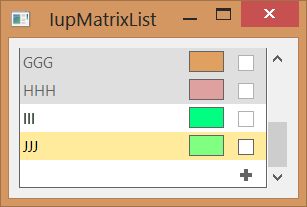
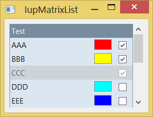

## IupMatrixList

Creates an interface element that displays a list of items, just like **IupList**, but internally uses a **IupMatrix**.

It uses the matrix columns to display labels, color boxes and check boxes in a way that is not possible using **IupList**.
But the control mimics the **IupList** attributes, callbacks and interaction, so the usage by the programmer and by the user should be very similar.

This is an additional control that depends on the IupControls library.

Based on MTXLIB, developed at Tecgraf/PUC-Rio by Renata Trautmann and Andre Derraik.

### Creation

    Ihandle* IupMatrixList(void);

Returns the identifier of the created matrix, or NULL if an error occurs.

### Attributes

**"1"**: First item in the list.
**"2"**: Second item in the list.
**"3"**: Third item in the list.
**...**
**"id"**: idth item in the list.

(non-inheritable) Item value. It can be any text.
Differently from the **IupList** control, the item must exist so its label can be changed.
So **APPENDITEM, INSERTITEM*id* , ADDLIN** or **COUNT** attributes must be used to reserve space for the list items.
Notice that lines and items in the list are the same thing.

**ADDLIN** (write-only): adds a new line to the list after the specified line.
To insert a line at the top, value 0 must be used.
To add more than one line, use format "***L-L***", where the first number corresponds to the base line and the second number corresponds to the number of lines to be added.
Ignored if set before map.

**APPENDITEM** (write-only): inserts an item after the last item. Ignored if set before map.

**COLORCOL** (read-only): returns the number of color column. If not exists, returns 0.

**COLOR*id*** : the color displayed at the color column.
If not defined the color box is not diplayed.

**COLUMNORDER**: defines or retrieves the display order of the columns.
Possible values is a combination of: "LABEL", "COLOR" and "IMAGE".
These values also can be combined in these formats: VALUE1 (one column); VALUE1:VALUE2 (two columns) or VALUE1:VALUE2:VALUE3 (three columns).
Default: "LABEL" (one column).

**COUNT**: defines the number of items in the list. Differently from the **IupList** control, it is not read-only.
It does not include the extra empty item when EDITABLE=Yes.

**DELLIN** (write-only): removes the given line from the list.
To remove more than one line, use format "***L-L***", where the first number corresponds to the base line and the second number corresponds to the number of lines to be removed.
Ignored if set before map.

**EDITABLE** (creation-only): enables the interactive editing of the list. It can be Yes or No.
Default: "NO". An empty item at the end of the list will be available so new items can be interactively inserted.
Also while editing a label, the IMAGE column will display a button so the item can be interactively removed.

**FOCUSCOLOR**: the background color when an item get the focus. Values in RGB format ("r g b").
Default: "255 235 155".

**FOCUSFGCOLOR**: the text color when an item get the focus.
If not defined uses the ITEMFGCOLORid.

**FOCUSITEM**: defines the current focus item. Default: "1".

**IMAGE*id*** (write-only): name of the image to be used in the specified item (id).
Use [IupSetHandle](../func/iup_sethandle.md) or [IupSetAttributeHandle](../func/iup_setattributehandle.md) to associate an image to a name.
See also [IupImage](../elem/iup_image.md). Image column must be available.

**IMAGEACTIVE*id***: controls the interaction with the image of an item. It can be Yes or No.
Default: Yes. Image column must be available.

**IMAGEADD** (write-only): name of the image that will be shown when the IupMatrixList is editable.
Default: "MTXLIST_IMG_ADD". Use [IupSetHandle](../func/iup_sethandle.md) or [IupSetAttributeHandle](../func/iup_setattributehandle.md) to associate an image to a name.
See also [IupImage](../elem/iup_image.md). Image column must be available.

**IMAGECHECK** (write-only): name of the image that will be shown when the IMAGEVALUE attribute is "IMAGECHECK".
Default: "MTXLIST_IMG_CHECK". Use [IupSetHandle](../func/iup_sethandle.md) or [IupSetAttributeHandle](../func/iup_setattributehandle.md) to associate an image to a name.
See also [IupImage](../elem/iup_image.md). Image column must be available.

**IMAGECOL** (read-only): returns the number of image column. If not exists, returns 0.

**IMAGEDEL** (write-only): name of the image that will be shown when the IupMatrixList is editable or when SHOWDELETE=Yes.
Default: "MTXLIST_IMG_DEL". Use [IupSetHandle](../func/iup_sethandle.md) or [IupSetAttributeHandle](../func/iup_setattributehandle.md) to associate an image to a name.
See also [IupImage](../elem/iup_image.md). Image column must be available.

**IMAGEUNCHECK** (write-only): name of the image that will be shown when the IMAGEVALUE attribute is "IMAGEUNCHECK".
Default: "MTXLIST_IMG_UNCHECK". Use [IupSetHandle](../func/iup_sethandle.md) or [IupSetAttributeHandle](../func/iup_setattributehandle.md) to associate an image to a name.
See also [IupImage](../elem/iup_image.md). Image column must be available.

**IMAGEVALUE*id***: selects the CHECK or the UNCHECK image to display for an item (id).
It can be Yes or No. Default: NO.

**INSERTITEM*id*** (write-only): inserts an item before the given id position (id starts at 1).
If id=COUNT+1 then it will append after the last item. Ignored if out of bounds.
Ignored if set before map.

**ITEMACTIVE*id***: controls the interaction with an item (id). It can be Yes or No. Default: "YES".

**ITEMFGCOLOR*id***: text color of an item (id). If not defined FGCOLOR is used.

**ITEMBGCOLOR*id***: background color of an item (id). If not defined BGCOLOR is used.

**LABELCOL** (read-only): returns the number of label column. If not exists, returns 0.

**REMOVEITEM** (write-only): removes the given item from the list.

**SHOWDELETE**: Shows only the **IMAGEDEL** image and ignores **IMAGECHECK** and **IMAGEUNCHECK.
TITLE**: title of the list. When not NULL the list will display a non scrollable title.

**TOPITEM** (write-only): position the given item at the top of the list or near to make it visible.

**VALUE**: defines or retrieves the value of the current cell.

**VISIBLELINES**: defines the number of visible lines for the **Natural Size**, this means that will act also as minimum number of visible lines.
Default: "3".

### Other Attributes

Since the **IupMatrixList** inherits its implementation from the **IupMatrix**, and that one from **IupCanvas**, those controls attributes and callbacks can be used.
But notice that **IupMatrixList** uses several of them internally for its own purpose, and reusing them may affect the control behavior and appearance.

Some attribute defaults were changed:

**EXPAND**: changed to "NO".

**ALIGNMENTLIN0**: changed to "ALEFT".

**CURSOR**: changed to "ARROW".

**FRAMETITLEHIGHLIGHT**: changed to "NO".

**HIDEFOCUS**: changed to "YES".

**SCROLLBAR**: changed to "VERTICAL".

> 
>
> ------------------------------------------------------------------------

[ACTIVE](../attrib/iup_active.md), [EXPAND](../attrib/iup_expand.md), [FONT](../attrib/iup_font.md), [SCREENPOSITION](../attrib/iup_screenposition.md), [POSITION](../attrib/iup_position.md), [MINSIZE](../attrib/iup_minsize.md), [MAXSIZE](../attrib/iup_maxsize.md), [WID](../attrib/iup_wid.md), [TIP](../attrib/iup_tip.md), [SIZE](../attrib/iup_size.md), [RASTERSIZE](../attrib/iup_rastersize.md), [ZORDER](../attrib/iup_zorder.md), [VISIBLE](../attrib/iup_visible.md): also accepted. 

### Callbacks

**IMAGEVALUECHANGED_CB**: called after the image value was interactively changed by the user (mark/unmark).

    int function (Ihandle *ih, int lin, int imagevalue);

**ih**: identifier of the element that activated the event.\
**lin**: item line.\
**imagevalue**: equal to 1 if the image used was IMAGECHECK or to 0 if the image used IMAGEUNCHECK.

**LISTACTION_CB**: Action generated when the state of an item in the list is changed.
Also provides information on the changed item:

    int function (Ihandle *ih, int item, int state);

**ih**: identifier of the element that activated the event.\
**item**: Number of the changed item starting at 1.\
**state**: Equal to 1 if the item is in focus or to 0 if the item loses its focus.

**LISTCLICK_CB**: Action generated when any mouse button is pressed over a item.

    int function (Ihandle *ih, int lin, int col, char *status);

**ih**: identifier of the element that activated the event.\
**lin**: item line.\
**col**: item column (label, image or color).\
**status**: Status of the mouse buttons and some keyboard keys at the moment the event is generated.
The same macros used for [BUTTON_CB](../call/iup_button_cb.md) can be used for this status.

**Returns:** To avoid the default processing return IUP_IGNORE.

**LISTDRAW_CB**: Action generated when an item needs to be redrawn.
It is called before the default processing.

    int function (Ihandle *ih, int lin, int col, int x1, int x2, int y1, int y2);

**ih**: identifier of the element that activated the event.\
**lin**: item line.\
**col**: item column (label, image or color).\
**x1**, **x2**, **y1**, **y2**: bounding rectangle of the current cell in pixels, excluding the decorations.

Use [IupDraw](../func/iup_draw.md) functions to draw the item contents.

**Returns:** If IUP_IGNORE the normal drawing will take place.

**LISTEDITION_CB**: Action generated when the current cell of an item enters or leaves the edition mode.
Called before the default processing.

    int function (Ihandle *ih, int lin, int col, int mode, int update);

**ih**: identifier of the element that activated the event.\
**lin**: item line.\
**col**: item column (label, image or color).\
**mode**: equal to 1 if the cell has entered the edition mode, or 0 if the cell has left the edition mode.\
**update**: equal to 1 to redraw, or 0 to no update returning IUP_IGNORE.

**LISTINSERT_CB**: Action generated when a new item is inserted into the list.

    int function (Ihandle *ih, int lin);

**ih**: identifier of the element that activated the event.\
**lin**:  position of the new item.

**LISTRELEASE_CB**: Action generated when any mouse button is released over a item.

    int function (Ihandle *ih, int lin, int col, char *status);

**ih**: identifier of the element that activated the event.\
**lin**: item line.\
**col**: item column (label, image or color).\
**status**: Status of the mouse buttons and some keyboard keys at the moment the event is generated.
The same macros used for [BUTTON_CB](../call/iup_button_cb.md) can be used for this status.

**Returns:** To avoid the default processing return IUP_IGNORE.

**LISTREMOVE_CB**: Action generated when an item is removed of the list.

    int function (Ihandle *ih, int lin);

**ih**: identifier of the element that activated the event.\
**lin**:  position of the removed item.

### Examples

[Browse for Example Files](../../examples/)

### See Also

[IupCanvas](../elem/iup_canvas.md), [IupMatrix](iup_matrix.md)
