## IupPlot

Creates a plot of one or more data sets. It inherits from [IupCanvas](../elem/iup_canvas.md).

This is an additional control.
Uses the [IupDraw](../func/iup_draw.md) API for internal drawing.

It completely replaces the old **IupPPlot** control.
This control eliminates all the limitations and issues we have with the PPlot library.
But we reused several [PPlot](http://pplot.sourceforge.net/) source code parts, so we would like to thank the author Pier Philipsen for making it with a very flexible BSD License.
We also would like to thank Marian Trifon for the first IupPPlot implementation which part was also reused here.

### Initialization and Usage

The **IupPlotOpen** function must be called after a **IupOpen**, so that the control can be used.
The "iup_plot.h" file must also be included in the source code.
The program must be linked to the controls library (iup_plot).

### Guide

The control can contain more than one plot in a rectangular grid.
Each plot will then have an exclusive plot area inside the control.
When it is just one plot, this area will occupy the whole control area.
The plot attributes are set based on the current plot.

Each plot can contain 2 **axis** (X and Y), a **title**, a **legend box**, a **grid**, a **dataset area** and as many **datasets** you want.

Each data set is added using the **Auxiliary Functions**. All other plot parameters are configured by attributes.
**IupPlot** support plots of **linear** sequential data, as a sequence of 2D samples ([x1,y1],[x2,y2],...) coordinates.
The dataset attributes are set based on the current dataset.

If no attribute is set, the default values were selected to best display the plot.

When setting attributes, the plot is NOT redrawn until the REDRAW attribute is set or a redraw event occurs.

The **dataset area** is delimited by a margin. Data is only plotted inside the dataset area.
Axis and main title are positioned independent of this margin.

The **legend box** is a list of the dataset names, each one drawn with the same color of the correspondent dataset.
The box can be located in one of the four corners of the dataset area.

The **grid** is automatically spaced accordingly the current axis major ticks.

The **title** is always centered in the top of the plot.

The **axis** are positioned at the left-bottom by default.
When cross-origin is enabled, then it is positioned at the origin and zoom and pan will affect its position.
Cross-origin will be automatically disabled in the other axis if a logarithm scale is used.

### Interaction

#### Zoom & Pan

**Zoom** can be done while pressing the **Ctrl** key and interacting with the control.
A single click is with the left mouse button will zoom in by 10%, a single click with the right mouse button will zoom out by 10%.
The same result can be obtained by moving the mouse wheel.
To zoom in to a region, click with the left mouse button, drag to form a selection rectangle and release the button.
In all cases the **Ctrl** key must be pressed during the interaction.

 Zoom can be reset by double-clicking with the left mouse button or pressing the "." key.
Zoom in and out can also be performed using the "+" and "-" keys respectively.

**Pan** is performed after zoom in, and it does not use the Ctrl key.
Simply click with the left mouse button and drag the plot to pan.
The mouse wheel will pan in the vertical direction by default, and when Shift is pressed will pan in the horizontal direction.
Pan can also be performed using the arrow keys, and with the PgDn/PgUp keys.
A single click with the middle mouse button will try to position the origin at that coordinate.

Zoom and Pan operate on **AXS_XMAX, AXS_XMIN, AXS_YMAX, AXS_YMIN** even if **AUTOMIN/MAX** is enabled.
The axis may be hidden depending on the selected rectangle.
The **AUTOMIN/MAX** attributes will be disabled during zoom in, and restored when zoom out completely.
The zoom out and pan are limited to the original attribute values when zoom in started.

#### Cross Hair & TIP

The cross hair cursor is activated and deactivated using the **Ctrl+H** or **Ctrl+V** key combinations.
When Ctrl+H is used, the X coordinate will control the cursor, the Y coordinate will reflect each dataset correspondent value (a Horizontally controlled cross-hair).
When Ctrl+V is used, the Y coordinate will control the cursor, the X coordinate will reflect each dataset correspondent value (a Vertically controlled cross-hair).

When the cursor is close to a sample, a TIP will be shown with the dataset name, sample index and coordinate values.

#### Selection

Selection can be done while pressing the **Shift** key and interacting with the control.
To select all the samples inside a region, click with the left mouse button, drag to form a selection rectangle and release the button (while pressing the Shift key).
The new selection will always replace the previous one.

To clear the selection, just select an empty region or select an area with no samples.
Pressing the Esc key will also clear the selection.

After selecting samples use the **Del** key to remove the selected samples, but this will only work if READONLY=NO.

Selection and delete behavior can be controlled using the respective callbacks.

#### Context Menu

The context menu is shown by a single click with the right mouse button when MENUCONTEXT=Yes.
The default menu contains the following items:

    Zoom In  +
    Zoom Out -
    Reset Zoom  .
    -----------
    Show/Hide Legend
    Show/Hide Grid
    -----------
    Data Set Values...      (only when MENUITEMVALUES=Yes)
    Data Set Properties...  (only when MENUITEMPROPERTIES=Yes)
    Properties...           (only when MENUITEMPROPERTIES=Yes)

The "Data Set Values..." dialog is available only if the [IupMatrixEx](iup_matrixex.md) control is initialized and ready to be used.
Also, the dialog in read-only by default, to enable the editing of values on the dialog set EDITABLEVALUES=Yes.
It is shown for the current Dataset.

The "Data Set Properties..." dialog is shown for the current Dataset.
The "Properties..." dialog is shown for the current Plot.

Context menu behavior can be controlled using the respective callbacks.

### Creation

    Ihandle* IupPlot(void);

This function returns the identifier of the created plot, or NULL if an error occurs.

### Auxiliary Functions

    void IupPlotBegin(Ihandle* ih, int strXdata);

Prepares a dataset to receive samples. If strXdata is 1 then the X axis value is a string.

------------------------------------------------------------------------

    void IupPlotAdd(Ihandle* ih, double x, double y);

Adds a sample to the dataset. Can only be called if **IupPlotBegin** was called with strXdata=0.

------------------------------------------------------------------------

    void IupPlotAddSegment(Ihandle* ih, double x, double y);

Same as **IupPlotAdd**, but the sample starts a new segment.
In drawing mode where samples are connected by lines this will create an empty space.

------------------------------------------------------------------------

    void IupPlotAddStr(Ihandle* ih, const char* x, double y);

Same as **IupPlotAdd**, but allows to use a string as the X axis value.
Can only be called if **IupPlotBegin** was called with strXdata=1.
Strings will be shown only in linear scale, they will not be shown in Logarithm scale.

------------------------------------------------------------------------

    int IupPlotEnd(Ihandle* ih);

Adds a 2D dataset to the plot and returns the dataset index. The data set can be empty.
Redraw is NOT done until the REDRAW attribute is set.
Also it will change the current dataset index to the return value.
You can only set attributes of a dataset AFTER you added the dataset.  Can only be called if **IupPlotBegin** was called.
Whenever you create a dataset all its "DS_*" attributes will be set to the default values.

------------------------------------------------------------------------

    int IupPlotLoadData(Ihandle *ih, const char* filename, int strXdata);

Creates new datasets from data stored in a file.
The file must contains space (' '), tab ('\t') or semicolon (';') separated numeric data in text format.
The text can contains line comments starting with '#'.
The file can have more than one dataset but the first column will always be the X coordinate of all datasets.
If **strXdata**=1 then the first column is treated as a string. The first line will define the number of datasets.
The file must have at least two columns of data. Returns a non-zero value is successful, or a zero value if failed.
Notice that if it fails during data read, but after the fist line, the datasets were already created and they will not be destroyed when the function returns.

------------------------------------------------------------------------

    void IupPlotInsert(Ihandle *ih, int ds_index, int sample_index, double x, double y);
    void IupPlotInsertSegment(Ihandle *ih, int ds_index, int sample_index, const char* x, double y);
    void IupPlotInsertStr(Ihandle *ih, int ds_index, int sample_index, const char* x, double y);
    iup.PlotInsertSegment(ih: ihandle, ds_index, sample_index: number, x: string, y: number)
    or ih:InsertSegment(ds_index, sample_index: number, x: string, y: number)
    iup.PlotInsertStr(ih: ihandle, ds_index, sample_index: number, x: string, y: number)
    or ih:InsertStr(ds_index, sample_index: number, x: string, y: number)

Inserts a sample in a dataset at the given **sample_index**.
Can be used only after the dataset is added to the plot.

------------------------------------------------------------------------

    void IupPlotInsertSamples(Ihandle *ih, int ds_index, int sample_index, double* x, double* y, int count);
    void IupPlotInsertStrSamples(Ihandle *ih, int ds_index, int sample_index, const char** x, double* y, int count);
    iup.PlotInsertStrSamples(ih: ihandle, ds_index, sample_index: number, x, y: table of number, count: number)
    or ih:InsertStrSamples(ds_index, sample_index: number, x, y: table of number, count: number)

Inserts an array of samples in a dataset at the given **sample_index**.
Can be used only after the dataset is added to the plot.

------------------------------------------------------------------------

    void IupPlotAddSamples(Ihandle *ih, int ds_index, double* x, double* y, int count);
    void IupPlotAddStrSamples(Ihandle *ih, int ds_index, const char** x, double* y, int count);
    iup.PlotAddStrSamples(ih: ihandle, ds_index: number, x, y: table of number, count: number)
    or ih:AddStrSamples(ds_index: number, x, y: table of number, count: number)

Adds an array of samples in a dataset at the end.
Can be used only after the dataset is added to the plot.

------------------------------------------------------------------------

    void IupPlotGetSample(Ihandle *ih, int ds_index, int sample_index, double *x, double *y);
    void IupPlotGetSampleStr(Ihandle *ih, int ds_index, int sample_index, const char* *x, double *y);
    iup.PlotGetSampleStr(ih: ihandle, ds_index, sample_index: number) -> (x: string, y: number)
    or ih:GetSampleStr(ds_index, sample_index: number) -> (x: string, y: number)

Returns the sample value in a dataset at the given **sample_index**.
Can be used only after the dataset is added to the plot.

------------------------------------------------------------------------

    int IupPlotGetSampleSelection(Ihandle *ih, int ds_index, int sample_index);

Returns the sample selected state in a dataset at the given **sample_index**.
Can be used only after the dataset is added to the plot. By default all samples are not selected.
Returns -1 if an error occurred.

------------------------------------------------------------------------

    double IupPlotGetSampleExtra(Ihandle *ih, int ds_index, int sample_index);

Returns the sample extra value in a dataset at the given **sample_index**.
Can be used only after the dataset is added to the plot. By default all samples have an extra of 0.
Returns -1 if an error occurred.

------------------------------------------------------------------------

    void IupPlotSetSample(Ihandle *ih, int ds_index, int sample_index, double x, double y);
    void IupPlotSetSampleStr(Ihandle *ih, int ds_index, int sample_index, const char* x, double y);

Changes the sample value in a dataset at the given **sample_index**.
Can be used only after the dataset is added to the plot.

------------------------------------------------------------------------

    void IupPlotSetSampleSelection(Ihandle *ih, int ds_index, int sample_index, int selected);

Changes the sample selected state in a dataset at the given **sample_index**.
Can be used only after the dataset is added to the plot.

------------------------------------------------------------------------

    void IupPlotSetSampleExtra(Ihandle *ih, int ds_index, int sample_index, double extra);

Changes the sample extra value in a dataset at the given **sample_index**.
Can be used only after the dataset is added to the plot.

------------------------------------------------------------------------

    void IupPlotTransform(Ihandle* ih, double x, double y, double *cnv_x, double *cnv_y);

Converts coordinates in plot units to pixels. It should be used inside callbacks only.
Output variables can be NULL if not used.

------------------------------------------------------------------------

    void IupPlotTransformTo(Ihandle* ih, double cnv_x, double cnv_y, double *x, double *y);

Converts coordinates from pixels to plot coordinates. It should be used inside callbacks only.
Output variables can be NULL if not used.

------------------------------------------------------------------------

    int IupPlotFindSample(Ihandle* ih, double cnv_x, double cnv_y, int *ds_index, int *sample_index);

Returns the nearest sample of the nearest dataset within a tolerance neighborhood.
Tolerance can be set in SCREENTOLERANCE attribute. Returns a non-zero value is successful, or a zero value if failed.
It should be used inside callbacks only. Output variables can be NULL if not used.
The datasets are searched in reverse order they are drawn.

------------------------------------------------------------------------

    int IupPlotFindSegment(Ihandle* ih, double cnv_x, double cnv_y, int *ds_index, int *sample_index1, int *sample_index2);

Returns the nearest segment of the nearest dataset within a tolerance neighborhood.
Tolerance can be set in SCREENTOLERANCE attribute. Returns a non-zero value is successful, or a zero value if failed.
It should be used inside callbacks only. Output variables can be NULL if not used.
The datasets are searched in reverse order they are drawn.
Only works when DS_MODE is LINE, MARKLINE, AREA, STEP or ERRORBAR.

------------------------------------------------------------------------

### Attributes (All non-inheritable, except when noted)

**ANTIALIAS**: Enable or disable the anti-aliasing support when available. Default: Yes.

**READONLY**: allow the selected samples to be removed when the Del key is pressed.

**REDRAW** (write-only): redraw all plots and update the display.
All other attributes will **NOT** update the display, so you can set many attributes without visual output.
Value can be NULL. If value is "NOFLUSH" rendering is performed internally but display is not updated.
If value is "CURRENT," only the current plot defined by "PLOT_CURRENT" will be updated, and it will behave as "NOFLUSH".
Works only after mapped.

**SYNCVIEW**: when a plot view is changed by interactive zoom or pan, the other plots are zoomed or panned accordingly.

**MERGEVIEW**: all plots are drawn in the same area. The margins are changed to define a single area in the same space.
Interaction is done with plot 0 by default, but can be altered for plot 1 (Shift key), plot 2 (Ctrl key) or plot 3 (Alt key).

**SHOWCROSSHAIR**: shows the crosshair cursor. Can be: NONE, HORIZONTAL, VERTICAL.
This attribute can be changed by the user when Ctrl+H or Ctrl+V is pressed.

**TIPFORMAT**: format of the automatic TIP when mouse is over a sample. Default: "%s (%s, %s)".
First parameter is DS_NAME, then X and Y sample values converted to strings using AXS_XTIPFORMAT and AXS_YTIPFORMAT accordingly.

**VIEWPORTSQUARE**: force the plot area to be a square.

**ZOOM** (write-only): controls the zoom in a simple way.
Can be set to "+" (zoom in), "-" (zoom out), or "0" (reset).

------------------------------------------------------------------------

All color attributes accept an extra component for alpha. The default alpha is always 255 (opaque).

**[BGCOLOR](../attrib/iup_bgcolor.md)** (inheritable): the default background color.
Default: "255 255 255". When set BACKCOLOR and LEGENDBOXBACKCOLOR of all plots will be reset to the same value.

**[FGCOLOR](../attrib/iup_fgcolor.md)** (inheritable): the default text and line color.
Default: "0 0 0 255". When set, TITLE, AXIS, BOX and LEGENDBOX colors of all plots will be reset to the same value.

**[FONT](../attrib/iup_font.md)** (inheritable): the default font used in all text elements of the plot: title, legend and labels.
Use "Plain" or "" to reset "Bold"/"Italic" styles.
When set, will not overwrite *FONTSTYLE nor *FONTSIZE attributes.

------------------------------------------------------------------------

**MENUCONTEXT**: enable the context menu. Can be Yes or No. Default: Yes.

**MENUITEMPROPERTIES**: enable the properties menu items and dataset values menu item in the context menu.
Can be Yes or No. Default: No.

**MENUITEMVALUES**: enable only the dataset menu item in the context menu. Can be Yes, No, or Hide.
Hide can be used to hide it when MENUITEMPROPERTIES=Yes. Default: No.

**SHOWMENUCONTEXT** (write-only): show the context menu in the given position.
Value has the "x:y" format and is relative to the left-top corner of the screen.

**EDITABLEVALUES**: enable the editing of values when the "DataSet Values..." dialog is displayed.
Can be Yes or No. Default: No.

#### Multiple Plots Management 

**PLOT_COUNT**: defines the number of multiple plots in the same control. Default: 1.
The minimum value is 1. If set to a smaller value will automatically remove the remaining plots.
If set to a larger value will automatically add new plots at the end.
The maximum number of plots is 20.

**PLOT_CURRENT**: current plot index. Default: 0. When set, can use also the **TITLE** name as value.

All plot attributes and callbacks are dependent on this value.

**IMPORTANT**: When an **IupCanvas** mouse event occurs, such as BUTTON_CB, WHELL_CB or MOTION_CB, the current plot is set to the plot where the event occurred.

**PLOT_INSERT** (write-only): inserts a new plot at the given index. If value is NULL will append after the last plot.
Value can also be the TITLE of an existing plot.
When a new plot is inserted it becomes the current plot.

**PLOT_NUMCOL**: defines the number of columns for multiple plot. Default: 1.
The plots will fill the space starting at the first line at the top from left to right.
If there is not enough plots to fill all columns an empty space will be displayed.

**PLOT_REMOVE** (write-only): removes a plot given its index.
If value is "CURRENT" or NULL the current plot is removed.
Value can also be the TITLE of an existing plot.

#### IMPORTANT: All the following attributes and callbacks are dependent on the PLOT_CURRENT attribute.

#### Interaction Configuration

**HIGHLIGHTMODE**: enable the highlight of a curve and/or sample when the cursor is over it.
Can be: NONE, SAMPLE, CURVE or BOTH. CURVE highlight only works when DS_MODE is LINE, MARKLINE, AREA, STEP or ERRORBAR.
Sample and curves are searched using IupPlotFindSample and IupPlotFindSegment.

**SCREENTOLERANCE**: tolerance in pixels for highlight and click. Default: 5

#### Background Configuration

**MARGINLEFT, MARGINRIGHT, MARGINTOP, MARGINBOTTOM:** margin of the dataset area in pixels.
If set to AUTO the margins are automatically calculated to fit all visible elements.
Default: "AUTO". When consulted return the last calculated margin.

**MARGINLEFTAUTO, MARGINRIGHTAUTO, MARGINTOPAUTO, MARGINBOTTOMAUTO:** returns if the margin is set to AUTO.
When set to NO the margin values will re-use the last calculated margin.
Default: "YES".

**PADDING**: internal margin used to complement the MARGIN* attributes.
Default value: "5x5".

**BACKCOLOR**: background color of the plot. Default: BGCOLOR.

**BACKIMAGE**: background image name. Use [IupSetHandle](../func/iup_sethandle.md) or [IupSetAttributeHandle](../func/iup_setattributehandle.md) to associate an image to a name.
See also [IupImage](../elem/iup_image.md).
The image will be positioned using the BACKIMAGE_*MIN/MAX coordinates in a plot scale.

**BACKIMAGE_XMIN, BACKIMAGE_XMAX, BACKIMAGE_YMIN, BACKIMAGE_YMAX**: coordinates in a plot scale to position the background image.
The anchors in the image are the left-bottom and the top-right corners.

**DATASETCLIPPING**: controls the clipping the dataset drawing. Can be: NONE, AREA or AREAOFFSET.
Default: AREA. When AREA clipping is set to the regular dataset area.
When AREAOFFSET clipping area is extended by a 2% offset or at least 10 pixels, but only when not in zoom.
When NONE area is extended up to the plot limits.

#### Title Configuration

**TITLE:** the title. If NULL, it will not be displayed.

**TITLECOLOR**: title color. Default: FGCOLOR.

**TITLEFONTSIZE, TITLEFONTSTYLE:** the title font size and style.
Default: FONT, but size is increased by 6 points.

**TITLEPOSAUTO**: If Yes, it will position the title at top-center of the plot area, else it will use TITLEPOSXY to position the title.
If set to NO it will disable the automatic position but reuse the last calculated position, and it will enable the interactive change of the title position.
Default: Yes.

**TITLEPOSXY**: position of the title in the format "x,y" in pixels inside the plot area relative to the bottom-left corner of the plot, oriented left to right and bottom to top, and anchored at the north-center point of the title bounding box.
When set, it will also set TITLEPOSAUTO to No.
Notice that when this value is used, if the plot is resized the value must also be manually updated to maintain the same appearance.

#### Legend Configuration

**LEGEND**: shows or hides the legend box. Can be YES or NO. Default: NO.
LEGENDSHOW is also accepted.

The Legend text color uses the DS_COLOR attribute of the respective dataset.

**LEGENDBOX**: draws a box around the legend area. Default: YES.

**LEGENDBOXCOLOR**: box line color. Default: FGCOLOR.

**LEGENDBOXBACKCOLOR**: box background color. Default: BGCOLOR.

**LEGENDBOXLINESTYLE**: line style of the grid. Can be: "CONTINUOUS", "DASHED", "DOTTED", "DASH_DOT", "DASH_DOT_DOT".
Default is "CONTINUOUS".

**LEGENDBOXLINEWIDTH**: line width of the legend box. Default: 1.

**LEGENDFONTSIZE, LEGENDFONTSTYLE**: the legend box text font size and style. Default: FONT.

**LEGENDPOS**: legend box position. Can be: "TOPLEFT", "TOPRIGHT", "BOTTOMLEFT", "BOTTOMRIGHT, "BOTTOMCENTER" or "XY".
Default: "TOPRIGHT". The legend box is positioned inside the dataset area, except for BOTTOMCENTER that is displayed below the dataset area along with the X axis, and for XY that it will be positioned at the LEGENDPOSXY attribute value.
If value is set to "XY" then the last calculated position is re-used, and it will enable the interactive change of the legend box position.

**LEGENDPOSXY**: legend box position in the format "x,y". When set, it will change LEGENDPOS to "XY".
Position is in pixels inside the plot area relative to the bottom-left corner of the plot, oriented left to right and bottom to top, and anchored at the bottom-left corner of the legend box.
Notice that when this value is used, if the plot is resized the values must also be manually updated to maintain the same appearance.

#### Grid Configuration

**GRID**: shows or hides the grid in both or a specific axis at the major ticks.
Can be: YES (both), HORIZONTAL, VERTICAL or NO. Default: NO.

**GRIDCOLOR**: grid color. Default: "200 200 200".

**GRIDLINESTYLE**: line style of the grid. Can be: "CONTINUOUS", "DASHED", "DOTTED", "DASH_DOT", "DASH_DOT_DOT".
Default is "CONTINUOUS".

**GRIDLINEWIDTH**: line width of the box. Default: 1.

**GRIDMINOR**, **GRIDMINORCOLOR**, **GRIDLINESTYLE** and **GRIDLINEWIDTH**: are the same attributes for a grid at the minor ticks, but they are visible only if the major ticks grid are visible too.

#### Box Configuration

**BOX**: draws a box around the dataset area. Default: NO.

**BOXCOLOR**: box line color. Default: FGCOLOR.

**BOXLINESTYLE**: line style of the grid. Can be: "CONTINUOUS", "DASHED", "DOTTED", "DASH_DOT", "DASH_DOT_DOT".
Default is "CONTINUOUS".

**BOXLINEWIDTH**: line width of the box. Default: 1.

#### Data Set List Management

**REMOVE** (write-only): removes a dataset given its index or its DS_NAME attribute, "CURRENT" or NULL are also accepted to remove the current dataset.
Notice that after removing a dataset the other datasets indices that are greater than the given index will be updated.

**CLEAR** (write-only): removes all datasets. Value is ignored.

**COUNT** [read-only]: total number of datasets.

**CURRENT**: current dataset index. Default is -1. When a dataset is added it becomes the current dataset.
The index starts at 0. All "DS_*" attributes are dependent on this value.
When set can use also the DS_NAME attribute as value.

#### Data Set Configuration

**DS_NAME**: name of the current dataset. Default is dynamically generated: "plot 0", "plot 1", "plot 2", etc.
DS_LEGEND is also accepted.

**DS_COLOR**: color of the current dataset.
Default is dynamically set from the list "255 0 0", "0 255 0", "0 0 255", "0 255 255", "255 0 255", "255 255 0", "128 0 0", "0 128 0", "0 0 128", "0 128 128", "128 0 128", "128 128 0".
If the color is not already being used in an existent dataset then it is used as the new default.
If all defaults are in use, then black is used "0 0 0".

**DS_COUNT**: returns the number of samples of the current dataset.

**DS_MODE**: drawing mode of the current dataset.
Can be: "LINE", "MARK", "MARKLINE", "AREA", "BAR", "STEM", "MARKSTEM", "HORIZONTALBAR", "MULTIBAR", "STEP", "ERRORBAR", "PIE".
Default: "LINE".

ERRORBAR is the same as MARKLINE with the additional error bar per sample.
ERRORBAR mode depends on the "Extra" value to be set (see IupPlotSetSampleExtra).
This extra value is the "error" of each sample.\
When BAR, HORIZONTALBAR and MULTIBAR modes are set, AXS_XDISCRETE or AXS_YDISCRETE is also set.\
When PIE mode is set only the first dataset is drawn.
Each sample is drawn with a different color automatically set, but a custom color can be set using SAMPLECOLORid attribute.
Also attributes AXS_*AUTOMIN and AXS_* are set to NO, AXS_*MIN are set to -1, and AXS_*MAX are set to 1.
And Legend displays the sample colors not the list of datasets.
Only non-zero, positive values are drawn.

**DS_LINESTYLE**: line style of the current dataset.
Can be: "CONTINUOUS", "DASHED", "DOTTED", "DASH_DOT", "DASH_DOT_DOT". Default is "CONTINUOUS".

**DS_LINEWIDTH**: line width of the current dataset. Default: 1.

**DS_MARKSTYLE**: mark style of the current dataset.
Can be: "PLUS", "STAR", "CIRCLE", "X", "BOX", "DIAMOND", "HOLLOW_CIRCLE", "HOLLOW_BOX", "HOLLOW_DIAMOND".
Default is "X".

**DS_MARKSIZE**: mark size of the current dataset in pixels. Default: 7.
If a sample "Extra" value is set (see IupPlotSetSampleExtra) then it will ignore this value and use the sample extra value as mark size, except for ERRORBAR mode.

**DS_BAROUTLINE**: draws an outline when mode is BAR, HORIZONTALBAR or MULTIBAR.

**DS_BAROUTLINECOLOR**: color of the outline. Default: "0 0 0".

**DS_BARSPACING**: blank spacing percent between bars when mode is BAR, HORIZONTALBAR or MULTIBAR.
Can be 0 to 100. Default: 10.

**DS_BARMULTICOLOR**: enable the use of one color for each sample when mode is BAR or HORIZONTALBAR.
The color is automatically set, but a custom color can be set using SAMPLECOLORid attribute.
Default: No.

**DS_REMOVE** (write-only): removes a sample from the current dataset given its index.

**DS_SELECTED**: the curve shows selected feedback.
Only works when DS_MODE is LINE, MARKLINE, AREA, STEP or ERRORBAR.

**DS_USERDATA**: user data associated with the dataset.

**DS_AREATRANSPARENCY**: transparency for the AREA mode. It will be added to the dataset color.
Can be 0 (fully transparent) to 255 (opaque). Used only for AREA mode.
When different then 255 a line with dataset line attributes and using the regular dataset color will be drawn as an outline of the area.
Default: 255.

**DS_PIERADIUS**: radius of the pie. Notice that the pie will be a circle only if the viewport area is a perfect square or if VIEWPORTSQUARE=Yes, otherwise it will be an ellipse.
Used only for PIE mode. Default: 0.95

**DS_PIESTARTANGLE**: The angle where the first sample sector starts in degrees.
Used only for PIE mode. Default: 0º

**DS_PIECONTOUR**: enable a contour separating each sector, the external ring and the internal ring (when there is a hole).
Can be Yes or No. Used only for PIE mode.
The line is drawn with DS_COLOR, DS_LINEWIDTH and DS_LINESTYLE.

**DS_PIEHOLE**: size of the hole as a factor of DS_PIERADIUS. Can be 0.0 to 1.0.
Used only for PIE mode. If not zero the pie will look like a donut.
The hole is filled with the plot background color given by BACKCOLOR.

**DS_PIESLICELABEL**: show a text inside each slice. Can be NONE, X, Y or PERCENT.
Text is drawn using AXS_YCOLOR, AXS_YFONTSIZE, AXS_YFONTSTYLE and AXS_YTICKFORMAT (for Y and PERCENT).
When X is set the string value is used or the index of the sample. Used only for PIE mode.
Default: NONE.

**DS_PIESLICELABELPOS**: position of the text as a factor of the radius.
The text reference point is at the bisectrix of the slice. The value of 1 positions the reference point at the border.
The value can be greater than 1, the text will be oriented inwards.
The value can be negative to orient the text outwards. Used only for PIE mode.
Default: 0.95

**DS_STRXDATA** [read-only]: returns if the dataset has strings for X coordinates, i.e. the strXdata parameter in IupPlotBegin was non-zero.
Can be: Yes or No.

**DS_EXTRA** [read-only]: returns if the dataset has extra values, i.e.,
IupPlotSetSampleExtra was called for the dataset. Can be: Yes or No.

**DS_ORDEREDX**: informs if the dataset X values are ordered.
If so the FindSample and FindSample routines are optimized to be faster (does not affect BAR modes nor PIE mode).
Default: No.

#### Axis Configuration 

**AXS_SCALEEQUAL**: force the auto scale to use a single minimum and maximum values for X and Y.
It will combine AXS_XMAX/AXS_XMIN with AXS_YMAX/AXS_YMIN to obtain a single minimum and maximum values. It does not need automatic scaling enabled.

**AXS_X, AXS_Y**: enable or disable the axis display. Can be YES or NO. Default: YES.

**AXS_XCOLOR, AXS_YCOLOR**: axis, ticks and label color. Default: FGCOLOR.

**AXS_XDISCRETE, AXS_YDISCRETE**: shift axis position by -0.5 to better display discrete data in BAR mode.
Default: NO.

**AXS_XLINEWIDTH, AXS_YLINEWIDTH**: line width of the axis and ticks. Default: 1.

**AXS_XMAX, AXS_XMIN, AXS_YMAX, AXS_YMIN**: minimum and maximum displayed values of the respective axis.
Automatically calculated values when AUTOMIN or AUTOMAX are enabled.
Interactive zoom will change this values during run time.

**AXS_XAUTOMIN, AXS_XAUTOMAX, AXS_YAUTOMIN, AXS_YAUTOMAX**: configures the automatic scaling of the minimum and maximum display values.
Can be YES or NO. Default: YES. They will be disabled during zoom in and restored when zoom out completely.

**AXS_XREVERSE, AXS_YREVERSE**: reverse the axis direction. Can be YES or NO. Default: NO.
Default is Y oriented bottom to top, and X oriented from left to right.

**AXS_XCROSSORIGIN, AXS_YCROSSORIGIN**: allow the axis to cross the origin and to be placed inside the dataset area.
Can be YES or NO. Default: NO. It is a simple interface to AXS_*ORIGINPOS when CROSSORIGIN is used or not.

**AXS_XPOSITION, AXS_YPOSITION**: position the axis.
Can be START (left or bottom), CROSSORIGIN (cross the origin), and END (right or top).
Default: START. If AXS_*SCALE is logarithmic then it is always START.

**AXS_XREVERSETICKSLABEL, AXS_YREVERSETICKSLABEL**: reverse ticks and label position.
By default the position is at left for the Y axis, and at bottom for the X axis.
Can be YES or NO. Default: NO. When AXS_*POSITION is START is always NO, when AXS_*POSITION is END is always YES, and when AXS_*POSITION is CROSSORIGIN can be YES or NO.

**AXS_XARROW, AXS_YARROW**: enable or disable the axis arrow display. Can be YES or NO.
Default: YES.

**AXS_XSCALE, AXS_YSCALE**: configures the scale of the respective axis.
Can be: LIN (linear), LOG10 (logarithmic base 10), LOG2 (logarithmic base 2) and LOGN (logarithmic base e).
Default: LIN. If a logarithmic scale is set then the other axis position is set to START.

**AXS_XTIPFORMAT**, **AXS_YTIPFORMAT**: format to numeric conversion when an automatic tip is shown.
See TIPFORMAT attribute. Default: "%.2f".

**AXS_XTIPFORMATPRECISION, AXS_YTIPFORMATPRECISION**: will set the **sprintf** "precision" field in the AXS_*TIPFORMAT attributes string if the format "%.<precision>f".
It is just a simple form to set and get the precision of the format attribute.

#### Axis Label Configuration 

**AXS_XLABEL, AXS_YLABEL**: text label of the  respective axis.

**AXS_XLABELCENTERED**, **AXS_YLABELCENTERED**: text label position at a center (YES) or at top/right (NO).
Default: YES.

**AXS_XLABELSPACING**, **AXS_YLABELSPACING**: label spacing from the ticks numbers.
Can be: AUTO (or -1 = 10% of the font height), or any positive integer in pixels.
Default: AUTO.

**AXS_XFONTSIZE, AXS_YFONTSIZE, AXS_XFONTSTYLE, AXS_YFONTSTYLE**: axis label text font size and style.

#### Axis Ticks Configuration

**AXS_XTICK, AXS_YTICK**: enable or disable the axis tick display. Can be YES or NO. Default: YES.

**AXS_XTICKAUTO**, **AXS_YTICKAUTO:** configures the automatic tick spacing. Can be YES or NO.
Default: YES. AXS_XAUTOTICK and AXS_YAUTOTICK are also accepted.

**AXS_XTICKMAJORSPAN**, **AXS_YTICKMAJORSPAN**: The spacing between major ticks in plot units.
Default: 1. Automatically calculated when AUTOTICK=Yes.

**AXS_XTICKMINORDIVISION**, **AXS_YTICKMINORDIVISION**: number of minor ticks intervals between each major tick.
Default: 5.  Automatically calculated when AUTOTICK=Yes.
AXS_XTICKDIVISION and AXS_YTICKDIVISION are also accepted.

**AXS_XTICKSIZEAUTO, AXS_YTICKSIZEAUTO**: configures the automatic tick size. Can be YES or NO.
Default: YES. AXS_XAUTOTICKSIZE and AXS_XAUTOTICKSIZE are also accepted.

**AXS_XTICKMINORSIZE, AXS_YTICKMINORSIZE**: size of minor ticks in pixels. Default: 5.
Automatically calculated when AUTOTICKSIZE=Yes. AXS_XTICKSIZE and AXS_YTICKSIZE are also accepted.

**AXS_XTICKMAJORSIZE, AXS_YTICKMAJORSIZE**: size of major ticks in pixels. Default is 8.
Automatically calculated when AUTOTICKSIZE=Yes.

#### Axis Ticks Number Configuration

**AXS_XTICKNUMBER, AXS_YTICKNUMBER**: enable or disable the axis tick number display.
Can be YES or NO. Default: YES.

**AXS_XTICKROTATENUMBER, AXS_YTICKROTATENUMBER**: enable the rotation of the axis tick number to the vertical position.
Can be YES or NO. Default: NO.

**AXS_XTICKROTATENUMBERANGLE, AXS_YTICKROTATENUMBERANGLE**: angle of rotation in degrees.
Use values between 90º and 45º for better results. Default: 90.

**AXS_XTICKFORMATAUTO, AXS_YTICKFORMATAUTO**: enable the automatic axis tick number format.
For the log scale axis the format is dynamically changed for every major tick.
Default: "Yes".

**AXS_XTICKFORMAT, AXS_YTICKFORMAT**: axis tick number C format string. If set, it will also set AXS_*TICKFORMATAUTO to NO.
Default: "%.0f". The decimal symbol will follow the DEFAULTDECIMALSYMBOL global attribute definition if any.

**AXS_XTICKFORMATPRECISION, AXS_YTICKFORMATPRECISION**: will set the **sprintf** "precision" field in the AXS_*TICKFORMAT attributes string if the format "%.<precision>f".
It is just a simple form to set and get the precision of the format attribute.

**AXS_XTICKFONTSIZE, AXS_YTICKFONTSIZE, AXS_XTICKFONTSTYLE, AXS_YTICKFONTSTYLE**: axis tick number font size and style.

> 
>
> ------------------------------------------------------------------------

[ACTIVE](../attrib/iup_active.md), [SCREENPOSITION](../attrib/iup_screenposition.md), [POSITION](../attrib/iup_position.md), [MINSIZE](../attrib/iup_minsize.md), [MAXSIZE](../attrib/iup_maxsize.md), [WID](../attrib/iup_wid.md), [TIP](../attrib/iup_tip.md), [SIZE](../attrib/iup_size.md), [RASTERSIZE](../attrib/iup_rastersize.md), [ZORDER](../attrib/iup_zorder.md), [VISIBLE](../attrib/iup_visible.md): also accepted. 

### Callbacks

**CLICKSAMPLE_CB**: Action generated when a sample is clicked.
Called when the mouse button is released, with no Ctrl key and IUP_BUTTON3 only when Shift is pressed, to avoid conflict with zoom and context menu situations.
The sample is searched using IupPlotFindSample.

    int function(Ihandle *ih, int ds_index, int sample_index, double x, double y, int button);

**ih**: identifier of the element that activated the event.\
**ds_index**: index of the dataset\
**sample_index**: index of the sample in the dataset**\
x**: X coordinate value of the sample. When DS_STRXDATA=Yes, contains just the sample_index.\
**y**: Y coordinate value of the sample\
**button**: identifies the activated mouse button\
    IUP_BUTTON1 - left mouse button (button 1)\
    IUP_BUTTON2 - middle mouse button (button 2)\
    IUP_BUTTON3 - right mouse button (button 3)\

**CLICKSEGMENT_CB**: Action generated when a segment is clicked.
The segment is identified by the two samples that connect the segment.
Called when the mouse button is released, with no Ctrl key and IUP_BUTTON3 only when Shift is pressed, to avoid conflict with zoom and context menu situations.
If a sample is clicked this callback is ignored.
The segment is searched using IupPlotFindSegment.

    int function(Ihandle *ih, int ds_index, int sample_index1, double x1, double y1, int sample_index2, double x2, double y2, int button);

**ih**: identifier of the element that activated the event.\
**ds_index**: index of the dataset\
**sample_index1**: index of the sample in the dataset**\
x1**: X coordinate value of the sample\
**y1**: Y coordinate value of the sample\
****sample_index2**:** index of the sample in the dataset**\
x2:** X coordinate value of the sample**\
y2:** Y coordinate value of the sample**\
button**: identifies the activated mouse button\
    IUP_BUTTON1 - left mouse button (button 1)\
    IUP_BUTTON2 - middle mouse button (button 2)\
    IUP_BUTTON3 - right mouse button (button 3)

**EDITSAMPLE_CB**: Action generated when a sample coordinates are changed in the "Data Set Values..." dialog if EDITABLEVALUES=Yes.

    int function(Ihandle *ih, int ds_index, int sample_index, double x, double y);

**ih**: identifier of the element that activated the event.\
**ds_index**: index of the dataset\
**sample_index**: index of the sample in the dataset**\
x**: X coordinate value of the sample. When DS_STRXDATA=Yes, contains just the sample_index.\
**y**: Y coordinate value of the sample

**DELETE_CB**: Action generated when the Del key is pressed to remove a sample from a dataset.
If multiple samples are selected it is called once for each selected sample.

    int function(Ihandle *ih, int ds_index, int sample_index, double x, double y);

**ih**: identifier of the element that activated the event.\
**ds_index**: index of the dataset\
**sample_index**: index of the sample in the dataset**\
x**: X coordinate value of the sample. When DS_STRXDATA=Yes, contains just the sample_index.\
**y**: Y coordinate value of the sample

**Returns:** If IUP_IGNORE then the sample is not deleted.

**DELETEBEGIN_CB, DELETEEND_CB**: Actions generated when a delete operation will begin or end.
But they are called only if DELETE_CB is also defined.

    int function(Ihandle *ih);

**ih**: identifier of the element that activated the event.

**Returns:** If DELETEBEGIN_CB returns IUP_IGNORE the delete operation for all the selected samples are aborted.

**DRAWSAMPLE_CB**: Action generated when a sample is drawn.
When the plot is redraw, it is called for each sample, then it is called again for all selected samples, and this repeats for each data set., and this repeats for each data set.

    int function(Ihandle *ih, int ds_index, int sample_index, double x, double y, int selected);

**ih**: identifier of the element that activated the event.\
**index**: index of the dataset\
**sample_index**: index of the sample in the dataset**\
x**: X coordinate value of the sample. When DS_STRXDATA=Yes, contains just the sample_index.\
**y**: Y coordinate value of the sample\
**select**: indicates if the sample is selected.

**Returns:** When called by the second time for a selected sample, if IUP_IGNORE is returned, the selection is not dawn.

**MENUCONTEXT_CB**: Action generated after the context menu (right-click) is created but before it is displayed, so the application can add or removed items from the menu.
Called when the mouse button is pressed, with no Ctrl nor Shift keys. Only shown if MENUCONTEXT=Yes.

    int function(Ihandle* ih, Ihandle* menu, int cnv_x, int cnv_y);

**ih**: identifier of the element that activated the event.\
**menu**: identifier of the menu that will be shown to the user.\
**cnv_x**, **cnv_y**: canvas coordinates inside the current plot.\

**MENUCONTEXTCLOSE_CB**: Same as MENUCONTEXT_CB, but called after the context menu is closed.
Only shown if MENUCONTEXT=Yes.

**DSPROPERTIESCHANGED_CB**: Called after the user changed dataset attributes using the "Data Set Properties..." dialog.

    int function(Ihandle *ih, int ds_index);

**ih**: identifier of the element that activated the event.\
**ds_index**: index of the dataset

**DSPROPERTIESVALIDATE_CB**: Called when the user pressed OK to change dataset attributes using the "Data Set Properties..." dialog.
Called only once.

    int function(Ihandle *ih, Ihandle* param_dialog, int ds_index);

**ih**: identifier of the element that activated the event.\
**param_dialog**: internal handle of the [IupGetParam](../dlg/iup_getparam.md) dialog so the application can consult the PARAMid attributes to check their values.\
**ds_index**: index of the dataset

**Returns:** if IUP_IGNORE is returned, the dialog is not closed.

**PROPERTIESCHANGED_CB**: Called when the user changed plot attributes using the "Properties..." dialog.

    int function(Ihandle *ih);

**ih**: identifier of the element that activated the event.

**PROPERTIESVALIDATE_CB**: Called for each attribute in the page, when the user pressed Apply to change plot attributes using the "Properties..." dialog.

    int function(Ihandle *ih, char* name, char* value);

**ih**: identifier of the element that activated the event.\
**name**: name of the attribute\
**value**: new value for the attribute

**Returns:** if IUP_IGNORE is returned, that attribute is not changed.

**SELECT_CB**: Action generated when a sample is selected.
If multiple samples are selected it is called once for each newly selected sample.
It is called only if the selection state of the sample is about to be changed.

    int function(Ihandle *ih, int ds_index, int sample_index, double x, double y, int selected);

**ih**: identifier of the element that activated the event.\
**ds_index**: index of the dataset\
**sample_index**: index of the sample in the dataset**\
x**: X coordinate value of the sample. When DS_STRXDATA=Yes, contains just the sample_index.\
**y**: Y coordinate value of the sample\
**select**: indicates if the sample is to be selected.

**Returns:** If IUP_IGNORE then the sample is not selected.

**SELECTBEGIN_CB, SELECTEND_CB**: Actions generated when a selection operation will begin or end.
But they are called only if SELECT_CB is also defined.

    int function(Ihandle *ih);

**ih**: identifier of the element that activated the event.

**Returns:** If SELECTBEGIN_CB returns IUP_IGNORE the selection operation is aborted.

**PLOTBUTTON_CB**: similar to [BUTTON_CB](../call/iup_button_cb.md) but coordinates are in plot scale with double precision.
It is called before the internal processing if returns IUP_IGNORE internal processing will not be done.

**PLOTMOTION_CB**: similar to [MOTION_CB](../call/iup_motion_cb.md) but coordinates are in plot scale with double precision.
It is called before the internal processing if returns IUP_IGNORE internal processing will not be done.

**XTICKFORMATNUMBER_CB**: allows to modify the displayed string of a tick number in the X axis.
If the callback is not defined the internal function is used.

    int function(Ihandle *ih, char* buffer, char* format, double x, char* decimal_symbol);

**ih**: identifier of the element that activated the event.\
**buffer**: buffer that will receive the string with the formatted number.
The buffer is limited to 128 characters.\
**format**: the format string used by the internal function to format the number.**\
x**: X coordinate value of the tick number.\
**decimal_symbol**: the decimal symbol used by the internal function.

**Returns:** If IUP_IGNORE, the number is not plotted. If IUP_CONTINUE the internal function is used.

**YTICKFORMATNUMBER_CB**: allows to modify the displayed string of a tick number in the Y axis.
If the callback is not defined the internal function is used.

    int function(Ihandle *ih, char* buffer, char* format, double y, char* decimal_symbol);

**ih**: identifier of the element that activated the event.\
**buffer**: buffer that will receive the string with the formatted number.
The buffer is limited to 128 characters.\
**format**: the format string used by the internal function to format the number.**\
y**: Y coordinate value of the tick number.\
**decimal_symbol**: the decimal symbol used by the internal function.

**Returns:** If IUP_IGNORE, the number is not plotted. If IUP_CONTINUE the internal function is used.

**PREDRAW_CB, POSTDRAW_CB**: Actions generated before and after the draw operation.
Predraw can be used to draw a different background, and Postdraw can be used to draw additional information in the plot.
Predraw has no restrictions, but Postdraw is clipped to the dataset area.
Predraw is called after the background is drawn, and Postdraw is called before the legend and title are drawn (the last drawn elements).
Use [IupDraw](../func/iup_draw.md) functions to draw, and **IupPlotTransform** to position primitives in plot units.

    int function(Ihandle *ih);

**ih**: identifier of the element that activated the event.

> 
>
> ------------------------------------------------------------------------

[MAP_CB](../call/iup_map_cb.md), [UNMAP_CB](../call/iup_unmap_cb.md), [DESTROY_CB](../call/iup_destroy_cb.md), [GETFOCUS_CB](../call/iup_getfocus_cb.md), [KILLFOCUS_CB](../call/iup_killfocus_cb.md), [ENTERWINDOW_CB](../call/iup_enterwindow_cb.md), [LEAVEWINDOW_CB](../call/iup_leavewindow_cb.md), [K_ANY](../call/iup_k_any.md), [HELP_CB](../call/iup_help_cb.md): All common callbacks are supported.

### Examples

[Browse for Example Files](../../examples/)

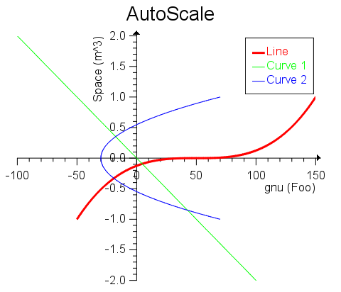
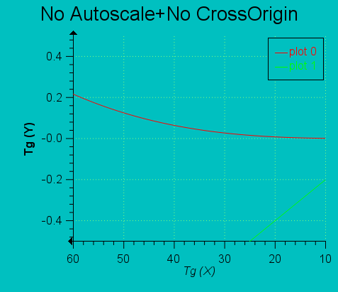
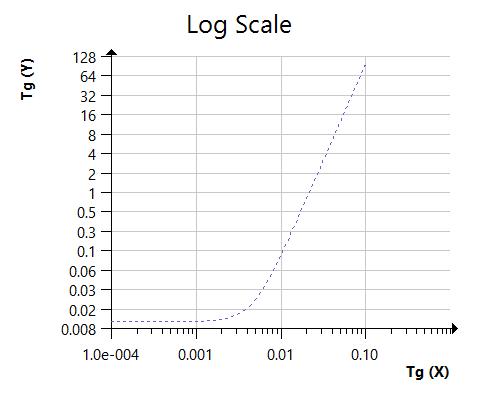
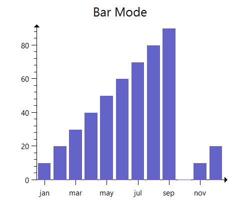
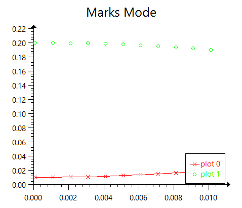
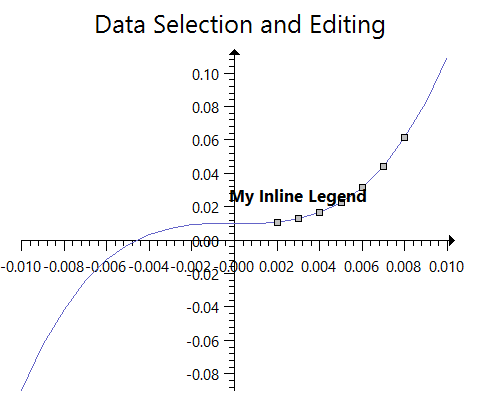
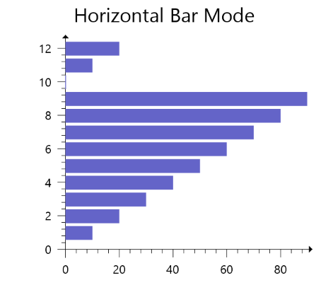
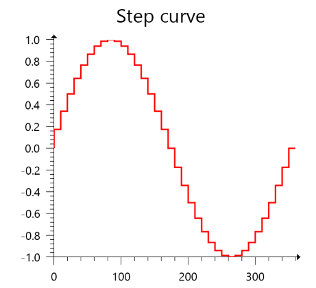
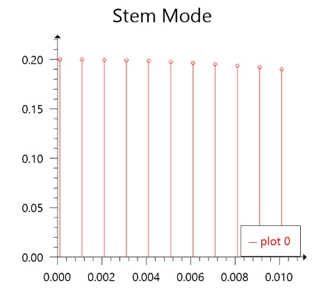
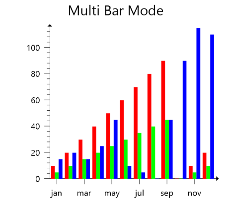
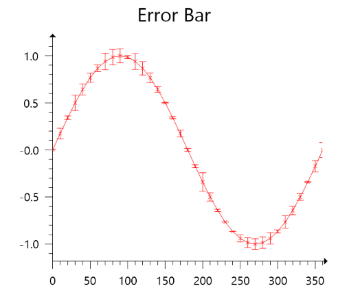
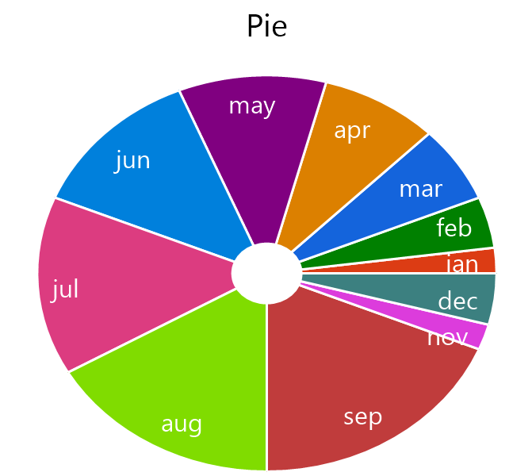

### See Also

[IupCanvas](../elem/iup_canvas.md)
