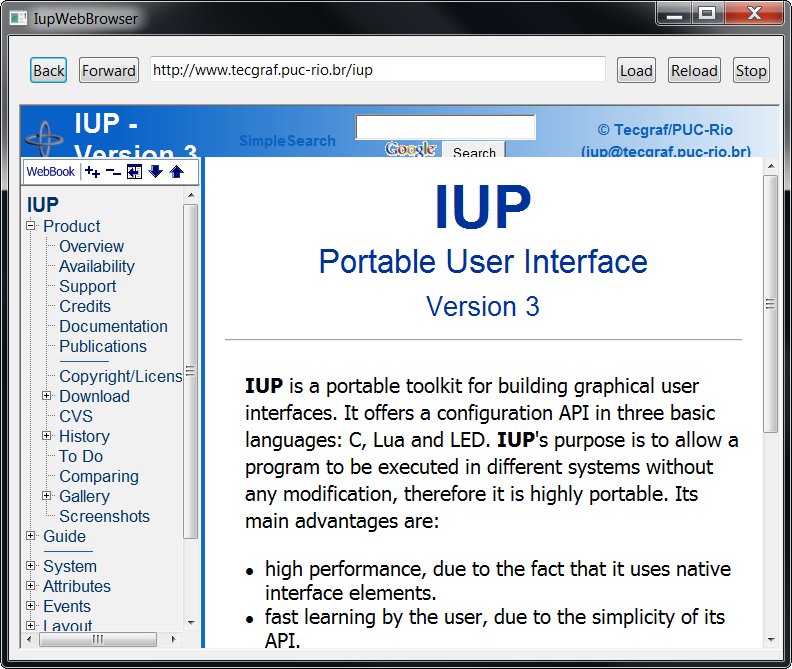

## IupWebBrowser [GTK and Windows only]

Creates a web browser control. It is responsible for managing the drawing of the web browser content and forwarding of its events.

In Linux, the implementation uses the [WebKit/GTK+](http://webkitgtk.org/), the new GTK+ port of the [WebKit](http://webkit.org), an open-source web content engine.
More information about WebKit/GTK+ (building, dependencies, releases, etc.) can be seen in a Notes section.
When using GTK 2.x, it uses the WebKit1 API.
When using GTK 3.x, it uses the WebKit2 API.

In Windows, the implementation uses the **IupOleControl** to embed an instance of the Internet Explorer WebBrowser control.

### Initialization and usage

The **IupWebBrowserOpen** function must be called after **IupOpen**.
The iupweb.h file must also be included in the source code.
The program must be linked to the controls library (iupweb).
If static linking is used then in Linux must be linked with the "webkit-1.0" for WebKit1 with GTK2, "webkitgtk-3.0" for WebKit1 with GTK3, and "webkit2gtk-4.0" libraries for WebKit2 with GTK3.

### Creation

    Ihandle* IupWebBrowser(void);

**Returns:** the identifier of the created element, or NULL if an error occurs.

### Attributes

**BACKCOUNT** [GTK Only] (read-only): gets the number of items that precede the current page.

**BACKFORWARD** (write-only): sets the number of steps away from the current page and loads the history item.
Negative values represent steps backward while positive values represent steps forward.

**GOBACK** (write-only): go to the previous page. Same as BACKFORWARD=-1.

**GOFORWARD** (write-only): go to the next page. Same as BACKFORWARD=1.

**CANGOBACK** (read-only): informs if there is a previous page.

**CANGOFORWARD** (read-only): informs if there is a next page.

**COPY** (write-only): copy the selection to the clipboard.

**FORWARDCOUNT** [GTK Only] (read-only): gets the number of items that succeed the current page.

**HTML**: loads a given HTML content.

**ITEMHISTORYid** [GTK Only] (read-only): Returns the URL associated with a specific history item.
Negative "id" value represents a backward item while positive "id" value represents a forward item ("0" represents the current item).

**INNERTEXT** [Windows Only]: the innerText property of the HTML element marked with the ID given by the attribute ELEMENT_ID.

**ATTRIBUTE** [Windows Only]: the content attribute of the HTML element marked with the ID given by the attribute ELEMENT_ID.
The name of the content attribute is given by the attribute ATTRIBUTE_NAME.

**PRINT** (write-only): shows the print dialog.
In Windows if set to Yes will display the system print dialog.

**PRINTPREVIEW** [Windows Only]: shows a print preview dialog.

**RELOAD** (write-only): reloads the page in the webbrowser.

**SELECTALL** (write-only): selects all contents.

**STATUS** (read-only): returns the load status. Can be "LOADING", "COMPLETED" or "FAILED".

**STOP** (write-only): stops any ongoing load in the webbrowser.

**VALUE**: sets a specified URL to load into the webbrowser, or retrieve the current URL.

**ZOOM**: the zoom factor of the browser in percent. No zoom is 100%.

------------------------------------------------------------------------

**EDITABLE**: enable the design mode, or the  WYSIWYG HTML editor. Can be Yes or NO.

(All the following attributes depend on the EDITABLE attribute)

**NEW** (write-only): initializes a blank document. Value is ignored.

**OPENFILE** (write-only): open an HTML file given its filename.
In Windows if the file is modified it will ask for a confirmation.

**SAVEFILE** (write-only): save the contents in an HTML file given its filename.
In Linux will save in a .mhtml file with all the images packed in a single file.

**DIRTY** [Windows Only]: Returns Yes or No if the contents have been edited by the user.

**UNDO** (write-only): undo the last editing.

**REDO** (write-only): redo the last editing.

**CUT** (write-only): cuts the selection to the clipboard.

**PASTE** (write-only): pastes the clipboard to the selection or caret.

**SELECTALL** (write-only): selects all the contents.

**FIND** [Windows Only] (write-only): shows a dialog for finding a text.

**EXECCOMMAND** (write-only): executes an editing command.
Possible commands:  CUT, COPY, PASTE, UNDO, REDO, SELECTALL, BOLD, ITALIC, UNDERLINE, STRIKETHROUGH, JUSTIFYLEFT, JUSTIFYCENTER, JUSTIFYRIGHT, JUSTIFYFULL, INDENT, OUTDENT, REMOVEFORMAT, DELETE, SUBSCRIPT, SUPERSCRIPT, INSERTORDEREDLIST, INSERTUNORDEREDLIST, UNLINK.

**COMMANDSTATE** [Windows Only] (read-only): returns the command state. Can be Yes or No.
The command name must be stored on the attribute COMMAND. 

**COMMANDENABLED** [Windows Only] (read-only): returns if the command is enabled.
Can be Yes or No. The command name must be stored on the attribute COMMAND.

**COMMANDTEXT** [Windows Only] (read-only): returns the command text if any.
The command name must be stored on the attribute COMMAND.

**COMMANDVALUE** [Windows Only] (read-only): returns the command value if any.
The command name must be stored on the attribute COMMAND.

**INSERTIMAGE** (write-only): inserts an image given its url.
In Windows if value is NULL displays a system dialog for inserting an image.

**INSERTIMAGEFILE** (write-only): inserts an image given its filename.

**CREATELINK** (write-only): inserts a link given its url.
In Windows if value is NULL displays a system dialog for editing a link.

**INSERTTEXT** (write-only): inserts a text at the current selection or caret.

**INSERTHTML** (write-only): inserts a formatted text at the current selection or caret.

**FONTNAME**: font face name. In Linux is write-only.

**FONTSIZE**: font relative size. In Linux is write-only.
Can be a number form "1" to "7", meaning 1: x-small, 2: small, 3: medium, 4: large, 5: x-large, 6: xx-large, 7: xxx-large.

**FORMATBLOCK**: The block format. In Linux is write-only.
It can be: "Heading 1", "Heading 2", "Heading 3", "Heading 4", "Heading 5", "Heading 6", "Paragraph", "Preformatted" and "Block Quote".
In Windows returns "Normal" for "Paragraph",  "Formatted" for "Preformatted" and "Block Quote" is not supported.

**FORECOLOR**: the foreground color of the selected text. In Linux is write-only.

**BACKCOLOR**: the background color of the selected text. In Linux is write-only.

> 
>
> ------------------------------------------------------------------------

[ACTIVE](../attrib/iup_active.md), [FONT](../attrib/iup_font.md), [EXPAND](../attrib/iup_expand.md), [SCREENPOSITION](../attrib/iup_screenposition.md), [POSITION](../attrib/iup_position.md), [MINSIZE](../attrib/iup_minsize.md), [MAXSIZE](../attrib/iup_maxsize.md), [WID](../attrib/iup_wid.md), [TIP](../attrib/iup_tip.md), [RASTERSIZE](../attrib/iup_rastersize.md), [ZORDER](../attrib/iup_zorder.md), [VISIBLE](../attrib/iup_visible.md): also accepted.

### Callbacks

**COMPLETED_CB**`:` action generated when a page successfully completed.
Can be called multiple times when a frame set loads its frames, or when a page loads also other pages.

    int function(Ihandle* ih, char* url); 

**ih**: identifier of the element that activated the event.\
**url**: the URL address that completed.

**ERROR_CB**`:` action generated when page load fail.

    int function(Ihandle* ih, char* url); 

**ih**: identifier of the element that activated the event.\
**url**: the URL address that caused the error.

**NAVIGATE_CB**`:` action generated when the browser requests a navigation to another page.
It is called before navigation occurs. Can be called multiple times when a frame set loads its frames, or when a page loads also other pages.

    int function(Ihandle* ih, char* url); 

**ih**: identifier of the element that activated the event.\
**url**: the URL address to navigate to.

**Returns**: IUP_IGNORE will abort navigation.

**NEWWINDOW_CB**`:` action generated when the browser requests a new window.

    int function(Ihandle* ih, char* url); 

**ih**: identifier of the element that activated the event.\
**url**: the URL address that is opened in the new window.

> **UPDATE_CB** [Windows Only]: action generated when the selection was changed and the editor interface needs an update. Used only when EDITABLE=Yes.
>
>     int function(Ihandle* ih); 
>
> **ih**: identifier of the element that activated the event.
>
> ------------------------------------------------------------------------

[MAP_CB](../call/iup_map_cb.md), [UNMAP_CB](../call/iup_unmap_cb.md), [DESTROY_CB](../call/iup_destroy_cb.md): callbacks are supported.

### Notes

To learn more about WebKit and WebKitGTK+:

[The WebKit Open Source Project](http://webkit.org/)\
[The WebKitGTK+ web page](http://webkitgtk.org/)\
[WebKitGTK+ wiki](http://live.gnome.org/WebKitGtk)\
[WebKitGTK+ tracker](http://trac.webkit.org/wiki/WebKitGTK)

### Examples

[Browse for Example Files](../../examples/)

