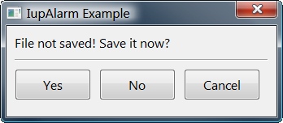

## IupAlarm

Shows a modal dialog containing a message and up to three buttons.

### Creation and Show

    int IupAlarm(const char *t, const char *m, const char *b1, const char *b2, const char *b3);

**t**: Dialog’s title\
**m**: Message\
**b1**: Text of the first button\
**b2**: Text of the second button (optional)\
**b3**: Text of the third button (optional)

**Returns:** the number of the **button** selected by the user (1, 2 or 3) , or 0 if failed.
It fails only if b1 is not defined.

### Notes

This function shows a dialog centralized on the screen, with the message and the buttons.
The ‘\n’ character can be added to the message to indicate line change.

A button is not shown if its parameter is NULL. This is valid only for **b2** and **b3**.

Button 1 is set as the "DEFAULTENTER" and "DEFAULTESC". If Button 2 exists, it is set as the "DEFAULTESC".
If Button 3 exists, it is set as the "DEFAULTESC".

The dialog uses a global attribute called "PARENTDIALOG" as the parent dialog if it is defined.
It also uses a global attribute called "ICON" as the dialog icon if it is defined.

### Examples

[Browse for Example Files](../../examples/)

### See Also

[IupMessage](iup_message.md), [IupListDialog](iup_listdialog.md), [IupGetFile](iup_getfile.md).

 
