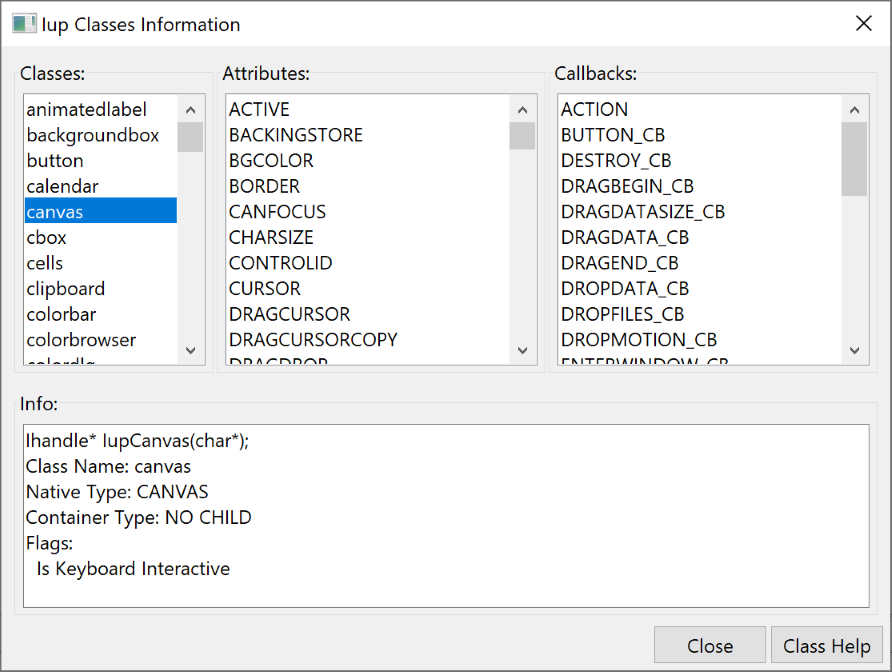

## IupClassInfoDialog

Creates an Iup Class Information dialog.
It is a predefined dialog to show all registered classes, each class attributes and callbacks.
It is a standard **IupDialog** constructed with other IUP elements.
The dialog can be shown with any of the show functions **IupShow**, **IupShowXY** or **IupPopup**.

This is a dialog intended for developers, so they can see attributes and callbacks information of a class.

### Creation

    Ihandle* IupClassInfoDialog(Ihandle* parent);

**parent:** dialog to be used as parent for the classinfo dialog. Can be NULL.

**Returns:** the identifier of the created dialog, or NULL if an error occurs.

### Attributes

Check the [IupDialog](iup_dialog.md) attributes.

### Callbacks

Check the [IupDialog](iup_dialog.md) callbacks.

### Examples

    IupShow(IupClassInfoDialog());  

The dialog is displayed next. The Help button shows the Iup class documentation page on the Tecgraf web site.

### See Also

[IupDialog](iup_dialog.md), [IupShow](../func/iup_show.md), [IupShowXY](../func/iup_showxy.md), [IupPopup](../func/iup_popup.md), [IupLayoutDialog](iup_layoutdialog.md)
