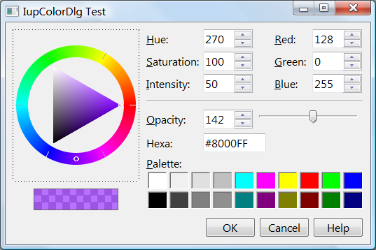

## IupColorDlg

Creates the Color Dialog element. It is a predefined dialog for selecting a color.

### Creation

    Ihandle* IupColorDlg(void);

**Returns:** the identifier of the created element, or NULL if an error occurs.

### Attributes

Supports all the [IupDialog](iup_dialog.md) attributes and the following additional attributes:

**ALPHA**: if defined, it will enable an alpha selection additional controls with its initial value.
If the user pressed the Ok button contains the returned value.
Default: no defined, or 255 if SHOWALPHA=YES.

**COLORTABLE**: list of colors separated by ";". If a color is not specified then the default color is used.
You can skip colors using ";;". The maximum number of colors is 20.

[PARENTDIALOG](../attrib/iup_parentdialog.md) (creation-only): Name of a dialog to be used as parent.
This dialog will always be in front of the parent dialog.

**SHOWALPHA**: if enabled will display the alpha selection controls, regardless if ALPHA is defined for the initial value or not.

**SHOWCOLORTABLE**: if enabled will display the color table, regardless if **COLORTABLE** is defined or not.

**SHOWHEX**: if enabled will display the Hexadecimal notation of the color.

**SHOWHELP**: if enabled will display the Help button.
The Help button is shown only if the HELP_CB callback is defined.

**STATUS** (read-only): defined to "1" if the user pressed the Ok button, NULL if pressed the Cancel button.

[TITLE](../attrib/iup_title.md): Dialog title.

**VALUE**: The color value in RGB coordinates and optionally alpha.
It is used as the initial value and contains the selected value if the user pressed the Ok button.
Format: "R G B" or "R G B A". Each component range from 0 to 255.

**VALUEHSI**: The color value in HSI coordinates.
It is used as the initial value and contains the selected value if the user pressed the Ok button.
Format: "H S I". Each component range from 0-359, 0-100 and 0-100 respectively.

**VALUEHEX**: The color value in RGB Hexadecimal notation.
It is used as the initial value and contains the selected value if the user pressed the Ok button.
Format: "#RRGGBB". Each component range from 0-255, but in hexadecimal notation.

### Callbacks

Supports all the [IupDialog](iup_dialog.md) callbacks and the following additional callbacks:

**COLORUPDATE_CB**: Action generated when the color is updated in the dialog.
It is also called when the color is updated programmatically.

    int function(Ihandle* ih); 

**ih**: identifier of the element that activated the event.

[HELP_CB](../call/iup_help_cb.md): Action generated when the Help button is pressed.

### Notes

It is a regular **IupDialog** that can be shown with [IupShow](../func/iup_show.md) or [IupPopup](../func/iup_popup.md).

### Examples

    Ihandle* dlg = IupColorDlg();

    IupSetAttribute(dlg, "VALUE", "128 0 255");
    IupSetAttribute(dlg, "ALPHA", "142");
    IupSetAttribute(dlg, "SHOWHEX", "YES");
    IupSetAttribute(dlg, "SHOWCOLORTABLE", "YES");
    IupSetAttribute(dlg, "TITLE", "IupColorDlg Test");
    IupSetCallback(dlg, "HELP_CB", (Icallback)help_cb);

    IupPopup(dlg, IUP_CURRENT, IUP_CURRENT);

    if (IupGetInt(dlg, "STATUS"))
    {
      printf("OK\n");
      printf("  COLOR(%s)\n", IupGetAttribute(dlg, "COLOR"));
      printf("  COLORTABLE(%s)\n", IupGetAttribute(dlg, "COLORTABLE"));
    }
    else
      printf("CANCEL\n");

    IupDestroy(dlg);  

### See Also

[IupMessageDlg](iup_messagedlg.md), [IupFileDlg](iup_filedlg.md), [IupPopup](../func/iup_popup.md)
