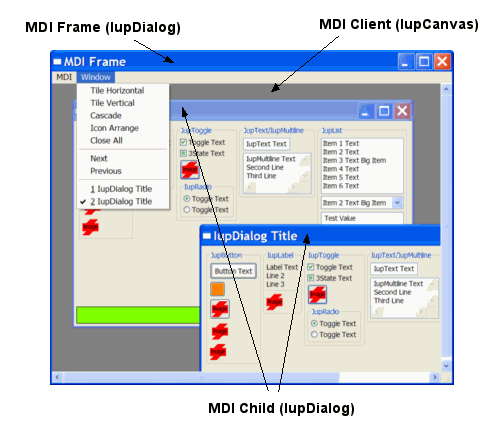
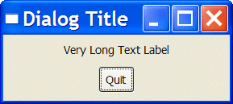

## IupDialog

Creates a dialog element. It manages user interaction with the interface elements.
For any interface element to be shown, it must be encapsulated in a dialog.

### Creation

    Ihandle* IupDialog(Ihandle *child);

**child**: Identifier of an interface element. The dialog has only one child. It can be NULL.

**Returns:** the identifier of the created element, or NULL if an error occurs.

### Attributes

#### Common

**BACKGROUND** (non-inheritable): Dialog background color or image.
Can be a non-inheritable alternative to BGCOLOR or can be the name of an image to be tiled on the background.

**BORDER** (non-inheritable) (creation-only): Shows a resize border around the dialog.
Default: "YES". BORDER=NO is useful only when RESIZE=NO, MAXBOX=NO, MINBOX=NO, MENUBOX=NO and TITLE=NULL, if any of these are defined there will be always some border.

**BORDERSIZE** (non-inheritable) (read-only): returns the border size.

**CHILDOFFSET**: Allow to specify a position offset for the child. Available for native containers only.
It will not affect the natural size, and allows to position controls outside the client area.
Format "*dx*x*dy*", where *dx* and *dy* are integer values corresponding to the horizontal and vertical offsets, respectively, in pixels.
Default: 0x0.

[CURSOR](../attrib/iup_cursor.md) (non-inheritable): Defines a cursor for the dialog.

[EXPAND](../attrib/iup_expand.md) (non-inheritable): The default value is "YES".

**NACTIVE** (non-inheritable): same as [ACTIVE](../attrib/iup_active.md) but does not affect the controls inside the dialog.

[SIZE](../attrib/iup_size.md) (non-inheritable): Dialog’s size.
Additionally, the following values can also be defined for width and/or height:

- "FULL": Defines the dialog’s width (or height) equal to the screen's width (or height)
- "HALF": Defines the dialog’s width (or height) equal to half the screen's width (or height)
- "THIRD": Defines the dialog’s width (or height) equal to 1/3 the screen's width (or height)
- "QUARTER": Defines the dialog’s width (or height) equal to 1/4 of the screen's width (or height)
- "EIGHTH": Defines the dialog’s width (or height) equal to 1/8 of the screen's width (or height)

The dialog **Natural** size is only considered when the **User** size is not defined or when it is bigger than the **Current** size.
This behavior is different from a control that goes inside the dialog.
Because of that, when SIZE or RASTERSIZE are set (changing the **User** size), the **Current** size is internally reset to 0x0, so the **Natural** size can be considered when re-computing the **Current** size of the dialog.

Values set at SIZE or RASTERSIZE attributes of a dialog are always accepted, regardless of the minimum size required by its children.
For a dialog to have the minimum necessary size to fit all elements contained in it, simply define SIZE or RASTERSIZE to NULL.
Also, if you set SIZE or RASTERSIZE to be used as the initial size of the dialog, its contents will be limited to this size as the minimum size, if you do not want that, then after showing the dialog reset this size to NULL so the dialog can be resized to smaller values.
But notice that its contents will still be limited by the **Natural** size, to also remove that limitation set SHRINK=YES.
To only change the **User** size in pixels, without resetting the **Current** size, set the USERSIZE attribute.

Notice that the dialog size includes its decoration (it is the **Window** size), the area available for controls are returned by the dialog [CLIENTSIZE](../attrib/iup_clientsize.md).
For more information see [Layout Guide](../layout.md).

**SIMULATEMODAL** (write-only): disable all other visible dialogs, just like when the dialog is made modal.

[TITLE](../attrib/iup_title.md) (non-inheritable): Dialog’s title. Default: NULL.
If you want to remove the title bar, you must also set MENUBOX=NO, MAXBOX=NO and MINBOX=NO, before map.
But in Motif and GTK it will hide it only if RESIZE=NO also.

[VISIBLE](../attrib/iup_visible.md): Simply call **IupShow** or **IupHide** for the dialog.

> 
>
> ------------------------------------------------------------------------

[ACTIVE](../attrib/iup_active.md), [BGCOLOR](../attrib/iup_bgcolor.md), [FONT](../attrib/iup_font.md), [EXPAND](../attrib/iup_expand.md), [SCREENPOSITION](../attrib/iup_screenposition.md), [WID](../attrib/iup_wid.md), [TIP](../attrib/iup_tip.md), [CLIENTOFFSET](../attrib/iup_clientoffset.md), [CLIENTSIZE](../attrib/iup_clientsize.md), [RASTERSIZE](../attrib/iup_rastersize.md), [ZORDER](../attrib/iup_zorder.md): also accepted.
Note that ACTIVE, BGCOLOR and FONT will also affect all the controls inside the dialog.

[Drag & Drop](../attrib/iup_dragdrop.md) attributes and callbacks are supported. 

#### Exclusive

**CUSTOMFRAMESIMULATE**: allows the application to customize the dialog frame elements (the title and its buttons) by using IUP controls for its elements like caption, minimize button, maximize button, and close buttons.
The custom frame support is entirely simulated by IUP, no native support for custom frame is used (this seems to have fewer drawbacks on the application behavior).
The application is responsible for leaving space for the borders. One drawback is that menu bars will not work.
For the dialog to be able to be moved an **IupLabel**, or a **IupFlatLabel** or an **IupCanvas** must be at the top of the dialog and must have the NAME attribute set to CUSTOMFRAMECAPTION.
See the Custom Frame notes below.

By setting this attribute, the following attributes will be set:

    RESIZE=NO
    MENUBOX=NO
    MAXBOX=NO
    MINBOX=NO
    BORDER=NO
    TITLE=NULL
    MENU=NULL
    TASKBARBUTTON=SHOW

The BUTTON_CB and MOTION_CB callbacks of the dialog will be set too, so the dialog can be resized.
The BUTTON_CB and MOTION_CB callbacks of the element with NAME=CUSTOMFRAMECAPTION  will also be changed so the dialog can be moved and maximized with double click.
It is application responsibility to implement the minimize, maximize and close buttons.

**DEFAULTENTER**:  Name of the button activated when the user press Enter when focus is in another control of the dialog.
Use [IupSetHandle](../func/iup_sethandle.md) or [IupSetAttributeHandle](../func/iup_setattributehandle.md) to associate a button to a name.

**DEFAULTESC**: Name of the button activated when the user presses Esc when focus is in another control of the dialog.
Use [IupSetHandle](../func/iup_sethandle.md) or [IupSetAttributeHandle](../func/iup_setattributehandle.md) to associate a button to a name.

**DIALOGFRAME**: Set the common decorations for modal dialogs. This means RESIZE=NO, MINBOX=NO and MAXBOX=NO.
In Windows, if the PARENTDIALOG is defined then the MENUBOX is also removed, but the Close button remains.

[ICON](../attrib/iup_icon.md): Dialog’s icon.
The Windows SDK recommends that cursors and icons should be implemented as resources rather than created at run time.

**FULLSCREEN:** Makes the dialog occupy the whole screen over any system bars in the main monitor.
All dialog details, such as title bar, borders, maximize button, etc., are removed.
Possible values: YES, NO. In Motif, you may have to click in the dialog to set its focus.
In Motif if set to YES when the dialog is hidden, then it cannot be changed after it is visible.

**MAXBOX** (creation-only): Requires a maximize button from the window manager.
If RESIZE=NO then MAXBOX will be set to NO. Default: YES.
In Motif the decorations are controlled by the Window Manager and may not be possible to be changed from IUP.
In Windows MAXBOX is hidden only if MINBOX is hidden as well, or else it will be just disabled.

**MAXSIZE**: Maximum size for the dialog in raster units (pixels).
The windowing system will not be able to change the size beyond this limit.
Default: 65535x65535.

**MENU**: Name of a menu. Associates a menu to the dialog as a menu bar. The previous menu, if any, is unmapped.
Use [IupSetHandle](../func/iup_sethandle.md) or [IupSetAttributeHandle](../func/iup_setattributehandle.md) to associate a menu to a name.
See also [IupMenu](../elem/iup_menu.md).

**MENUBOX** (creation-only): Requires a system menu box from the window manager.
If hidden will also remove the Close button. Default: YES.
In Motif the decorations are controlled by the Window Manager and may not be possible to be changed from IUP.
In Windows if hidden will hide also MAXBOX and MINBOX.

**MINBOX** (creation-only): Requires a minimize button from the window manager.
Default: YES. In Motif the decorations are controlled by the Window Manager and may not be possible to be changed from IUP.
In Windows MINBOX is hidden only if MAXBOX is hidden as well, or else it will be just disabled.

**MINSIZE**: Minimum size for the dialog in raster units (pixels).
The windowing system will not be able to change the size beyond this limit. Default: 1x1.
Some systems define a very minimum size greater than this, for instance in Windows the horizontal minimum size includes the window decoration buttons.

**MODAL** (read-only): Returns the popup state. It is "YES" if the dialog was shown using **IupPopup**.
It is "NO" if **IupShow** was used, or it is not visible.
At the first time the dialog is shown, MODAL is not set yet when SHOW_CB is called.

**NATIVEPARENT** (creation-only): Native handle of a dialog to be used as parent.
Used only if PARENTDIALOG is not defined.

[PARENTDIALOG](../attrib/iup_parentdialog.md) (creation-only): Name of a dialog to be used as parent.

**PLACEMENT**: Changes how the dialog will be shown. Values: "FULL", "MAXIMIZED", "MINIMIZED" and "NORMAL".
Default: NORMAL. After **IupShow**/**IupPopup** the attribute is set back to "NORMAL".
FULL is similar to FULLSCREEN, but only the dialog client area covers the screen area, menu and decorations will be there but out of the screen.
In UNIX there is a chance that the placement won't work correctly, that depends on the Window Manager.
In Windows, the SHOWNOACTIVATE attribute can be set to Yes to prevent the window from being activated.
In Windows, the SHOWMINIMIZENEXT attribute can be set to Yes to activate the next top-level window in the Z order when minimizing.

**RESIZE** (creation-only): Allows interactively changing the dialog’s size. Default: YES.
If RESIZE=NO then MAXBOX will be set to NO.
In Motif the decorations are controlled by the Window Manager and may not be possible to be changed from IUP.

[SHRINK](../attrib/iup_shrink.md): Allows changing the elements’ distribution when the dialog is smaller than the minimum size.
Default: NO.

**STARTFOCUS**: Name of the element that must receive the focus right after the dialog is shown using **IupShow** or **IupPopup**.
If not defined then the first control than can receive the focus is selected (same effect of calling [IupNextField](../func/iup_nextfield.md) for the dialog).
Updated after SHOW_CB is called and only if the focus was not changed during the callback.

**SHOWNOFOCUS**: do not set focus after show.

#### Exclusive [System Dependent]

**HWND** [Windows Only] (non-inheritable, read-only): Returns the Windows Window handle.
Available in Windows, WinUI, or in the GTK/GTK 4/Qt drivers on Windows.

**SAVEUNDER** [Windows and Motif Only] (creation-only): When this attribute is true (YES), the dialog stores the original image of the desktop region it occupies (if the system has enough memory to store the image).
In this case, when the dialog is closed or moved, a redrawing event is not generated for the windows that were shadowed by it.
Its default value is YES if the dialog has a parent dialog.
To save memory disable it for your main dialog.

**XWINDOW** [UNIX Only] (non-inheritable, read-only): Returns the X-Windows Window (Drawable).
Available in Motif, GTK, GTK 4, Qt and EFL on X11.

**WL_SURFACE** [UNIX Only] (non-inheritable, read-only): Returns the Wayland surface handle.
Available in GTK, GTK 4, Qt and EFL on Wayland.

####

#### Exclusive

**ACTIVEWINDOW** (read-only): informs if the dialog is the active window (the window with focus).
Can be Yes or No.
Not supported in Motif.

**CUSTOMFRAME** (non-inheritable): allows the application to customize the dialog frame elements (the title and its buttons) by using IUP controls for its elements like caption, minimize button, maximize button, and close buttons.
The custom frame support uses the native system support for custom frames.
The application is responsible for leaving space for the borders. One drawback is that menu bars will not work.
For the dialog to be able to be moved an **IupLabel** or an **IupCanvas** must be at the top of the dialog and must have the NAME attribute set to CUSTOMFRAMECAPTION.
See the Custom Frame notes below.
Not supported in Motif.

**DROPFILESTARGET** (non-inheritable): Enable or disable the drop of files.
Default: NO, but if DROPFILES_CB is defined when the element is mapped then it will be automatically enabled.

**MAXIMIZED** (read-only): indicates if the dialog is maximized.
Can be YES or NO.
Not supported in Motif.

**MINIMIZED** (read-only): indicates if the dialog is minimized.
Can be YES or NO.
Not supported in Motif.

**OPACITY**: sets the dialog transparency alpha value.
Valid values range from 0 (completely transparent) to 255 (opaque).
In Windows must be set before map so the native window would be properly initialized when mapped.
Not supported in Motif.

**OPACITYIMAGE**: sets an RGBA image as the dialog background so it is possible to create a non rectangle window with transparency, but it can not have children.
Used usually for splash screens. It must be set before map so the native window would be properly initialized when mapped.
Not supported in GTK 4, Motif, and WinUI.

**SHAPEIMAGE**: sets an RGBA image as the dialog shape, so it is possible to create a non rectangle window with children.
Only the fully transparent pixels will be transparent.
The pixels colors will be ignored, only the alpha channel is used.
Not supported in GTK 4 and Motif.

**TOPMOST**: puts the dialog always in front of all other dialogs in all applications.
Default: NO.
Not supported in GTK 4 and Motif.

#### Exclusive [Windows Only]

**BRINGFRONT** [Windows Only] (write-only): makes the dialog the foreground window.
Use "YES" to activate it. Useful for multithreaded applications.

**COMPOSITED** [Windows Only] (creation-only): controls if the window will have an automatic double buffer for all children.
Default is "NO".
It is NOT compatible with IupCanvas, and all derived IUP controls such as IupFlat*, IupGL*, IupPlot and IupMatrix, because IupCanvas uses CS_OWNDC in the window class.

**CUSTOMFRAMEDRAW** [Windows Only] (non-inheritable): allows the application to customize the dialog frame elements (the title and its buttons) by drawing them with the CUSTOMFRAMEDRAW_CB callback.
Can be Yes or No. The Window client area is expanded to include the whole window.
Notice that the dialog attributes like BORDER, RESIZE, MAXBOX, MINBOX and TITLE must still be defined.
But maximize, minimize and close buttons must be manually implemented in the BUTTON_CB callback.
One drawback is that menu bars will not work.

**CUSTOMFRAMECAPTIONHEIGHT** [Windows Only] (non-inheritable): height of the caption area.
If not defined it will use the system size.

**CUSTOMFRAMECAPTIONLIMITS** [Windows Only] (non-inheritable): limits of the caption area at left and at right.
The caption area is always expanded inside the limits when the dialog is resized.
Format is "left:right" or in C "%d:%d". Default: "0:0".
This will allow the dialog to be moved by the system when the user clicks and drags the caption area.
If not defined but CUSTOMFRAMECAPTION is defined, then it will use the caption element horizontal position and size for the limits.

**HELPBUTTON** [Windows Only] (creation-only): Inserts a help button in the same place of the maximize button.
It can only be used for dialogs without the minimize and maximize buttons, and with the menu box.
For the next interaction of the user with a control in the dialog, the callback  [HELP_CB](../call/iup_help_cb.md) will be called instead of the control defined ACTION callback.
Possible values: YES, NO. Default: NO.

**MAXIMIZEATPARENT** [Windows Only]: when using multiple monitors, maximize the dialog in the same monitor that the parent dialog is.

**TOOLBOX** [Windows Only] (creation-only): makes the dialog look like a toolbox with a smaller title bar.
It is only valid if the PARENTDIALOG or NATIVEPARENT attribute is also defined. Default: NO.

#### Exclusive [GTK, Qt and macOS Only]

**DIALOGHINT** (creation-only): if enabled, set the window type hint to a dialog hint.
Supported in GTK, GTK 4, Qt, macOS, and EFL.

**HIDETITLEBAR** (non-inheritable): hides the title bar with all its elements.
Supported in GTK, GTK 4, Qt, and macOS.

#### Exclusive Taskbar [Windows Only]

**HIDETASKBAR** (write-only): Action attribute that when set to "YES", hides the dialog, but does not decrement the visible dialog count, does not call SHOW_CB and does not mark the dialog as hidden inside IUP.
It is usually used to hide the dialog and keep the tray icon working without closing the main loop.
It has the same effect as setting LOCKLOOP=Yes and normally hiding the dialog.
IMPORTANT: when you hide using HIDETASKBAR, you must show using HIDETASKBAR also.
Possible values: YES, NO.

**TASKBARPROGRESS** [Windows Only] (write-only): enables the use of a progress bar on a taskbar button.
Default: NO.

**TASKBARPROGRESSSTATE** [Windows Only] (write-only): sets the type and state of the progress indicator displayed on a taskbar button.
Possible values: NORMAL (a green bar), PAUSED (a yellow bar), ERROR (a red bar), INDETERMINATE (a green marquee) and NOPROGRESS (no bar).
Default: NORMAL.

**TASKBARPROGRESSVALUE** [Windows Only] (write-only): updates a progress bar hosted in a taskbar button to show the specific percentage completed of the full operation.
The value must be between 0 and 100.

**TASKBARBUTTON** [Windows Only]: If set to SHOW force the application button to be shown on the taskbar even if the dialog does not have decorations.
If set to HIDE force the application button to be hidden from the taskbar, but also in this case the system menu, the maximize and minimize buttons will be hidden.

#### Exclusive MDI [Windows Only]

***--- For the MDI Frame ---* MDIFRAME** (creation-only) [Windows Only] (non-inheritable): Configure this dialog as a MDI frame.
Can be YES or NO. Default: NO.

**MDIACTIVE** [Windows Only] (read-only): Returns the name of the current active MDI child.
Use IupGetAttributeHandle to directly retrieve the child handle.

**MDIACTIVATE** [Windows Only] (write-only): Name of an MDI child window to be activated.
If value is "NEXT" will activate the next window after the current active window.
If value is "PREVIOUS" will activate the previous one.

**MDIARRANGE** [Windows Only] (write-only): Action to arrange MDI child windows.
Possible values: TILEHORIZONTAL, TILEVERTICAL, CASCADE and ICON (arrange the minimized icons).

**MDICLOSEALL** [Windows Only] (write-only): Action to close and destroy all MDI child windows.
The CLOSE_CB callback will be called for each child.

IMPORTANT: When an MDI child window is closed, it is automatically destroyed.
The application can override this returning IUP_IGNORE in CLOSE_CB.

**MDINEXT** [Windows Only] (read-only): Returns the name of the next available MDI child.
Use IupGetAttributeHandle to directly retrieve the child handle. Must use MDIACTIVE to retrieve the first child.
If the application is going to destroy the child retrieve the next child before destroying the current.

***--- For the MDI Client *** (a IupCanvas) ***---* MDICLIENT** (creation-only) [Windows Only] (non-inheritable): Configure the canvas as an MDI client.
Can be YES or NO. No callbacks will be called.
This canvas will be used internally only by the MDI Frame and its MDI Children.
The MDI frame must have one and only one MDI client. Default: NO.

**MDIMENU** (creation-only) [Windows Only]: Name of a IupMenu to be used as the Window list of an MDI frame.
The system will automatically add the list of MDI child windows there.

***--- For the MDI Children ---* MDICHILD** (creation-only) [Windows Only]: Configure this dialog to be an MDI child.
Can be YES or NO. The PARENTDIALOG attribute must also be defined.
Each MDI child is automatically named if it does not have one. Default: NO.

### Callbacks

[CLOSE_CB](../call/iup_close_cb.md): Called right before the dialog is closed.

**COPYDATA_CB**: Called at the first instance, when a second instance is running.
Must set the global attribute SINGLEINSTANCE to be called.

    int function(Ihandle *ih, char* cmdLine, int size);

**ih**: identifier of the element that activated the event.\
**cmdLine**: command line of the second instance.\
**size**: size of the command line string including the null character.

[DROPFILES_CB](../call/iup_dropfiles_cb.md): Action generated when one or more files are dropped in the dialog.

**CUSTOMFRAME_CB** [Windows Only]: Called when the dialog must be redrawn.
Although it is designed for drawing the frame elements, all the dialog must be painted.
Works only when CUSTOMFRAME or CUSTOMFRAMEEX is defined.
The dialog can be used just like an IupCanvas to draw its elements, the **HDC_WMPAINT** and **CLIPRECT** attributes are defined during the callback.
For mouse callbacks use the same callbacks as **IupCanvas**, such as [BUTTON_CB](../call/iup_button_cb.md) and [MOTION_CB](../call/iup_motion_cb.md).

    int function(Ihandle *ih);

> **ih**: identifier of the element that activated the event.

**CUSTOMFRAMEACTIVATE_CB** [Windows Only]: Called when the dialog active state is changed (for instance, the user Alt+Tab to another application, or clicked in another window).
Works only when CUSTOMFRAME or CUSTOMFRAMEEX is defined.

    int function(Ihandle *ih, int active);

**ih**: identifier of the element that activated the event.\
**active**: is non-zero if the dialog is active or zero if it is inactive.

**FOCUS_CB**: Called when the dialog or any of its children gets the focus, or when another dialog or any control in another dialog gets the focus.
It is called after the common callbacks GETFOCUS_CB and KILL_FOCUS_CB.

    int function(Ihandle *ih, int focus);

**ih**: identifier of the element that activated the event.\
**focus**: is non-zero if the dialog or any of its children is getting the focus, is zero if it is losing the focus.

**MDIACTIVATE_CB** [Windows Only]: Called when an MDI child window is activated.
Only the MDI child receives this message.
It is not called when the child is shown for the first time.

    int function(Ihandle *ih);

> **ih**: identifier of the element that activated the event.

**MOVE_CB**: Called after the dialog was moved on screen.
The coordinates are the same as the [SCREENPOSITION](../attrib/iup_screenposition.md) attribute.

    int function(Ihandle *ih, int x, int y);

**ih**: identifier of the element that activated the event.\
**x**, **y**: coordinates of the new position.

[RESIZE_CB](../call/iup_resize_cb.md): Action generated when the dialog size is changed.
If returns IUP_IGNORE the dialog layout is NOT recalculated.

[SHOW_CB](../call/iup_show_cb.md): Called right after the dialog is shown, hidden, maximized, minimized or restored from minimized/maximized.

**THEMECHANGED_CB**: Called when the system theme or color scheme changes (e.g., switching between light and dark mode).

    int function(Ihandle *ih, int dark_mode);

**ih**: identifier of the element that activated the event.\
**dark_mode**: is non-zero if the system is now in dark mode, zero if in light mode.

Supported in Windows (Win32 and WinUI), GTK 3, GTK 4, Qt, EFL and macOS.
Not supported in Motif.

>
>
> ------------------------------------------------------------------------

[MAP_CB](../call/iup_map_cb.md), [UNMAP_CB](../call/iup_unmap_cb.md), [DESTROY_CB](../call/iup_destroy_cb.md), [GETFOCUS_CB](../call/iup_getfocus_cb.md), [KILLFOCUS_CB](../call/iup_killfocus_cb.md), [ENTERWINDOW_CB](../call/iup_enterwindow_cb.md), [LEAVEWINDOW_CB](../call/iup_leavewindow_cb.md), [K_ANY](../call/iup_k_any.md), [HELP_CB](../call/iup_help_cb.md): All common callbacks are supported.

[Drag & Drop](../attrib/iup_dragdrop.md) attributes and callbacks are supported. 

### Notes

Do not associate an **IupDialog** with the native "dialog" nomenclature in Windows, GTK or Motif.
**IupDialog** use native standard windows in all drivers.

Except for the menu, all other elements must be inside a dialog to interact with the user.
Therefore, an interface element will only be visible if its dialog is also visible.

The order of callback calling is system-dependent.
For instance, the RESIZE_CB and the SHOW_CB are called in a different order in Win32 and in X-Windows when the dialog is shown for the first time.

In Windows, when all decorations are removed, the window icon is not displayed on the task bar; when minimized, a small rectangular window will be positioned above the task bar on the bottom-left corner of the desktop.

In GTK uses GtkWindow, in Windows uses a custom window class called "IupDialog", in WinUI uses a Win32 window with XAML Islands, in macOS uses NSWindow, in Qt uses QMainWindow, in EFL uses Efl_Ui_Win, and in Motif uses topLevelShellWidgetClass.

#### Windows MDI

The MDI support is composed of 3 components: the MDI frame window (IupDialog), the MDI client window (IupCanvas) and the MDI children (IupDialog).
Although the MDI client is a IupCanvas it is not used directly by the application, but it must be created and included in the dialog that will be the MDI frame, other controls can also be available in the same dialog, like buttons and other canvases composing toolbars and status area.
The following picture illustrates the e components:

#### Custom Frame

The use of custom frame is very popular nowadays. But the system support is very poor, in Windows and in GTK.
So use it carefully and consciously of its glitches.

In GTK is easier to understand because the frame is managed by the Window Manager.
So depending on the system, it may be provided by the Windows Manager, or it is simulated by IUP removing the window decoration.

In Windows, there is no function or attribute to activate this feature in the Win32 API (maybe in WPF there is, but we are stuck with the old API).
It is a combination of message handling with returned values in the WindowProc.
So sometimes the result is not what was expected.
For instance, if the application is not responding, the old title bar interface is drawn over the top of the dialog just to show the "Not Responding" at the window caption, even if the window does not have a caption.
We don't know how to avoid that. Also, the internal double buffer processing for the dialog is somehow affected, and a sequential or full redraw of the dialog has more flicker than usual.

The CUSTOMFRAMESIMULATE attribute is a workaround that tries to solve the double buffer problem and has more control over the custom frame behavior in general.

### Examples

Very simple dialog with a label and a button. The application is closed when the button is pressed.

    #include <iup.h>

    int quit_cb(void)
    {
      return IUP_CLOSE;
    }

    int main(int argc, char* argv[])
    {
      Ihandle *dialog, *quit_bt, *vbox;

      IupOpen(&argc, &argv);

      /* Creating the button */ 
      quit_bt = IupButton("Quit", 0);
      IupSetCallback(quit_bt, "ACTION", (Icallback)quit_cb);

      /* the container with a label and the button */
      vbox = IupVbox(
               IupSetAttributes(IupLabel("Very Long Text Label"), "EXPAND=YES, ALIGNMENT=ACENTER"), 
               quit_bt, 
               0);
      IupSetAttribute(vbox, "MARGIN", "10x10");
      IupSetAttribute(vbox, "GAP", "5");

      /* Creating the dialog */ 
      dialog = IupDialog(vbox);
      IupSetAttribute(dialog, "TITLE", "Dialog Title");
      IupSetAttributeHandle(dialog, "DEFAULTESC", quit_bt);

      IupShow(dialog);

      IupMainLoop();
      
      IupDestroy(dialog);
      IupClose();

      return 0;
    }

[Browse for Example Files](../../examples/)

### See Also

[IupFileDlg](../dlg/iup_filedlg.md), [IupMessageDlg](../dlg/iup_messagedlg.md), [IupDestroy](../func/iup_destroy.md), [IupShowXY](../func/iup_showxy.md), [IupShow](../func/iup_show.md), [IupPopup](../func/iup_popup.md), [IupTray](../elem/iup_tray.md)
