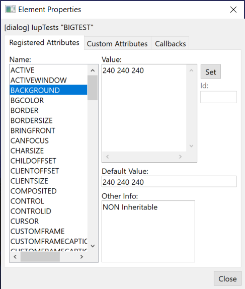

## IupElementPropertiesDialog

Creates an Element Properties Dialog. It is a predefined dialog to edit the properties of an element in run time.
It is a standard **IupDialog** constructed with other IUP elements.
The dialog can be shown with any of the show functions **IupShow**, **IupShowXY** or **IupPopup**.

Any existent element can be edited. It does not need to be mapped on the native system nor visible.
It could have been created in any language.

This is a dialog intended for developers, so they can see and inspect their elements in other ways.

It contains 3 Tab sections: one for the registered attributes of the element, one for custom attributes set by the application, and one for the callbacks.
The callbacks are just for inspection, and custom attributes should be handled carefully because they may be not strings.
Registered attributes values are shown in red when they were changed by the application.

### Creation

    Ihandle* IupElementPropertiesDialog(Ihandle* parent, Ihandle* elem);

**parent:** dialog to be used as parent for the properties dialog. Can be NULL.**\
elem**: identifier of the element to display the properties. Not optional.

**Returns:** the identifier of the created dialog, or NULL if an error occurs.

### Attributes

Check the [IupDialog](iup_dialog.md) attributes.

### Callbacks

Check the [IupDialog](iup_dialog.md) callbacks.

**ATTRIBCHANGED_CB**: Called when an attribute is changed.

    int function(Ihandle *ih, char* name);

> **ih**: identifier of the element that activated the event.\
> **name**: name of the attribute that changed.

### Examples

    IupShow(IupElementPropertiesDialog(button));  

The dialog is displayed next.

### See Also

[IupDialog](iup_dialog.md), [IupShow](../func/iup_show.md), [IupShowXY](../func/iup_showxy.md), [IupPopup](../func/iup_popup.md)
