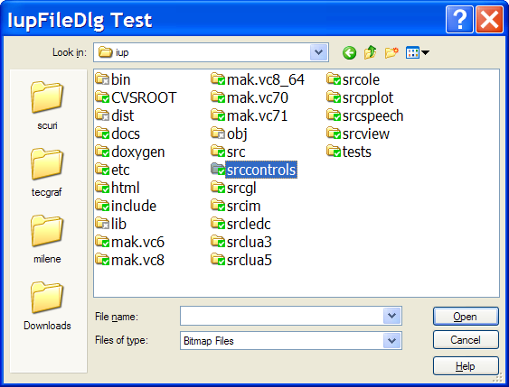
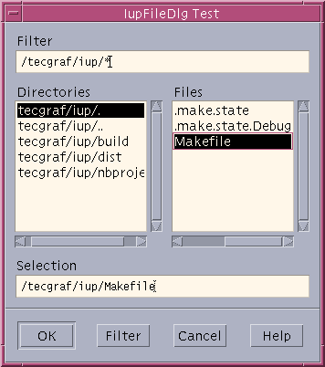
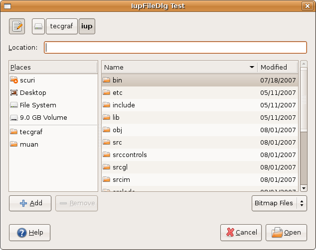

## IupFileDlg

Creates the File Dialog element. It is a predefined dialog for selecting files or a directory.
The dialog can be shown with the IupPopup function only.

### Creation

    Ihandle* IupFileDlg(void);

**Returns:** the identifier of the created element, or NULL if an error occurs.

### Attributes

**ALLOWNEW**: Indicates if non-existent file names are accepted.
If equals "NO" and the user specifies a non-existing file, an alert dialog is shown.
Default: if the dialog is of type "OPEN", default is "NO"; if the dialog is of type "SAVE", default is "YES".
Not used when DIALOGTYPE=DIR.

**DIALOGTYPE**: Type of dialog (Open, Save or Directory). Can have values "OPEN", "SAVE" or "DIR".
Default: "OPEN".

> In Windows, when DIALOGTYPE=DIR the dialog shown is not the same dialog for OPEN and SAVE; this new dialog does not have the Help button neither filters. Also, this new dialog needs CoInitializeEx with COINIT_APARTMENTTHREADED (done in **IupOpen**), if the COM library was initialized with COINIT_MULTITHREADED prior to **IupOpen** then the new dialog will have limited functionality. In other drivers the dialog is the same, but it only allows the user to select a directory.

**DIRECTORY**: Initial directory. When consulted after the dialog is closed and the user pressed the OK button, it will contain the directory of the selected file.
When set the last separator does not need to be specified, but when get the returned value will always contain the last separator.

> In Windows, if not defined and the application has used the dialog in the past, the path most recently used is selected as the initial directory. However, if an application is not run for a long time, its saved selected path is discarded. Also if not defined and the current directory contains any files of the specified filter types, the initial directory is the current directory. Otherwise, the initial directory is the "My Documents" directory of the current user. Otherwise, the initial directory is the Desktop folder.
>
> In other drivers, if not defined, the dialog opens in the current directory.

**EXTFILTER**: Defines several file filters. It has priority over FILTERINFO and FILTER.
Must be a text with the format "FilterInfo1|Filter1|FilterInfo2|Filter2|...". The list ends with character '|'.
Example: "Text files|*.txt;*.doc|Image files|*.gif;*.jpg;*.bmp|".
It is recommended to always add a less restrictive filter to the filter list, for example, "All Files|*.*".

**EXTDEFAULT**: default extension to be used if selected file does not have an extension.
The inspected extension will consider having the same number of characters of the default extension.
It must NOT include the period ".".

**FILE**: Name of the file initially shown in the "File Name" field in the dialog.
If contains a full path, then it is used as the initial directory and **DIRECTORY** is ignored.

**FILEEXIST** (read-only): Indicates if the file defined by the FILE attribute exists or not.
It is only valid if the user has pressed OK in the dialog.
Not set when DIALOGTYPE=DIR or **MULTIPLEFILES=YES**.

**FILTER**: String containing a list of file filters separated by ';' without spaces.
Example: "*.C;*.txt;test.*". In Motif only the first filter is used.

**FILTERINFO**: Filter's description.
If not defined the filter itself will be used as its description.

**FILTERUSED**: the index of the filter in EXTFILTER to use starting at 1.
It returns the selection made by the user. Set only if EXTFILTER is defined.

**MULTIPLEFILES**: Allows the user to select multiple files when DIALOGTYPE=OPEN.
Can be "Yes" or "No". Default "No".

**NOCHANGEDIR**: Indicates if the current working directory must be restored after the user navigation.
Default: "YES".

**NOOVERWRITEPROMPT**: do not prompt to overwrite an existent file when in "SAVE" dialog.
Default is "NO", i.e., prompt before overwrite.

**NOPLACESBAR** [Windows Only]: do not show the places bar.

**[PARENTDIALOG](../attrib/iup_parentdialog.md)**: Makes the dialog be treated as a child of the specified dialog.

**PORTAL** [Unix Only]: When set to "YES", forces the use of the XDG Desktop Portal for the file dialog via D-Bus, instead of the native toolkit dialog.
When the global attribute SANDBOX is set, the portal is used automatically.
If the portal is not available, falls back to the native dialog.
Supported in GTK 3, Motif and EFL.
In GTK 4, the native GtkFileDialog already uses portals when appropriate.

**SHOWEDITBOX** [Windows Only]: Show an edit box in the directory selection dialog (DIALOGTYPE=DIR).

**SHOWHIDDEN**: Show hidden files. Default: NO.

**SHOWPREVIEW**: A preview area is shown inside the file dialog. Can have values "YES" or "NO". Default: "NO".
Valid only if the FILE_CB callback is defined, use it to retrieve the file name and the necessary attributes to paint the preview area.
Supported in Windows (Win32), GTK 3, FLTK, macOS and Qt.

> Read only attributes that are valid inside the FILE_CB callback when status="PAINT":\
> **    PREVIEWDC**: Returns the Device Context (HDC in Windows and GC in Unix)\
> **    PREVIEWWIDTH** and **PREVIEWHEIGHT**: Returns the width and the height of the client rectangle for the preview area.\
>   Also the attributes WID, HWND, XWINDOW and XDISPLAY are valid and are relative to the preview area.
>
> If the attribute PREVIEWGLCANVAS is defined, then it is used as the name of an existent **IupGLCanvas** control to be mapped internally to the preview canvas. Notice that this is not a fully implemented **IupGLCanvas** that inherits from **IupCanvas**. This does the minimum necessary so you can use **IupGLCanvas** auxiliary functions for the preview canvas and call OpenGL functions. No **IupCanvas** attributes or callbacks are available.
> Supported in Windows (Win32), GTK 3, Motif, macOS and Qt (X11 only).

**STATUS** (read-only): Indicates the status of the selection made:

> "1": New file.\
> "0": Normal, existing file or directory.\
> "-1": Operation cancelled.

**[TITLE](../attrib/iup_title.md)**: Dialog's title.

**VALUE** (read-only): Name of the selected file(s), or NULL if no file was selected.
If FILE is not defined this is used as the initial value.
When MULTIPLEFILES=Yes it contains the path (but NOT the same value returned in DIRECTORY, it does not contain the last separator) and several file names separated by the '\|' character.
The file list ends with character '\|'.
BUT when the user selects just one file, the directory and the file are not separated by '\|'.
For example:

    "/tecgraf/iup/test|a.txt|b.txt|c.txt|" (MULTIPLEFILES=Yes and more than one file is selected)
    "/tecgraf/iup/test/a.txt" (only one file is selected)

**MULTIVALUECOUNT**(read-only): number of returned values when MULTIPLEFILES=Yes.
It always includes the path, so if only 1 file is selected its value is 2.

**MULTIVALUE*****id*** (read-only): almost the same sequence returned in VALUE when MULTIPLEFILES=Yes but split in several attributes.
VALUE0 contains the path (same value returned in DIRECTORY), and VALUE1, VALUE2, ... contains each file name without the path.

**MULTIVALUEPATH**: force a full path in MULTIVALUE and VALUE attributes when MULTIPLEFILES=Yes (id=0 will still contain the path of the first file).
In Windows and Motif, only files in the same folder may be selected, but in GTK when using the "Recent Files" files from different folders can be selected.

### Callbacks

**FILE_CB**: Action generated when a file is selected. Not called when DIALOGTYPE=DIR.
When MULTIPLEFILES=YES it is called only for one file.

    int function(Ihandle *ih, const char* file_name, const char* status);

**ih**: identifier of the element that activated the event.\
**file_name**: name of the file selected.\
**status**: describes the action. Can be:

> - "INIT" - when the dialog has started. file_name is NULL.
> - "FINISH" - when the dialog is closed. file_name is NULL.
> - "SELECT" - a file has been selected.
> - "OTHER" - an invalid file or a directory is selected. file_name is the one selected.
> - "OK" - the user pressed the OK button. If returns IUP_IGNORE, the action is refused and the dialog is not closed, if returns IUP_CONTINUE does the same, but if the FILE attribute is defined the current filename is updated.
> - "PAINT" - the preview area must be redrawn.\
>   Used only when SHOWPREVIEW=YES. If an invalid file or a directory is selected, file_name is NULL.
> - "FILTER" - when a filter is changed. [Windows Only]\
>   FILTERUSED attribute will be updated to reflect the change. If returns IUP_CONTINUE, the FILE attribute if defined will update the current filename.

[HELP_CB](../call/iup_help_cb.md): Action generated when the Help button is pressed.

[BUTTON_CB](../call/iup_button_cb.md): Action generated when any mouse button is pressed or released over the preview canvas.

[MOTION_CB](../call/iup_motion_cb.md): Action generated when the mouse is moved over the preview canvas.

[WHEEL_CB](../call/iup_wheel_cb.md): Action generated when the mouse wheel is rotated over the preview canvas.

### Notes

The **IupFileDlg** is a native pre-defined dialog that is not altered by [IupSetLanguage](../func/iup_setlanguage.md).

To show the dialog, use function [IupPopup](../func/iup_popup.md).

The dialog is mapped only inside **IupPopup**, **IupMap** does nothing.

The [IupGetFile](iup_getfile.md) function simply creates and popup a **IupFileDlg**.

In Windows, the FILE and the DIRECTORY attributes also accept strings containing "/" as path separators, but the VALUE attribute will always return strings using the "\\" character.

In Windows, the dialog will be modal relative only to its parent or to the active dialog.

In Windows, when using UTF-8 strings (UTF8MODE=Yes), attributes that return file names are still using the current locale, because the standard file I/O functions, like fopen, use ANSI file names.
To use UTF-8 filenames (that can lately be converted to UTF-16) set the global attribute [UTF8MODE_FILE](../attrib/iup_globals.md) to Yes.
In a specific case, the application can set before popup, and unset after, so for just that call will return in UTF-8.

In Windows (Win32), if FILE_CB and HELP_CB are not defined, and x,y are IUP_CENTER or IUP_CURRENT then it will use the newer Explorer interface.

When saving a file, the overwrite check is done before the FILE_CB callback is called with status=OK.
If the application wants to add an extension to the file name inside the FILE_CB callback when status=OK, then it must manually check if the file with the extension exits and asks the user if the file should be replaced, if not then the callback can set the FILE attribute and returns IUP_CONTINUE, so the file dialog will remain open and the user will have an opportunity to change the file name now that it contains the extension.

#### XDG Desktop Portals

On Linux/Unix, the file dialog can use the XDG Desktop Portal (org.freedesktop.portal.FileChooser) via D-Bus instead of the native toolkit dialog.
This is useful for sandboxed applications (Flatpak, Snap) that need to access files outside their sandbox.

The portal is used automatically when the global attribute SANDBOX is set, or it can be forced by setting the PORTAL attribute to "YES" on the dialog before calling IupPopup.

Portal support is available in GTK 3, FLTK, Motif and EFL.
In GTK 4, the native GtkFileDialog already integrates with portals when running in a sandboxed environment.
In Qt, QFileDialog automatically uses the XDG Desktop Portal through the Qt platform integration when running in a sandboxed environment.

#### Native Implementations

In Win32 uses GetOpenFileName/GetSaveFileName, in WinUI uses IFileOpenDialog/IFileSaveDialog (COM), in GTK 3 uses GtkFileChooserDialog, in GTK 4 uses GtkFileDialog, in macOS uses NSOpenPanel/NSSavePanel, in Qt uses QFileDialog, in FLTK uses Fl_File_Chooser, in EFL uses Elm_Fileselector, and in Motif uses XmFileSelectionDialog.

### Examples

    Ihandle *dlg = IupFileDlg();

    IupSetAttribute(dlg, "DIALOGTYPE", "OPEN");
    IupSetAttribute(dlg, "TITLE", "IupFileDlg Test");
    IupSetAttributes(dlg, "FILTER = \"*.bmp\", FILTERINFO = \"Bitmap Files\"");
    IupSetCallback(dlg, "HELP_CB", (Icallback)help_cb);

    IupPopup(dlg, IUP_CURRENT, IUP_CURRENT);

    if (IupGetInt(dlg, "STATUS") != -1)
    {
      printf("OK\n");
      printf("  VALUE(%s)\n", IupGetAttribute(dlg, "VALUE"));
    }
    else
      printf("CANCEL\n");

    IupDestroy(dlg);

**Windows XP**

**Motif/Mwm**

**GTK/GNOME**

[Browse for Example Files](../../examples/)

### See Also

[IupMessage](iup_message.md), [IupListDialog](iup_listdialog.md), [IupAlarm](iup_alarm.md), [IupGetFile](iup_getfile.md), [IupPopup](../func/iup_popup.md)
