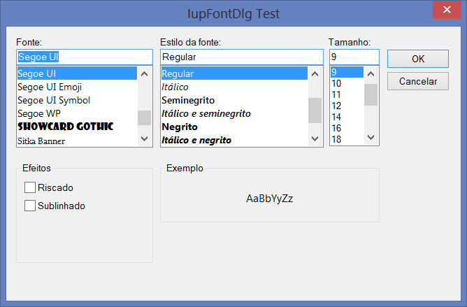
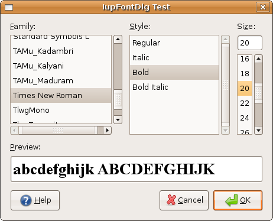
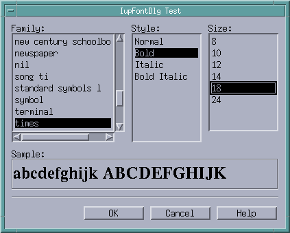

## IupFontDlg

Creates the Font Dialog element. It is a predefined dialog for selecting a font.
The dialog can be shown with the **IupPopup** function only.

### Creation

    Ihandle* IupFontDlg(void);

**Returns:** the identifier of the created element, or NULL if an error occurs.

### Attributes

**PREVIEWTEXT** [GTK and Motif only]: the text shown in the preview area.
If not defined, the system will provide a default text.

**COLOR** [Windows Only]: The initial color value and the returned selected value if the user pressed the Ok button.
In Windows the Choose Font dialog allows the user to select a color from a pre-defined list of colors.
Since IUP 3.15 must set SHOWCOLOR=Yes to enable this option.

[PARENTDIALOG](../attrib/iup_parentdialog.md) (creation-only): Name of a dialog to be used as parent.
This dialog will always be in front of the parent dialog.

**STATUS** (read-only): defined to "1" if the user pressed the Ok button, "0" or NULL if pressed the Cancel button.

[TITLE](../attrib/iup_title.md): Dialog title.

**VALUE**: The initial font value and the selected value returned if the user pressed the Ok button.
Has the same format as the [FONT](../attrib/iup_font.md) attribute.

### Callbacks

[HELP_CB](../call/iup_help_cb.md): Action generated when the Help button is pressed.

### Notes

The **IupFontDlg** is a native pre-defined dialog not altered by **IupSetLanguage**.

To show the dialog, use function **IupPopup**.

The dialog is mapped only inside **IupPopup**, **IupMap** does nothing.

In Windows, the dialog will be modal relative only to its parent or to the active dialog.

In GTK uses gtk_font_selection_dialog (GTK 2) or gtk_font_chooser (GTK 3), in Windows uses ChooseFont, and in Motif uses a custom dialog implemented using IUP controls.

### Examples

    Ihandle* dlg = IupFontDlg();

    IupSetAttribute(dlg, "VALUE", "Times New Roman, Bold 20");
    IupSetAttribute(dlg, "TITLE", "IupFontDlg Test");
    IupSetCallback(dlg, "HELP_CB", (Icallback)help_cb);

    IupPopup(dlg, IUP_CURRENT, IUP_CURRENT);

    if (IupGetInt(dlg, "STATUS"))
    {
      printf("OK\n");
      printf("  VALUE(%s)\n", IupGetAttribute(dlg, "VALUE"));
      printf("  COLOR(%s)\n", IupGetAttribute(dlg, "COLOR"));
    }
    else
      printf("CANCEL\n");

    IupDestroy(dlg); 

**Windows XP**

**GTK/GNOME**

**Motif/MWM**

### See Also

[IupMessageDlg](iup_messagedlg.md), [IupFileDlg](iup_filedlg.md), [IupPopup](../func/iup_popup.md)
