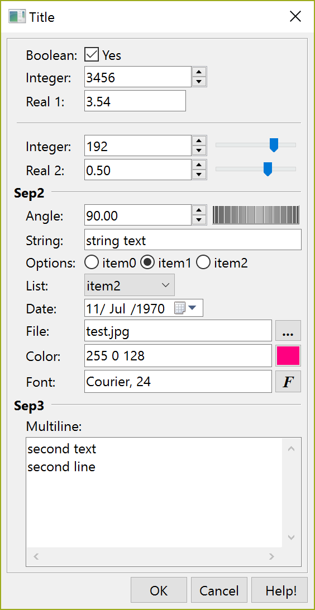

## IupGetParam

Shows a modal dialog for capturing parameter values using several types of controls.
The dialog uses the [IupParam](../elem/iup_param.md) and [IupParamBox](../elem/iup_parambox.md) controls internally.

### Creation and Show

    int IupGetParam(const char* title, Iparamcb action, void* user_data, const char* format,...);
    int IupGetParamV(const char* title, Iparamcb action, void* user_data, const char* format, va_list arglist);
    int IupGetParamv(const char* title, Iparamcb action, void* user_data, const char* format, int param_count, int param_extra, void** param_data);

title: dialog title.\
**action:** user callback to be called whenever a parameter value was changed, and when the user pressed the OK button.
It can be NULL. It is the same callback defined in [IupParamBox](../elem/iup_parambox.md).\
**user_data**: user pointer passed to the user callback.\
**format**: string describing all the parameters.
It is a sequence of format strings for each parameter, see [IupParam](../elem/iup_param.md).\
...: list of variables address with initial values for the parameters.
The number of lines in the format string (number of '\n') will determine the number of required parameters.
But separators will not count as parameters. There is no maximum number of parameters.\
**param_count**: number of regular parameters in the array.\
**param_extra**: number of extra parameters in the array (separator lines and button names).\
**param_data**: array of variables address with initial values for the parameters.

**Returns:** a **status** code 1 if button 1 was pressed, 0 if button 2 was pressed or if an error occurred.

The function will abort if there are errors in the format string as in the number of the expected parameters.

### Notes

The dialog is resizable if it contains a string, a multiline string or a number with a valuator.
All the multiline strings will increase size equally in both directions.

The dialog uses a global attribute called "**PARENTDIALOG**" as the parent dialog if it is defined.
It also uses a global attribute called "**ICON**" as the dialog icon if it is defined.

The function does not allocate memory space to store strings entered by the user.
Therefore, the string value parameter must be large enough to receive the user input.
If you want to set a maximum size for the string, you can set the param attribute **MAXSTR**, inside the callback when param_index=IUP_GETPARAM_INIT.

### Examples

[Browse for Example Files](../../examples/)

Here is an example showing many of the possible parameters.
We show only one for each type, but you can have as many parameters of the same type you want.

      int pboolean = 1;
      int pinteger = 3456;
      float preal = 3.543f;
      int pinteger2 = 192;
      float preal2 = 0.5f;
      float pangle = 90;
      char pstring[100] = "string text";
      char pfont[100] = "Courier, 24";
      char pcolor[100] = "255 0 128";
      int plist = 2, poptions = 1;
      char pstring2[200] = "second text\nsecond line";
      char file_name[500] = "test.jpg";
      
      if (!IupGetParam("Title", param_action, 0,
                       "Bt %u[, MyCancel, Help!]\n"
                       "Boolean: %b[No,Yes]\n"
                       "Integer: %i\n"
                       "Real 1: %r\n"
                       "Sep1 %t\n"
                       "Integer: %i[0,255]\n"
                       "Real 2: %r[-1.5,1.5,0.05]\n"
                       "Sep2 %t\n"
                       "Angle: %a[0,360]\n"
                       "String: %s\n"
                       "Options: %o|item0|item1|item2|\n" 
                       "List: %l|item0|item1|item2|item3|item4|item5|item6|\n" 
                       "File: %f[OPEN|*.bmp;*.jpg|CURRENT|NO|NO]\n"
                       "Color: %c{Color Tip}\n"
                       "Font: %n\n"
                       "Sep3 %t\n"
                       "Multiline: %m\n",
                       &pboolean, &pinteger, &preal, &pinteger2, &preal2, &pangle, pstring, 
                       &poptions, &plist, file_name, pcolor, pfont, pstring2, NULL))
        return;

### See Also

[IupColorDlg](iup_colordlg.md), [IupFontDlg](iup_fontdlg.md), [IupVal](../elem/iup_val.md), [IupDial](../elem/iup_dial.md), [IupList](../elem/iup_list.md), [IupFileDlg](iup_filedlg.md).
