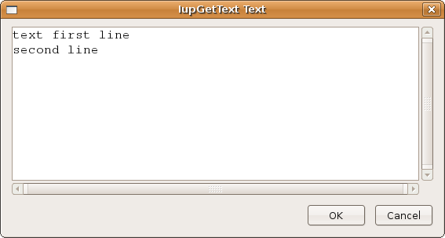

## IupGetText

Shows a modal dialog to edit a multiline text.

### Creation and Show

    int IupGetText(const char* title, char *text, int maxsize);

**title**: the dialog title.**\
text**: the initial value of the text and the returned text.\
**maxsize:** maximum size for the edited string.
If set to 0 will be the current length of a text, if set to -1 the dialog will be read-only and only the OK button is displayed.

**Returns:** a non-zero value if successful.

### Notes

The function does not allocate memory space to store the text entered by the user.
Therefore, the text parameter must be large enough to contain the user input.

The dialog uses a global attribute called "PARENTDIALOG" as the parent dialog if it is defined.
It also uses a global attribute called "ICON" as the dialog icon if it is defined.

### Examples

### See Also

[IupMessage](iup_message.md), [IupListDialog](iup_listdialog.md), [IupAlarm](iup_alarm.md), [IupSetLanguage](../func/iup_setlanguage.md).
