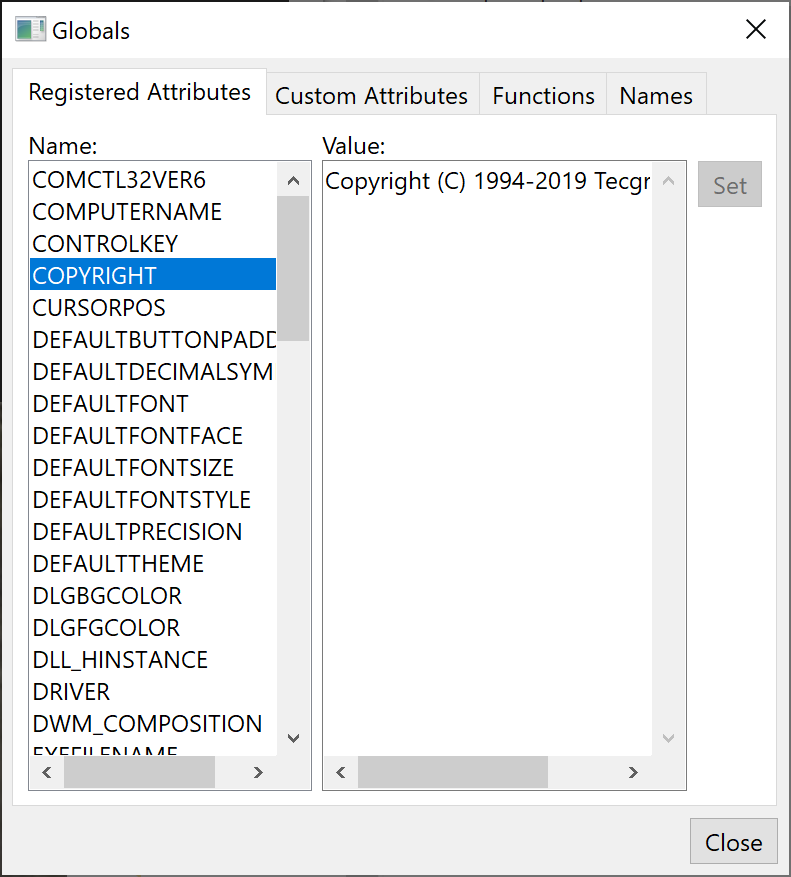

## IupGlobalsDialog

Creates a Globals Dialog. It is a predefined dialog to check and edit global attributes, functions (read-only) and names (read-only) in run time.
It is a standard **IupDialog** constructed with other IUP elements.
The dialog can be shown with any of the show functions **IupShow**, **IupShowXY** or **IupPopup**.

This is a dialog intended for developers, so they can see and inspect their globals in other ways.

It contains 4 Tab sections: one for the registered global attributes, one for custom global attributes set by the application, one for the global functions and one for the global names.
The function and names are just for inspection, and custom attributes should be handled carefully because they may be not strings.

### Creation

    Ihandle* IupGlobalsDialog(void);

**Returns:** the identifier of the created dialog, or NULL if an error occurs.

### Attributes

Check the [IupDialog](iup_dialog.md) attributes.

### Callbacks

Check the [IupDialog](iup_dialog.md) callbacks.

### Examples

    IupShow(IupGlobalsDialog());  

The dialog is displayed next.

### See Also

[IupDialog](iup_dialog.md), [IupShow](../func/iup_show.md), [IupShowXY](../func/iup_showxy.md), [IupPopup](../func/iup_popup.md)
