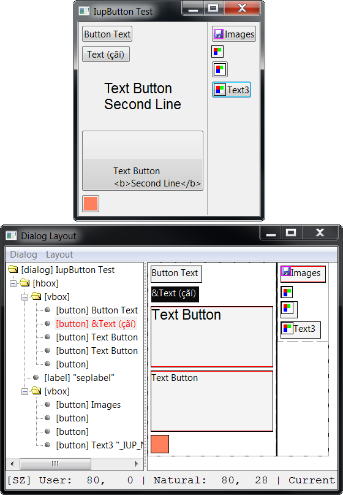

## IupLayoutDialog

Creates a Layout Dialog. It is a predefined dialog to visually edit the layout of another dialog in run time.
It is a standard **IupDialog** constructed with other IUP elements.
The dialog can be shown with any of the show functions **IupShow**, **IupShowXY** or **IupPopup**.

Any existent dialog can be selected. It does not need to be mapped on the native system nor visible.

The layout dialog is composed of two areas: one showing the given dialog children hierarchy tree, and one displaying its layout.

This is a dialog intended for developers, so they can see and inspect their dialogs in other ways.

### Creation

    Ihandle* IupLayoutDialog(Ihandle* dialog);

**dialog**: identifier of the dialog to display the layout. Can be NULL.

**Returns:** the identifier of the created element, or NULL if an error occurs.

### Attributes

**DESTROYWHENCLOSED**: The dialog will be automatically destroyed when closed. Default: Yes.

Check the [IupDialog](iup_dialog.md) attributes.

### Callbacks

Check the [IupDialog](iup_dialog.md) callbacks.

**ATTRIBCHANGED_CB**: Called when an attribute is changed in the Properties dialog.

    int function(Ihandle *ih, char* name);

> **ih**: identifier of the element that activated the event.\
> **name**: name of the attribute that changed.

**LAYOUTCHANGED_CB**: Called when the layout is changed.

    int function(Ihandle *ih, Ihandle *elem);

> **ih**: identifier of the element that activated the event.\
> **elem**: identifier of the element that changed the layout. Can be NULL.

### Notes

We added a global hot key to display the layout dialog loading the current dialog, just press Alt+Ctrl+Shift+L.
These keys are only enabled if the global attribute GLOBALLAYOUTDLGKEY is enabled:

     IupSetGlobal("GLOBALLAYOUTDLGKEY", "Yes");

#### Menu

    Dialog
        New  - creates a new empty dialog, it will be destroyed when the layout is destroyed.
        Load - loads an existent dialog from the application.
        Load Visible - lists only visible dialogs from the application to be loaded.
        Reload - reloads the current dialog into the Layout Dialog.
        Export - exports the current dialog to a text file in the specified language.
        Redraw - send a redraw to the current dialog (IupRedraw).
        Show - shows the current dialog (IupShow) 
        Hide - hides the current dialog (IupHide) 
        Globals - shows a dialog to inspect and edit global attributes, functions and names
        Close - hides the Layout Dialog, optionally self destroy according to DESTROYWHENCLOSED.
    Layout
        Show Tree - shows or hides the layout hierarchy tree at left.
        Refresh - recalculates the dialog (call IupRefresh).
        Update (Tree and Draw) - Rebuild the tree and redraw the layout.
        Auto Update Draw - periodically redraw the layout.
        Show Hidden - show hidden elements in the layout.
        Show Internal - show internal elements in the layout.
        Opacity - controls the Layout Dialog opacity so you can composite it on top of the selected dialog.
        Find Element - shows a dialog to search for elements in the layout.

Use **Reload** when the dialog has been changed and the layout was modified by the application.
Use **Update** when attributes of the dialog were changed by the application and the layout needs to be redrawn.

The **Export** items will export only the dialog and its children.
Associated elements such as menus and images will not be exported.
The selected file will be overwritten if existent.

The **Find** dialog can search for several kinds of strings, such as: Type (element type like "button", "label", etc.), Handle (handle name previously associated with IupSetHandle), Name (the NAME attribute), Title (the TITLE attribute), Attribute (a combination of attribute and value using the format "attribute=value".
All searches are not case-sensitive. F3 can be used to search for the next occurrence, but focus must be on the IupLayoutDialog not at the Find dialog (notice that Handle and Name are searched only once).

#### Hierarchy Tree

Each element inside the dialog is mapped to a node in the tree, and elements that are containers are branches in the tree.
The node title shows the element class name, its TITLE attribute when available and its name when available.
The selected node is synced with the selected element in the layout display in both ways.
Using the right click over a node shows a context menu.

You can drag and drop items in the tree. But there are some restrictions, according to each container possibility.
Some containers have internal children that are displayed but cannot be changed.

#### Layout Display

The layout of an element is drawn with its Current size using its FONT, TITLE, BGCOLOR and FGCOLOR if any.
But inheritance is not used intentionally to emphasize the element attributes.
Only the first line (limited to 50 characters in the tree) is used from the element TITLE.
Images are also used, but the position of text and images are not the same as in the native control.
This decoration is there simply to help locate the elements in the layout.

Containers that are not native elements are shown with dashed lines, other elements are shown with solid lines.
When a red line is displayed along with a border of an element, it means that element is maximizing its parent size, i.e., its **Current** size is equal to its **Natural** size and both are equal to the parent **Client** size.
Usually this is the element determining the natural size of the container at least in the direction marked with red.

You cannot drag and drop elements in the layout.
Using the right click over an element shows a context menu, the same as in a tree node.
When an element in the layout is double-clicked and the actual element is visible, then the actual element will blink twice.

#### Context Menu

    Properties - shows the properties dialog for the selected element.
    Handle Name - allow to change the name set for the element with IupSetHandle.
    Map - maps the selected element to the native system.
    Unmap - unmaps the selected element from the native system. Its attribute are saved before unmapping.
    Refresh Children - refresh the layout of the children of the element.
    -----------------
    Go To Parent - navigate to the parent of the element
    Blink - makes the element blink on the interface, valid only for native elements.
    Set Focus - changes the keyboard focus to the element.
    -----------------
    Copy - Prepare the selected element to be copied. Its attributes are also copied. The copy occurs only when pasted.
    Cut - Prepare the selected element to be cut (re-parent). The cut occurs only when pasted.
    Paste Insert Child - paste the copy or cut element as the first child of the selected container. 
    Paste Insert at Cursor - paste the copy or cut element at the cursor mark of the selected container.
    Paste Append Child - paste the copy or cut element as the last child of the selected container.
    Paste Insert Brother - paste the copy or cut element as brother of the selected element.
    -----------------
    New Insert Child - selects a class of control and creates a new element of that class, then insert it as the first child of the selected container. The new element is not mapped.
    New Insert at Cursor - selects a class of control and creates a new element of that class, then insert it at the cursor mark of the selected container. The new element is not mapped.
    New Append Child - selects a class of control and creates a new element of that class, then insert it as the last child of the selected container. The new element is not mapped.
    New Insert Brother - selects a class of control and creates a new element of that class, then insert it as brother of the selected element. The new element is not mapped.
    -----------------
    Remove - removes the selected element. 

#### Properties

The **Properties** dialog allows the inspection and change of the elements attributes.
It contains 3 Tab sections: one for the registered attributes of the element, one for custom attributes set at the hash table, and one for the callbacks.
The callbacks are just for inspection, and custom attribute should be handled carefully because they may be not strings.
Registered attributes values are shown in red when they were changed by the application.
It uses the [IupElementPropertiesDialog](iup_elementpropdialog.md).

The **Globals** dialog is very similar to the **Properties** dialog but used for global attributes ([IupSetGlobal](../func/iup_setglobal.md)/[IupGetGlobal](../func/iup_getglobal.md)), functions (set by [IupSetFunction](../func/iup_setfunction.md)) and names (set by [IupSetHandle](../func/iup_sethandle.md)).

#### Insert Cursor

The cursor mark in green is shown only inside a selected container that can receive more children.
In the **IupCbox** container the cursor is a point, on the other containers the cursor is a vertical or horizontal line accordingly.
Elements can be pasted, created a new one, or dropped in a cursor mark.

#### Drag & Drop of Elements

It was possible only to drag & drop controls in the tree.

But now it is possible to drag & drop in the layout too.
When the element is dragged, the selection is not changed, when there is a cursor mark in a container is where the drop will occur.
So before dragging an element first select the container you want to drop it, so the cursor mark can be displayed while dragging.
Also like in the tree, it is possible to drag a container with all its children.
But there will be no visual feedback of the drag, with the exception of a mouse cursor changed to a "move" symbol.

Inside an **IupCbox** container, the drag &drop is different.
First, when dragging immediate children of the IupCbox the change occurs simultaneously and can be visually seen in the layout and in the IupCbox itself if the dialog is visible.
When the IupCbox is not selected the move occurs only from one point to another inside the container, i.e., the hierarchy is not changed, just its position inside the container.
When the IupCbox is selected any element from the IupCbox hierarchy can be moved (re-parent) to be a direct child of the IupCbox.
When another container is selected, and there is a cursor mark the drop will be placed in that container.

#### Inspecting Native Controls

The **Spy++** tool distributed with Microsoft Visual Studio is very useful to inspect windows controls position, size and visibility.
It can be found in the Visual Studio "Tools" menu.

The **GTK Inspector** tool included in GTK is very useful to inspect GTK controls position, size, and visibility.
To enable the GTK Inspector, you can use the Control-Shift-I or Control-Shift-D keyboard shortcuts, or set the GTK_DEBUG=interactive environment variable.

### Examples

This will create an empty layout with a new dialog.

    IupShow(IupLayoutDialog(NULL));  

The following dialog layout is displayed next.

### See Also

[IupDialog](iup_dialog.md), [IupShow](../func/iup_show.md), [IupShowXY](../func/iup_showxy.md), [IupPopup](../func/iup_popup.md)
