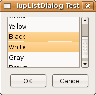

## IupListDialog

Shows a modal dialog to select items from a simple or multiple selection list.

### Creation and Show

    int IupListDialog(int type, const char *title, int size, const char** list, int op, int max_col, int max_lin, int* marks);

**type**: 1=simple selection; 2=multiple selection\
**title**: Text for the dialog’s title\
**size**: Number of options\
**list**: List of options. Must have **size** elements\
**op**: Initial selected item when type=1. starts at 1 (note that this index is different from the return value, kept for compatibility reasons)\
**max_col**: number of visible columns in the list\
**max_lin**: number of visible lines in the list\
**marks**: List of the items selection state, used only when type=2. Can be NULL when type=1.
When type=2 must have **size** elements

**Returns:** When type=1, the function returns the number of the selected option (starts at 0), or -1 if the user cancels the operation.\
             When type=2, the function returns -1 when the user cancels the operation. If the user does not cancel the operation the function returns 1 and the **marks** parameter will have value 1 for the options selected by the user and value 0 for non-selected options.

### Notes

The dialog uses a global attribute called "PARENTDIALOG" as the parent dialog if it is defined.
It also uses a global attribute called "ICON" as the dialog icon if it is defined.

### Examples

[Browse for Example Files](../../examples/)

### See Also

[IupMessage](iup_message.md), [IupGetFile](iup_getfile.md), [IupAlarm](iup_alarm.md)
