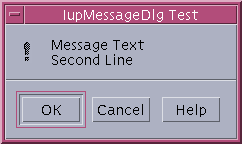

## IupMessageDlg

Creates the Message Dialog element. It is a predefined dialog for displaying a message.
The dialog can be shown with the IupPopup function only.

### Creation

    Ihandle* IupMessageDlg(void);

**Returns:** the identifier of the created element, or NULL if an error occurs.

### Attributes

**BUTTONDEFAULT**: Number of the default button.
Can be "1", "2" or "3". "2" is valid only for "RETRYCANCEL", "OKCANCEL" and "YESNO" button configurations. "3" is valid only for "YESNOCANCEL".
Default: "1".

**BUTTONRESPONSE**: Number of the pressed button. Can be "1", "2" or "3". Default: "1".

**BUTTONS**: Buttons configuration. Can have values: "OK", "OKCANCEL", "RETRYCANCEL", "YESNO", or "YESNOCANCEL".
Default: "OK". Additionally, the "Help" button is displayed if the HELP_CB callback is defined.

**BUTTONSTYLE** [Android, iOS]: visual style applied to all buttons. Same values as [IupButton](../elem/iup_button.md)'s BUTTONSTYLE ("FILLED", "TONAL", "OUTLINED", "ELEVATED", "TEXT"). When unset, the default action gets a filled look and the rest a gray look (matching the platform's native alert).

**CORNERSTYLE** [Android, iOS]: corner shape applied to all buttons. Same values as [IupButton](../elem/iup_button.md)'s CORNERSTYLE ("SMALL", "MEDIUM", "LARGE", "CAPSULE"). When unset, the platform's stock default is used (capsule on modern Material 3 / iOS 26 Liquid Glass).

**DIALOGTYPE**: Type of dialog defines which icon will be displayed beside the message text.
Can have values: "MESSAGE" (No Icon), "ERROR" (Stop-sign), "WARNING" (Exclamation-point), "QUESTION" (Question-mark) or "INFORMATION" (Letter "i").
Default: "MESSAGE".
The icon is not displayed in GTK 4.

[PARENTDIALOG](../attrib/iup_parentdialog.md) (creation-only): Name of a dialog to be used as parent.
This dialog will always be in front of the parent dialog.
If not defined in Motif the dialog could not be modal.

[TITLE](../attrib/iup_title.md): Dialog title.

**VALUE**: Message text.

### Callbacks

[HELP_CB](../call/iup_help_cb.md): Action generated when the Help button is pressed.
Not supported in WinUI, GTK 4, FLTK and Haiku.

### Notes

The **IupMessageDlg** is a native pre-defined dialog not altered by **IupSetLanguage**.

To show the dialog, use function **IupPopup**.

The dialog is mapped only inside **IupPopup**, **IupMap** does nothing.

The **IupMessage** function simply creates and popups a **IupMessageDlg**.

In Win32, each different DIALOGTYPE plays a different system beep, and PARENTDIALOG makes the dialog modal relative only to its parent.

The underlying native widget per driver:

- **Win32**: MessageBoxIndirect.
- **WinUI**: ContentDialog hosted on the parent dialog's XamlRoot.
- **GTK 3**: gtk_message_dialog (gtk_dialog_run).
- **GTK 4**: GtkAlertDialog (4.10+).
- **Motif**: XmCreateMessageDialog / XmCreateMessageBox.
- **Cocoa**: NSAlert.
- **CocoaTouch**: custom UIView.
- **Qt**: QMessageBox.
- **FLTK**: fl_message / fl_choice_n.
- **EFL**: custom dialog window (efl_ui_win).
- **Android**: MaterialAlertDialogBuilder.
- **Haiku**: BAlert.

The (x,y) position from IupPopup is ignored by the native widget on all drivers except Qt, which honors it only when there is no parent.

### Examples

    Ihandle* dlg = IupMessageDlg();

    IupSetAttribute(dlg, "DIALOGTYPE", "WARNING");
    IupSetAttribute(dlg, "TITLE", "IupMessageDlg Test");
    IupSetAttribute(dlg, "BUTTONS", "OKCANCEL");
    IupSetAttribute(dlg, "VALUE", "Message Text\nSecond Line");
    IupSetCallback(dlg, "HELP_CB", (Icallback)help_cb);

    IupPopup(dlg, IUP_CURRENT, IUP_CURRENT);

    printf("BUTTONRESPONSE(%s)\n", IupGetAttribute(dlg, "BUTTONRESPONSE"));

    IupDestroy(dlg);  

**Windows XP**

**Motif/Mwm**

**GTK/GNOME**

### See Also

[IupMessage](iup_message.md), [IupListDialog](iup_listdialog.md), [IupAlarm](iup_alarm.md), [IupGetFile](iup_getfile.md), [IupPopup](../func/iup_popup.md)
