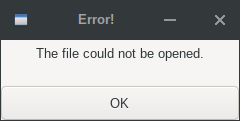
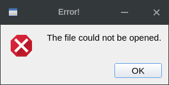
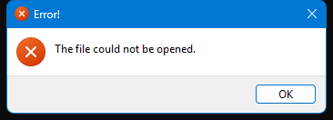
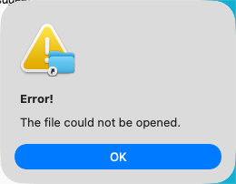

## IupMessageError

Shows a modal dialog containing an error message.
It simply creates and popup a **IupMessageDlg** with DIALOGTYPE=ERROR.

### Creation and Show

    void IupMessageError(Ihandle* parent, const char *message);

**parent**: parent dialog, can be NULL.\
**message**: text message contents. It can be a language pre-defined string without the "_@" prefix.

### Notes

If the parent is NULL, the title defaults to "Error!" and tries the global attribute "PARENTDIALOG" as the parent dialog.

The dialog title will be the same title of the parent dialog.

The dialog is shown centered relative to its parent.

### Examples

[Browse for Example Files](../../examples/)

|                                         |                                       |                                        |                                        |
|-----------------------------------------|---------------------------------------|----------------------------------------|----------------------------------------|
| GTK                                     | Qt                                    | Win32                                  | macOS                                  |
|  |  |  |  |

### See Also

[IupGetFile](iup_getfile.md), [IupListDialog](iup_listdialog.md), [IupAlarm](iup_alarm.md), [IupMessage](iup_message.md), [IupMessageDlg](iup_messagedlg.md)
