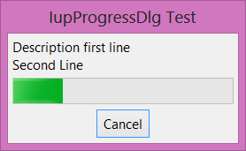

## IupProgressDlg

Creates a progress dialog element. It is a predefined dialog for displaying the progress of an operation.
The dialog is meant to be shown with the show functions **IupShow** or **IupShowXY**.

### Creation

    Ihandle* IupProgressDlg(void);

**Returns:** the identifier of the created element, or NULL if an error occurs.

### Attributes

Supports all the [IupDialog](iup_dialog.md) attributes. But some attributes where changed to configure the dialog.
We recommend changing only the following attributes:

[ICON](../attrib/iup_icon.md): Dialog’s icon.

[TITLE](../attrib/iup_title.md) (non-inheritable): Dialog’s title. Default: NULL.
If not set the title bar will not be displayed and the dialog will occupy less space on screen.

[VISIBLE](../attrib/iup_visible.md): Simply call **IupShow** or **IupHide** for the dialog.

[PARENTDIALOG](../attrib/iup_parentdialog.md) (creation-only): Name of a dialog to be used as parent.
This dialog will always be in front of the parent dialog.

[TITLE](../attrib/iup_title.md): Dialog title.

Other attributes were set to values different from the default value (but can still be changed):

**RESIZE**=NO, **MAXBOX**=NO, **MINBOX**=NO, **MENUBOX**=NO

------------------------------------------------------------------------

New attributes. All non-inheritable.

**COUNT**: current count of iterations.

**INC** (write-only): increment the current count by the given amount.
If set to NULL will increment +1.

**PERCENT**: current percentage of iterations.

**TOTALCOUNT**: total number of iterations.

**STATE**: describe the state of the iteration. Can be: IDLE, PROCESSING, UNDEFINED or ABORTED.
Default is IDLE. When INC, COUNT or PERCENT are set the state is changed to PROCESSING.
If the user pressed the Cancel button, the state is changed to ABORTED, but check the CANCEL_CB callback for other options.
If the state is set to UNDEFINED by the application the progress bar will display an undefined state animation (same as setting MARQUEE=Yes in [IupProgressBar](../elem/iup_progressbar.md)), to resume processing set the state attribute to PROCESSING.

**DESCRIPTION**: text description to be shown in the dialog.

**PROGRESSHEIGHT**: height in pixels of the progress bar. Default: 30

**MINCLOCK**: minimum time between counts to an actual screen update in milliseconds.
So if each count increment is too fast this avoids updating the screen too often.
Must at least have passed the minimum time for a screen update. Default: 250

**MINPERCENT**: minimum percent between counts to an actual screen update, when the minimum clock has not reached yet.
So if each count increment is too fast, but the application would like to update the screen anyway after the percentage of the total progress has passed this minimum value.
So at least some screen updates will occur. Default: 10

### Callbacks

Supports all the [IupDialog](iup_dialog.md) callbacks.

------------------------------------------------------------------------

New callbacks.

**CANCEL_CB**: Action generated when the user clicked on the Cancel button.

    int function(Ihandle* ih);

**ih**: identifier of the element that activated the event.

**Returns**: if different from IUP_CONTINUE then STATE will be changed to ABORTED, same behavior as if the callback does not exist.
The returned value will also be returned in the "Cancel" button callback.

### Notes

The **IupProgressDlg** will display the iteration state using a [IupProgressBar](../elem/iup_progressbar.md) control.

The dialog is **not** automatically closed, the application must do that manually inside the CANCEL_CB callback or inside your processing loop by checking the STATE attribute.

### Examples

    static int cancel_cb(Ihandle* ih)
    {
      int ret = IupAlarm("Warning!", "Interrupt Processing?", "Yes", "No", NULL);
      if (ret == 1) /* Yes Interrupt */
      {
        IupExitLoop();
        return IUP_DEFAULT;
      }
      
      return IUP_CONTINUE;
    }

    ...
    Ihandle* dlg = IupProgressDlg();
      
    IupSetAttribute(dlg, "TITLE", "IupProgressDlg Test");
    IupSetAttribute(dlg, "DESCRIPTION", "Description first line\nSecond Line"); // Actually can have any number of lines.
    IupSetCallback(dlg, "CANCEL_CB", cancel_cb);
    IupSetAttribute(dlg, "TOTALCOUNT", "300");
      
    IupShowXY(dlg, IUP_CENTER, IUP_CENTER);
    ...

    // Called from inside the application processing loop
    static int update_progress(Ihandle* ih)
    {
      IupSetAttribute(ih, "INC", NULL);
      
      // This is just an example, the application can control the loop in other ways
      if (IupGetInt(ih, "COUNT")==IupGetInt(ih, "TOTALCOUNT"))
      {
        IupHide(ih);
        return 0;
      }
        
      return 1;
    }

### See Also

[IupProgressBar](../elem/iup_progressbar.md), [IupDialog](iup_dialog.md)
