## IupButton

Creates an interface element that is a button. When selected, this element activates a function in the application.
Its visual presentation can contain a text and/or an image.

### Creation

    Ihandle* IupButton(const char *title, const char *action);

**title**: Text to be shown to the user. It can be NULL. It will set the TITLE attribute.\
**action**: Name of the action generated when the button is selected. It can be NULL.

**Returns:** the identifier of the created element, or NULL if an error occurs.

### Attributes

**ALIGNMENT** (non-inheritable): horizontal and vertical alignment.
Possible values: "ALEFT", "ACENTER" and "ARIGHT",  combined to "ATOP", "ACENTER" and "ABOTTOM".
Default: "ACENTER:ACENTER". Partial values are also accepted, like "ARIGHT" or ":ATOP", the other value will be obtained from the default value.
In Motif, vertical alignment is restricted to "ACENTER".
In GTK, horizontal alignment for multiple lines will align only the text block.

[BGCOLOR](../attrib/iup_bgcolor.md): Background color.
If text and image are not defined, the button is configured to simply show a color, in this case set the button size because the natural size will be very small.
In Windows and in GTK 3, the BGCOLOR attribute is ignored if text or image is defined.
Default: the global attribute DLGBGCOLOR.
BGCOLOR is ignored when FLAT=YES because it will be used the background from the native parent.

**CANFOCUS** (creation-only) (non-inheritable): enables the focus traversal of the control.
In Windows the button will respect CANFOCUS differently to some other controls.
Default: YES.

**PROPAGATEFOCUS**(non-inheritable): enables the focus callback forwarding to the next native parent with FOCUS_CB defined.
Default: NO.

**FLAT** (creation-only): Hides the button borders until the mouse cursor enters the button area.
The border space is always there. Can be YES or NO. Default: NO.

[FGCOLOR](../attrib/iup_fgcolor.md): Text color. Default: the global attribute DLGFGCOLOR.

**IMAGE** (non-inheritable): Image name. If set before map defines the behavior of the button to contain an image.
The natural size will be size of the image in pixels, plus the button borders.
Use [IupSetHandle](../func/iup_sethandle.md) or [IupSetAttributeHandle](../func/iup_setattributehandle.md) to associate an image to a name.
See also [IupImage](iup_image.md). If TITLE is also defined and not empty both will be shown.

**IMINACTIVE** (non-inheritable): Image name of the element when inactive.
If it is not defined then the IMAGE is used and the colors will be replaced by a modified version of the background color creating the disabled effect.
GTK will also change the inactive image to look like other inactive objects.

**IMPRESS** (non-inheritable): Image name of the pressed button.
If IMPRESS and IMAGE are defined, the button borders are not shown and not computed in natural size.
When the button is clicked the pressed image does not offset.
In Motif the button will lose its focus feedback also.

**IMPRESSBORDER** (non-inheritable): if enabled, the button borders will be shown and computed even if IMPRESS is defined.
Can be "YES" or "NO". Default: "NO".

**IMAGEPOSITION** (non-inheritable): Position of the image relative to the text when both are displayed.
Can be: LEFT, RIGHT, TOP, BOTTOM. Default: LEFT.
Not supported in Motif and EFL.

**MARKUP**: allows the title string to contain markup commands.
Supports a Pango-like subset: `<b>`, `<i>`, `<u>`, `<s>`, ``, ``, `<big>`, `<small>`, and `` with `foreground`, `background`, `font_family`, `font_size`, `font_weight`, `font_style` attributes. GTK uses Pango markup natively; other drivers convert to their native format.
Works only if a mnemonic is NOT defined in the title. Can be "YES" or "NO". Default: "NO".
Not supported in Win32, FLTK and Motif (markup tags are stripped and plain text is displayed).

**PADDING**: internal margin. Works just like the MARGIN attribute of the **IupHbox** and **IupVbox** containers, but uses a different name to avoid inheritance problems.
Default value: "0x0". Value can be DEFAULTBUTTONPADDING, so the global attribute of this name will be used instead.

**CPADDING**: same as PADDING but using the units of the **SIZE** attribute.
It will actually set the PADDING attribute.

**SPACING** (creation-only): defines the spacing between the image associated and the button's text.
Default: "2".

**CSPACING**: same as SPACING but using the units of the vertical part of the **SIZE** attribute.
It will actually set the SPACING attribute.

[TITLE](../attrib/iup_title.md) (non-inheritable): Button's text.
If IMAGE is not defined before map, then the default behavior is to contain only a text.
The button behavior cannot be changed after map.
The natural size will be larger enough to include all the text in the selected font, even using multiple lines, plus the button borders.
The '\n' character is accepted for line change.
The "&" character can be used to define a mnemonic, the next character will be used as key.
Use "&&" to show the "&" character instead on defining a mnemonic.
The button can be activated from any control in the dialog using the "Alt+key" combination.

> 
>
> ------------------------------------------------------------------------

[ACTIVE](../attrib/iup_active.md), [FONT](../attrib/iup_font.md), [EXPAND](../attrib/iup_expand.md), [SCREENPOSITION](../attrib/iup_screenposition.md), [POSITION](../attrib/iup_position.md), [MINSIZE](../attrib/iup_minsize.md), [MAXSIZE](../attrib/iup_maxsize.md), [WID](../attrib/iup_wid.md), [TIP](../attrib/iup_tip.md), [SIZE](../attrib/iup_size.md), [RASTERSIZE](../attrib/iup_rastersize.md), [ZORDER](../attrib/iup_zorder.md), [VISIBLE](../attrib/iup_visible.md), [THEME](../attrib/iup_theme.md): also accepted.

### Callbacks

[ACTION](../call/iup_action.md): Action generated when the button 1 (usually left) is selected.
This callback is called only after the mouse is released and when it is released inside the button area.

    int function(Ihandle* ih);

**ih**: identifier of the element that activated the event.

**Returns**: IUP_CLOSE will be processed.

[BUTTON_CB](../call/iup_button_cb.md): Action generated when any mouse button is pressed and when it is released.
Both calls occur before the ACTION callback when button 1 is being used.

------------------------------------------------------------------------

[MAP_CB](../call/iup_map_cb.md), [UNMAP_CB](../call/iup_unmap_cb.md), [DESTROY_CB](../call/iup_destroy_cb.md), [GETFOCUS_CB](../call/iup_getfocus_cb.md), [KILLFOCUS_CB](../call/iup_killfocus_cb.md), [ENTERWINDOW_CB](../call/iup_enterwindow_cb.md), [LEAVEWINDOW_CB](../call/iup_leavewindow_cb.md), [K_ANY](../call/iup_k_any.md), [HELP_CB](../call/iup_help_cb.md): All common callbacks are supported.

### Notes

Buttons with images and/or texts cannot change its behavior after mapped. This is a creation dependency.
But after creation, the image can be changed for another image, and the text for another text.

Buttons are activated using Enter or Space keys.

Buttons are not activated if the user clicks inside the button but moves the cursor and releases outside the button area.
Also in Windows, the highlight feedback when that happens is different if the button has CANFOCUS enabled or not.

Buttons always have borders, except when IMAGE and IMPRESS are both defined and IMPRESSBORDER=NO.
In this case in Windows TITLE can also be defined.

Usually toolbar buttons have FLAT=Yes and CANFOCUS=NO.

In GTK uses GtkButton, in Windows uses WC_BUTTON, in WinUI uses XAML Button, in macOS uses NSButton, in Qt uses QPushButton, in FLTK uses Fl_Button, in EFL uses Elm_Button, and in Motif uses xmPushButton.

### Examples

[Browse for Example Files](../../examples/)

The buttons with image and text simultaneous have PADDING=5x5, the other buttons have no padding.
The buttons with no text and BGCOLOR defined have their RASTERSIZE set.

|                                         |                                           |                                           |                                         |
|-----------------------------------------|-------------------------------------------|-------------------------------------------|-----------------------------------------|
| Motif                                   | Windows Classic                           | Windows w/ Styles                         | GTK                                     |
|  | 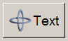 | 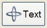 | 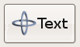 |
| 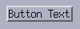      | 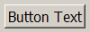      | 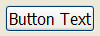      | 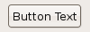      |
| 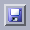     | 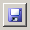     | 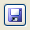     | 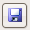     |
|    |    |    |    |

### See Also

[IupImage](iup_image.md), [IupToggle](iup_toggle.md), [IupLabel](iup_label.md), [IupFlatButton](../ctrl/iup_flatbutton.md)
