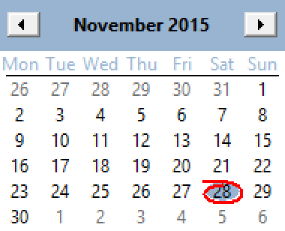
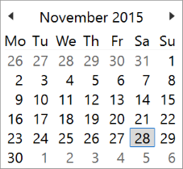
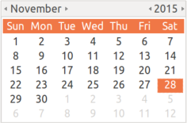

## IupCalendar

Creates a month calendar interface element, where the user can select a date.

GTK and Windows only. NOT available in Motif.

### Creation

    Ihandle* IupCalendar(void);

**Returns:** the identifier of the created element, or NULL if an error occurs.

### Attributes

**TODAY** (read-only): Returns the date corresponding to today in VALUE format.

**VALUE**: the current date always in the format "year/month/day" ("%d/%d/%d" in C).
Can be set to "TODAY". Default value is the today date.

**WEEKNUMBERS**: Shows the number of the week along the year. Default: NO.

### Callbacks

**VALUECHANGED_CB**: Called after the value was interactively changed by the user.

    int function(Ihandle *ih);

**ih**: identifier of the element that activated the event.

> 
>
> ------------------------------------------------------------------------

[MAP_CB](../call/iup_map_cb.md), [UNMAP_CB](../call/iup_unmap_cb.md), [DESTROY_CB](../call/iup_destroy_cb.md), [GETFOCUS_CB](../call/iup_getfocus_cb.md), [KILLFOCUS_CB](../call/iup_killfocus_cb.md), [ENTERWINDOW_CB](../call/iup_enterwindow_cb.md), [LEAVEWINDOW_CB](../call/iup_leavewindow_cb.md), [K_ANY](../call/iup_k_any.md), [HELP_CB](../call/iup_help_cb.md): All common callbacks are supported.

### Notes

In Windows, the view is changed when the month of year is clicked, so the user can select the month of the year or a year among years.

In GTK the today date is not marked in the calendar.

In GTK uses GtkCalendar, and in Windows uses MONTHCAL_CLASS.

### Examples

**Windows Classic**

**Windows w/ Styles**

**GTK**

[Browse for Example Files](../../examples/)

### See Also

[IupDatePick](iup_datepick.md).
