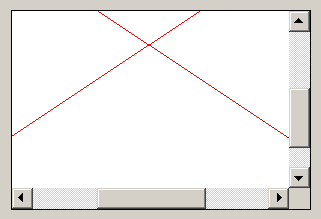
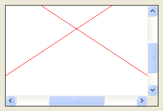
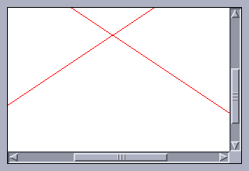
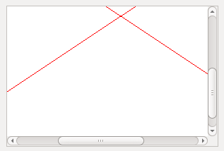

## IupCanvas

Creates an interface element that is a canvas - a drawing area for your application.

### Creation

    Ihandle* IupCanvas(const char *action);

**action**: Name of the action generated when the canvas needs to be redrawn. It can be NULL.

**Returns:** the identifier of the created element, or NULL if an error occurs.

### Attributes

**BACKINGSTORE** [Motif Only]: Controls the canvas backing store flag. The default value is "YES".

[BGCOLOR](../attrib/iup_bgcolor.md): Background color.
The background is painted only if the ACTION callback is not defined.
If the callback is defined the application must draw all the canvas contents.
In GTK or Motif if you set the ACTION callback after map then you should also set BGCOLOR to any value just after setting the callback or the first redraw will be lost.
Default: "255 255 255".

**BORDER** (creation-only): Shows a border around the canvas. Default: "YES".

**CANFOCUS** (creation-only) (non-inheritable): enables the focus traversal of the control.
In Windows the canvas will respect CANFOCUS differently to some other controls.
Default: YES.

**PROPAGATEFOCUS**(non-inheritable): enables the focus callback forwarding to the next native parent with FOCUS_CB defined.
Default: NO.

**CAIRO_CR** [GTK Only] (non-inheritable): Contains the "cairo_t*" parameter of the internal GTK callback.
Valid only during the ACTION callback and only when using GTK version 3.

**CLIPRECT** (only during ACTION): Specifies a rectangle that has its region invalidated for painting, it could be used for clipping.
Format: "%d %d %d %d"="x1 y1 x2 y2".
Supported in Windows, GTK, GTK 4, Qt and macOS.

[CURSOR](../attrib/iup_cursor.md) (non-inheritable): Defines a cursor for the canvas.
The Windows SDK recommends that cursors and icons should be implemented as resources rather than created at run time.

**DROPFILESTARGET** (non-inheritable): Enable or disable the drop of files.
Default: NO, but if DROPFILES_CB is defined when the element is mapped then it will be automatically enabled.

**DRAWSIZE** (non-inheritable): The size of the drawing area in pixels.
This size is also used in the RESIZE_CB callback.

Notice that the drawing area size is not the same as RASTERSIZE.
The SCROLLBAR and BORDER attributes affect the size of the drawing area.

**DRAWDRIVER** (read-only): returns the name of the draw driver in use by the IupDraw API.
Can be: D2D, GDI+ (Windows), CAIRO (GTK), COCOA (macOS), QT, EFL_VG (EFL), or X11 (Motif).

**DRAWIMAGE** (read-only): returns the offscreen drawing buffer as an [IupImage](iup_image.md) handle name.
Must be used between IupDrawBegin and IupDrawEnd.
The image is cached and automatically destroyed on the next query.

[EXPAND](../attrib/iup_expand.md) (non-inheritable): The default value is "YES".
The natural size is the size of 1 character.

**HDC_WMPAINT** [Windows Only] (non-inheritable): Contains the HDC created with the BeginPaint inside the WM_PAINT message.
Valid only during the ACTION callback.

**HWND** [Windows Only] (non-inheritable, read-only): Returns the Windows Window handle.
Available in Windows, or in the GTK/GTK 4/Qt drivers on Windows.

[SCROLLBAR](../attrib/iup_scrollbar.md) (creation-only): Associates a horizontal and/or vertical scrollbar to the canvas.
Default: "NO". The secondary attributes are all non-inheritable.

[DX](../attrib/iup_dx.md): Size of the thumb in the horizontal scrollbar. Also, the horizontal page size.
Default: "0.1".\
[DY](../attrib/iup_dy.md): Size of the thumb in the vertical scrollbar. Also, the vertical page size.
Default: "0.1".\
[POSX](../attrib/iup_posx.md): Position of the thumb in the horizontal scrollbar. Default: "0.0".\
[POSY](../attrib/iup_posy.md): Position of the thumb in the vertical scrollbar. Default: "0.0".\
[XMIN](../attrib/iup_xmin.md): Minimum value of the horizontal scrollbar. Default: "0.0".\
[XMAX](../attrib/iup_xmax.md): Maximum value of the horizontal scrollbar. Default: "1.0".\
[YMIN](../attrib/iup_ymin.md): Minimum value of the vertical scrollbar. Default: "0.0".\
[YMAX](../attrib/iup_ymax.md): Maximum value of the vertical scrollbar. Default: "1.0".\
**LINEX**: The amount the thumb moves when an horizontal step is performed.
Default: 1/10th of DX.\
**LINEY**: The amount the thumb moves when a vertical step is performed.
Default: 1/10th of DY.\
**XAUTOHIDE**: When enabled, if DX >= XMAX-XMIN then the horizontal scrollbar is hidden.
Default: "YES".\
**YAUTOHIDE**: When enabled, if DY >= YMAX-YMIN then the vertical scrollbar is hidden.
Default: "YES".\
**SCROLLVISIBLE** (read-only): Returns which scrollbars are visible at the moment.
Can be: YES (both), VERTICAL, HORIZONTAL, NO.
Supported in Windows, Qt and macOS.

**TOUCH** [Windows Only]: enable the touch processing if touch support is available.
In Qt, touch events are always enabled.

**GESTURE** [Windows Only]: disable the gesture support for touch interfaces.
Accepts only the NO value.

**WHEELDROPFOCUS** (non-inheritable): when the wheel is used the focus control receives a SHOWDROPDOWN=No.

**CGCONTEXT** [macOS Only] (non-inheritable, read-only): Returns the CoreGraphics context (CGContextRef).

**NSVIEW** [macOS Only] (non-inheritable, read-only): Returns the NSView handle.

**DRAWABLE** [Unix/macOS Only] (non-inheritable, read-only): Returns an offscreen drawing surface handle.
Available in GTK, Cocoa, Qt and EFL.

**XDISPLAY** [Unix Only] (non-inheritable, read-only): Returns the X-Windows Display.
Available in Motif and GTK on X11.

**XWINDOW** [Unix Only] (non-inheritable, read-only): Returns the X-Windows Window (Drawable).
Available in Motif, GTK, GTK 4, Qt and EFL on X11.

**XSCREEN** [Motif Only] (non-inheritable, read-only): Returns the X-Windows Screen.

**WL_SURFACE** [Unix Only] (non-inheritable, read-only): Returns the Wayland surface handle.
Available in GTK, GTK 4, Qt and EFL on Wayland.

> 
>
> ------------------------------------------------------------------------

[ACTIVE](../attrib/iup_active.md), [FONT](../attrib/iup_font.md), [SCREENPOSITION](../attrib/iup_screenposition.md), [POSITION](../attrib/iup_position.md), [MINSIZE](../attrib/iup_minsize.md), [MAXSIZE](../attrib/iup_maxsize.md), [WID](../attrib/iup_wid.md), [TIP](../attrib/iup_tip.md), [SIZE](../attrib/iup_size.md), [RASTERSIZE](../attrib/iup_rastersize.md), [ZORDER](../attrib/iup_zorder.md), [VISIBLE](../attrib/iup_visible.md), [THEME](../attrib/iup_theme.md): also accepted.

[Drag & Drop](../attrib/iup_dragdrop.md) attributes and callbacks are supported. 

### Callbacks

[ACTION](../call/iup_action.md): Action generated when the canvas needs to be redrawn.

    int function(Ihandle *ih, float posx, float posy);

**ih**: identifier of the element that activated the event.\
**posx**: thumb position in the horizontal scrollbar. The POSX attribute value.
Old parameter in float format, use POSX attribute to get the value in double format.\
**posy**: thumb position in the vertical scrollbar. The POSY attribute value.
Old parameter in float format, use POSX attribute to get the value in double format.

[BUTTON_CB](../call/iup_button_cb.md): Action generated when any mouse button is pressed or released.

[DROPFILES_CB](../call/iup_dropfiles_cb.md): Action generated when one or more files are dropped in the element.

**FOCUS_CB**: Called when the canvas gets or loses the focus.
It is called after the common callbacks GETFOCUS_CB and KILL_FOCUS_CB.

    int function(Ihandle *ih, int focus);

**ih**: identifier of the element that activated the event.\
**focus**: is non-zero if the canvas is getting the focus, is zero if it is losing the focus.

[MOTION_CB](../call/iup_motion_cb.md): Action generated when the mouse is moved.

[KEYPRESS_CB](../call/iup_keypress_cb.md): Action generated when a key is pressed or released.
It is called after the common callback K_ANY.

When the canvas has the focus, pressing the arrow keys may change the focus to another control in some systems.
If your callback process the arrow keys, we recommend you to return IUP_IGNORE so it will not lose its focus.

[RESIZE_CB](../call/iup_resize_cb.md): Action generated when the canvas size is changed.

[SCROLL_CB](../call/iup_scroll_cb.md): Called when the scrollbar is manipulated.

**TOUCH_CB** [Windows and Qt Only]: Action generated when a touch event occurred.
Multiple touch events will trigger several calls.
In Windows must set TOUCH=Yes to receive this event. In Qt, touch events are always enabled.

    int function(Ihandle* ih, int id, int x, int y, char* state);

**ih**: identifies the element that activated the event.\
**id**: identifies the touchpoint. **\
x**, **y**: position in pixels, relative to the top-left corner of the canvas.\
**state**: the touchpoint state. Can be: DOWN, MOVE or UP.
If the point is a "primary" point, then "-PRIMARY" is appended to the string.

**Returns**: IUP_CLOSE will be processed.

**MULTITOUCH_CB** [Windows Only]: Action generated when multiple touch events occurred.
Must set TOUCH=Yes to receive this event.

    int function(Ihandle *ih, int count, int* pid, int* px, int* py, int* pstate)

**ih**: identifier of the element that activated the event.\
**count**: Number of touch points in the array.\
**pid**: Array of touch point ids.\
**px**: Array of touch point x coordinates in pixels, relative to the top-left corner of the canvas.\
**py**: Array of touch point y coordinates in pixels, relative to the top-left corner of the canvas.\
**pstate**: Array of touch point states. Can be 'D' (DOWN), 'U' (UP) or 'M' (MOVE).\

**Returns**: IUP_CLOSE will be processed.

[WHEEL_CB](../call/iup_wheel_cb.md): Action generated when the mouse wheel is rotated.

> 
>
> ------------------------------------------------------------------------

[MAP_CB](../call/iup_map_cb.md), [UNMAP_CB](../call/iup_unmap_cb.md), [DESTROY_CB](../call/iup_destroy_cb.md), [GETFOCUS_CB](../call/iup_getfocus_cb.md), [KILLFOCUS_CB](../call/iup_killfocus_cb.md), [ENTERWINDOW_CB](../call/iup_enterwindow_cb.md), [LEAVEWINDOW_CB](../call/iup_leavewindow_cb.md), [K_ANY](../call/iup_k_any.md), [HELP_CB](../call/iup_help_cb.md): All common callbacks are supported.

[Drag & Drop](../attrib/iup_dragdrop.md) attributes and callbacks are supported.

### Notes

Note that some keys might remove the focus from the canvas.
To avoid this, return IGNORE in the [K_ANY](../call/iup_k_any.md) callback.

The mouse cursor position can be programmatically controlled using the global attribute [CURSORPOS](../attrib/iup_globals.md).

When the canvas is displayed for the first time, the callback call order is always:

    MAP_CB()
    RESIZE_CB()
    ACTION()

When the canvas is resized, the ACTION callback is always called after the RESIZE_CB callback.

The [IupDraw](../func/iup_draw.md) API can be used to draw in the canvas.
But the ACTION callback function cannot be called manually from inside the application, it must be invoked by the system, so if you need to redraw then call [IupRedraw](../func/iup_redraw.md) or [IupUpdate](../func/iup_update.md).

In GTK uses GtkFixed (with custom iupGtk4Fixed in GTK 4), in Windows uses a custom window class called "IupCanvas", in WinUI uses XAML Canvas, in macOS uses a custom NSView, in Qt uses a custom QWidget, in EFL uses Evas_Object, and in Motif uses xmDrawingArea.

### Examples

[Browse for Example Files](../../examples/)

**Windows Classic**

**Windows w/ Styles**

**Motif**

**GTK**

### See Also

[IupGLCanvas](../ctrl/iup_glcanvas.md), [IupBackgroundBox](iup_backgroundbox.md), [IupDraw](../func/iup_draw.md)
