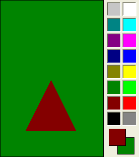

## IupColorbar

Creates a color palette to enable a color selection from several samples. It can select one or two colors.
The primary color is selected with the left mouse button, and the secondary color is selected with the right mouse button.
You can double-click a cell to change its color, and you can double-click the preview area to switch between primary and secondary colors.

It inherits from [IupCanvas](../elem/iup_canvas.md).

Originally implemented by André Clinio.

### Creation

    Ihandle* IupColorbar(void);

**Returns:** the identifier of the created element, or NULL if an error occurs.

### Attributes

**CELL***n***:** Contains the color of the "n" cell. "n" can be from 0 to NUM_CELLS-1.

**NUM_CELLS** (non-inheritable)**:** Contains the number of color cells. Default: "16".
The maximum number of colors is 256. The default colors use the same set of **IupImage**.

**COUNT** (read-only) (non-inheritable)**:** same as **NUM_CELLS** but it is read-only.

**FLAT**: use a 1 pixel flat border instead of the default 3-pixel sunken border.
When enabled is the same as setting SHADOWED=NO. Can be Yes or No. Default: No.

**FLATCOLOR:** color of the border when FLAT=Yes and the preview area borders.
Default: "0 0 0".

**FOCUSSELECT**: when focus is changed, the primary selection is also changed.

**NUM_PARTS** (non-inheritable)**:** Contains the number of lines or columns. Default: "1".

**ORIENTATION:** Controls the orientation. It can be "VERTICAL" or "HORIZONTAL".
Default: "VERTICAL".

**PREVIEW_SIZE** (non-inheritable)**:** Fixes the size of the preview area in pixels.
The default size is dynamically calculated from the size of the control.
The size is reset to the default when SHOW_PREVIEW=NO.

**SHOW_PREVIEW:** Controls the display of the preview area. Default: "YES".

**SHOW_SECONDARY:** Controls the existence of a secondary color selection. Default: "NO".

[SIZE](../attrib/iup_size.md): there is no initial size. You must define SIZE or RASTERSIZE.

**PRIMARY_CELL** (non-inheritable)**:** Contains the index of the primary color.
Default "0" (black).

**SECONDARY_CELL** (non-inheritable)**:** Contains the index of the secondary color.
Default "15" (white).

**SQUARED**: Controls the aspect ratio of the color cells.
Non square cells expand equally to occupy all of the control area. Default: "YES".

**SHADOWED:** Controls the 3D effect of the color cells. When enabled is the same as setting FLAT=NO.
Default: "YES".

**TRANSPARENCY**: Contains a color that will be not rendered in the color palette.
The color cell will have a white and gray chess pattern.
It can be used to create a palette with fewer colors than the number of cells.

> 
>
> ------------------------------------------------------------------------

[ACTIVE](../attrib/iup_active.md), [BGCOLOR](../attrib/iup_bgcolor.md), [FONT](../attrib/iup_font.md), [SCREENPOSITION](../attrib/iup_screenposition.md), [POSITION](../attrib/iup_position.md), [MINSIZE](../attrib/iup_minsize.md), [MAXSIZE](../attrib/iup_maxsize.md), [WID](../attrib/iup_wid.md), [TIP](../attrib/iup_tip.md), [EXPAND](../attrib/iup_expand.md), [SIZE](../attrib/iup_size.md), [RASTERSIZE](../attrib/iup_rastersize.md), [ZORDER](../attrib/iup_zorder.md), [VISIBLE](../attrib/iup_visible.md), [THEME](../attrib/iup_theme.md): also accepted. 

### Callbacks

**CELL_CB**`:` called when the user double clicks a color cell to change its value.

    char* function(Ihandle* ih, int cell);

**ih**: identifier of the element that activated the event.\
**cell:** index of the selected cell. If the user double click a preview cell, the respective index is returned.

**Returns**: a new color or NULL to ignore the change. By default nothing is changed.

**EXTENDED_CB**`:` called when the user right click a cell with the Shift key pressed.
It is independent of the SHOW_SECONDARY attribute.

    int function(Ihandle* ih, int cell); 

**ih**: identifier of the element that activated the event.\
**cell:** index of the selected cell.

**Returns**: If IUP_IGNORE the cell is not redrawn. By default the cell is always redrawn.

**SELECT_CB**`:` called when a color is selected.
The primary color is selected with the left mouse button, and if existent the secondary is selected with the right mouse button.

    int function(Ihandle* ih, int cell, int type); 

**ih**: identifier of the element that activated the event.\
**cell**: index of the selected cell.\
**type**: indicates if the user selected a primary or secondary color.
In can be: `IUP_PRIMARY(-1)` or `IUP_SECONDARY(-2).`

**Returns**: If IUP_IGNORE the selection is not accepted.
By default, the selection is always accepted.

**SWITCH_CB**`:` called when the user double-clicks the preview area outside the preview cells to switch the primary and secondary selections.
It is only called if SHOW_SECONDARY=YES**.**

    int function(Ihandle* ih, int prim_cell, int sec_cell); 

**ih**: identifier of the element that activated the event.\
**prim_cell**: index of the actual primary cell.\
**sec_cell**: index of the actual secondary cell.

**Returns**: If IUP_IGNORE the switch is not accepted. By default the switch is always accepted.

> 
>
> ------------------------------------------------------------------------

[MAP_CB](../call/iup_map_cb.md), [UNMAP_CB](../call/iup_unmap_cb.md), [DESTROY_CB](../call/iup_destroy_cb.md), [GETFOCUS_CB](../call/iup_getfocus_cb.md), [KILLFOCUS_CB](../call/iup_killfocus_cb.md), [ENTERWINDOW_CB](../call/iup_enterwindow_cb.md), [LEAVEWINDOW_CB](../call/iup_leavewindow_cb.md), [K_ANY](../call/iup_k_any.md), [HELP_CB](../call/iup_help_cb.md): All common callbacks are supported.

### Notes

When the control has the focus the keyboard can be used to change the colors and activate the callbacks.
Use the arrow keys to move from cell to cell, **Home** goes to the first cell, **End** goes to the last cell.
**Space** will activate the **SELECT_CB** callback for the primary color, **Ctrl**+**Space** will activate the **SELECT_CB** callback for the secondary color.
**Shift**+**Space** will activate the **EXTENTED_CB** callback.
**Shift**+**Enter** will activate the **CELL_CB** callback.

### Examples

[Browse for Example Files](../../examples/)

Creates a Colorbar for selection of two colors.

### See Also

[IupCanvas](../elem/iup_canvas.md), [IupImage](../elem/iup_image.md)
