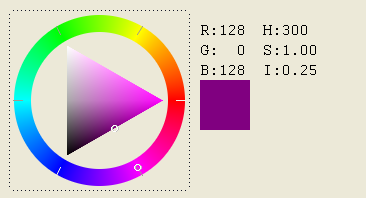

## IupColorBrowser

Creates an element for selecting a color. The selection is done using a cylindrical projection of the RGB cube.
The transformation defines a coordinate color system called HSI, that is still the RGB color space but using cylindrical coordinates.

**H** is for Hue, and it is the angle around the RGB cube diagonal starting at red (RGB=255 0 0).

**S** is for Saturation, and it is the normal distance from the color to the diagonal, normalized by its maximum value at the specified Hue.
This also defines a point at the diagonal used to define **I**.

**I** is for Intensity, and it is the distance from the point defined at the diagonal to black (RGB=0 0 0).
**I** can also be seen as the projection of the color vector onto the diagonal.
But **I** is not linear, see Notes below.

For a dialog that simply returns the selected color, you can use function [IupGetColor](../dlg/iup_getcolor.md) or [IupColorDlg](../dlg/iup_colordlg.md).

### Creation

    Ihandle* IupColorBrowser(void);

**Returns:** the identifier of the created element, or NULL if an error occurs.

### Attributes

[EXPAND](../attrib/iup_expand.md): The default is "NO".

[RASTERSIZE](../attrib/iup_rastersize.md) (non-inheritable): the initial size is "181x181".
Set to NULL to allow the automatic layout to use smaller values.

**RGB** (non-inheritable): the color selected in the control, in the "r g b"? format; r, g and b are integers ranging from 0 to 255.
Default: "255 0 0".

**HSI** (non-inheritable): the color selected in the control, in the "h s i"? format; h, s and i are floating point numbers ranging from 0-360, 0-1 and 0-1 respectively.

> 
>
> ------------------------------------------------------------------------

[ACTIVE](../attrib/iup_active.md), [BGCOLOR](../attrib/iup_bgcolor.md), [FONT](../attrib/iup_font.md), [POSITION](../attrib/iup_position.md), [MINSIZE](../attrib/iup_minsize.md), [MAXSIZE](../attrib/iup_maxsize.md), [WID](../attrib/iup_wid.md), [TIP](../attrib/iup_tip.md), [SIZE](../attrib/iup_size.md), [ZORDER](../attrib/iup_zorder.md), [VISIBLE](../attrib/iup_visible.md), [THEME](../attrib/iup_theme.md): also accepted. 

### Callbacks

**CHANGE_CB**: Called when the user releases the left mouse button over the control, defining the selected color.

    int change(Ihandle *ih, unsigned char r, unsigned char g, unsigned char b);

**ih**: identifier of the element that activated the event.\
**r, g, b**: color value.

**DRAG_CB**: Called several times while the color is being changed by dragging the mouse over the control.

    int drag(Ihandle *ih, unsigned char r, unsigned char g, unsigned char b);

**ih**: identifier of the element that activated the event.\
**r, g, b**: color value.

**VALUECHANGED_CB**: Called after the value was interactively changed by the user.
It is called whenever a **CHANGE_CB** or a **DRAG_CB** would also be called, it is just  called after them.

    int function(Ihandle *ih);

**ih**: identifier of the element that activated the event.

> 
>
> ------------------------------------------------------------------------

[MAP_CB](../call/iup_map_cb.md), [UNMAP_CB](../call/iup_unmap_cb.md), [DESTROY_CB](../call/iup_destroy_cb.md), [GETFOCUS_CB](../call/iup_getfocus_cb.md), [KILLFOCUS_CB](../call/iup_killfocus_cb.md), [ENTERWINDOW_CB](../call/iup_enterwindow_cb.md), [LEAVEWINDOW_CB](../call/iup_leavewindow_cb.md), [K_ANY](../call/iup_k_any.md), [HELP_CB](../call/iup_help_cb.md): All common callbacks are supported.

### Notes

When the control has the focus, the keyboard can be used to change the color value.
Use the arrow keys to move the cursor inside the SI triangle, and use Home(0), PageUp, PageDn and End(180) keys to move the cursor inside the Hue circle.

The Hue in the HSI coordinate system defines a plane that it is a triangle in the RGB cube.
But the maximum saturation in this triangle is different for each Hue because of the geometry of the cube.
In ColorBrowser this point is fixed at the center of the **I** axis.
So the **I** axis is not completely linear, it is linear in two parts, one from 0 to 0.5, and another from 0.5 to 1.0.
Although the selected values are linearly specified, you can notice that when Hue is changed, the gray scale also changes, visually compacting values above or below the I=0.5 line according to the selected Hue.

This is the same HSI specified in the [IM](http://www.tecgraf.puc-rio.br/im) toolkit, except for the non linearity of **I**.
This non linearity was introduced so a simple triangle could be used to represent the SI plane.

### Examples

[Browse for Example Files](../../examples/)

### See Also

[IupGetColor](../dlg/iup_getcolor.md), [IupColorDlg](../dlg/iup_colordlg.md).
