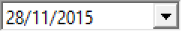
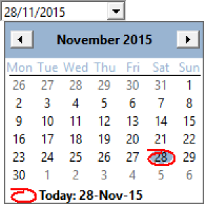
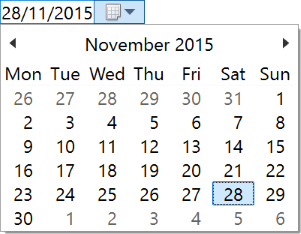
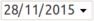
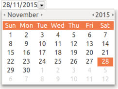

## IupDatePick

Creates a date editing interface element, which can displays a calendar for selecting a date.

In Windows is a native element. In GTK and Motif is a custom element.
In Motif is not capable of displaying the calendar.

### Creation

    Ihandle* IupDatePick();

**Returns:** the identifier of the created element, or NULL if an error occurs.

### Attributes

**CALENDARWEEKNUMBERS**: Shows the number of the week along the year in the calendar. Default: NO.

**FORMAT** [Windows Only]: Flexible format for the date in Windows.
For more information see ["About Date and Time Picker Control"](https://msdn.microsoft.com/EN-US/library/windows/desktop/bb761726(v=vs.85).aspx) in the Windows SDK.
The Windows control was configured to display date only without any time options.
Default: "d'/'M'/'yyyy". See Noted below.

**MONTHSHORTNAMES** [Windows Only]: Month display will use a short name instead of numbers.
Must be set before ORDER. Default: NO. Names will be in the language of the system.

**ORDER**: Day, month and year order. Can be any combination of "D", "M" and "Y" without repetition, and with all three letters.
It will set the FORMAT attribute in Windows. It will NOT affect the VALUE attribute order.
Default: "DMY".

**SEPARATOR**: Separator between day, month and year. Must be set before ORDER in Windows.
Default: "/".

**SHOWDROPDOWN** (write-only): opens or closes the dropdown calendar. Can be "YES" or "NO".
Ignored if set before map. In Windows, it works only for NO.

**TODAY** (read-only): Returns the date corresponding to today in VALUE format.

**VALUE**: the current date always in the format "year/month/day" ("%d/%d/%d" in C).
Can be set to "TODAY". Default value is the today date.

**ZEROPRECED**: Day and month numbers will be preceded by a zero. Must be set before ORDER in Windows.
Default: No.

### Callbacks

**VALUECHANGED_CB**: Called after the value was interactively changed by the user.

    int function(Ihandle *ih);

**ih**: identifier of the element that activated the event.

> 
>
> ------------------------------------------------------------------------

[MAP_CB](../call/iup_map_cb.md), [UNMAP_CB](../call/iup_unmap_cb.md), [DESTROY_CB](../call/iup_destroy_cb.md), [GETFOCUS_CB](../call/iup_getfocus_cb.md), [KILLFOCUS_CB](../call/iup_killfocus_cb.md), [ENTERWINDOW_CB](../call/iup_enterwindow_cb.md), [LEAVEWINDOW_CB](../call/iup_leavewindow_cb.md), [K_ANY](../call/iup_k_any.md), [HELP_CB](../call/iup_help_cb.md): All common callbacks are supported. 

### Notes

In GTK uses a custom control built with IUP elements, and in Windows uses DATETIMEPICK_CLASS.

In Windows, when the user navigates to other pages in the calendar, the date is not changed until the user actually selects a day.

In Windows, FORMAT can have the following values, but other text in the format string must be enclosed in single quotes:

| Element | Description |
|----|----|
| "d" | The one- or two-digit day. (**default**) |
| "dd" | The two-digit day. Single-digit day values are preceded by a zero.(Set when ZEROPRECED=Yes) |
| "ddd" | The three-character weekday abbreviation. |
| "dddd" | The full weekday name. |
| "M" | The one- or two-digit month number. (**default**) |
| "MM" | The two-digit month number. Single-digit values are preceded by a zero. (Set when ZEROPRECED=Yes) |
| "MMM" | The three-character month abbreviation.(Set when MONTHSHORTNAMES=Yes) |
| "MMMM" | The full month name. |
| "yy" | The last two digits of the year (that is, 1996 would be displayed as "96").(Not recommended) |
| "yyyy" | The full year (that is, 1996 would be displayed as "1996"). (**default**) |

### Examples

**Windows Classic**

**Windows w/ Styles**

**GTK**

[Browse for Example Files](../../examples/)

### See Also

[IupCalendar](iup_calendar.md).
