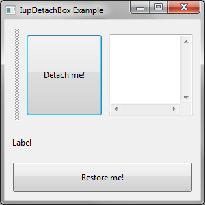
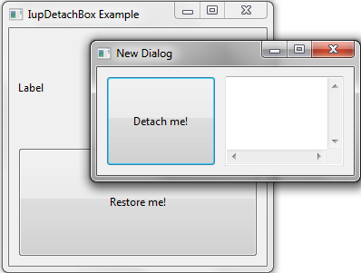

## IupDetachBox

Creates a  detachable void container.

Dragging and dropping this element, it creates a new dialog composed by its child or elements arranged in it (for example, a child like IupVbox or IupHbox).
During the drag, the ESC key can be pressed to cancel the action.

It does not have a native representation, but it contains also a **IupCanvas** to implement the bar handler.

### Creation

    Ihandle* IupDetachBox(Ihandle* child);

**child**: Identifier of an interface element that will receive the box. It can be NULL.

**Returns:** the identifier of the created element, or NULL if an error occurs.

### Attributes

**BARSIZE** (non-inheritable): controls the size of the bar handler.
To completely hide the bar set BARSIZE to 0. Default: 10.

**COLOR**: Changes the color of the bar grip affordance. The value should be given in "R G B" color style.
Default: "160 160 160". When SHOWGRIP = NO, this attribute sets the background color of the bar handler.

[EXPAND](../attrib/iup_expand.md) (non-inheritable): The default value is "YES".

**ORIENTATION** (creation-only) (non-inheritable): Indicates the orientation of the bar handler.
The direction of the resize is perpendicular to the orientation. Possible values are "VERTICAL" or "HORIZONTAL".
Default: "VERTICAL".

**OLDPARENT_HANDLE** (read-only): returns the previous parent of the detached element.
Only valid after the element was detached.

**OLDBROTHER_HANDLE** (read-only): returns the previous reference child of the detached element.
Only valid after the element was detached.
See [IupReparent](../func/iup_reparent.md) for a reference child definition.

**DETACH** (write-only): detach the box by creating a new dialog and placing the detachbox as the child of the new dialog.
The DETACHED_CB callback is called, use it to configure the new dialog.
The handler is hidden, the USERSIZE of the detachbox is set to the CURRENTSIZE of the child, and the PARENTDIALOG of the new dialog is set to old dialog.
To re-parent the child we need to map the dialog before doing it, so to force a dialog to resize its size is reset before its is shown, to control the dialog size use the child size.
The new dialog is show at the current cursor position, and the USERSIZE of the detachbox is reset.

**RESTORE** (write-only): restore the box to its previous place (parent and brother) and destroys the new dialog.
Value can be NULL or can be the name of a new parent when the control will be appended.
Use [IupSetHandle](../func/iup_sethandle.md) or [IupSetAttributeHandle](../func/iup_setattributehandle.md) to associate an Ihandle* to a name.
The handler is shown (if restored to inside a zbox, the application must update the zbox child visibility manually).

**RESTOREWHENCLOSED**: automatically restore the box to its original position when the new dialog is closed.
Can be Yes or No. Default: No.

**SHOWGRIP** (non-inheritable): Shows the bar grip affordance. Default: YES.
When set to NO, the BARSIZE is set to 5 (if greater than 5).
To completely hide the bar set BARSIZE to 0.

**WID** (read-only): returns -1 if mapped.

> 
>
> ------------------------------------------------------------------------

[FONT](../attrib/iup_font.md), [SIZE](../attrib/iup_size.md), [RASTERSIZE](../attrib/iup_rastersize.md), [CLIENTSIZE](../attrib/iup_clientsize.md), [CLIENTOFFSET](../attrib/iup_clientoffset.md), [POSITION](../attrib/iup_position.md), [MINSIZE](../attrib/iup_minsize.md), [MAXSIZE](../attrib/iup_maxsize.md), [THEME](../attrib/iup_theme.md): also accepted.

### Callbacks

**DETACHED_CB**: Callback called when the box is detached.

    int function(Ihandle *ih, Ihandle *new_parent, int x, int y);

**ih**: identifier of the element that activated the event.\
**new_parent**: identifier of the future parent of the box.
At this point only the PARENTDIALOG attribute was set.\
**x, y**: dropped position.

**Returns**: IUP_IGNORE will be processed, in order to cancel the detach action.

**RESTORED_CB**: Callback called when the box is restored if RESTOREWHENCLOSED=Yes.

    int function(Ihandle *ih, Ihandle *old_parent, int x, int y);

**ih**: identifier of the element that activated the event.\
**old_parent**: identifier of the original parent of the box.\
**x, y**: always 0,0.

**Returns**: IUP_IGNORE will be processed, in order to cancel the detach action.

### Notes

The box can be created with no elements and be dynamic filled using [IupAppend](../func/iup_append.md) or [IupInsert](../func/iup_insert.md).

### Examples

[Browse for Example Files](../../examples/)

IupDetachBox (ORIENTATION = VERTICAL)

New dialog created after the detach action

