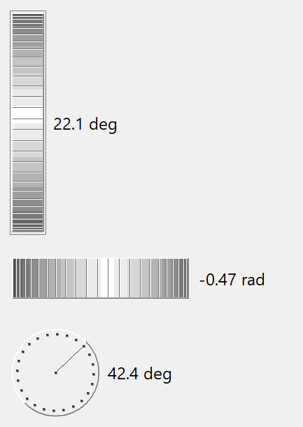
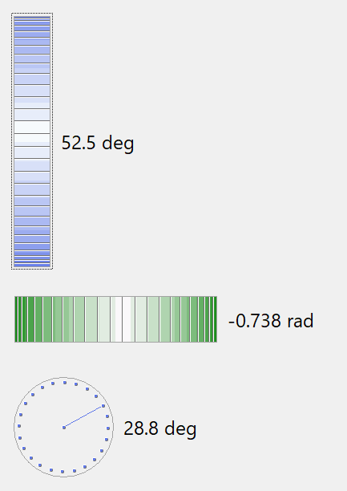

## IupDial

Creates a dial for regulating a given angular variable.
It inherits from [IupCanvas](../elem/iup_canvas.md).

### Creation

    Ihandle* IupDial(const char *orientation);

**orientation**: optional dial orientation, can be NULL. See ORIENTATION attribute.

**Returns:** the identifier of the created element, or NULL if an error occurs.

### Attributes

**DENSITY**: number of lines per pixel in the handle of the dial. Default is "0.2".

[EXPAND](../attrib/iup_expand.md): the default is "NO".

**FLAT**: use a 1 pixel flat border instead of the default 3-pixel sunken border.
Can be Yes or No. Default: No.

**FLATCOLOR:** color of the border when FLAT=Yes. Default: "160 160 160".

[FGCOLOR](../attrib/iup_fgcolor.md): foreground color.
The default value is "64 64 64".

[SIZE](../attrib/iup_size.md) (non-inheritable): the initial size is "16x80", "80x16" or "40x35" according to the dial orientation.
Set to NULL to allow the automatic layout to use smaller values.

**ORIENTATION** (creation-only) (non-inheritable): dial layout configuration "VERTICAL", "HORIZONTAL" or "CIRCULAR".
Default: "HORIZONTAL". Vertical increments when moved up, and decrements when moved down.
Horizontal increments when moved right, and decrements when moved left.
Circular increments when moved counter-clock wise, and decrements when moved clock wise.

**UNIT**: unit of the angle. Can be "DEGREES" or "RADIANS". Default is "RADIANS".
Used only in the callbacks.

**VALUE** (non-inheritable): The dial angular value in radians always.
The value is reset to zero when the interaction is started, except for ORIENTATION=CIRCULAR.
When orientation is vertical or horizontal, the dial measures relative angles.
When orientation is circular the dial measure absolute angles, where the origin is at 3 O'clock.

> 
>
> ------------------------------------------------------------------------

[ACTIVE](../attrib/iup_active.md), [BGCOLOR](../attrib/iup_bgcolor.md), [FONT](../attrib/iup_font.md), [SCREENPOSITION](../attrib/iup_screenposition.md), [POSITION](../attrib/iup_position.md), [MINSIZE](../attrib/iup_minsize.md), [MAXSIZE](../attrib/iup_maxsize.md), [WID](../attrib/iup_wid.md), [TIP](../attrib/iup_tip.md), [RASTERSIZE](../attrib/iup_rastersize.md), [ZORDER](../attrib/iup_zorder.md), [VISIBLE](../attrib/iup_visible.md), [THEME](../attrib/iup_theme.md): also accepted. 

### Callbacks

**BUTTON_PRESS_CB**: Called when the user presses the left mouse button over the dial.
The angle here is always zero, except for the circular dial.

int function(Ihandle *ih, double angle)

**ih**: identifier of the element that activated the event.\
**angle**: the dial value converted according to UNIT.

**BUTTON_RELEASE_CB**: Called when the user releases the left mouse button after pressing it over the dial.

int function(Ihandle *ih, double angle)

**ih**: identifier of the element that activated the event.\
**angle**: the dial value converted according to UNIT.

**MOUSEMOVE_CB**: Called each time the user moves the dial with the mouse button pressed.
The angle the dial rotated since it was initialized is passed as a parameter.

int function(Ihandle *ih, double angle);

**ih**: identifier of the element that activated the event.\
**angle**: the dial value converted according to UNIT.

**VALUECHANGED_CB**: Called after the value was interactively changed by the user.
It is called whenever a **BUTTON_PRESS_CB**, a **BUTTON_RELEASE_CB** or a **MOUSEMOVE_CB** would also be called, but if defined those callbacks will not be called.

    int function(Ihandle *ih);

**ih**: identifier of the element that activated the event.

> 
>
> ------------------------------------------------------------------------

[MAP_CB](../call/iup_map_cb.md), [UNMAP_CB](../call/iup_unmap_cb.md), [DESTROY_CB](../call/iup_destroy_cb.md), [GETFOCUS_CB](../call/iup_getfocus_cb.md), [KILLFOCUS_CB](../call/iup_killfocus_cb.md), [ENTERWINDOW_CB](../call/iup_enterwindow_cb.md), [LEAVEWINDOW_CB](../call/iup_leavewindow_cb.md), [K_ANY](../call/iup_k_any.md), [HELP_CB](../call/iup_help_cb.md): All common callbacks are supported.

### Notes

When the keyboard arrows are pressed and released, the mouse press and the mouse release callbacks are called in this order.
If you hold the key down, the mouse move callback is also called for every repetition.

When the wheel is rotated only the mouse move callback is called, and it increments the last angle the dial was rotated.

In all cases, the value is incremented or decremented by PI/10 (18 degrees).

If you press Shift while using the arrow keys, the increment is reduced to PI/100 (1.8 degrees).
Press the Home key in the circular dial to reset to 0.

### Examples

[Browse for Example Files](../../examples/)

\
Regular

\
Flat=Yes and fgcolor

### See Also

[IupCanvas](../elem/iup_canvas.md)
