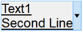
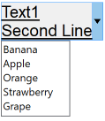
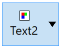
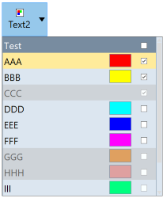
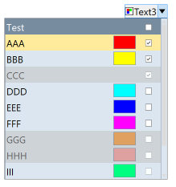

## IupDropButton

Creates an interface element that is a button with a drop-down arrow. It can function as a button and as a dropdown.
Its visual presentation can contain a text and/or an image.

When dropped displays a child inside a dialog with no decorations, so it can simulate the initial function of a dropdown list, but it can display any layout of IUP elements inside the dropped dialog.
When the user clicks outside the dialog, it is automatically closed.

It inherits from [IupCanvas](../elem/iup_canvas.md).

### Creation

    Ihandle* IupDropButton(Ihandle* dropchild);

**child**: Identifier of an interface element to be displayed when the dropdown is activated.
It can be NULL. It is not a regular child of the dropbutton.
It will be displayed inside a dialog with no decorations.

**Returns:** the identifier of the created element, or NULL if an error occurs.

### Attributes

Inherits all attributes and callbacks of the [IupCanvas](../elem/iup_canvas.md), but redefines a few attributes.

**ALIGNMENT** (non-inheritable): horizontal and vertical alignment of the set image+text.
Possible values: "ALEFT", "ACENTER" and "ARIGHT", combined to "ATOP", "ACENTER" and "ABOTTOM".
Default: "ALEFT:ACENTER". Partial values are also accepted, like "ARIGHT" or ":ATOP", the other value will be obtained from the default value.
Alignment does not include the padding area.

**ARROWACTIVE** (non-inheritable): the arrow can be disabled when the button is enabled.
If there is no drop child, the arrow will be automatically disabled.

**ARROWALIGN** (non-inheritable): vertical arrow alignment. Can be: TOP, CENTER or BOTTOM.
Default: CENTER.

**ARROWCOLOR**: color used for the arrow. Default uses FGCOLOR.

**ARROWIMAGES** (non-inheritable): replace the drawn arrows by the following images.
Make sure their sizes are equal or smaller than ARROWSIZE. Default: No.

**ARROWIMAGE** (non-inheritable): Arrow image name.
Use [IupSetHandle](../func/iup_sethandle.md) or [IupSetAttributeHandle](../func/iup_setattributehandle.md) to associate an image to a name.
See also [IupImage](../elem/iup_image.md).

**ARROWIMAGEHIGHLIGHT** (non-inheritable): Arrow image name of the element in highlight state.
If it is not defined then the ARROWIMAGE is used.

**ARROWIMAGEINACTIVE** (non-inheritable): Arrow image name of the element when inactive.
If it is not defined then the ARROWIMAGE is used and its colors will be replaced by a modified version creating the disabled effect.

**ARROWIMAGEPRESS** (non-inheritable): Arrow image name of the element in pressed state.
If it is not defined then the ARROWIMAGE is used.

**ARROWPADDING** (non-inheritable): internal margin for the arrow. It is inside ARROWSIZE.
Default: 5.

**ARROWSIZE** (non-inheritable): size of the area occupied by the arrow, even when using images.
Default: 24

**BACKIMAGE** (non-inheritable): image name to be used as a background.
Use [IupSetHandle](../func/iup_sethandle.md) or [IupSetAttributeHandle](../func/iup_setattributehandle.md) to associate an image to a name.
See also [IupImage](../elem/iup_image.md).

**BACKIMAGEHIGHLIGHT** (non-inheritable): background image name of the element in highlight state.
If it is not defined then the BACKIMAGE is used.

**BACKIMAGEINACTIVE** (non-inheritable): background image name of the element when inactive.
If it is not defined then the BACKIMAGE is used and its colors will be replaced by a modified version creating the disabled effect.

**BACKIMAGEPRESS** (non-inheritable): background image name of the element in pressed state.
If it is not defined then the BACKIMAGE is used.

**BACKIMAGEZOOM** (non-inheritable): if set, the back image will be zoomed to occupy the full background.
Aspect ratio is NOT preserved. Can be Yes or No. Default: No.

[BGCOLOR](../attrib/iup_bgcolor.md): Background color.
If text and image are not defined, the button is configured to simply show a color, in this case set the button size because the natural size will be very small.
If not defined it will use the background color of the native parent.

**HLCOLOR**: background color used to indicate a highlight state. Pre-defined to "200 225 245".
Can be set to NULL. If NULL BGCOLOR will be used instead.

**PSCOLOR**: background color used to indicate a press state. Pre-defined to "150 200 235".
Can be set to NULL. If NULL BGCOLOR will be used instead.

**BORDER** (creation-only): the default value is "NO". This is the **IupCanvas** border.

**BORDERCOLOR**: color used for borders. Default: "50 150 255".
This is for the **IupDropButton** drawn border.

**BORDERPSCOLOR**: color used for borders when pressed or selected. Default uses BORDERCOLOR.

**BORDERHLCOLOR**: color used for borders when highlighted. Default uses BORDERCOLOR.

**BORDERWIDTH**: line width used for borders. Default: "1".
Any borders can be hidden by simply setting this value to 0.
This is for the **IupDropButton** drawn border.

**SHOWBORDER**: by default borders are drawn only when the button is highlighted, if SHOWBORDER=Yes borders are always shown.
When SHOWBORDER=Yes and BGCOLOR is not defined, the actual BGCOLOR will be a darker version of the background color of the native parent.

**CANFOCUS** (creation-only) (non-inheritable): enables the focus traversal of the control.
In Windows the button will respect CANFOCUS in opposite to the other controls. Default: YES.

**FOCUSFEEDBACK** (non-inheritable): draw the focus feedback. Can be Yes or No.
Default: Yes.

**DROPCHILD**: the name of the element that will be displayed when dropped.
Use [IupSetHandle](../func/iup_sethandle.md) or [IupSetAttributeHandle](../func/iup_setattributehandle.md) to associate a child to a name.
The drop dialog, were the drop child is inserted, is available right after setting the attribute using **IupGetDialog** on the drop child handle.
See the Notes below for more information.

**DROPCHILD_HANDLE**: same as DROPCHILD but directly using the Ihandle* of the element.

**DROPONARROW** (non-inheritable): when enabled only clicking on the drop arrow will show the drop child.
Clicking on the remaining of the button will call FLAT_ACTION.
There will be two separates areas in the button, one for the drop arrow and one for the regular button.
When disabled there will be only one area, and the drop child will be shown anywhere the button is clicked, the callback FLAT_ACTION will not be called.
Default: Yes.

**DROPPOSITION** (non-inheritable): the drop child can be shown in four different positions relative to the drop button: BOTTOMLEFT, TOPLEFT, BOTTOMRIGHT, TOPRIGHT.
BOTTOMLEFT the top-left corner of the drop child is aligned with the bottom-left corner of the drop button, BOTTOMRIGHT the top-right corner of the drop child is aligned with the bottom-right corner of the drop button, TOPLEFT the bottom-left corner of the drop child is aligned with the top-left corner of the drop button, TOPRIGHT the bottom-right corner of the drop child is aligned with the top-right corner of the drop button.
Default: BOTTOMLEFT.

**PROPAGATEFOCUS** (non-inheritable): enables the focus callback forwarding to the next native parent with FOCUS_CB defined.
Default: NO.

[EXPAND](../attrib/iup_expand.md) (non-inheritable): The default value is "NO". 

[FGCOLOR](../attrib/iup_fgcolor.md): Text color. Default: the global attribute DLGFGCOLOR.

**TEXTHLCOLOR**: text color used to indicate a highlight state.
If not defined FGCOLOR will be used instead.

**TEXTPSCOLOR**: text color used to indicate a press state.
If not defined FGCOLOR will be used instead.

**FITTOBACKIMAGE** (non-inheritable): enable the natural size to be computed from the BACKIMAGE.
If BACKIMAGE is not defined will be ignored. Can be Yes or No. Default: No.

**FRONTIMAGE** (non-inheritable): image name to be used as foreground.
The foreground image is drawn in the same position as the background, but it is drawn at last.
Use [IupSetHandle](../func/iup_sethandle.md) or [IupSetAttributeHandle](../func/iup_setattributehandle.md) to associate an image to a name.
See also [IupImage](../elem/iup_image.md).

**FRONTIMAGEHIGHLIGHT** (non-inheritable): foreground image name of the element in highlight state.
If it is not defined then the FRONTIMAGE is used.

**FRONTIMAGEINACTIVE** (non-inheritable): foreground image name of the element when inactive.
If it is not defined then the FRONTIMAGE is used and its colors will be replaced by a modified version creating the disabled effect.

**FRONTIMAGEPRESS** (non-inheritable): foreground image name of the element in pressed state.
If it is not defined then the FRONTIMAGE is used.

**HASFOCUS** (read-only): returns the button state if has focus. Can be Yes or No.

**HIGHLIGHTED** (read-only): returns the button state if highlighted. Can be Yes or No.

**IMAGE** (non-inheritable): Image name.
Use [IupSetHandle](../func/iup_sethandle.md) or [IupSetAttributeHandle](../func/iup_setattributehandle.md) to associate an image to a name.
See also [IupImage](../elem/iup_image.md).

**IMAGEHIGHLIGHT** (non-inheritable): Image name of the element in highlight state.
If it is not defined then the IMAGE is used.

**IMAGEINACTIVE** (non-inheritable): Image name of the element when inactive.
If it is not defined then the IMAGE is used and its colors will be replaced by a modified version creating the disabled effect.

**IMAGEPRESS** (non-inheritable): Image name of the element in pressed state.
If it is not defined then the IMAGE is used.

**IMAGEPOSITION** (non-inheritable): Position of the image relative to the text when both are displayed.
Can be: LEFT, RIGHT, TOP, BOTTOM. Default: LEFT.

**PADDING**: internal margin. Works just like the MARGIN attribute of the **IupHbox** and **IupVbox** containers, but uses a different name to avoid inheritance problems.
Alignment does not include the padding area. Default value: "3x3".
Value can be DEFAULTBUTTONPADDING, so the global attribute of this name will be used instead.

**CPADDING**: same as PADDING but using the units of the **SIZE** attribute.
It will actually set the PADDING attribute.

**PRESSED** (read-only): returns the button state if pressed. Can be Yes or No.

**SHOWDROPDOWN** (write-only): opens or closes the dropdown child. Can be "YES" or "NO".
Ignored if set before map.

**SPACING** (non-inheritable): spacing between the image and the text. Default: "2".

**CSPACING**: same as SPACING but using the units of the vertical part of the **SIZE** attribute.
It will actually set the SPACING attribute.

[TITLE](../attrib/iup_title.md) (non-inheritable): Label's text.
The '\n' character is accepted for line change.

**TEXTALIGNMENT** (non-inheritable): Horizontal text alignment for multiple lines.
Can be: ALEFT, ARIGHT or ACENTER. Default: ALEFT.

**TEXTWRAP** (non-inheritable): For single line texts if the text is larger than its box the line will be automatically broken in multiple lines.
Notice that this is done internally by the system, the element natural size will still use only a single line.
For the remaining lines to be visible, the element should use EXPAND=VERTICAL or set a SIZE/RASTERSIZE with enough height for the wrapped lines.

**TEXTELLIPSIS** (non-inheritable): If the text is larger than its box, an ellipsis ("...") will be placed near the last visible part of the text and replace the invisible part.
It will be ignored when TEXTWRAP=Yes.

  **TEXTORIENTATION** (non-inheritable): text angle in degrees and counterclockwise.
The text size will adapt to include the rotated space.

**VISIBLECOLUMNS**: Defines the number of visible columns for the **Natural Size**, this means that will act also as minimum number of visible columns.
It uses a wider character size then the one used for the SIZE attribute, so strings will fit better without the need of extra columns.
Padding will be around the visible columns.

> 
>
> ------------------------------------------------------------------------

[ACTIVE](../attrib/iup_active.md), [FONT](../attrib/iup_font.md), [EXPAND](../attrib/iup_expand.md), [SCREENPOSITION](../attrib/iup_screenposition.md), [POSITION](../attrib/iup_position.md), [MINSIZE](../attrib/iup_minsize.md), [MAXSIZE](../attrib/iup_maxsize.md), [WID](../attrib/iup_wid.md), [TIP](../attrib/iup_tip.md), [SIZE](../attrib/iup_size.md), [RASTERSIZE](../attrib/iup_rastersize.md), [ZORDER](../attrib/iup_zorder.md), [VISIBLE](../attrib/iup_visible.md), [THEME](../attrib/iup_theme.md): also accepted.

### Callbacks

Inherits all callbacks of the [IupCanvas](../elem/iup_canvas.md), but redefines a few of them.
Including ACTION, BUTTON_CB, MOTION_CB, FOCUS_CB, LEAVEWINDOW_CB, and ENTERWINDOW_CB.
To allow the application to use those callbacks, the same callbacks are exported with the "FLAT_" prefix using the same parameters, except the FLAT_ACTION callback that now mimics the **IupButton** ACTION.
They are all called before the internal callbacks, and if they return IUP_IGNORE the internal callbacks are not processed.

**FLAT_ACTION**: Action generated when the button 1 (usually left) is selected.
This callback is called only after the mouse is released and when it is released inside the button area.
Called only when DROPONARROW=Yes.

    int function(Ihandle* ih);

**ih**: identifier of the element that activated the event.

**Returns**: IUP_CLOSE will be processed.

**DROPDOWN_CB**: Action generated right before the drop child is shown or hidden.
This callback is also called when SHOWDROPDOWN is set.

    int function (Ihandle *ih, int state);

**ih**: identifier of the element that activated the event.\
**state**: the new state of the drop child 1=to be shown, 0=to be hidden.

**DROPSHOW_CB**: Action generated right after the drop child is shown or hidden.
This callback is also called when SHOWDROPDOWN is set.

    int function (Ihandle *ih, int state);

**ih**: identifier of the element that activated the event.\
**state**: the current state of the drop child 1=shown, 0=hidden.

------------------------------------------------------------------------

[MAP_CB](../call/iup_map_cb.md), [UNMAP_CB](../call/iup_unmap_cb.md), [DESTROY_CB](../call/iup_destroy_cb.md), [GETFOCUS_CB](../call/iup_getfocus_cb.md), [KILLFOCUS_CB](../call/iup_killfocus_cb.md), [ENTERWINDOW_CB](../call/iup_enterwindow_cb.md), [LEAVEWINDOW_CB](../call/iup_leavewindow_cb.md), [K_ANY](../call/iup_k_any.md), [HELP_CB](../call/iup_help_cb.md): All common callbacks are supported.

### Notes

The natural size will be a combination of the size of the image and the title, if any, plus PADDING and SPACING (if both image and title are present), and plus the horizontal space occupied by the arrow.

The drop dialog is configured with no decorations, and it is not resizable, only the FOCUS_CB and K_ESC callbacks are set.
But this can be changed by the application. It is a regular [IupDialog](../dlg/iup_dialog.md).
To obtain the drop button handle from the handle of the dialog, get the "DROPBUTTON" attribute handle from the dialog, using [IupGetAttributeHandle](../func/iup_getattributehandle.md).
After performing some operation on the drop child, use SHOWDROPDOWN=NO on the drop button, you may also update its TITLE, just like a regular **IupList** with DROPDOWN=Yes, but this will not be performed automatically by the drop button.
For example, set the ACTION callback on the IupList used as drop child:

    static int list_cb(Ihandle* list, char *text, int item, int state)
    {
      if (state == 1)
      {
        Ihandle* ih = IupGetAttributeHandle(IupGetDialog(list), "DROPBUTTON");
        IupSetAttribute(ih, "SHOWDROPDOWN", "No");
        IupSetStrAttribute(ih, "TITLE", text);
      }
      return IUP_DEFAULT;
    }

Additionally, to mimic a **IupList** with DROPDOWN=Yes set SHOWBORDER=Yes and DROPONARROW=NO on the drop button.
But notice that the natural size will not use the largest item in the drop child list, so you can use EXPAND=HORIZONTAL or set VISIBLECOLUMNS, both on the drop button.

### Examples

[Browse for Example Files](../../examples/)

The following screenshots where taken while the button is highlighted or dropped.

### See Also

[IupImage](iup_image.md), [IupButton](iup_button.md), [IupToggle](iup_toggle.md), [IupLabel](iup_label.md), [IupList](iup_list.md)
