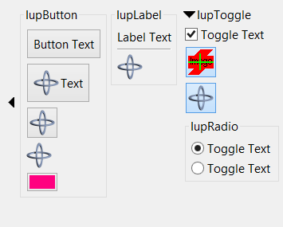
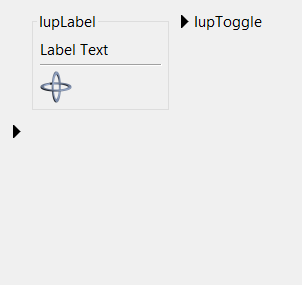

## IupExpander

Creates a void container that can interactively show or hide its child.

It does not have a native representation, but it contains also several elements to implement the bar handler.

### Creation

    Ihandle* IupExpander(Ihandle* child);

**child**: Identifier of an interface element. It can be NULL.

**Returns:** the identifier of the created element, or NULL if an error occurs.

### Attributes

**AUTOSHOW** (non-inheritable): enables the automatic show of the child when mouse is over the handler for more than 1 second.
Default: No. See Notes below.

**ANIMATION** (non-inheritable): enable animation during open/close.
Works only for BARPOSITION=TOP and does not work for AUTOSHOW.
Also the child must be a native container like **IupTabs**, **IupFrame**, **IupBackgroundBox**, or **IupScrollBox,** or it will not work accordantly.
Values can be SLIDE (child controls slide down), CURTAIN (child controls appears as if a curtain is being pulled) or NO.
Default: NO. (

The attribute **NUMFRAMES** can be used to control the number of frames used for the animation, the default value is 10 frames.
The time between frames is controlled by the **FRAMETIME** attribute, the default value is 30ms (milliseconds).
If the dialog has lots of controls and its layout computation takes longer than FRAMETIME, then a frame is lost, but the total animation time (numframes*frametime) is always the same.

**BACKCOLOR** (non-inheritable): background color of the bar handler.
If not defined it will use the background color of the native parent.

**BARPOSITION** (creation-only): indicates the bar handler position.
Possible values are "TOP", "BOTTOM", "LEFT" or "RIGHT". Default: "TOP".

**BARSIZE** (non-inheritable): controls the size of the bar handler.
Default: the height or width that fits all its internal elements according to BARPOSITION.

[EXPAND](../attrib/iup_expand.md) (non-inheritable): the default value is "YES".

**EXTRABUTTONS** (non-inheritable) (creation-only): sets the number of extra image buttons at right when BARPOSITION=TOP.
The maximum number of buttons is 3. See the EXTRABUTTON_CB callback. Default: 0.

**IMAGEEXTRAid**: image name used for the button. id can be 1, 2 or 3. 1 is the rightmost button, and count from right to left.\
**IMAGEEXTRAPRESSid**: image name used for the button when pressed.\
**IMAGEEXTRAHIGHLIGHTid**: image name for the button used when mouse is over the button area.

**FORECOLOR** (non-inheritable): title text color.
Default: the global attribute DLGFGCOLOR.

**OPENCOLOR** (non-inheritable): title text color when STATE=OPEN.
Defaults to the FORECOLOR if not defined.

**HIGHCOLOR** (non-inheritable): title text color when highlighted. Works only when TITLEEXPAND=Yes.
Defaults to the FORECOLOR if not defined.

**FRAME** (non-inheritable): enables the frame line around the bar area. Default: No.

**FRAMECOLOR** (non-inheritable): frame line color.
Default: the global attribute DLGFGCOLOR.

**FRAMEWIDTH** (non-inheritable): frame line width. Default: 1.

**IMAGE** (non-inheritable):  image name to replace the arrow image by a custom image when STATE=CLOSE.
Works only when BARPOSITION=TOP. Use [IupSetHandle](../func/iup_sethandle.md) or [IupSetAttributeHandle](../func/iup_setattributehandle.md) to associate an image to a name.
See also [IupImage](iup_image.md).

**IMAGEOPEN**: image name used when STATE=OPEN.\
**IMAGEHIGHLIGHT**: image name used when mouse is over the bar handler and STATE=CLOSE.\
**IMAGEOPENHIGHLIGHT**: image name used when mouse is over the bar handler and STATE=OPEN.

**STATE** (non-inheritable): Show or hide the container elements.
Possible values: "OPEN" (expanded) or "CLOSE" (collapsed). Default: OPEN.
Setting this attribute will automatically change the layout of the entire dialog so the child can be recomposed.

**STATEREFRESH** (non-inheritable): when state is changed **IupRefresh** is automatically called.
Can be Yes or No. Default: Yes.

**TITLE** (non-inheritable): title text, shown in the bar handler near the expand/collapse button.
When set it will reset TITLEIMAGE. Shown only when BARPOSITION=TOP.

**TITLEIMAGE** (non-inheritable): title image, shown in the bar handler near the expand/collapse button.
When set it will reset TITLE (image and text title are mutually exclusive).
Shown only when BARPOSITION=TOP.

**TITLEIMAGEOPEN**: image name used when STATE=OPEN.\
**TITLEIMAGEHIGHLIGHT**: image name used when mouse is over the title image and STATE=CLOSE.\
**TITLEIMAGEOPENHIGHLIGHT**: image name used when mouse is over the title image and STATE=OPEN.

**TITLEEXPAND** (non-inheritable): enable the expand/collapse action also at the tile.
Default: NO.

**WID** (read-only): returns -1 if mapped.

> 
>
> ------------------------------------------------------------------------

[FONT](../attrib/iup_font.md), [SIZE](../attrib/iup_size.md), [RASTERSIZE](../attrib/iup_rastersize.md), [CLIENTSIZE](../attrib/iup_clientsize.md), [CLIENTOFFSET](../attrib/iup_clientoffset.md), [POSITION](../attrib/iup_position.md), [MINSIZE](../attrib/iup_minsize.md), [MAXSIZE](../attrib/iup_maxsize.md), [THEME](../attrib/iup_theme.md): also accepted.

### Callbacks

[ACTION](../call/iup_action.md): Action generated after the expander state is interactively changed.

    int function(Ihandle* ih);

**ih**: identifier of the element that activated the event. 

**OPENCLOSE_CB**: Action generated before the expander state is interactively changed.

    int function(Ihandle* ih, int state);

**ih**: identifier of the element that activated the event. \
**state**: new state to be applied.

**Returns**: if return IUP_IGNORE the new state is ignored.

**EXTRABUTTON_CB**: Action generated when any mouse button is pressed or released.

    int function(Ihandle* ih, int button, int pressed);

> **ih**: identifies the element that activated the event.\
> **button**: identifies the extra button. can be 1, 2 or 3. (this is not the same as BUTTON_CB)\
> **pressed**: indicates the state of the button:
>
> 0 - mouse button was released;\
> 1 - mouse button was pressed.

### Notes

The bar handler elements are inside a **IupBackgroundBox** that is always the first child of the expander.
It can be obtained using **IupGetChild** or **IupGetNextChild**.
Inside that box there is **IupHbox** or a **IupVbox**, depending on BARPOSITION, that contains the interactive elements.
All buttons are in fact **IupLabel** to avoid the **IupButton** margins and highlight effects.
When BARPOSITION=TOP, the expand/collapse button is followed by a title label, then by a **IupHbox** containing the 3 or less extra buttons.

The container can be created with no elements and be dynamic filled using [IupAppend](../func/iup_append.md) or [IupInsert](../func/iup_insert.md).

When the TITLE is defined and BARPOSITION=TOP, then the expand/collapse button is left aligned.
In all other situations, the expand/collapse button is centered.

When AUTOSHOW=Yes the dialog layout is NOT recalculated.
The child is shown on top of the dialog, so the other children will not move or redraw.
After the mouse is move away from the child, then it is automatically hidden.
**IMPORTANT**: this feature will ONLY work if the child is a native container like **IupFrame**, **IupBackgroundBox, IupScrollBox** or **IupTabs**.

### Examples

[Browse for Example Files](../../examples/)

Container Expanded (STATE = "OPEN")

Container Collapsed (STATE = "CLOSE")

