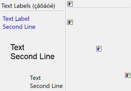

## IupFlatLabel

Creates an interface element that is a label, but it does not have native decorations.
Its visual presentation can contain a text and/or an image.

It behaves just like an [IupLabel](iup_label.md), but since it is not a native control, it has more flexibility for additional options.

It inherits from [IupCanvas](../elem/iup_canvas.md).

### Creation

    Ihandle* IupFlatLabel(const char *title);

**title**: Text to be shown to the user. It can be NULL. It will set the TITLE attribute.

**Returns:** the identifier of the created element, or NULL if an error occurs.

### Attributes

Inherits all attributes and callbacks of the [IupCanvas](../elem/iup_canvas.md), but redefines a few attributes.

**ALIGNMENT** (non-inheritable): horizontal and vertical alignment of the set image+text.
Possible values: "ALEFT", "ACENTER" and "ARIGHT",  combined to "ATOP", "ACENTER" and "ABOTTOM".
Default: "ALEFT:ACENTER". Partial values are also accepted, like "ARIGHT" or ":ATOP", the other value will be obtained from the default value.
Alignment does not include the padding area.

**BACKIMAGE** (non-inheritable): image name to be used as a background.
Use [IupSetHandle](../func/iup_sethandle.md) or [IupSetAttributeHandle](../func/iup_setattributehandle.md) to associate an image to a name.
See also [IupImage](../elem/iup_image.md).

**BACKIMAGEZOOM** (non-inheritable): if set, the back image will be zoomed to occupy the full background.
Aspect ratio is NOT preserved. Can be Yes or No. Default: No.

**BORDER** (creation-only): the default value is "NO". This is the **IupCanvas** border.

[BGCOLOR](../attrib/iup_bgcolor.md): ignored. It will use the background color of the native parent.

[EXPAND](../attrib/iup_expand.md) (non-inheritable): The default value is "NO". 

[FGCOLOR](../attrib/iup_fgcolor.md): Text color. Default: the global attribute DLGFGCOLOR.

**FITTOBACKIMAGE** (non-inheritable): enable the natural size to be computed from the BACKIMAGE.
If BACKIMAGE is not defined will be ignored. Can be Yes or No. Default: No.

**FRONTIMAGE** (non-inheritable): image name to be used as foreground.
The foreground image is drawn in the same position as the background, but it is drawn at last.
Use [IupSetHandle](../func/iup_sethandle.md) or [IupSetAttributeHandle](../func/iup_setattributehandle.md) to associate an image to a name.
See also [IupImage](../elem/iup_image.md).

**IMAGE** (non-inheritable): Image name.
Use [IupSetHandle](../func/iup_sethandle.md) or [IupSetAttributeHandle](../func/iup_setattributehandle.md) to associate an image to a name.
See also [IupImage](../elem/iup_image.md).

**IMAGEINACTIVE** (non-inheritable): Image name of the element when inactive.
If it is not defined then the IMAGE is used and its colors will be replaced by a modified version creating the disabled effect.

**IMAGEPOSITION** (non-inheritable): Position of the image relative to the text when both are displayed.
Can be: LEFT, RIGHT, TOP, BOTTOM. Default: LEFT.

**PADDING**: internal margin. Works just like the MARGIN attribute of the **IupHbox** and **IupVbox** containers, but uses a different name to avoid inheritance problems.
Default value: "0x0". Alignment does not include the padding area.

**CPADDING**: same as PADDING but using the units of the **SIZE** attribute.
It will actually set the PADDING attribute.

**SPACING** (non-inheritable): spacing between the image and the text. Default: "2".

**CSPACING**: same as SPACING but using the units of the vertical part of the **SIZE** attribute.
It will actually set the SPACING attribute.

[TITLE](../attrib/iup_title.md) (non-inheritable): Label's text.
The '\n' character is accepted for line change.

**TEXTALIGNMENT** (non-inheritable): Horizontal text alignment for multiple lines.
Can be: ALEFT, ARIGHT or ACENTER. Default: ALEFT.

**TEXTWRAP** (non-inheritable): For single line texts if the text is larger than its box, the line will be automatically broken in multiple lines.
Notice that this is done internally by the system, the element natural size will still use only a single line.
For the remaining lines to be visible, the element should use EXPAND=VERTICAL or set a SIZE/RASTERSIZE with enough height for the wrapped lines.

**TEXTELLIPSIS** (non-inheritable): If the text is larger than its box, an ellipsis ("...") will be placed near the last visible part of the text and replace the invisible part.
It will be ignored when TEXTWRAP=Yes.

  **TEXTORIENTATION** (non-inheritable): text angle in degrees and counterclockwise.
The text size will adapt to include the rotated space.

> 
>
> ------------------------------------------------------------------------

[ACTIVE](../attrib/iup_active.md), [FONT](../attrib/iup_font.md), [EXPAND](../attrib/iup_expand.md), [SCREENPOSITION](../attrib/iup_screenposition.md), [POSITION](../attrib/iup_position.md), [MINSIZE](../attrib/iup_minsize.md), [MAXSIZE](../attrib/iup_maxsize.md), [WID](../attrib/iup_wid.md), [TIP](../attrib/iup_tip.md), [SIZE](../attrib/iup_size.md), [RASTERSIZE](../attrib/iup_rastersize.md), [ZORDER](../attrib/iup_zorder.md), [VISIBLE](../attrib/iup_visible.md), [THEME](../attrib/iup_theme.md): also accepted.

### Notes

The **IupFlatLabel** can contain text and image simultaneously.

The natural size will be a combination of the size of the image and the title, if any, plus PADDING and SPACING (if both image and title are present).

The **IupLabel** SEPARATOR attribute to configure a separator (horizontal or vertical lines) is not supported.
ELLIPSIS, MARKUP and WORDWRAP **IupLabel** attributes are also not supported.
Mnemonics are not supported.

### Examples

[Browse for Example Files](../../examples/)

Normal Text Label: FGCOLOR = "0 0 255" ALIGNMENT="ALEFT:ATOP",
FONT = "Helvetica, 14" ALIGNMENT = "ACENTER:ACENTER" TEXTALIGNMENT = "ACENTER",
ALIGNMENT = "ARIGHT:ABOTTOM".

Normal Image Label: ALIGNMENT = "ALEFT" (8bpp Image),
ALIGNMENT = "ACENTER" (24 bpp Image),
ALIGNMENT = "ARIGHT" (32 bpp Image).

### See Also

[IupImage](iup_image.md), [IupButton](iup_button.md), [IupToggle](iup_toggle.md), [IupLabel](iup_label.md)
