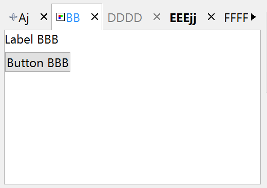
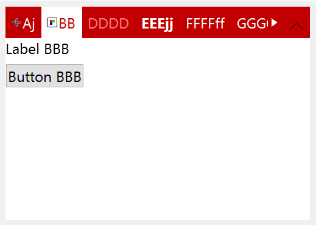

## IupFlatTabs

Creates a native container for composing elements in hidden layers with only one layer visible (just like [IupZbox](iup_zbox.md)), but its visibility can be interactively controlled.
The interaction is done in a line of tabs with titles and arranged according to the tab type.
Also known as Notebook in native systems.
Identical to the [IupTabs](iup_tabs.md) control but the decorations and buttons are manually drawn.
It inherits from [IupCanvas](../elem/iup_canvas.md).

### Creation

    Ihandle* IupFlatTabs(Ihandle* child, ...);
    Ihandle* IupFlatTabsV(Ihandle* child, va_list arglist);
    Ihandle* IupFlatTabsv(Ihandle** children);

**child, ...** : List of the elements that will be placed in the box.
NULL must be used to define the end of the list in C.
It can be empty, but in C must have at least the NULL terminator.

**Returns:** the identifier of the created element, or NULL if an error occurs.

### Attributes (non-inheritable)

Inherits all attributes and callbacks of the [IupCanvas](../elem/iup_canvas.md), but redefines a few attributes.
BORDER and SCROLLBAR are always NO.

[BGCOLOR](../attrib/iup_bgcolor.md): background color for the current Tab and the children.
Default: "255 255 255". It is non-inheritable, but when set will internally propagate to the children.

**CANFOCUS** (creation-only) (non-inheritable): enables the focus traversal of the control.
Default: YES.

**FOCUSFEEDBACK** (non-inheritable): draw the focus feedback. Can be Yes or No.
Default: Yes.

**PROPAGATEFOCUS** (non-inheritable): enables the focus callback forwarding to the next native parent with FOCUS_CB defined.
Default: NO.

**CHILDSIZEALL** (non-inheritable): compute the natural size using all children.
If set to NO will compute using only the current tab. Default: Yes.

**FORECOLOR**: text color for the current Tab. Default: "50 150 255".

**HIGHCOLOR**: text color for the highlighted Tab.
The current Tab is never highlighted, so it affects only the other tabs.
If not defined FORECOLOR will be used.

**CHILDOFFSET**: Allow specifying a position offset for the child. Available for native containers only.
It will not affect the natural size, and allows to position controls outside the client area.
Format "*dx*x*dy*", where *dx* and *dy* are integer values corresponding to the horizontal and vertical offsets, respectively, in pixels.
Default: 0x0.

**COUNT** (read-only)**:** returns the number of tabs. Same value returned by **IupGetChildCount**.

[EXPAND](../attrib/iup_expand.md): The default value is "YES".

**FIXEDWIDTH**: forces all tabs to use the same width, given by the attribute.
It does not include padding, nor the close button space if any, i.e., padding and close button space will be added to the fixed width.

**HASFOCUS** (read-only): returns the tabs state if it has focus. Can be Yes or No.

**SHOWCLOSE**:  enables the close button on each tab. Default value: "NO". By default, when closed the tab is hidden.
To change that behavior, use the TABCLOSE_CB callback.

**SHOWLINES**: when enabled, the current tab will be separated from the other tabs by a line.
Can be Yes or No. Default: Yes.

[SIZE](../attrib/iup_size.md): The default size is the smallest size that fits its largest child.
All child elements are considered even invisible ones.

**TABCHANGEONCHECK**: call the TABCHANGE* callbacks when current tab is removed or hidden, so a new tab is made current internally.

**TABSPADDING**: internal margin of the tab title.
Works just like the MARGIN attribute of the IupHbox and IupVbox containers, but uses a different name to avoid inheritance problems.
Alignment does not include the padding area. Default value: "6x4" (default changed in 3.29).

**TABSFORECOLOR**: text color of the tabs that are not the current tab.
Default: the global attribute DLGFGCOLOR.

**TABSBACKCOLOR**: background color of the tabs that are not the current tab.
If not defined it will use the background color of the parent.

**TABSHIGHCOLOR**: background highlight color of the tabs that are not the current tab.
When not defined the background is not highlighted.

**TABSFONT**: text font of the tabs. When not defined FONT is used.
It is a non-inheritable option for setting the font.

**TABSFONTSTYLE**: text font style. When change will actually set TABSFONT.

**TABSFONTSIZE**: text font size. When change will actually set TABSFONT.

**TABSTEXTALIGNMENT** (non-inheritable): Horizontal text alignment for multiple lines.
Can be: ALEFT, ARIGHT or ACENTER. Default: ALEFT.

**TABSTEXTWRAP** (non-inheritable): For single line texts if the text is larger than its box, the line will be automatically broken in multiple lines.
Notice that this is done internally by the system, the element natural size will still use only a single line.
For the remaining lines to be visible, the element should use EXPAND=VERTICAL or set a SIZE/RASTERSIZE with enough height for the wrapped lines.

**TABSTEXTELLIPSIS** (non-inheritable): If the text is larger than its box, an ellipsis ("...") will be placed near the last visible part of the text and replace the invisible part.
It will be ignored when TEXTWRAP=Yes.

  **TABSTEXTORIENTATION** (non-inheritable): text angle in degrees and counterclockwise.
The text size will adapt to include the rotated space.

**TABTYPE** (non-inheritable): the type of tabs, which can be "TOP", "BOTTOM", "LEFT" or "RIGHT".
Default is "TOP". It will not automatically change the TABORIENTATION.
When changed with the dialog visible the application should call IupRefresh or IupRefresh children to updated the layout when ready.

**TABORIENTATION** (non-inheritable): the orientation of tab text, which can be "HORIZONTAL" or "VERTICAL".
Default is "HORIZONTAL". When set to vertical it will simply set TABSTEXTORIENTATION to 90.

**TABSLINECOLOR**: color of the separator line. Default: "160 160 160"

**TABSIMAGEPOSITION**: position of the image relative to the text when both are displayed.
Can be: LEFT, RIGHT, TOP, BOTTOM. Default: LEFT.

**TABSIMAGESPACING**: spacing between the image and the text. Default: "2".

**TABSALIGNMENT**: horizontal and vertical alignment of the set image+text.
Possible values: "ALEFT", "ACENTER" and "ARIGHT",  combined to "ATOP", "ACENTER" and "ABOTTOM".
Alignment does not include the padding area. Default: "ACENTER:ACENTER".
Partial values are also accepted, like "ARIGHT" or ":ATOP", the other value will be obtained from the default value.

#### Tab Attributes (non-inheritable)

**TABIMAGEn**: image name to be used in the respective tab.
Use [IupSetHandle](../func/iup_sethandle.md) or [IupSetAttributeHandle](../func/iup_setattributehandle.md) to associate an image to a name. n starts at 0.
See also [IupImage](iup_image.md).

**TABIMAGEHIGHTLIGHTn**: same as TABIMAGEn when in highlight state.
If not defined TABIMAGEn is used.

**TABIMAGEINACTIVEn**: same as TABIMAGEn when in inactive state.
If not defined TABIMAGEn is used, and its colors will be replaced by a modified version creating the disabled effect.

**TABVISIBLEn**: controls the visibility of a tab. When a tab is hidden the tabs indices are not changed.
Can be Yes or No. Default: Yes.

**TABTITLEn**: contains the text to be shown in the respective tab title. n starts at 0.
If this value is NULL, it will remain empty.

**TABACTIVEn**: active state of the tab.  Can be Yes or No. Default: Yes.

**TABFORECOLORn**: text color of the tab title. When not defined TABSFORECOLOR is used.

**TABBACKCOLORn**: background color of the tab. When not defined TABSBACKCOLOR is used.

**TABHIGHCOLORn**: highlight color of the tab title. When not defined TABSHIGHCOLOR is used.

**TABFONTn**: text font of the tab. When not defined TABSFONT is used.

**TABFONTSTYLEn**: text font style. When change will actually set TABFONTn.

**TABFONTSIZEn**: text font size. When change will actually set TABFONTn.

**TABTIPn**: TIP of the tab.

#### Tab Close Button Attributes

**CLOSEIMAGE**: image name to be used in the close button.
Use [IupSetHandle](../func/iup_sethandle.md) or [IupSetAttributeHandle](../func/iup_setattributehandle.md) to associate an image to a name. n starts at 0.
See also [IupImage](iup_image.md). Default: "IMGFLATCLOSE".

**CLOSEIMAGEPRESS**: image name to be used in the close button in pressed state.
Default: "IMGFLATCLOSEPRESS".

**CLOSEIMAGEHIGHLIGHT**: image name to be used in the close button in highlight state.

**CLOSEIMAGEINACTIVE**: image name to be used in the close button in inactive state.
If it is not defined then the CLOSEIMAGE is used and its colors will be replaced by a modified version creating the disabled effect.

**CLOSEPRESSCOLOR**: background color of the close button in pressed state.
Default: "50 150 255".

**CLOSEHIGHCOLOR**: background color of the close button in highlight state. Default: "200 225 245".

#### Extra Buttons Attributes (non-inheritable)

**EXTRABUTTONS**: sets the number of extra image buttons at right in the free space area.
There can be any number of buttons. See the EXTRABUTTON_CB callback. Default: 0.

Button id starts at 1, and are positioned from right to left. Just like the tabs, they do not affect natural width.
But they also don't affect the tabs title height, if button title or image are larger than the tabs title height, they will be cropped.

**EXTRATITLE*****id***: text of the respective button.

**EXTRAACTIVE*****id***: active state of the button. Can be Yes or No.
When not defined works as "Yes".

**EXTRABORDERWIDTH*id***: width of the button border. Set this attribute to at least 1 to enable the border.
Default: 0

**EXTRABOX*id*** [read-only]: the box limits of the button in the format "xmin ymin xmax ymax" or "%d %d %d %d" in C.
Coordinates are relative to the IupFlatTabs top left corner.

**EXTRASHOWBORDER*id***: always show the button border. If not defined the border is shown when highlighted or pressed.
Default: NO

**EXTRABORDERCOLOR*id***: color of the border. Default: "50 150 255"

**EXTRAFORECOLOR*****id***: text color of the button title. When not defined TABSFORECOLOR is used.

**EXTRAPRESSCOLOR*****id***: background color of the button in pressed state.
Default: "150 200 235".

**EXTRAHIGHCOLOR*****id***: background color of the button in highlight state.
Default: "200 225 245".

**EXTRAFONT*****id***: text font of the button. When not defined TABSFONT is used.

**EXTRAIMAGE*****id***: image name to be used in the respective button.
Use [IupSetHandle](../func/iup_sethandle.md) or [IupSetAttributeHandle](../func/iup_setattributehandle.md) to associate an image to a name. n starts at 0.
See also [IupImage](iup_image.md).

**EXTRAIMAGEPRESS*****id***: same as EXTRAIMAGE*id* when in pressed state.
If not defined EXTRAIMAGE*id* is used.

**EXTRAIMAGEHIGHLIGHT*****id***: same as EXTRAIMAGE*id* when in highlight state.
If not defined EXTRAIMAGE*id* is used.

**EXTRAIMAGEINACTIVE*****id***: same as EXTRAIMAGE*id* when in inactive state.
If not defined EXTRAIMAGE*id* is used and its colors will be replaced by a modified version creating the disabled effect.

**EXTRATIP*id***: TIP of the button.

**EXTRATOGGLE*id***: enabled the toggle behavior. Default: NO.

****EXTRA**VALUE***id*****: Toggle's state. Values can be "ON" or "OFF".
Default: "OFF".

#### Expand Button Attributes (non-inheritable)

**EXPANDBUTTON**: uses the next free extra button to configure an expand button.
The button allows to dynamically expand and collapse the tabs contents.
When collapsed a click on a tab causes that tab to be temporarily expanded until it loses the focus.

**EXPANDBUTTONPOS** (read-only): position of the expand button in the extra buttons.

**EXPANDBUTTONSTATE**: The expand button is on expand state. Can be Yes or No. Default: Yes.

#### Current Tab (non-inheritable)

**VALUE**: Changes the current tab by its name.
The value passed must be the name of one of the elements contained in the tabs.
Use [IupSetHandle](../func/iup_sethandle.md) or [IupSetAttributeHandle](../func/iup_setattributehandle.md) to associate a child to a name.
When the tabs is created, the first element inserted is set as the current tab.
When the current tab is changed is also scrolled to be visible.

**VALUE_HANDLE**: Changes the current tab by its handle.
The value passed must be the handle of a child contained in the tabs.

**VALUEPOS**: Changes the current tab by its position, starting at 0.

> 
>
> ------------------------------------------------------------------------

[ACTIVE](../attrib/iup_active.md), [FONT](../attrib/iup_font.md), [SCREENPOSITION](../attrib/iup_screenposition.md), [POSITION](../attrib/iup_position.md), [CLIENTSIZE](../attrib/iup_clientsize.md), [CLIENTOFFSET](../attrib/iup_clientoffset.md), [MINSIZE](../attrib/iup_minsize.md), [MAXSIZE](../attrib/iup_maxsize.md), [WID](../attrib/iup_wid.md), [TIP](../attrib/iup_tip.md), [RASTERSIZE](../attrib/iup_rastersize.md), [ZORDER](../attrib/iup_zorder.md), [VISIBLE](../attrib/iup_visible.md), [THEME](../attrib/iup_theme.md): also accepted.

### Attributes (at Children)

[FLOATING](../attrib/iup_floating.md) (non-inheritable) **(at children only)**: If a child has FLOATING=YES then its size and position will be ignored by the layout processing.
Default: "NO".

**TABTITLE** (non-inheritable) **(at children only)**: Same as TABTITLEn but set in each child.
Works only if set before the child is added to the tabs. It is not updated if TABTITLEn is changed.

**TABIMAGE** (non-inheritable) **(at children only)**: Same as **TABIMAGEn** but set in each child.
Works only if set before the child is added to the tabs. It is not updated if TABIMAGEn is changed.

### Callbacks

Inherits all callbacks of the [IupCanvas](../elem/iup_canvas.md), but redefines a few of them.
Including BUTTON_CB, MOTION_CB, GETFOCUS_CB, KILLFOCUS_CB and LEAVEWINDOW_CB.
To allow the application to use those callbacks the same callbacks are exported with the "FLAT_" prefix using the same parameters.
They are all called before the internal callbacks and if they return IUP_IGNORE the internal callbacks are not processed.
In FLATBUTTON_CB and FLAT_MOTION_CB use [IupConvertXYToPos](../func/iup_convertxytopos.md) to convert (x,y) coordinates in tab position (same as VALUEPOS).

**TABCHANGE_CB**: Callback called when the user changes the current tab.

int function(Ihandle* ih, Ihandle* new_tab, Ihandle* old_tab);

**ih**: identifier of the element that activated the event.\
**new_tab**: the new tab selected by the user\
**old_tab**: the previously selected tab

**Returns**: if IUP_IGNORE is returned, the current tab is NOT changed.

**TABCHANGEPOS_CB**: Callback called when the user changes the current tab.
Called only when TABCHANGE_CB is not defined.

int function(Ihandle* ih, int new_pos, int old_pos);

**ih**: identifier of the element that activated the event.\
**new_pos**: the new tab position selected by the user\
**old_pos**: the previously selected tab position

**Returns**: if IUP_IGNORE is returned, the current tab is NOT changed.

**TABCLOSE_CB**: Callback called when the user clicks on the close button.
Called only when SHOWCLOSE=Yes.

int function(Ihandle* ih, int pos);

**ih**: identifier of the element that activated the event.\
**pos**: the tab position

**Returns**: the tab will be hidden if the callback returns IUP_DEFAULT or if it does not exist.
If IUP_CONTINUE is returned the tab is removed and its children are destroyed.
If IUP_IGNORE is returned does nothing.

**RIGHTCLICK_CB**: Callback called when the user clicks on some tab using the right mouse button.

int function(Ihandle* ih, int pos);

**ih**: identifier of the element that activated the event.\
**pos**: the tab position

**EXTRABUTTON_CB**: Action generated when any mouse button is pressed or released.

    int function(Ihandle* ih, int button, int pressed);

**ih**: identifies the element that activated the event.\
**button**: identifies the extra button.
Can be 1, 2, 3, 4, and so on. (this is not the same as BUTTON_CB)\
**pressed**: indicates the state of the button (1=pressed, 0=released)

------------------------------------------------------------------------

[MAP_CB](../call/iup_map_cb.md), [UNMAP_CB](../call/iup_unmap_cb.md), [DESTROY_CB](../call/iup_destroy_cb.md), [ENTERWINDOW_CB](../call/iup_enterwindow_cb.md), [K_ANY](../call/iup_k_any.md), [HELP_CB](../call/iup_help_cb.md): All common callbacks are supported.

### Notes

The Tabs can be created with no children and be dynamic filled using [IupAppend](../func/iup_append.md).

Its children automatically receive a name when the child is appended or inserted into the tabs.

**IMPORTANT**: Similar to **IupZbox**, **IupFlatTabs** does depends on the VISIBLE attribute.
To proper functioning we strongly recommend using a [IupBackgroundBox](iup_backgroundbox.md) for each child.

When you change the current tab, the focus is usually not changed.
If you want to control the focus behavior, call **IupSetFocus** in the TABCHANGE_CB callback.

When flattabs has the focus, the current tab can be changed using the left and right arrow keys.

Main differences from [IupTabs](iup_tabs.md):

- Appearance can be controlled for global features and for individual tabs.
- Child focus can be controlled without native problems.
- Tabs can be individually disabled using TABACTIVEid attribute.
- Tab change can be controlled by the callbacks and ignored.
- MULTILINE is NOT supported.
- Mnemonics are NOT supported.

### Utility Functions

These functions can be used to set and get attributes from the element:

    void  IupSetAttributeId(Ihandle *ih, const char* name, int id, const char* value);
    char* IupGetAttributeId(Ihandle *ih, const char* name, int id);
    int   IupGetIntId(Ihandle *ih, const char* name, int id);
    float IupGetFloatId(Ihandle *ih, const char* name, int id);
    void  IupSetfAttributeId(Ihandle *ih, const char* name, int id, const char* format, ...);
    void  IupSetIntId(Ihandle* ih, const char* name, int id, int value);
    void  IupSetFloatId(Ihandle* ih, const char* name, int id, float value);

They work just like the respective traditional set and get functions.
But the attribute string is complemented with the id value. For ex:

    IupSetAttributeId(ih, "TABTITLE", 3, value) == IupSetAttribute(ih, "TABTITLE3", value)

But these functions are faster than the traditional functions because they do not need to parse the attribute name string and the application does not need to concatenate the attribute name with the id.

### Examples

[Browse for Example Files](../../examples/)

    IupSetAttribute(ih, "TABVISIBLE2", "NO");
    IupSetAttribute(ih, "TABACTIVE3", "NO");
    IupSetAttribute(ih, "SHOWCLOSE", "Yes");
    IupSetAttribute(ih, "TABFONTSTYLE4", "Bold");

    IupSetAttribute(ih, "FORECOLOR", "192 0 0");
    IupSetAttribute(ih, "TABSBACKCOLOR", "192 0 0");
    IupSetAttribute(ih, "HIGHCOLOR", "255 128 128");
    IupSetAttribute(ih, "CLOSEHIGHCOLOR", "255 128 128");
    IupSetAttribute(ih, "TABSFORECOLOR", "255 255 255");
    IupSetAttribute(ih, "SHOWLINES", "NO");
    IupSetAttribute(ih, "SHOWCLOSE", "NO");
    IupSetAttribute(ih, "EXPANDBUTTON", "Yes");

### See Also

[IupTabs](iup_tabs.md), [IupZbox](iup_zbox.md)
