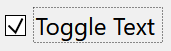
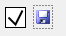
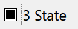
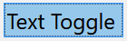
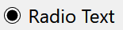

## IupFlatToggle

Creates an interface element that is a toggle, but it does not have native decorations.
When selected, this element activates a function in the application.
Its visual presentation can contain a text and/or an image.

It behaves just like an [IupToggle](iup_toggle.md), but since it is not a native control it has more flexibility for additional options.

It inherits from [IupCanvas](../elem/iup_canvas.md).

### Creation

    Ihandle* IupFlatToggle(const char *title);

**title**: Text to be shown to the user. It can be NULL. It will set the TITLE attribute.

**Returns:** the identifier of the created element, or NULL if an error occurs.

### Attributes

Inherits all attributes and callbacks of the [IupCanvas](../elem/iup_canvas.md), but redefines a few attributes.

**ALIGNMENT** (non-inheritable): horizontal and vertical alignment of the set image+text.
Possible values: "ALEFT", "ACENTER" and "ARIGHT",  combined to "ATOP", "ACENTER" and "ABOTTOM".
Default: "ACENTER:ACENTER". Partial values are also accepted, like "ARIGHT" or ":ATOP", the other value will be obtained from the default value.
Alignment does not include the padding area.

**BACKIMAGE** (non-inheritable): image name to be used as a background.
Use [IupSetHandle](../func/iup_sethandle.md) or [IupSetAttributeHandle](../func/iup_setattributehandle.md) to associate an image to a name.
See also [IupImage](../elem/iup_image.md).

**BACKIMAGEHIGHLIGHT** (non-inheritable): background image name of the element in highlight state.
If it is not defined then the BACKIMAGE is used.

**BACKIMAGEINACTIVE** (non-inheritable): background image name of the element when inactive.
If it is not defined then the BACKIMAGE is used and its colors will be replaced by a modified version creating the disabled effect.

**BACKIMAGEPRESS** (non-inheritable): background image name of the element in pressed state.
If it is not defined then the BACKIMAGE is used.

**BACKIMAGEZOOM** (non-inheritable): if set the back image will be zoomed to occupy the full background.
Aspect ratio is NOT preserved. Can be Yes or No. Default: No.

[BGCOLOR](../attrib/iup_bgcolor.md): Background color.
If text and image are not defined, the button is configured to simply show a color, in this case set the button size because the natural size will be very small.
If not defined it will use the background color of the native parent.

**HLCOLOR**: background color used to indicate a highlight state. Pre-defined to "200 225 245".
Can be set to NULL. If NULL, BGCOLOR will be used instead.

**PSCOLOR**: background color used to indicate a press state. Pre-defined to "150 200 235".
Can be set to NULL. If NULL, BGCOLOR will be used instead.

**BORDER** (creation-only): the default value is "NO". This is the **IupCanvas** border.

**BORDERCOLOR**: color used for borders. Default: "50 150 255".
This is for the **IupFlatToggle** drawn border.

**BORDERPSCOLOR**: color used for borders when pressed or selected. Default uses BORDERCOLOR.

**BORDERHLCOLOR**: color used for borders when highlighted. Default uses BORDERCOLOR.

**BORDERWIDTH**: line width used for borders. Default: "1".
Any borders can be hidden by simply setting this value to 0. This is for the **IupFlatToggle** drawn border.
When the checkbox is shown the borders are not shown, and the background is not highlighted.

**SHOWBORDER**: by default borders are drawn only when the button is highlighted, if SHOWBORDER=Yes borders are always show.
When SHOWBORDER=Yes and BGCOLOR is not defined, the actual BGCOLOR will be a darker version of the background color of the native parent.

**CANFOCUS** (creation-only) (non-inheritable): enables the focus traversal of the control.
In Windows the button will respect CANFOCUS in opposite to the other controls. Default: YES.

**FOCUSFEEDBACK** (non-inheritable): draw the focus feedback. Can be Yes or No.
Default: Yes.

**CHECKSIZE** (non-inheritable): size of the checkbox when visible.
Default depends on the resolution: 16 (dpi <= 120), or 24 (dpi > 120). Set it to 0 to hide the check box.
When the check box is shown the borders are not shown, and the background is not highlighted.

**CHECKRIGHT** (non-inheritable): place the checkbox at the right. Can be "YES" or "NO".
Default: "NO".

**CHECKSPACING** (non-inheritable): spacing between the checkbox and the image+text.
The space occupies the image+text area. Default: 5

**CHECKALIGN** (non-inheritable): vertical alignment of the checkbox. Can be "ATOP", "ACENTER" and "ABOTTOM".
Default: ACENTER.

**CHECKIMAGE** (non-inheritable): image name to be used as check box when VALUE=OFF, be sure the image size is equal to CHECKSIZE-2.
Use [IupSetHandle](../func/iup_sethandle.md) or [IupSetAttributeHandle](../func/iup_setattributehandle.md) to associate an image to a name.
See also [IupImage](../elem/iup_image.md).
If this attribute is defined the checkbox is not drawn, the images will be used instead.

**CHECKIMAGEHIGHLIGHT** (non-inheritable): check box image name of the element in highlight state when VALUE=OFF.
If it is not defined then the CHECKIMAGE is used.

**CHECKIMAGEINACTIVE** (non-inheritable): check box image name of the element when inactive and VALUE=OFF.
If it is not defined then the CHECKIMAGE is used and its colors will be replaced by a modified version creating the disabled effect.

**CHECKIMAGEPRESS** (non-inheritable): check box image name of the element in pressed state when VALUE=OFF.
If it is not defined then the CHECKIMAGE is used.

**CHECKIMAGEON*** (non-inheritable): image names to be used as check box when VALUE=ON. (HIGHLIGHT, INACTIVE and PRESS included)

**CHECKIMAGENOTDEF*** (non-inheritable): image names to be used as check box when VALUE=NOTDEF. (HIGHLIGHT, INACTIVE and PRESS included)

**PROPAGATEFOCUS** (non-inheritable): enables the focus callback forwarding to the next native parent with FOCUS_CB defined.
Default: NO.

[EXPAND](../attrib/iup_expand.md) (non-inheritable): The default value is "NO". 

[FGCOLOR](../attrib/iup_fgcolor.md): Text color. Default: the global attribute DLGFGCOLOR.

**TEXTHLCOLOR**: text color used to indicate a highlight state.
If not defined FGCOLOR will be used instead.

**TEXTPSCOLOR**: text color used to indicate a press state.
If not defined FGCOLOR will be used instead.

**FITTOBACKIMAGE** (non-inheritable): enable the natural size to be computed from the BACKIMAGE.
If BACKIMAGE is not defined will be ignored. Can be Yes or No. Default: No.

**FRONTIMAGE** (non-inheritable): image name to be used as foreground.
The foreground image is drawn in the same position as the background, but it is drawn at last.
Use [IupSetHandle](../func/iup_sethandle.md) or [IupSetAttributeHandle](../func/iup_setattributehandle.md) to associate an image to a name.
See also [IupImage](../elem/iup_image.md).

**FRONTIMAGEHIGHLIGHT** (non-inheritable): foreground image name of the element in highlight state.
If it is not defined then the FRONTIMAGE is used.

**FRONTIMAGEINACTIVE** (non-inheritable): foreground image name of the element when inactive.
If it is not defined then the FRONTIMAGE is used and its colors will be replaced by a modified version creating the disabled effect.

**FRONTIMAGEPRESS** (non-inheritable): foreground image name of the element in pressed state.
If it is not defined then the FRONTIMAGE is used.

**HASFOCUS** (read-only): returns the button state if has focus. Can be Yes or No.

**HIGHLIGHTED** (read-only): returns the button state if highlighted. Can be Yes or No.

**IMAGE** (non-inheritable): Image name.
Use [IupSetHandle](../func/iup_sethandle.md) or [IupSetAttributeHandle](../func/iup_setattributehandle.md) to associate an image to a name.
See also [IupImage](../elem/iup_image.md).

**IMAGEHIGHLIGHT** (non-inheritable): Image name of the element in highlight state.
If it is not defined then the IMAGE is used.

**IMAGEINACTIVE** (non-inheritable): Image name of the element when inactive.
If it is not defined then the IMAGE is used and its colors will be replaced by a modified version creating the disabled effect.

**IMAGEPRESS** (non-inheritable): Image name of the element in pressed state.
If it is not defined then the IMAGE is used.

**IMAGEPOSITION** (non-inheritable): Position of the image relative to the text when both are displayed.
Can be: LEFT, RIGHT, TOP, BOTTOM. Default: LEFT.

**PADDING**: internal margin. Works just like the MARGIN attribute of the **IupHbox** and **IupVbox** containers, but uses a different name to avoid inheritance problems.
Alignment does not include the padding area. Default value: "0x0".
Value can be DEFAULTBUTTONPADDING, so the global attribute of this name will be used instead.

**CPADDING**: same as PADDING but using the units of the **SIZE** attribute.
It will actually set the PADDING attribute.

**PRESSED** (read-only): returns the button state if pressed. Can be Yes or No.

**RADIO** (read-only): returns if the toggle is inside a radio. Can be "YES" or "NO".

**IGNORERADIO** (non-inheritable): when set the toggle will not behave as a radio when inside an **IupRadio** hierarchy.

**SELECTEDNOTIFY** (non-inheritable): for a toggle inside a radio notify the selected toggle when pressed again.

**SPACING** (non-inheritable): spacing between the image and the text. Default: "2".

**CSPACING**: same as SPACING but using the units of the vertical part of the **SIZE** attribute.
It will actually set the SPACING attribute.

[TITLE](../attrib/iup_title.md) (non-inheritable): toggle text.
The '\n' character is accepted for line change.

**TEXTALIGNMENT** (non-inheritable): Horizontal text alignment for multiple lines.
Can be: ALEFT, ARIGHT or ACENTER. Default: ALEFT.

**TEXTWRAP** (non-inheritable): For single line texts if the text is larger than its box, the line will be automatically broken in multiple lines.
Notice that this is done internally by the system, the element natural size will still use only a single line.
For the remaining lines to be visible the element should use EXPAND=VERTICAL or set a SIZE/RASTERSIZE with enough height for the wrapped lines.

**TEXTELLIPSIS** (non-inheritable): If the text is larger than its box, an ellipsis ("...") will be placed near the last visible part of the text and replace the invisible part.
It will be ignored when TEXTWRAP=Yes.

  **TEXTORIENTATION** (non-inheritable): text angle in degrees and counterclockwise.
The text size will adapt to include the rotated space.

**VALUE** (non-inheritable): Toggle's state. Values can be "ON", "OFF" or "TOGGLE".
If 3STATE=YES then can also be "NOTDEF". Default: "OFF". The TOGGLE option will invert the current state.
Can only be set to ON if the toggle is inside a radio, it will automatically set to OFF the previous toggle that was ON in the radio.

**3STATE** (creation-only): Enable a three state toggle.
Valid for toggles with text only and that do not belong to a radio. Can be "YES" or NO".
Default: "NO". Incompatible with SWITCH=YES.

**SWITCH** (creation-only) (non-inheritable): displays the toggle as a switch control instead of a checkbox.
Can be "YES" or "NO". Default: "NO". Incompatible with 3STATE.
When SWITCH=YES, the check area draws a track with a sliding thumb instead of a checkbox or radio dot.
The attributes CHECKSIZE, CHECKSPACING, CHECKRIGHT, CHECKALIGN, CHECKIMAGE and CHECKIMAGEON are reused for the switch.
When SWITCH=YES and CHECKSIZE is not explicitly set, a larger default size is used: 20 (dpi <= 120) or 26 (dpi > 120), instead of the checkbox defaults of 16/24.
The thumb grows slightly on mouse hover to provide visual feedback.

**SWITCHTRACKWIDTH** (non-inheritable): width of the switch track in pixels.
Default: effective CHECKSIZE * 2 (40 at standard DPI, 52 at high DPI). The track height is controlled by CHECKSIZE.

**SWITCHOFFCOLOR** (non-inheritable): track fill color when VALUE=OFF. Default: "190 190 190".

**SWITCHOFFHLCOLOR** (non-inheritable): track fill color when VALUE=OFF and highlighted.
If not defined then SWITCHOFFCOLOR is used.

**SWITCHOFFPSCOLOR** (non-inheritable): track fill color when VALUE=OFF and pressed.
If not defined then SWITCHOFFCOLOR is used.

**SWITCHONCOLOR** (non-inheritable): track fill color when VALUE=ON. Default: "0 120 215".

**SWITCHONHLCOLOR** (non-inheritable): track fill color when VALUE=ON and highlighted.
If not defined then SWITCHONCOLOR is used.

**SWITCHONPSCOLOR** (non-inheritable): track fill color when VALUE=ON and pressed.
If not defined then SWITCHONCOLOR is used.

**SWITCHBORDERCOLOR** (non-inheritable): track border color.
If not defined then FGCOLOR is used. Responds to CHECKHLCOLOR and CHECKPSCOLOR for state variants.

**SWITCHCORNERRADIUS** (non-inheritable): corner radius for the switch track.
Default: half of the track height (pill shape). Set to 0 for a square track.

**SWITCHTRACKGRADIENT** (non-inheritable): gradient for the track, format "color1:color2".
Default: NULL (solid color). Used as fallback for both OFF and ON states.

**SWITCHTRACKONGRADIENT** (non-inheritable): gradient for the track when VALUE=ON, format "color1:color2".
Default: NULL. If not defined, SWITCHTRACKGRADIENT is used when set.

**SWITCHTRACKGRADIENTANGLE** (non-inheritable): gradient angle in degrees.
Default: 90 (top to bottom).

**SWITCHTHUMBCOLOR** (non-inheritable): thumb fill color. Default: "255 255 255" (white).

**SWITCHTHUMBHLCOLOR** (non-inheritable): thumb color when highlighted.
If not defined then SWITCHTHUMBCOLOR is used.

**SWITCHTHUMBPSCOLOR** (non-inheritable): thumb color when pressed.
If not defined then SWITCHTHUMBCOLOR is used.

**SWITCHTHUMBSIZE** (non-inheritable): thumb diameter in pixels.
Default: track height - 8 (4 pixel margin on each side).

**SWITCHTHUMBCORNERRADIUS** (non-inheritable): corner radius for the thumb.
Default: half of SWITCHTHUMBSIZE (circle). Set to 0 for a square thumb.

>
>
> ------------------------------------------------------------------------

[ACTIVE](../attrib/iup_active.md), [FONT](../attrib/iup_font.md), [EXPAND](../attrib/iup_expand.md), [SCREENPOSITION](../attrib/iup_screenposition.md), [POSITION](../attrib/iup_position.md), [MINSIZE](../attrib/iup_minsize.md), [MAXSIZE](../attrib/iup_maxsize.md), [WID](../attrib/iup_wid.md), [TIP](../attrib/iup_tip.md), [SIZE](../attrib/iup_size.md), [RASTERSIZE](../attrib/iup_rastersize.md), [ZORDER](../attrib/iup_zorder.md), [VISIBLE](../attrib/iup_visible.md), [THEME](../attrib/iup_theme.md): also accepted.

### Callbacks

Inherits all callbacks of the [IupCanvas](../elem/iup_canvas.md), but redefines a few of them.
Including ACTION, BUTTON_CB, MOTION_CB, FOCUS_CB, LEAVEWINDOW_CB, and ENTERWINDOW_CB.
To allow the application to use those callbacks, the same callbacks are exported with the "FLAT_" prefix using the same parameters, except the FLAT_ACTION callback that now mimics the **IupToggle** ACTION.
They are all called before the internal callbacks, and if they return IUP_IGNORE the internal callbacks are not processed.

**FLAT_ACTION**: Action generated when the button 1 (usually left) is selected.
This callback is called only after the mouse is released and when it is released inside the button area.

    int function(Ihandle* ih, int state);

**ih**: identifier of the element that activated the event.\
**state**: 1 if the toggle's state was shifted to on; 0 if it was shifted to off.

**Returns**: IUP_CLOSE will be processed.

**VALUECHANGED_CB**: Called after the value was interactively changed by the user.
Called after the ACTION callback but under the same context.

    int function(Ihandle *ih);

**ih**: identifier of the element that activated the event.

------------------------------------------------------------------------

[MAP_CB](../call/iup_map_cb.md), [UNMAP_CB](../call/iup_unmap_cb.md), [DESTROY_CB](../call/iup_destroy_cb.md), [GETFOCUS_CB](../call/iup_getfocus_cb.md), [KILLFOCUS_CB](../call/iup_killfocus_cb.md), [ENTERWINDOW_CB](../call/iup_enterwindow_cb.md), [LEAVEWINDOW_CB](../call/iup_leavewindow_cb.md), [K_ANY](../call/iup_k_any.md), [HELP_CB](../call/iup_help_cb.md): All common callbacks are supported.

### Notes

The **IupFlatToggle** can contain the checkbox, text and image simultaneously.

The natural size will be a combination of the size of the image and the title, if any, plus PADDING and SPACING (if both image and title are present), and the check box if visible.

Borders are drawn only when the button is highlighted reproducing the behavior of the **IupButton** when FLAT=Yes.
When the checkbox is shown, the borders are not shown, and the background is not highlighted.

Buttons are activated using Enter or Space keys.

To build a set of mutual exclusive toggles, insert them in a **IupRadio** container.
Only the **IupFlatToggle** controls inside the radio will be part of the exclusive group.

The toggle that is a child of an **IupRadio** automatically receives a name when it is mapped into the native system.

To replace a **IupToggle** by a **IupFlatToggle**, you must change the function call (**IupFlatToggle** does not include the action callback in the constructor) and change the ACTION callback name to FLAT_ACTION.

Finally notice that the name of the secondary image attributes are different (for instance, IMINACTIVE is IMAGEINACTIVE, IMPRESS is IMAGEPRESS, and so on).

When the **IupFlatToggle** displays only a text it will look like a label, use SHOWBORDER=Yes to force the display of the borders all the time.

### Examples

[Browse for Example Files](../../examples/)

Here are a few combinations:

**Text+Check**

**Image+Check**

**3 State**

**Text Only**

**Inside a Radio**

### See Also

[IupImage](iup_image.md), [IupButton](iup_button.md), [IupToggle](iup_toggle.md), [IupLabel](iup_label.md), [IupRadio](iup_radio.md).
