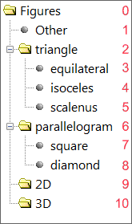
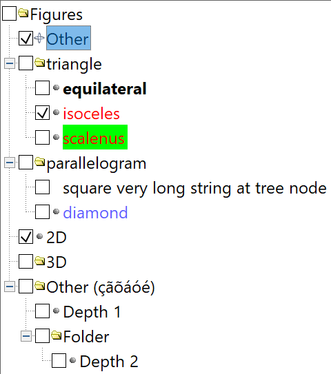
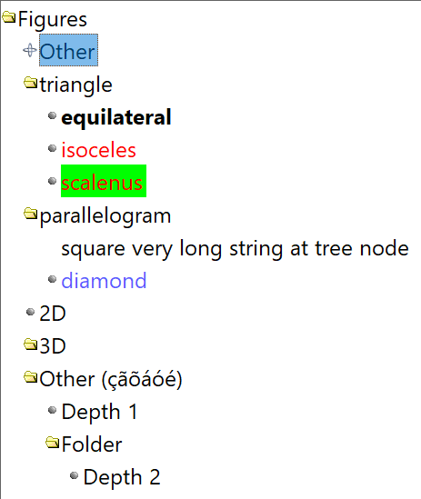
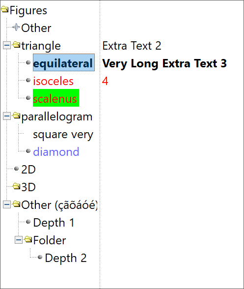

## IupFlatTree

Creates a tree containing nodes of branches or leaves.
Both branches and leaves can have an associated text and image.

The branches can be expanded or collapsed.
When a branch is expanded, its immediate children are visible, and when it is collapsed they are hidden.

The leaves can generate an "executed" or "renamed" actions, branches can only generate a "renamed" action.

The focus node is the node with the focus rectangle, marked nodes have their background inverted.

It behaves like [IupTree](iup_tree.md), but it does not depend on the native system.

It inherits from [IupCanvas](../elem/iup_canvas.md).

### Creation

    Ihandle* IupFlatTree(void); 

**Returns:** the identifier of the created element, or NULL if an error occurs.

### Attributes

Inherits all attributes and callbacks of the [IupCanvas](../elem/iup_canvas.md), but redefines a few attributes.

Different from the IupTree, all attributes are functional before map.
The attributes marked with (*) are exclusive to the IupFlatTree and are NOT supported in the regular IupTree.

#### [General](iup_flattree_attrib.md)

AUTOREDRAW, BGCOLOR, BORDERCOLOR(*), BORDERWIDTH(*), COUNT, EXPAND, EXTRATEXTWIDTH(*), FGCOLOR, HLCOLOR(*), HLCOLORALPHA(*), PSCOLOR(*), TEXTPSCOLOR(*), ICONSPACING(*), INDENTATION, RASTERSIZE, SPACING, TOPITEM

#### [Expanders](iup_flattree_attrib.md)

HIDELINES, HIDEBUTTONS, LINECOLOR(*), BUTTONBGCOLOR(*), BUTTONFGCOLOR(*), BUTTONBRDCOLOR(*), BUTTONSIZE(*), BUTTONPLUSIMAGE(*), BUTTONMINUSIMAGE(*)

#### [Nodes](iup_flattree_attrib.md)

CHILDCOUNT, TOTALCHILDCOUNT, COLOR, BACKCOLOR(*), ITEMTIP(*), DEPTH, KIND, PARENT, STATE, TITLE, TITLEFONT, USERDATA, EXTRATEXT(*)

#### [Toggle](iup_flattree_attrib.md)

SHOWTOGGLE, EMPTYTOGGLE(*), TOGGLEVALUE, TOGGLEVISIBLE, TOGGLEBGCOLOR(*), TOGGLEFGCOLOR(*), TOGGLESIZE(*)

#### [Images](iup_flattree_attrib.md)

IMAGE, IMAGEEXPANDED, IMAGELEAF, IMAGEBRANCHCOLLAPSED, IMAGEBRANCHEXPANDED, BACKIMAGE(*), BACKIMAGEZOOM(*)

#### [Focus](iup_flattree_attrib.md)

VALUE, CANFOCUS, PROPAGATEFOCUS, FOCUSFEEDBACK(*), HASFOCUS(*)

#### [Marks](iup_flattree_attrib.md)

MARK, MARKED, MARKEDNODES, MARKMODE, MARKSTART, MARKWHENTOGGLE

#### [Hierarchy](iup_flattree_attrib.md)

ADDEXPANDED, ADDLEAF, ADDBRANCH, COPYNODE, DELNODE, EXPANDALL, INSERTLEAF, INSERTBRANCH, MOVENODE

#### [Editing](iup_flattree_attrib.md)

RENAME, RENAMECARET, RENAMESELECTION, SHOWRENAME

#### [Drag&Drop](iup_flattree_attrib.md)

DRAGDROPTREE, DROPFILESTARGET, DROPEQUALDRAG, SHOWDRAGDROP

### [Callbacks](iup_flattree_cb.md)

Inherits all callbacks of the [IupCanvas](../elem/iup_canvas.md), but redefines a few of them.
Including BUTTON_CB, LEAVEWINDOW_CB, FOCUS_CB, and MOTION_CB.
To allow the application to use those callbacks, the same callbacks are exported with the "FLAT_" prefix using the same parameters.
They are all called before the internal callbacks, and if they return IUP_IGNORE the internal callbacks are not processed.

**SELECTION_CB**: Action generated when an node is selected or deselected.\
**MULTISELECTION_CB**: Action generated when multiple nodes are selected with the mouse and the shift key pressed.\
**MULTIUNSELECTION_CB**: Action generated before multiple nodes are unselected in one single operation.\
**BRANCHOPEN_CB**: Action generated when a branch is expanded.\
**BRANCHCLOSE_CB**: Action generated when a branch is collapsed.\
**EXECUTELEAF_CB:** Action generated when a leaf is executed. **\
EXECUTEBRANCH_CB:** Action generated when a branch is executed.**\
SHOWRENAME_CB**: Action generated before a node is renamed.\
**RENAME_CB**: Action generated after a node is renamed.\
**DRAGDROP_CB**: Action generated when an internal drag & drop is executed.\
**NODEREMOVED_CB**: Action generated when a node is about to be removed.\
**RIGHTCLICK_CB**: Action generated when the right mouse button is pressed over a node.\
**TOGGLEVALUE_CB**: Action generated when the toggle's state was changed.
The callback also receives the new toggle's state.\

[Drag & Drop](../attrib/iup_dragdrop.md) attributes and callbacks are supported, but SHOWDRAGDROP must be set to NO.

### Notes

**IupFlatTree** is almost identical to the **IupTree** with some additional attributes, but it has a major difference: **all the attributes work before map**.
So you can add and remove nodes before the element is mapped to the native system.

Another important difference is that there is no ADDROOT attribute.
**IupFlatTree** behaves as ADDROOT=NO always, so there is never an initial root branch.

The SPACING attribute is simply the vertical space between each node, different from the IupTree.

The EMPTYTOGGLE attribute replaces EMPTYAS3STATE, and it works in all systems.

Finally all features behave the same in all systems.

#### Hierarchy

Branches can contain other branches or leaves. The first node always has id=0 and depth=0.
The tree nodes have a sequential identification number (id), starting by the first, with id=0, and increases for each node independent of the node depth.
The following picture illustrates the numbering of the nodes in a tree.

\
**Tree nodes and Ids**

Since you have to add each node, the creation of this tree can be done in several ways because the action attributes ADD* and INSERT* use an existent node to position the new node.
The following pseudocode initializes the tree from top to bottom sequentially:

    TITLE0 = "Figures"
      ADDLEAF0 = "Other"    // Use the previous node as reference
      ADDBRANCH1 = "triangle"
        ADDLEAF2 = "equilateral"
        ADDLEAF3 = "isoceles"
        ADDLEAF4 = "scalenus"
      INSERTBRANCH2 = "parallelogram"  // Use the previous node at the same depth as reference
        ADDLEAF6 = "square"
        ADDLEAF7 = "diamond"
      INSERTBRANCH6 = "2D"
      INSERTBRANCH9 = "3D"

The following pseudo code initializes the tree from bottom to top sequentially (except for branches), and also uses the focus node:

    VALUE = 0  // Set the focus node at the first (default for a new element)
    TITLE = "Figures"
    ADDBRANCH = "3D"
    ADDBRANCH = "2D"
    ADDBRANCH = "parallelogram"
    ADDLEAF1 = "diamond"
    ADDLEAF1 = "square"
    ADDBRANCH = "triangle"
    ADDLEAF1 = "scalene"
    ADDLEAF1 = "isosceles"
    ADDLEAF1 = "equilateral"
    ADDLEAF = "Other"

Notice that in both cases, the initialization of the tree is highly dependent on the order of the operations.

Scrollbars are automatically displayed if the tree is greater than its display area.

The first node added to an empty tree will always be the focus node.

#### Manipulation

Node insertion or removal is done by means of attributes.
It is allowed to remove nodes and branches inside callbacks associated to opening or closing branches.

This means that the user may insert nodes and branches only when necessary when the parent branch is opened, allowing the use of a larger IupFlatTree without too much overhead.
Then when the parent branch is closed, the subtree can be removed.
But the subtree must have at least 1 node, so the branch can be opened and closed, empty branches cannot be opened.

#### User Data

The node id does not always correspond to the same node as the tree is modified.
For example, an id=2 will always refer to the third node in the tree, so if you add a node before the third node, the node with id=2 will now refer to the new node, and the old node will now have id=3.
For that reason, each node can store an user data pointer uniquely identifying the node.
To set or retrieve the user data of a node use the **USERDATAid** attribute, or the **Extra Functions** below to associate a user data to a node and to find a node given its user data.

#### Images

IupFlatTree has three types of images: one associated to the leaf, one to the collapsed branch and the other to the expanded branch.
Each image can be changed, both globally and individually.

The predefined images used in IupFlatTree can be obtained by means of function IupGetHandle.
The names of the predefined images are: IMGLEAF, IMGCOLLAPSED, IMGEXPANDED, IMGBLANK (blank sheet of paper) and IMGPAPER (written sheet of paper).
By default:

    "IMAGELEAF" uses "IMGLEAF"
    "IMAGEBRANCHCOLLAPSED" uses "IMGCOLLAPSED"
    "IMAGEBRANCHEXPANDED" uses "IMGEXPANDED"

    "IMGBLANK" and "IMGPAPER" are designed for use as "IMAGELEAF"

The default images are 16x16 pixels on standard resolution and 24x24 pixels on high resolution (4k displays), but you can force the use of the high resolution images by defining the global attribute "TREEIMAGE24" to "Yes".

All images do NOT need to have the same size, but it is recommended that a pair of branch open and branch collapsed to have the same size.

IMGEMPTY can be used as branches or leafs to clear the image (a totally transparent image).

#### Simple Marking

It is the default operation mode (MARKMODE=SINGLE). In this mode only one node can be selected.

#### Multiple Marking

IupFlatTree allows marking several nodes simultaneously using the Shift and Control keys.
To use multiple marking set MARKMODE=MULTIPLE.
Multiple nodes can also be selected using mouse dragging if SHOWDRAGDROP=NO.

When a user keeps the Control key pressed, the individual marking mode is used.
This way, the focus node can be modified without changing the marked node.
To reverse a node marking, the user simply has to press the space bar.

When the user keeps the Shift key pressed, the block marking mode is used.
This way, all nodes between the focus node and the initial node are marked, and all others are unmarked.
The initial node is changed every time a node is marked without the Shift key being pressed.
This happens when any movement is done without Shift or Control keys being pressed, or when the space bar is pressed together with Control.

#### Extra Text Area

The extra text area is displayed when EXTRATEXTWIDTH is greater than 0.
It is located at right, and displays additional text associated with each node.
The split handler can be controlled by the user and directly sets the EXTRATEXTWIDTH attribute.

#### Navigation

Using the keyboard:

- **Arrow Up/Down**: Moves the focus node to the neighbor node, according to the arrow direction. If **Shift** is pressed and MARKMODE=MULTIPLE a continuous range of cells is selected.
- **Home/End**: Moves the focus node to the first/last node.
- **Page Up/Page Down**: Moves the focus node to the node one visible page above/below the focus node.
- **Enter**: If the focus node is an expanded branch, it is collapsed; if it is a collapsed branch, it is expanded; if it is a leaf, it is executed.
- **Ctrl+Arrow Up/Down**: Moves only the focus node.
- **Ctrl+Space**: Marks or unmark the node at focus.
- **F2**: Calls the rename callback or invoke the in place rename.
- **Esc**: cancels in place rename.

Using the left mouse button:

- **Clicking a node**: Moves the focus node to the clicked node.
- **Clicking a (-/+) box**: Makes the branch to the right of the (-/+) box collapse/expand.
- **Double-clicking a node**: Moves the focus node to the clicked node. If the node is an expanded branch, it is collapsed; if it is a collapsed branch, it is expanded; if it is a leaf, it is executed.
- **Clicking twice a node**: Calls the rename callback or invoke the in place rename.
- **Clicking and dragging a node**: if SHOWDRAGDROP=Yes starts a drag. When mouse is released, the DRAGDROP_CB callback is called. If the callback does not exist or if it returns IUP_CONTINUE then the node is moved to the new position. If Ctrl is pressed then the node is copied instead of moved.

#### Removing a Node with "Del"

By default the Del key is not processed, but you can implement it using a simple K_ANY callback:

    int k_any(Ihandle* ih, int c)
    {
      if (c == K_DEL) 
       IupSetAttribute(ih,"DELNODE","MARKED");
      return IUP_CONTINUE;
    }

### Extra Functions

**IupFlatTree** has functions that allow associating a pointer (or a user defined id) to a node.
In order to do that, you provide the id of the node and the pointer (userid); even if the node's id changes later on, the userid will still be associated with the given node.

**IupFlatTree** shares the same functions with **IupTree**.

------------------------------------------------------------------------

    int IupTreeSetUserId(Ihandle *ih, int id, void *userid);

**ih**: Identifier of the interface element.\
**id**: Node identifier.\
**userid**: User pointer to be associated with the node.
Use NULL (nil) value to remove the association.

Returns a non-zero value if the node was found.

Associates a userid with a given id. If the id of the node is changed, the userid remains the same.

    void* IupTreeGetUserId(Ihandle *ih, int id); 

**ih**: Identifier of the interface element.\
**id**: Node identifier.

Returns the pointer associated to the node or NULL if none was associated.
**SetUserId** must have been called for the node with the given id.

    int IupTreeGetId(Ihandle *ih, void *userid); 

**ih**: Identifier of the interface element.\
**userid**: Pointer associated to the node.

Returns the id of the node that has the userid on success or -1 (nil) if not found.
**SetUserId** must have been called with the same userid.

------------------------------------------------------------------------

### Utility Functions

These functions can be used to set and get attributes from the element:

    void  IupSetAttributeId(Ihandle *ih, const char* name, int id, const char* value);
    char* IupGetAttributeId(Ihandle *ih, const char* name, int id);
    int   IupGetIntId(Ihandle *ih, const char* name, int id);
    float IupGetFloatId(Ihandle *ih, const char* name, int id);
    void  IupSetfAttributeId(Ihandle *ih, const char* name, int id, const char* format, ...);
    void  IupSetIntId(Ihandle* ih, const char* name, int id, int value);
    void  IupSetFloatId(Ihandle* ih, const char* name, int id, float value);

They work just like the respective traditional set and get functions.
But the attribute string is complemented with the id value. For ex:

    IupSetAttributeId(ih, "KIND", 30, value) == IupSetAttribute(ih, "KIND30", value)
    IupSetAttributeId(ih, "ADDLEAF", 10, value) == IupSetAttribute(ih, "ADDLEAF10", value)

But these functions are faster than the traditional functions because they do not need to parse the attribute name string and the application does not need to concatenate the attribute name with the id.

### Examples

[Browse for Example Files](../../examples/)

**Regular Tree**

**Tree with Toggle**

**Tree without lines and expander buttons**

**Tree with extra text area**

