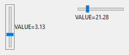

## IupFlatVal

Creates a Valuator control, but it does not have native decorations. Selects a value in a limited interval.
Also known as Scale or Trackbar in native systems.

It behaves just like an [IupVal](iup_val.md), but since it is not a native control, it has more flexibility for additional options.
But ticks are NOT supported.

It inherits from [IupCanvas](../elem/iup_canvas.md). 

### Creation

    Ihandle* IupFlatVal(const char *orientation);

**orientation**: optional orientation of valuator. Can be NULL. See ORIENTATION attribute.

**Returns:** the identifier of the created element, or NULL if an error occurs.

### Attributes

Inherits all attributes and callbacks of the [IupCanvas](../elem/iup_canvas.md), but redefines a few attributes.

[BGCOLOR](../attrib/iup_bgcolor.md): ignored. It will use the background color of the native parent.

**BACKIMAGE** (non-inheritable): image name to be used as a background.
Use [IupSetHandle](../func/iup_sethandle.md) or [IupSetAttributeHandle](../func/iup_setattributehandle.md) to associate an image to a name.
See also [IupImage](../elem/iup_image.md).

**BACKIMAGEZOOM** (non-inheritable): if set the back image will be zoomed to occupy the full background.
Aspect ratio is NOT preserved. Can be Yes or No. Default: No.

**BORDER** (creation-only): the default value is "NO". This is the **IupCanvas** border.

**BORDERCOLOR**: color used for borders. Default: "50 150 255". This is for the drawn border.

**BORDERPSCOLOR**: color used for borders when pressed or selected. Default uses BORDERCOLOR.

**BORDERHLCOLOR**: color used for borders when highlighted. Pre-defined to "0 120 220".
Can be set to NULL. If NULL, BORDERCOLOR will be used instead.

**BORDERWIDTH**: line width used for borders. Default: "1".
Any borders can be hidden by simply setting this value to 0.
This is for the **IupFlatButton** drawn border.

**CANFOCUS** (creation-only) (non-inheritable): enables the focus traversal of the control.
In Windows the control will still get the focus when clicked. Default: YES.

**PROPAGATEFOCUS**(non-inheritable): enables the focus callback forwarding to the next native parent with FOCUS_CB defined.
Default: NO.

**FITTOBACKIMAGE** (non-inheritable): enable the natural size to be computed from the BACKIMAGE.
If BACKIMAGE is not defined will be ignored. Can be Yes or No. Default: No.

[FGCOLOR](../attrib/iup_fgcolor.md): Controls the handler color. Default: "0 120 220".

**HLCOLOR**: color used to indicate a highlight state. Pre-defined to "30 150 250".
Can be set to NULL. If NULL, FGCOLOR will be used instead.

**PSCOLOR**: color used to indicate a press state. Pre-defined to "0 60 190". Can be set to NULL.
If NULL, FGCOLOR will be used instead.

**HANDLERSIZE** (non-inheritable): handler size in the same direction of the ORIENTATION.
Default: 0. When 0 it will be calculated with half of the dimension opposite to the ORIENTATION.
If IMAGE is used, it will be ignored. When IMAGE is not used is the handler size in the opposite direction is the size of the element.

**IMAGE** (non-inheritable): Image name for the handler.
Use [IupSetHandle](../func/iup_sethandle.md) or [IupSetAttributeHandle](../func/iup_setattributehandle.md) to associate an image to a name.
See also [IupImage](../elem/iup_image.md). If defined the handler will be replaced by the image.

**IMAGEHIGHLIGHT** (non-inheritable): Image name of the element in highlight state.
If it is not defined then the IMAGE is used.

**IMAGEINACTIVE** (non-inheritable): Image name of the element when inactive.
If it is not defined then the IMAGE is used and its colors will be replaced by a modified version creating the disabled effect.

**IMAGEPRESS** (non-inheritable): Image name of the element in pressed state.
If it is not defined then the IMAGE is used.

**MAX**: Contains the maximum valuator value. Default is "1".
When changed the display will not be updated until VALUE is set.

**MIN**: Contains the minimum valuator value. Default is "0".
When changed the display will not be updated until VALUE is set.

**PAGESTEP**: Controls the increment for PgDn and PgUp keys. It is not the size of the increment.
The increment size is "pagestep*(max-min)", so it must be 0<pagestep<1. Default is "0.1".

[SIZE](../attrib/iup_size.md) (non-inheritable): The natural size is the height of one character in one direction and the width of 15 characters in the other.

**SLIDERSIZE** (non-inheritable): slider size in the same direction of the ORIENTATION.
Default: 5. Ignored when BACKIMAGE is used.

**SLIDERBORDERCOLOR**: slider border color. Default: "160 160 160".

**SLIDERCOLOR**: slider background color. Default: "220 220 220".

**STEP** (non-inheritable**)**: Controls the increment for keyboard control and the mouse wheel.
It is not the size of the increment. The increment size is "step*(max-min)", so it must be 0<step<1.
Default is "0.01".

**ORIENTATION** (creation-only) (non-inheritable):  Informs whether the valuator is "VERTICAL" or "HORIZONTAL".
Vertical valuators are bottom to up, and horizontal valuators are left to right variations of min to max.
Default: "HORIZONTAL".

**VALUE** (non-inheritable): Contains a number between MIN and MAX, indicating the valuator position.
Default: "0.0".

> 
>
> ------------------------------------------------------------------------

[ACTIVE](../attrib/iup_active.md), [EXPAND](../attrib/iup_expand.md), [FONT](../attrib/iup_font.md), [SCREENPOSITION](../attrib/iup_screenposition.md), [POSITION](../attrib/iup_position.md), [MINSIZE](../attrib/iup_minsize.md), [MAXSIZE](../attrib/iup_maxsize.md), [WID](../attrib/iup_wid.md), [TIP](../attrib/iup_tip.md), [SIZE](../attrib/iup_size.md), [ZORDER](../attrib/iup_zorder.md), [VISIBLE](../attrib/iup_visible.md), [THEME](../attrib/iup_theme.md): also accepted. 

### Callbacks

Inherits all callbacks of the [IupCanvas](../elem/iup_canvas.md), but redefines a few of them.
Including ACTION, BUTTON_CB, MOTION_CB, FOCUS_CB, WHEEL_CB, LEAVEWINDOW_CB, and ENTERWINDOW_CB.
To allow the application to use those callbacks, the same callbacks are exported with the "FLAT_" prefix using the same parameters, except the ACTION.
They are all called before the internal callbacks, and if they return IUP_IGNORE the internal callbacks are not processed.

**VALUECHANGED_CB**: Called after the value was interactively changed by the user.

    int function(Ihandle *ih);

**ih**: identifier of the element that activated the event.

**VALUECHANGING_CB**: Called when the value starts or ends to be interactively changed by the user.

    int function(Ihandle *ih, int start);

**ih**: identifier of the element that activated the event.\
**start**: flag that indicates if the value started to be changed (1) or the change just ended (0).

> 
>
> ------------------------------------------------------------------------

[MAP_CB](../call/iup_map_cb.md), [UNMAP_CB](../call/iup_unmap_cb.md), [DESTROY_CB](../call/iup_destroy_cb.md), [GETFOCUS_CB](../call/iup_getfocus_cb.md), [KILLFOCUS_CB](../call/iup_killfocus_cb.md), [ENTERWINDOW_CB](../call/iup_enterwindow_cb.md), [LEAVEWINDOW_CB](../call/iup_leavewindow_cb.md), [K_ANY](../call/iup_k_any.md), [HELP_CB](../call/iup_help_cb.md): All common callbacks are supported.

### Notes

#### Keyboard Mapping

This is the default mapping when ORIENTATION=HORIZONTAL.

|                          |                                        |
|--------------------------|----------------------------------------|
| Keys                     | Action for HORIZONTAL                  |
| Right Arrow              | move right, increment by one step      |
| Left Arrow               | move left, decrement by one step       |
| Ctrl+Right Arrow or PgDn | move right, increment by one page step |
| Ctrl+Left Arrow or PgUp  | move left, decrement by one page step  |
| Home                     | move all left, set to minimum          |
| End                      | move all right, set to maximum         |

This is the default mapping when ORIENTATION=VERTICAL.

|                         |                                       |
|-------------------------|---------------------------------------|
| Keys                    | Action for VERTICAL                   |
| Up Arrow                | move up, increment by one step        |
| Down Arrow              | move down, decrement by one step      |
| Ctrl+Up Arrow or PgUp   | move up, increment by one page step   |
| Ctrl+Down Arrow or PgDn | move down, decrement by one page step |
| Home                    | move all up, set to maximum           |
| End                     | move all down, set to minimum         |

### Examples

[Browse for Example Files](../../examples/)

|                            |
|----------------------------|
|  |
