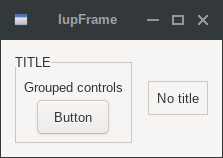
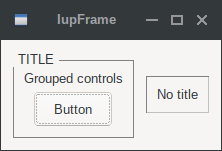
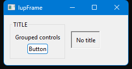
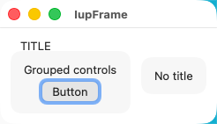

## IupFrame

Creates a native container, which draws a frame with a title around its child.

### Creation

    Ihandle* IupFrame(Ihandle *child);

**child**: Identifier of an interface element which will receive the frame around. It can be NULL.

**Returns:** the identifier of the created element, or NULL if an error occurs.

### Attributes

[BGCOLOR](../attrib/iup_bgcolor.md): ignored and transparent, using the background color of the native parent.
Except if TITLE is not defined and BGCOLOR is defined before map (can be changed later), then the frame will have a color background.

**CHILDOFFSET**: Allow specifying a position offset for the child. Available for native containers only.
It will not affect the natural size, and allows to position controls outside the client area.
Format "*dx*x*dy*", where *dx* and *dy* are integer values corresponding to the horizontal and vertical offsets, respectively, in pixels.
Default: 0x0.

[EXPAND](../attrib/iup_expand.md) (non-inheritable): The default value is "YES".

[FGCOLOR](../attrib/iup_fgcolor.md): Text title color.
Not available in EFL.
In Win32 it is not applied when the frame uses Windows Visual Styles (a titled frame); WinUI is not affected.
Default: the global attribute DLGFGCOLOR.

**SUNKEN**: When not using a title, the frame line defines a sunken area (lowered area).
Valid values: YES or NO. Default: NO.
Not supported in WinUI, GTK 4, EFL, macOS, iOS and Haiku.

[TITLE](../attrib/iup_title.md) (non-inheritable): Text the user will see at the top of the frame.
If not defined during creation it cannot be added later, to be changed it must be at least "" during creation.

> 
>
> ------------------------------------------------------------------------

[ACTIVE](../attrib/iup_active.md), [FONT](../attrib/iup_font.md), [SCREENPOSITION](../attrib/iup_screenposition.md), [POSITION](../attrib/iup_position.md), [CLIENTSIZE](../attrib/iup_clientsize.md), [CLIENTOFFSET](../attrib/iup_clientoffset.md), [MINSIZE](../attrib/iup_minsize.md), [MAXSIZE](../attrib/iup_maxsize.md), [WID](../attrib/iup_wid.md), [SIZE](../attrib/iup_size.md), [RASTERSIZE](../attrib/iup_rastersize.md), [ZORDER](../attrib/iup_zorder.md), [VISIBLE](../attrib/iup_visible.md), [THEME](../attrib/iup_theme.md): also accepted.

### Callbacks

[MAP_CB](../call/iup_map_cb.md), [UNMAP_CB](../call/iup_unmap_cb.md), [DESTROY_CB](../call/iup_destroy_cb.md): common callbacks are supported.

**FOCUS_CB**: Called when a child of the container gets or loses the focus.
It is called only if PROPAGATEFOCUS is defined in the child.

    int function(Ihandle *ih, int focus);

**ih**: identifier of the element that activated the event.\
**focus**: is non-zero if the container is getting the focus, is zero if it is losing the focus.

### Notes

In Win32, a Frame with TITLE==NULL is not the same control as when TITLE!=NULL.
When TITLE==NULL it does not have Visual Styles and uses a sharp rectangle border.
When TITLE!=NULL it has Visual Styles and the border is a rounded rectangle.
To always use Visual Styles, set the title to "" before mapping, but be aware that a vertical space for the title will always be reserved at the top border.
This does not apply to WinUI, which always draws the same emulated border.

The frame can be created with no elements and be dynamic filled using [IupAppend](../func/iup_append.md) or [IupInsert](../func/iup_insert.md). 

### Examples

[Browse for Example Files](../../examples/)

      frame1 = IupFrame
              (
                IupVbox
                (
                  IupLabel("Label1"),
                  IupLabel("Label2"), 
                  IupLabel("Label3"),
                  NULL
                )
              );

      frame2 = IupFrame
              (
                IupVbox
                (
                  IupLabel("Label4"), 
                  IupLabel("Label5"),
                  IupLabel("Label6"),
                  NULL
                )
              );

      IupSetAttribute(frame1, "TITLE", "Title Text");
      IupSetAttribute(frame2, "SUNKEN", "YES");

|                                  |                                |                                 |                                 |
|----------------------------------|--------------------------------|---------------------------------|---------------------------------|
| GTK                              | Qt                             | Win32                           | macOS                           |
|  |  |  |  |

### See Also

[IupFlatFrame](../ctrl/iup_flatframe.md), [IupBackgroundBox](iup_backgroundbox.md)

