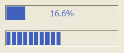

## IupGauge

Creates a Gauge control. Shows a percent value that can be updated to simulate a progression.
It inherits from [IupCanvas](../elem/iup_canvas.md).

### Creation

    Ihandle* IupGauge(void);

**Returns:** the identifier of the created element, or NULL if an error occurs.

### Attributes

**BACKCOLOR** (non-inheritable): color of the background inside the borders. Predefined to "220 220 220.
Can be NULL. When NULL it will use the parent's background color.

**CANFOCUS:** enables the focus traversal of the control. Default: NO. (different from IupCanvas)

**DASHED**: Changes the style of the gauge for a dashed pattern. Default is "NO".

[FGCOLOR](../attrib/iup_fgcolor.md): Controls the gauge and text color.
Default: "0 120 220".

**FLAT**: use a 1 pixel flat border instead of the default 3-pixel sunken border.
Can be Yes or No. Default: No.

**FLATCOLOR:** color of the border when FLAT=Yes. Default: "160 160 160".

**MAX** (non-inheritable): Contains the maximum value. Default is "1".

**MIN** (non-inheritable): Contains the minimum value. Default is "0".

**ORIENTATION** (creation-only): can be "VERTICAL" or "HORIZONTAL". Default: "HORIZONTAL".
Horizontal goes from left to right, and vertical from bottom to top.
Width and height are swapped when orientation is set.

**PADDING**: internal margin. Works just like the MARGIN attribute of the **IupHbox** and **IupVbox** containers, but uses a different name to avoid inheritance problems.
Default value: "0x0".

**CPADDING**: same as PADDING but using the units of the **SIZE** attribute.
It will actually set the PADDING attribute.

**SHOWTEXT**: Indicates if the text inside the Gauge is to be shown or not.
If the gauge is dashed the text is never shown. Possible values: "YES" or "NO". Default: "YES".

[SIZE](../attrib/iup_size.md) (non-inheritable): The initial size is "120x14".
Set to NULL to allow the automatic layout to use smaller values.

**TEXT** (non-inheritable): Contains a text to be shown inside the Gauge when SHOW_TEXT=YES.
If it is NULL, the percentage calculated from VALUE will be used. If the gauge is dashed the text is never shown.
When ORIENTATION=VERTICAL text is drawn in 90º.

**VALUE** (non-inheritable): Contains a number between "MIN" and "MAX", controlling the current position.

> 
>
> ------------------------------------------------------------------------

[ACTIVE](../attrib/iup_active.md), [BGCOLOR](../attrib/iup_bgcolor.md), [EXPAND](../attrib/iup_expand.md), [FONT](../attrib/iup_font.md), [SCREENPOSITION](../attrib/iup_screenposition.md), [POSITION](../attrib/iup_position.md), [MINSIZE](../attrib/iup_minsize.md), [MAXSIZE](../attrib/iup_maxsize.md), [WID](../attrib/iup_wid.md), [TIP](../attrib/iup_tip.md), [RASTERSIZE](../attrib/iup_rastersize.md), [ZORDER](../attrib/iup_zorder.md), [VISIBLE](../attrib/iup_visible.md), [THEME](../attrib/iup_theme.md): also accepted. 

### Callbacks

[MAP_CB](../call/iup_map_cb.md), [UNMAP_CB](../call/iup_unmap_cb.md), [DESTROY_CB](../call/iup_destroy_cb.md): common callbacks are supported.

### Notes

To replace a **IupProgressBar** by a **IupGauge**, you should set RASTERSIZE=200x30 and SHOWTEXT=NO.

### Examples

[Browse for Example Files](../../examples/)

\
The Two Types of Gauge

### See Also

[IupCanvas](../elem/iup_canvas.md), [IupProgressBar](iup_progressbar.md)
