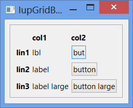
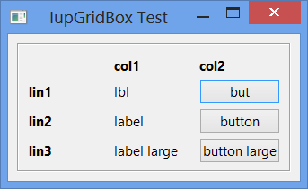
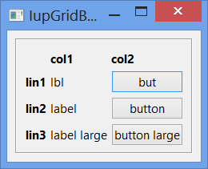

## IupGridBox

Creates a void container for composing elements in a regular grid.
It is a box that arranges the elements it contains from top to bottom and from left to right, but can distribute the elements in lines or in columns.

The child elements are added to the control just like a vbox and hbox, sequentially.
Then they are distributed accordingly the attributes ORIENTATION and NUMDIV.
When ORIENTATION=HORIZONTAL children are distributed from left to right on the first line until NUMDIV, then on the second line, and so on.
When ORIENTATION=VERTICAL children are distributed from top to bottom on the first column until NUMDIV, then on the second column, and so on.
The number of lines and the number of columns can be easily obtained from the combination of these attributes:

      if (orientation==IGBOX_HORIZONTAL)
        num_lin = child_count / num_div
        num_col = num_div
      else
        num_lin = num_div
        num_col = child_count / num_div

Notice that the total number of spaces can be larger than the number of actual children, the last line or column can be incomplete.

The column sizes will be based only on the width of the children of the reference line, usually line 0.
The line sizes will be based only on the height of the children of the reference column, usually column 0.

It does not have a native representation.

### Creation

    Ihandle* IupGridBox(Ihandle *child, ...);
    Ihandle* IupGridBoxV(Ihandle* child, va_list arglist);
    Ihandle* IupGridBoxv(Ihandle **children);

**child**, ... : List of the identifiers that will be placed in the box.
NULL must be used to define the end of the list in C.
It can be empty, but in C must have at least the NULL terminator..

**Returns:** the identifier of the created element, or NULL if an error occurs.

### Attributes

**ALIGNMENTLIN** (non-inheritable): Vertically aligns the elements within each line.
Possible values: "ATOP", "ACENTER", "ABOTTOM". Default: "ATOP".
The alignment of a single line can also be set using **"ALIGNMENTLIN***L***"**, where "L" is the line index, starting at 0 from top to bottom.

**ALIGNMENTCOL** (non-inheritable): Horizontally aligns the elements within each column.
Possible values: "ALEFT", "ACENTER", "ARIGHT". Default: "ALEFT".
The alignment of a single column can also be set using **"ALIGNMENTCOL***C***"**, where "C" is the column index, starting at 0 from left to right.

[EXPAND](../attrib/iup_expand.md) (non-inheritable*): The default value is "YES".
See the documentation of the attribute for EXPAND inheritance.

**EXPANDCHILDREN** (non-inheritable): forces all children to expand in the given direction and to fully occupy its space available inside the box.
Can be YES (both directions), HORIZONTAL, VERTICAL or NO. Default: "NO".
This has the same effect as setting EXPAND on each child.

**FITTOCHILDREN** (write-only): Set the RASTERSIZE attribute of the reference element in the given column or line, so that it will fit the widest element in the column or the highest element in the line.
The number of the column or line must be preceded by a character identifying its type, "C" for columns and "L" for lines.
For example "C5"=column 5 or "L3"=line 3.
Can only be set after the layout of the dialog has been calculated at least 1 time.
If FITMAXWIDTHn or FITMAXHEIGHTn are set for the column or line they are used as maximum limit for the size.

**GAPLIN, CGAPLIN**: Defines a vertical space in pixels between lines, **CGAPLIN** is in the same units of the **SIZE** attribute for the height.
Default: "0".

**GAPCOL, CGAPCOL**: Defines a horizontal space in pixels between columns, **CGAPCOL** is in the same units of the **SIZE** attribute for the height.
Default: "0".

**NGAPLIN, NCGAPLIN, NGAPCOL, NCGAPCOL** (non-inheritable): Same as *GAP* but are non-inheritable.

**HOMOGENEOUSLIN** (non-inheritable): forces all lines to have the same vertical space, or height.
The line height will be  based on the highest child of the reference column (See **SIZECOL**).
Default: "NO". Notice that this does not change the children size, only the available space for each one of them to expand.

**HOMOGENEOUSCOL** (non-inheritable): forces all columns to have the same horizontal space, or width.
The column width will be  based on the widest child of the reference line (See **SIZELIN**).
Default: "NO". Notice that this does not change the children size, only the available space for each one of them to expand.

**MARGIN, CMARGIN**: Defines a margin in pixels, **CMARGIN** is in the same units of the **SIZE** attribute.
Its value has the format "*width*x*height*", where *width* and *height* are integer values corresponding to the horizontal and vertical margins, respectively.
Default: "0x0" (no margin).

**NMARGIN, NCMARGIN** (non-inheritable): Same as **MARGIN** but are non-inheritable.

**NUMDIV**: controls the number of divisions along the distribution according to ORIENTATION.
When ORIENTATION=HORIZONTAL, NUMDIV is the number of columns, when ORIENTATION=VERTICAL, NUMDIV is the number of lines.
When value is AUTO, its actual value will be calculated to fit the maximum number of elements in the orientation direction.
Default: AUTO.

**NUMCOL** (read-only): returns the number of columns.

**NUMLIN** (read-only): returns the number of lines.

**NORMALIZESIZE** (non-inheritable): normalizes all children's natural size to be the biggest natural size among the reference line and/or the reference column.
All natural width will be set to the biggest width, and all natural height will be set to the biggest height according to is value.
Can be NO, HORIZONTAL (width only), VERTICAL (height only) or BOTH. Default: "NO".
Same as using [IupNormalizer](iup_normalizer.md).
Notice that this is different from the **HOMOGENEOUS*** attributes in the sense that the children will have their sizes changed.

**ORIENTATION** (non-inheritable): controls the distribution of the children in lines or in columns.
Can be: HORIZONTAL or VERTICAL. Default: HORIZONTAL.

**SIZECOL** (non-inheritable): index of the column that will be used as reference when calculating the height of the lines.
Default: 0. If set to -1 all columns will contribute for the line height, the highest cell of the line will be the line height.

**SIZELIN** (non-inheritable): index of the line that will be used as reference when calculating the width of the columns.
Default: 0. If set to -1 all lines will contribute for the column width, the widest cell of the column will be the column width.

**WID** (read-only): returns -1 if mapped.

> 
>
> ------------------------------------------------------------------------

[SIZE](../attrib/iup_size.md), [RASTERSIZE](../attrib/iup_rastersize.md), [FONT](../attrib/iup_font.md), [CLIENTSIZE](../attrib/iup_clientsize.md), [CLIENTOFFSET](../attrib/iup_clientoffset.md), [POSITION](../attrib/iup_position.md), [MINSIZE](../attrib/iup_minsize.md), [MAXSIZE](../attrib/iup_maxsize.md), [THEME](../attrib/iup_theme.md): also accepted.

### Attributes (at Children)

[FLOATING](../attrib/iup_floating.md) (non-inheritable) **(at children only)**: If a child has FLOATING=YES then its size and position will be ignored by the layout processing.
Default: "NO".

### Notes

The box can be created with no elements and be dynamic filled using [IupAppend](../func/iup_append.md) or [IupInsert](../func/iup_insert.md).

The box will NOT expand its children, it will allow its children to expand according to the space left in the box parent.
So for the expansion to occur, the children must be expandable with EXPAND!=NO, and there must be room in the box parent.

### Examples

[Browse for Example Files](../../examples/)

**NORMALIZE=BOTH**

**EXPANDCHILDREN=YES**

### See Also

[IupVbox](iup_vbox.md), [IupHbox](iup_hbox.md)
