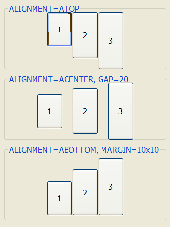
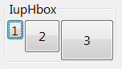
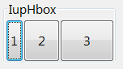

## IupHbox

Creates a void container for composing elements horizontally.
It is a box that arranges the elements it contains from left to right.

It does not have a native representation.

### Creation

    Ihandle* IupHbox(Ihandle *child, ...);
    Ihandle* IupHboxV(Ihandle* child,va_list arglist);
    Ihandle* IupHboxv(Ihandle **children);

**child**,... : List of identifiers that will be placed in the box.
NULL must be used to define the end of the list in C.
It can be empty, but in C must have at least the NULL terminator.

**Returns:** the identifier of the created element, or NULL if an error occurs.

### Attributes

**ALIGNMENT** (non-inheritable): Vertically aligns the elements. Possible values: "ATOP", "ACENTER", "ABOTTOM".
Default: "ATOP".

[EXPAND](../attrib/iup_expand.md) (non-inheritable*): The default value is "YES".
See the documentation of the attribute for EXPAND inheritance.

**EXPANDCHILDREN** (non-inheritable): forces all children to expand vertically and to fully occupy its space available inside the box.
Default: "NO". This has the same effect as setting EXPAND=VERTICAL on each child.

**GAP, CGAP**: Defines a horizontal space in pixels between the children, **CGAP** is in the same units of the **SIZE** attribute for the width.
Default: "0".

**NGAP, NCGAP** (non-inheritable): Same as **GAP** but are non-inheritable.

**HOMOGENEOUS** (non-inheritable): forces all children to get equal horizontal space.
The space width will be based on the largest child. Default: "NO".
Notice that this does not change the children size, only the available space for each one of them to expand.

**MARGIN, CMARGIN**: Defines a margin in pixels, **CMARGIN** is in the same units of the **SIZE** attribute.
Its value has the format "*width*x*height*", where *width* and *height* are integer values corresponding to the horizontal and vertical margins, respectively.
Default: "0x0" (no margin).

**NMARGIN, NCMARGIN** (non-inheritable): Same as **MARGIN** but are non-inheritable.

**NORMALIZESIZE** (non-inheritable): normalizes all children natural size to be the biggest natural size among them.
All natural width will be set to the biggest width, and all natural height will be set to the biggest height according to is value.
Can be NO, HORIZONTAL, VERTICAL or BOTH. Default: "NO".
Same as using [IupNormalizer](iup_normalizer.md).

**ORIENTATION** (read-only) (non-inheritable): Returns "HORIZONTAL".

[SIZE](../attrib/iup_size.md) / [RASTERSIZE](../attrib/iup_rastersize.md) (non-inheritable): Defines the width of the box.
When consulted behaves as the standard SIZE/RASTERSIZE attributes.
The standard format "wxh" can also be used, but height will be ignored.

**WID** (read-only): returns -1 if mapped.

> 
>
> ------------------------------------------------------------------------

[FONT](../attrib/iup_font.md), [CLIENTSIZE](../attrib/iup_clientsize.md), [CLIENTOFFSET](../attrib/iup_clientoffset.md), [POSITION](../attrib/iup_position.md), [MINSIZE](../attrib/iup_minsize.md), [MAXSIZE](../attrib/iup_maxsize.md), [THEME](../attrib/iup_theme.md): also accepted.

### Attributes (at Children)

**EXPANDWEIGHT** (non-inheritable) **(at children only)**: If a child defines the expand weight, then it is used to multiply the free space used for expansion.

[FLOATING](../attrib/iup_floating.md) (non-inheritable) **(at children only)**: If a child has FLOATING= YES, then its size and position will be ignored by the layout processing.
Default: "NO".

### Notes

The box can be created with no elements and be dynamic filled using [IupAppend](../func/iup_append.md) or [IupInsert](../func/iup_insert.md).

The box will NOT expand its children, it will allow its children to expand, according to the space left in the box parent.
So for the expansion to occur, the children must be expandable with EXPAND!=NO, and there must be room in the box parent.

Also, the **h**box will not reduce its children beyond their **horizontal** natural size even if SHRINK=Yes is set to the dialog.

### Examples

[Browse for Example Files](../../examples/)

**HOMOGENEOUS=YES**

**EXPANDCHILDREN=YES**

### See Also

[IupZbox](iup_zbox.md), [IupVBox](iup_vbox.md)
