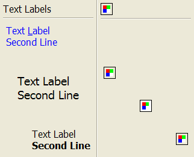

## IupLabel

Creates a label interface element, which displays a separator, a text or an image.

### Creation

    Ihandle* IupLabel(const char *title);

**title**: Text to be shown on the label. It can be NULL. It will set the TITLE attribute.

**Returns:** the identifier of the created element, or NULL if an error occurs.

### Attributes

**ACTIVE**: The only difference between an active label and an inactive one is its visual feedback.
Possible values: "YES, "NO". Default: "YES".

**ALIGNMENT** (non-inheritable): horizontal and vertical alignment.
Possible values: "ALEFT", "ACENTER" and "ARIGHT",  combined to "ATOP", "ACENTER" and "ABOTTOM".
Default: "ALEFT:ACENTER". Partial values are also accepted, like "ARIGHT" or ":ATOP", the other value will be used obtained from the default value.
In Motif, vertical alignment is restricted to "ACENTER".

[BGCOLOR](../attrib/iup_bgcolor.md): ignored, transparent in all systems.
Will use the background color of the native parent.

**DROPFILESTARGET** (non-inheritable): Enable or disable the drop of files.
Default: NO, but if DROPFILES_CB is defined when the element is mapped then it will be automatically enabled.

**ELLIPSIS**: add an ellipsis: "..." to the text if there is not enough space to render the entire string.
Can be "YES" or "NO". Default: "NO".
Not supported in Motif.

[FGCOLOR](../attrib/iup_fgcolor.md): Text color. Default: the global attribute DLGFGCOLOR.

**IMAGE** (non-inheritable): Image name. If set before map defines the behavior of the label to contain an image.
The natural size will be size of the image in pixels.
Use [IupSetHandle](../func/iup_sethandle.md) or [IupSetAttributeHandle](../func/iup_setattributehandle.md) to associate an image to a name.
See also [IupImage](iup_image.md).

**IMINACTIVE** (non-inheritable): Image name of the element when inactive.
If it is not defined then the IMAGE is used and the colors will be replaced by a modified version of the background color creating the disabled effect.
Not supported in Win32 and WinUI.

**MARKUP**: allows the title string to contain markup commands.
Supports a Pango-like subset: `<b>`, `<i>`, `<u>`, `<s>`, ``, ``, `<big>`, `<small>`, and `` with `foreground`, `background`, `font_family`, `font_size`, `font_weight`, `font_style` attributes. GTK uses Pango markup natively; other drivers convert to their native format.
Works only if a mnemonic is NOT defined in the title. Can be "YES" or "NO". Default: "NO".
Not supported in Win32 and Motif (markup tags are stripped and plain text is displayed).

**PADDING**: internal margin. Works just like the MARGIN attribute of the **IupHbox** and **IupVbox** containers, but uses a different name to avoid inheritance problems.
Not used when SEPARATOR is used. Default value: "0x0".

**CPADDING**: same as PADDING but using the units of the **SIZE** attribute.
It will actually set the PADDING attribute.

**SEPARATOR** (creation-only) (non-inheritable): Turns the label into a line separator.
Possible values: "HORIZONTAL" or "VERTICAL".
When changed before mapping the EXPAND attribute is set to "HORIZONTALFREE" or "VERTICALFREE" accordingly.

[TITLE](../attrib/iup_title.md) (non-inheritable): Label's text.
If SEPARATOR or IMAGE are not defined before map, then the default behavior is to contain a text.
The label behavior cannot be changed after map.
The natural size will be larger enough to include all the text in the selected font, even using multiple lines.
The '\n' character is accepted for line change.
The "&" character can be used to define a mnemonic, the next character will be used as key.
Use "&&" to show the "&" character instead of defining a mnemonic.
The next control from the label will be activated from any control in the dialog using the "Alt+key" combination.

**WORDWRAP**: enables or disable the wrapping of lines that does not fit in the label.
Can be "YES" or "NO". Default: "NO". Can only set WORDWRAP=YES if ALIGNMENT=ALEFT.
Not supported in Motif.

> 
>
> ------------------------------------------------------------------------

[FONT](../attrib/iup_font.md), [EXPAND](../attrib/iup_expand.md), [SCREENPOSITION](../attrib/iup_screenposition.md), [POSITION](../attrib/iup_position.md), [MINSIZE](../attrib/iup_minsize.md), [MAXSIZE](../attrib/iup_maxsize.md), [WID](../attrib/iup_wid.md), [TIP](../attrib/iup_tip.md), [SIZE](../attrib/iup_size.md), [RASTERSIZE](../attrib/iup_rastersize.md), [ZORDER](../attrib/iup_zorder.md), [VISIBLE](../attrib/iup_visible.md), [THEME](../attrib/iup_theme.md): also accepted.

[Drag & Drop](../attrib/iup_dragdrop.md) attributes and callbacks are supported.  

### Callbacks

[BUTTON_CB](../call/iup_button_cb.md): Action generated when any mouse button is pressed or released.

[MOTION_CB](../call/iup_motion_cb.md): Action generated when the mouse is moved.

[DROPFILES_CB](../call/iup_dropfiles_cb.md): Action generated when one or more files are dropped in the element.

[MAP_CB](../call/iup_map_cb.md), [UNMAP_CB](../call/iup_unmap_cb.md), [DESTROY_CB](../call/iup_destroy_cb.md), [ENTERWINDOW_CB](../call/iup_enterwindow_cb.md), [LEAVEWINDOW_CB](../call/iup_leavewindow_cb.md): common callbacks are supported.

### Notes

Labels with images, texts or line separator cannot change its behavior after mapped.
But after map, the image can be changed for another image, and the text for another text.

In GTK uses GtkSeparator/GtkImage/GtkLabel, in GTK 4 uses GtkSeparator/GtkImage/GtkLabel, in Windows uses WC_STATIC, in WinUI uses XAML TextBlock/Image/Border, in macOS uses NSSeparator/NSImageView/NSTextField, in Qt uses QFrame/QLabel, in EFL uses Efl_Ui_Separator/Efl_Ui_Image/Elm_Label, and in Motif uses xmSeparator/xmLabel.

### Examples

Normal Text Label: FGCOLOR = "0 0 255" ALIGNMENT="ALEFT:ATOP",
FONT = "Helvetica, 14" ALIGNMENT = "ACENTER:ACENTER",
MARKUP = "YES" ALIGNMENT = "ARIGHT:ABOTTOM".

Normal Image Label: (8bpp Image),
ALIGNMENT = "ACENTER" (24 bpp Image),
ALIGNMENT = "ARIGHT" (32 bpp Image).

[Browse for Example Files](../../examples/)

### See Also

[IupImage](iup_image.md), [IupButton](iup_button.md), [IupFlatLabel](iup_flatlabel.md).
